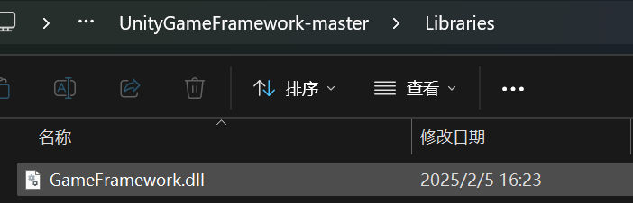
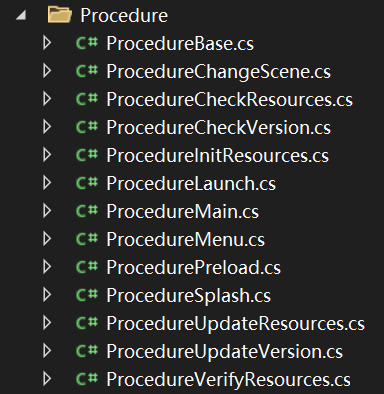

 [Game Framework](https://gameframework.cn/) 是一个基于 Unity 的轻量级游戏开发框架，提供了模块化的架构，包括资源管理、UI管理、事件系统、数据存储等功能。其整体流程大致如下：

**教程：**
- [花桑GameFramework解析](https://zhuanlan.zhihu.com/p/426136370)
- [烟雨迷离半世殇GF教程](https://www.lfzxb.top/gameframework-all/)
- [烟雨迷离半世殇GF视频教程](https://www.bilibili.com/medialist/detail/ml759678145)
- [GF API 手册](https://gameframework.cn/api/index.html)
- [常见问题](https://gameframework.cn/faq/)
  
**参考项目：**
- [GF官方](https://github.com/EllanJiang)（包涵GameFrameWork 源码，UnityGameFrameWork Package， StarForce 示例工程）
- [花桑塔防游戏](https://github.com/DrFlower/TowerDefense-GameFramework-Demo?tab=readme-ov-file)
  

**导入插件：**

1. [下载](https://github.com/EllanJiang/UnityGameFramework)
2. 解压到游戏 `Assets 父级`目录下，避免污染 Assets,文件中的框架被封装成dll如下要想阅读源码[跳转至此](https://github.com/EllanJiang/GameFramework/)
3. 手动修改 package.json 为"version": "1.0.0" ，否则会报错：
导入插件报错：Cannot perform upm operation: Unable to add package， version 字段不符合 Semantic Versioning（语义化版本） 规范。
4. 保存文件，然后重新尝试导入。


**源码导入：**

>Q：如何把 GameFramework.dll 换成源码调试和运行？

>A：首先，强烈建议保持 GameFramework.dll 的现状而不是更换为代码，以防止开发过程中错误的进行修改。如果是想调试其中的代码，可以考虑使用源码自行编译 dll，并连同 pdb 文件覆盖到原有目录，即可跳转进入 dll 内的函数。

如果一定要更换源码，按以下步骤进行：
- 请先删除掉原来的 GameFramework.dll
- 将 Game Framework 源码目录拷贝至GameFramework.dll所在的目录下，并在此目录中增加 GameFramework.asmdef 文件（注意需要勾选unsafe选项）。
- 然后让 UnityGameFramework.Runtime.asmdef 依赖 GameFramework.asmdef，让 UnityGameFramework.Editor.asmdef 同时依赖 GameFramework.asmdef 和 UnityGameFramework.Runtime.asmdef 即可。Runtime.asmdef 文件通常位于 UnityGameFramework/Scripts/Runtime 目录下，而 UnityGameFramework.Editor.asmdef 文件通常位于 UnityGameFramework/Scripts/Editor 目录下。


## Game Framework 由哪几部分组成？
完整的 Game Framework 包含三部分：

- GameFramework – 封装基础游戏逻辑，如数据管理、资源管理、文件系统、对象池、有限状态机、本地化、事件、实体、网络、界面、声音等，此部分逻辑实现不依赖于 Unity 引擎，以程序集的形式提供。
- UnityGameFramework.Runtime – 依赖 UnityEngine.dll 进行对 GameFramework.dll 的补充实现。为了方便兼容 Unity 的各个版本，此部分已经以代码的形式包含在 Unity 插件中。
- UnityGameFramework.Editor – 依赖 UnityEditor.dll 进行对工具、Inspector 的实现。为了方便兼容 Unity 的各个版本，此部分已经以代码的形式包含在 Unity 插件中。

## **Game Framework 框架流程**
### **1. 启动流程**
1. **入口方法**  
   - `GameEntry.cs` 作为游戏的入口，初始化各个核心模块。
   - 通常在 `Awake()` 方法中完成框架初始化。

2. **初始化框架**  
   - `GameFramework.Init()`，内部初始化各个子模块：
     - **日志系统**
     - **事件系统**
     - **数据表管理**
     - **资源管理**
     - **网络管理**
     - **UI管理**
     - **音频管理**
     - **实体管理**
     - **场景管理**
     - **配置管理**
     - **本地化管理**
   - 这些模块通常继承 `GameFrameworkModule`，在 `GameEntry` 中注册。


3. **加载配置**
   - 读取本地配置文件（如 `Config.json`），设置游戏基本参数。
   - 可能从 `PlayerPrefs` 或服务器拉取用户数据。

---

### **2. 资源管理**
1. **加载资源**
   - 依赖 `ResourceComponent` 进行加载，支持：
     - **本地 AssetBundle**
     - **远程下载**
   - 采用异步加载，防止主线程卡顿：
     ```csharp
     ResourceComponent.LoadAssetAsync("path/to/asset", OnLoadComplete);
     ```
   - 支持 **热更新**（可与 `VersionCheckComponent` 结合）。

2. **对象池管理**
   - **UI 界面**、**实体**、**特效**等资源可通过 **对象池** 管理，提高性能：
     ```csharp
     GameEntry.ObjectPool.Spawn("Enemy");
     GameEntry.ObjectPool.Despawn(enemy);
     ```

---

### **3. 游戏场景管理**
1. **场景加载**
   - `GameEntry.Scene.LoadScene("MainScene");`
   - 可异步加载 `AsyncOperation`，防止卡顿：
     ```csharp
     GameEntry.Scene.LoadSceneAsync("BattleScene", OnSceneLoaded);
     ```

2. **切换场景**
   - 场景切换前可触发 **存档**、**释放资源**、**播放过场动画**。

---

### **4. UI管理**
1. **打开 UI**
   - 通过 `UIComponent` 加载 UI 预制体：
     ```csharp
     GameEntry.UI.OpenUIForm(UIFormId.MainMenu);
     ```

2. **关闭 UI**
   - `GameEntry.UI.CloseUIForm(mainMenuForm);`
   - UI 通过 `EventComponent` 监听数据变更，支持 MVC 结构。

---

### **5. 事件与消息系统**
1. **订阅事件**
   - 采用 **事件驱动** 模式，减少组件间耦合：
     ```csharp
     GameEntry.Event.Subscribe(EventId.PlayerDead, OnPlayerDead);
     ```
  
2. **触发事件**
   - 组件间通过事件通信：
     ```csharp
     GameEntry.Event.Fire(this, new PlayerDeadEventArgs());
     ```

3. **消息传递**
   - 适用于 **网络同步**，例如：
     ```csharp
     GameEntry.Network.Send(new PlayerMovePacket());
     ```

---

### **6. 实体（角色、怪物）管理**
1. **创建实体**
   - 通过 `EntityComponent` 生成角色、敌人、NPC 等：
     ```csharp
     GameEntry.Entity.ShowEntity(EntityId.Player, "Assets/Player.prefab");
     ```

2. **实体回收**
   - `GameEntry.Entity.HideEntity(player);`
   - 结合对象池减少资源消耗。

---

### **7. 数据存储**
1. **本地存储**
   - 采用 `PlayerPrefs` 存储 **简单数据**：
     ```csharp
     PlayerPrefs.SetInt("HighScore", 1000);
     ```

2. **存档管理**
   - 复杂数据采用 `SaveComponent` 或 `Json` 文件存储：
     ```csharp
     GameEntry.Save.SaveToFile("save.json", saveData);
     ```

---

### **8. 音效与BGM管理**
1. **播放音效**
   - `GameEntry.Sound.PlaySound("Sound/Click");`

2. **背景音乐**
   - `GameEntry.Sound.PlayMusic("Music/BattleTheme");`

3. **音量控制**
   - `GameEntry.Sound.SetVolume(0.5f);`

---

### **9. 热更新（可选）**
1. **检查版本**
   - `GameEntry.Version.CheckUpdate();`
   - 若有更新，则下载新的资源并热加载。

2. **更新资源**
   - 采用 **AssetBundle 或 Addressables**：
     ```csharp
     GameEntry.Resource.UpdateResources();
     ```

---

### **10. 退出游戏**
1. **游戏暂停**
   - `Time.timeScale = 0;`

2. **存档并退出**
   - `GameEntry.Save.SaveAll();`
   - `Application.Quit();`

---

## **总结**
Game Framework 框架提供了一套完整的游戏开发流程：
1. **初始化框架**
2. **加载配置**
3. **资源管理**
4. **UI管理**
5. **事件驱动**
6. **实体管理**
7. **数据存储**
8. **音效管理**
9. **热更新**
10. **游戏退出**

整个流程以 **模块化架构** 运行，降低耦合，提高开发效率。在实际项目中，可以根据需求扩展新的 **组件（Component）**，如 **AI 系统**、**战斗系统**、**成就系统** 等。

如果你需要具体的代码实现，或者对某个模块有深入的问题，可以继续交流！😊


## 内置模块
Game Framework，字面意思是游戏框架，基于Unity游戏引擎，将开发过程中常用的游戏模块封装起来，很大程度上规范了流程，提升了开发速度，保证了产品质量。

游戏框架提供了以下19个内置模块，后续还将开发更多模块供游戏开发者使用。： 

1. **Config**——保存一些全局的只读游戏配置，比如玩家的初始速度，游戏的初始音量等。  

2. **数据节点**——在树结构中保存任意类型的数据，以便在游戏运行时管理各种数据。  

3. **数据表**——用于以预配置表格（如 Microsoft Excel 表格）的形式调用游戏数据。表格的格式可以自定义。  

4. **调试器**——在 Unity 编辑器或开发版本中运行游戏时显示调试器窗口，以方便查看运行时日志和调试消息。用户可以将自己的功能注册到调试器窗口并方便地使用它们。  

5. **下载**——提供下载文件的功能。用户可以自由设置同时使用多少个下载器。  

6. **实体**——提供管理实体和实体组的能力，其中实体定义为游戏场景中动态创建的任何对象。它显示或隐藏实体，将一个实体附加到另一个实体（例如武器、马匹或抢夺另一个实体）。实体可以避免在使用后立即被销毁，因此可以回收再利用。  

7. **事件**——为游戏逻辑提供触发或观察事件的机制。游戏框架中的许多模块在操作后都会触发事件，观察这些事件将在很大程度上解耦游戏逻辑模块。用户也可以定义自己的游戏逻辑事件。  

8. **文件系统**——基于磁盘概念的虚拟文件系统，将分散的文件集中管理，优化资源加载时的内存分配，甚至可以分段加载资源，大大提升资源加载的性能。  

9. **FSM**——提供创建、使用和销毁有限状态机的能力。对于某些类似状态机的游戏逻辑来说，使用此模块是个不错的选择。  

10. **本地化**——提供游戏本地化的能力。游戏框架不仅支持文本的本地化，还支持各种资产的本地化。例如，游戏中的烟花效果可以本地化为各种版本，这样玩家在中文版中会看到“新年好”的效果，而在英文版中则会看到“Happy New Year”的效果。  

11. **网络**——提供套接字连接，目前支持 TCP，并且 IPv4 和 IPv6 均有效。用户可以同时与不同的服务器建立多个连接。例如，用户可以连接到普通游戏服务器和另一个用于语音聊天的服务器。如果用户想要使用 ProtoBuf 等协议库，则可以继承并实现“Packet”类。  

12. **对象池**——提供将对象缓存在池中的能力。避免频繁创建和销毁游戏对象，从而提高游戏性能。游戏框架本身使用对象池，用户可以方便地创建和管理自己的池。  

13. **程序**——实际上是游戏整个生命周期的 FSM。通过程序来解耦不同的游戏状态是一个很好的习惯。对于网络游戏，你可能需要检查资源、更新资源、检查服务器列表、选择服务器、登录服务器和创建头像的程序。对于独立游戏，你可能需要在菜单和实际游戏玩法之间切换。用户可以通过简单地子类化和实现“ProcedureBase”类来添加程序。  

14. **Resource**——只提供异步接口来加载资源。为了更好的游戏体验，我们不推荐使用同步方式，Game Framework 本身也使用了一套完整的异步资源加载体系。我们异步加载所有内容，包括简单的数据表、本地化文本，以及复杂的实体、场景、UI 等。同时，Game Framework 提供了默认的内存管理策略（当然，您也可以定义自己的策略）。大多数情况下，在使用 GameObject 实例时，您甚至不需要调用“Instantiate”或“Destroy”。  

15. **场景**——提供管理场景的功能。它支持同时加载多个场景，并且允许用户随时卸载场景。因此可以轻松实现场景的部分加载/卸载。  

16. **设置**——通过封装 UnityEngine.PlayerPrefs 或将数据直接保存到磁盘，将玩家数据存储在键值对中。  

17. **声音**——提供管理声音和声音组的功能。用户可以设置音频剪辑的属性，例如音量、剪辑是 2D 还是 3D，甚至可以将剪辑绑定到某个实体以跟随其位置。  

18. **UI**——提供管理用户界面和 UI 组的功能，例如显示或隐藏、激活或停用以及深度更改。无论用户使用 Unity 内置的 uGUI 还是其他 UI 插件（例如 NGUI），他只需子类化“UIFormLogic”并实现自己的 UI 逻辑。UI 可以避免在使用后立即被销毁，从而被回收再利用。  

19. **Web请求**——提供短连接特性，支持 GET 和 POST 方法向服务器发送请求并获取响应数据，并允许用户同时向不同的服务器发送请求。  


## 流程模块



这些类文件是 **Unity Game Framework (UGF)** 中的 **Procedure**（流程）模块，通常用于管理游戏的状态和流程控制。以下是每个类的大致作用：

1. **ProcedureBase.cs**  
   - 流程基类，定义所有流程的基础行为和接口。  
   - 包含流程的初始化、进入、更新、离开等生命周期方法。  

2. **ProcedureChangeScene.cs**  
   - 处理场景切换的流程。  
   - 常用于在游戏关卡或场景间切换时，加载新场景或卸载旧场景。  

3. **ProcedureCheckResources.cs**  
   - 检查游戏资源的完整性和可用性。  
   - 通常在启动游戏时进行资源校验，以确保游戏能正常运行。  

4. **ProcedureCheckVersion.cs**  
   - 检查游戏版本的流程。  
   - 用于版本更新检测，如与服务器进行版本对比，提示用户更新。  

5. **ProcedureInitResources.cs**  
   - 初始化资源的流程。  
   - 在游戏启动时，预加载或初始化必要的资源。  

6. **ProcedureLaunch.cs**  
   - 启动流程。  
   - 通常是游戏开始的第一个流程，进行基础环境设置，如读取配置、初始化日志等。  

7. **ProcedureMain.cs**  
   - 主游戏流程。  
   - 控制游戏主逻辑的入口，如游戏运行、暂停、恢复等。  

8. **ProcedureMenu.cs**  
   - 菜单流程。  
   - 用于管理游戏主菜单的显示、隐藏及其交互逻辑。  

9. **ProcedurePreload.cs**  
   - 预加载流程。  
   - 提前加载一些常用的资源或场景，以减少游戏中的加载等待时间。  

10. **ProcedureSplash.cs**  
    - 启动画面流程。  
    - 控制启动画面的显示，如 Logo、版权信息等。  

11. **ProcedureUpdateResources.cs**  
    - 资源更新流程。  
    - 检查并下载资源更新包，支持热更新。  

12. **ProcedureUpdateVersion.cs**  
    - 版本更新流程。  
    - 处理游戏版本的更新，如强制更新、下载新版本等。  

13. **ProcedureVerifyResources.cs**  
    - 资源验证流程。  
    - 验证本地资源的完整性，如 MD5 校验，确保资源未被篡改。  

---

### **典型使用场景**
1. **游戏启动**  
   - ProcedureLaunch → ProcedureCheckVersion → ProcedureUpdateVersion  
2. **资源准备**  
   - ProcedureCheckResources → ProcedureInitResources → ProcedurePreload  
3. **主菜单**  
   - ProcedureSplash → ProcedureMenu  
4. **游戏过程**  
   - ProcedureMain → ProcedureChangeScene → ProcedureMain  
5. **资源更新**  
   - ProcedureCheckResources → ProcedureUpdateResources → ProcedureVerifyResources  

---

### **总结**
**Procedure 模块** 是 UGF 的核心，用于管理游戏的各个状态和流程，提供了一种解耦的方式来处理复杂的游戏逻辑。每个流程都可以单独编写、调试和维护，从而提高了开发效率和代码可维护性。


# **C# 热更新与资源热更新的对应关系**。
下面我将详细说明如何通过 **HybridCLR** 和 **UnityGameFramework** 完整实现 **C# 热更新与资源热更新的下载与加载**，以及它们如何对应和协调工作。

### **1. C# 热更新和资源热更新如何下载：**

#### **1.1 C# 热更新的下载与加载**

1. **下载新的程序集：**
   - C# 代码热更新是通过更新程序集来实现的。新的程序集通常存储在服务器上，并且可以通过 **HTTP 请求** 来下载。
   
   - 你可以使用 Unity 的 `UnityWebRequest` 来下载更新的程序集。

   示例代码：
   ```csharp
   using UnityEngine;
   using UnityEngine.Networking;
   using HybridCLR;

   public class HotfixManager : MonoBehaviour
   {
       private string hotfixAssemblyUrl = "https://your-server.com/hotfix/HotfixAssembly.dll";

       // 下载热更新的程序集
       public void DownloadHotfixAssembly()
       {
           UnityWebRequest request = UnityWebRequest.Get(hotfixAssemblyUrl);
           request.SendWebRequest().completed += (asyncOp) =>
           {
               if (request.result == UnityWebRequest.Result.Success)
               {
                   byte[] assemblyBytes = request.downloadHandler.data;
                   LoadHotfixAssembly(assemblyBytes);
               }
               else
               {
                   Debug.LogError("Failed to download assembly: " + request.error);
               }
           };
       }

       // 加载热更新的程序集
       private void LoadHotfixAssembly(byte[] assemblyBytes)
       {
           // 使用 HybridCLR 加载新的程序集
           RuntimeLoader.LoadAssembly(assemblyBytes);
       }
   }
   ```
   - 这段代码中，`DownloadHotfixAssembly` 方法使用 `UnityWebRequest.Get` 从服务器下载更新的程序集，下载完成后会将程序集的字节数据传递给 `LoadHotfixAssembly` 方法，使用 **HybridCLR** 的 `RuntimeLoader.LoadAssembly` 方法加载新的程序集。

2. **程序集加载后的代码更新：**
   - 下载并加载新的程序集后，你就可以跳转到新版本的 C# 代码并执行相应的热更新逻辑。此时，游戏中的运行时逻辑会被新的程序集替换。

#### **1.2 资源热更新的下载与加载**

资源热更新的过程与 C# 热更新类似，也是通过下载新版本的资源文件来实现。资源可以通过 **AssetBundles**、**Addressables** 或自定义资源包的方式进行管理。

1. **资源更新包下载：**
   - 通常资源热更新是基于版本控制的，在资源文件夹中会有一个 `version.txt` 或者 `resource_version.dat` 文件，记录着最新的资源版本。资源包会根据版本来下载。

   - 使用 `UnityWebRequest` 下载新的资源包，并且使用 `AssetBundle` 或其他方法加载更新的资源。

   示例代码：
   ```csharp
   using UnityEngine;
   using UnityEngine.Networking;

   public class ResourceManager : MonoBehaviour
   {
       private string resourceUpdateUrl = "https://your-server.com/updates/ResourcePack.assetbundle";

       // 下载更新的资源包
       public void DownloadResourcePack()
       {
           UnityWebRequest request = UnityWebRequest.Get(resourceUpdateUrl);
           request.SendWebRequest().completed += (asyncOp) =>
           {
               if (request.result == UnityWebRequest.Result.Success)
               {
                   byte[] assetBundleData = request.downloadHandler.data;
                   LoadResource(assetBundleData);
               }
               else
               {
                   Debug.LogError("Failed to download resource pack: " + request.error);
               }
           };
       }

       // 加载下载的资源包
       private void LoadResource(byte[] assetBundleData)
       {
           AssetBundle assetBundle = AssetBundle.LoadFromMemory(assetBundleData);
           if (assetBundle != null)
           {
               // 加载资源
               var asset = assetBundle.LoadAsset<GameObject>("UpdatedResource");
               Instantiate(asset);
           }
           else
           {
               Debug.LogError("Failed to load asset bundle.");
           }
       }
   }
   ```

2. **加载资源包：**
   - `DownloadResourcePack` 方法下载最新版本的资源包（例如 `.assetbundle` 文件），然后通过 `AssetBundle.LoadFromMemory` 将其加载到内存中。
   - 使用 `assetBundle.LoadAsset<T>()` 来加载和实例化资源（比如新的模型或贴图）。

---

### **2. C# 热更新与资源热更新的对应关系：**

#### **2.1 如何保持 C# 代码和资源的一致性：**

1. **版本控制同步：**
   - 当你更新 C# 代码时，可能需要更新与之相关的资源（例如 UI 的新版本，新的场景或新模型）。同样，更新资源时也可能需要配套更新代码（如新的脚本逻辑或组件绑定）。
   - 你可以通过 **版本号同步** 来确保 C# 代码和资源的版本一致。通常，**版本控制文件**（例如 `version.txt` 或 `manifest.json`）会记录 C# 代码和资源的版本。
   - 在下载 C# 代码和资源时，首先检查当前版本和最新版本是否一致，如果不一致，则一起更新它们。

2. **热更新资源与代码的时序控制：**
   - 例如，在更新某个资源（如 `GameObject` 或 `UI`）时，可能需要相应的 C# 代码来支持这些资源的逻辑。通过在资源包中包含 **资源版本和代码版本**，确保这两者始终同步更新。
   - 在资源下载完成后，下载相应的 C# 热更新程序集，并应用到运行时。

#### **2.2 示例流程：**

1. **检查版本：**
   - 客户端首先通过 `version.txt` 或类似文件检查当前的版本与服务器上资源和 C# 代码的版本。
   - 如果有更新，首先下载新的资源包。

2. **下载和加载 C# 热更新代码：**
   - 下载最新版本的 C# 热更新程序集（通过 HybridCLR），并加载到运行时。

3. **更新资源：**
   - 在加载了新的 C# 程序集后，下载新的资源包并加载更新后的资源。

4. **同步执行：**
   - 确保 **C# 代码** 和 **资源** 的版本是相互匹配的。比如，更新了一个 UI 组件的资源时，对应的 C# 脚本也需要同时更新，以保证逻辑正确。

---

### **3. 总结：**

- **C# 热更新**：通过 HybridCLR 下载和加载更新的程序集，确保新的逻辑和功能生效。
- **资源热更新**：通过下载并加载新的资源包（如 AssetBundle 或自定义资源格式），并将更新后的资源加载到游戏中。
- **同步更新**：使用版本控制确保 **C# 代码** 和 **资源** 版本的一致性，避免因版本不匹配而导致的逻辑错误或资源问题。

通过这种方式，你可以实现 **灵活的热更新系统**，无论是 **C# 代码** 还是 **游戏资源**，都能够根据需要动态更新，并确保两者的匹配和协调工作。


