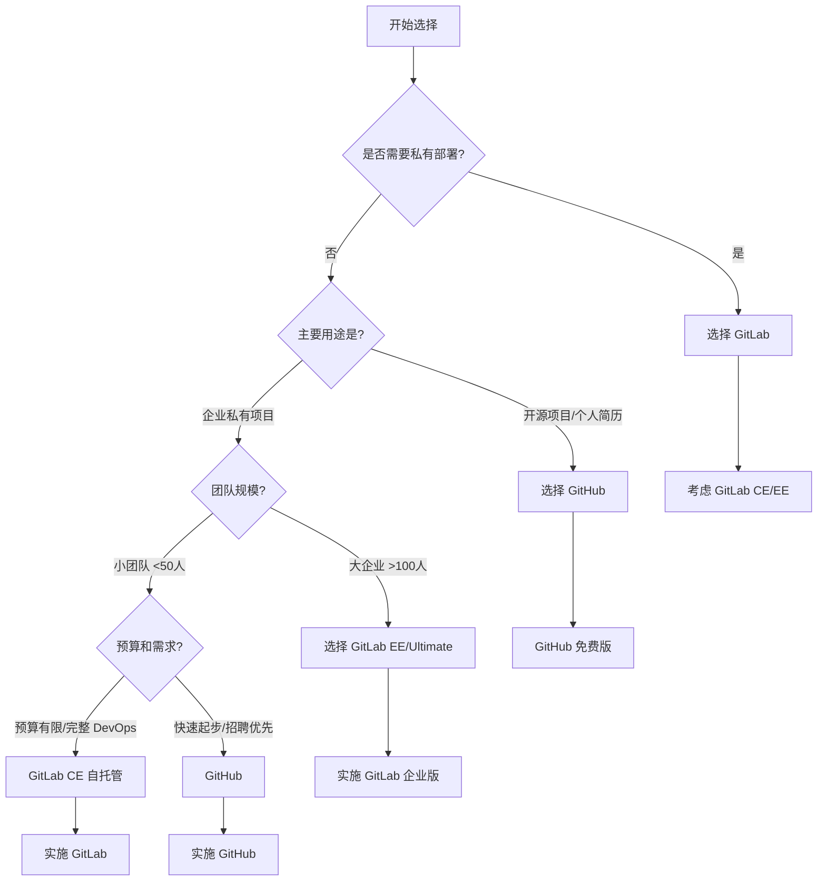

# GitLab vs GitHub：全面对比详解

## 一、一句话概括核心区别

**GitHub = 代码托管平台 + 社交协作网络**  
**GitLab = 一体化 DevOps 平台 + 自托管能力**

---

## 二、核心对比速查表

| 对比维度 | **GitHub** | **GitLab** | 谁更适合 |
|---------|-----------|-----------|---------|
| **核心定位** | 代码社交平台 | 完整 DevOps 平台 | 看需求 |
| **部署方式** | 仅云端 SaaS | SaaS + 自托管 | GitLab 灵活 |
| **商业模式** | 免费+付费 SaaS | 免费自托管+付费 SaaS | 各有所长 |
| **CI/CD** | GitHub Actions | GitLab CI/CD | GitLab 更强 |
| **项目管理** | Issues+Projects | 完整项目群组 | GitLab 完整 |
| **安全功能** | 基础安全扫描 | 全生命周期安全 | GitLab 全面 |
| **社区生态** | 全球最大 | 快速增长 | GitHub 领先 |
| **企业特性** | GitHub Enterprise | GitLab Ultimate | GitLab 更专业 |

---

## 三、详细对比分析

### 1. **核心定位与哲学差异**

#### **GitHub：代码的社交网络**
```
诞生：2008年
口号："Where the world builds software"
哲学：让开源协作更简单
特点：以 Pull Request 为核心的社交化协作
```

**GitHub 的使用体验：**
```bash
# GitHub 就像是：
1. 代码的"Facebook" - 关注、点赞（star）、fork
2. 开源项目的"展示厅" - 个人名片，技术品牌
3. 技术人才的"社交圈" - 发现牛人，学习最佳实践
```

#### **GitLab：一体化 DevOps 平台**
```
诞生：2011年
口号："One application for the entire DevOps lifecycle"
哲学：从想法到生产，全流程一体化
特点：覆盖 DevOps 全流程的单体应用
```

**GitLab 的使用体验：**
```bash
# GitLab 就像是：
1. 软件开发的"瑞士军刀" - 什么功能都有
2. 企业内部的"私有工坊" - 完全可控，私有部署
3. DevOps 的"全家桶" - 开发、测试、部署、监控一体化
```

### 2. **部署方式：最根本的差异**

#### **GitHub：纯云端 SaaS**
```
✅ 优点：
- 零维护成本
- 高可用性保证
- 自动升级
- 全球 CDN 加速

❌ 限制：
- 无法私有部署
- 必须连外网
- 数据在国外（GitHub.com）
- 定制化有限
```

#### **GitLab：SaaS + 自托管**
```
✅ 灵活性：
1. GitLab.com（SaaS）- 类似 GitHub
2. 自托管（Self-hosted）- 完全控制

自托管选项：
- 社区版（CE）：完全免费，功能足够
- 企业版（EE）：付费，企业级功能

部署方式多样：
- Docker 容器
- Helm Chart（K8s）
- 二进制包
- 云市场镜像
```

**自托管场景示例：**
```bash
# 1. 政府/军工企业 - 数据不能出境
# 2. 金融/医疗行业 - 严格合规要求
# 3. 网络隔离环境 - 内网开发
# 4. 大规模定制需求 - 深度定制工作流
```

### 3. **CI/CD 系统对比**

#### **GitHub Actions**
```yaml
# .github/workflows/ci.yml
name: CI Pipeline

on: [push, pull_request]

jobs:
  test:
    runs-on: ubuntu-latest
    steps:
    - uses: actions/checkout@v3
    - name: Run tests
      run: npm test
  
  deploy:
    needs: test
    runs-on: ubuntu-latest
    steps:
    - run: echo "Deploying..."
```

**GitHub Actions 特点：**
- ✅ 基于 YAML 配置
- ✅ 丰富的 Marketplace 动作
- ✅ 与 GitHub 深度集成
- ✅ 免费额度较充足
- ❌ 相对较新（2019年推出）
- ❌ 复杂流水线配置较繁琐

#### **GitLab CI/CD**
```yaml
# .gitlab-ci.yml
stages:
  - test
  - build
  - deploy

unit-test:
  stage: test
  script:
    - npm test
  artifacts:
    paths:
      - coverage/

docker-build:
  stage: build
  script:
    - docker build -t myapp .
    - docker push myapp:latest
  only:
    - main

production-deploy:
  stage: deploy
  script:
    - kubectl rollout restart deployment/myapp
  environment: production
  when: manual  # 手动触发
```

**GitLab CI/CD 特点：**
- ✅ 更成熟（2012年推出）
- ✅ 内置 Docker 支持
- ✅ 环境管理强大
- ✅ Auto DevOps（一键流水线）
- ✅ 流水线可视化更好
- ✅ 内置容器镜像仓库

### 4. **项目管理功能对比**

#### **GitHub：轻量级但够用**
```
核心功能：
1. Issues - 问题跟踪
2. Projects - 看板（类似 Trello）
3. Milestones - 里程碑
4. Labels - 标签分类

扩展：GitHub Projects（新版）
- 表格、看板、路线图视图
- 与 Issues、PR 自动同步
- 但功能相对基础
```

#### **GitLab：企业级项目管理**
```
完整功能矩阵：
1. Issues 系统
   - 权重（Weight）
   - 耗时估计（Time tracking）
   - 关联议题（Linked issues）
   - 服务台（Service Desk）

2. Epics 和 Milestones
   - 跨项目史诗管理
   - 燃尽图（Burn-down charts）
   - 路线图（Roadmaps）

3. 项目管理
   - 甘特图（Gantt charts）
   - 看板（Kanban）
   - 迭代（Iterations）
   - 价值流分析（Value stream）

4. Wiki 和知识库
   - 完整的 Wiki 系统
   - 与代码仓库集成
   - 版本控制
```

### 5. **安全功能对比**

#### **GitHub：基础安全扫描**
```
内置安全功能：
1. Dependabot - 依赖漏洞扫描
2. Code scanning - 代码安全扫描
3. Secret scanning - 密钥泄露检测
4. Security advisories - 安全通告

特点：重在预防和检测
```

#### **GitLab：全生命周期安全**
```
DevSecOps 全流程：
1. 代码阶段
   - SAST（静态应用安全测试）
   - Secret detection（密钥检测）
   - License scanning（许可证扫描）

2. 依赖阶段  
   - Dependency scanning（依赖扫描）
   - Container scanning（容器扫描）

3. 部署阶段
   - DAST（动态应用安全测试）
   - API fuzzing（API模糊测试）
   - Coverage fuzzing（覆盖率模糊测试）

4. 运行阶段
   - Runtime security（运行时安全）
   - Compliance management（合规管理）

特点：安全左移，贯穿全流程
```

### 6. **企业功能对比**

#### **GitHub Enterprise**
```
目标客户：大型企业
核心功能：
1. SAML/SSO 集成
2. 高级审计日志
3. 企业级支持
4. GitHub Actions 分钟数更多

部署：云端或本地（有限制）
```

#### **GitLab Ultimate**
```
目标客户：需要完整 DevOps 的企业
核心功能（除了 EE 所有功能）：
1. 高级项目管理和组合管理
2. 价值流管理（VSM）
3. 合规管理（SOC2、GDPR等）
4. 漏洞管理
5. 史诗和里程碑管理
6. 多级看板
7. 智能洞察和分析

部署：完全自由
```

### 7. **社区与生态系统**

#### **GitHub：无可匹敌的社区**
```
数字说话：
- 1亿+ 开发者
- 3亿+ 仓库
- 全球最大的开源社区
- 事实上的"程序员简历"

生态系统：
- GitHub Marketplace：7000+ 应用
- GitHub Copilot：AI 编程助手
- GitHub Sponsors：开源资助
- GitHub Education：教育计划
```

#### **GitLab：快速成长的社区**
```
社区特点：
- 更专注于企业用户
- 活跃的贡献者社区
- 详细的版本发布（每月22日）
- 透明的开发流程（公开 issue 板）

特色：
- GitLab for Open Source：免费黄金功能
- 贡献者计划
- 详细的文档和教程
```

### 8. **定价模式对比**

#### **GitHub 定价结构**
```
免费版（个人）：
- 公开仓库无限
- 私有仓库有限制
- 协作者数量限制
- Actions 分钟数有限

团队版：$4/用户/月
- 私有仓库无限协作者
- 基础代码审查工具
- 2GB Packages 存储

企业版：$21/用户/月
- SAML 单点登录
- 企业级审计
- GitHub Connect
- 高级支持
```

#### **GitLab 定价结构**
```
自托管版本：
1. 社区版（CE）：完全免费
   - 无限制用户
   - 核心 DevOps 功能
   - 基础 CI/CD

2. 高级版（Premium）：$29/用户/月
   - 企业级敏捷工具
   - 代码质量报告
   - 多级看板
   - 合并请求批准

3. 终极版（Ultimate）：$99/用户/月
   - 安全与合规
   - 价值流管理
   - 漏洞管理
   - 史诗管理

云托管（GitLab.com）：类似定价
```

---

## 四、实际使用场景对比

### 场景1：个人开发者/学生

**推荐：GitHub**
```bash
理由：
1. 简历必备 - 招聘方更认可
2. 开源学习 - 更多开源项目可参考
3. 免费好用 - 个人需求完全满足
4. 社交属性 - 可以关注大神，建立技术影响力
```

### 场景2：创业公司/小团队（<50人）

**都可以，看侧重点：**

| 需求 | 推荐 | 理由 |
|------|------|------|
| 快速起步，不想维护 | GitHub | 开箱即用 |
| 需要完整 DevOps | GitLab | 一体化解决方案 |
| 预算有限 | GitLab CE | 免费自托管 |
| 招聘考虑 | GitHub | 候选人更熟悉 |
| 数据敏感 | GitLab | 自托管控制数据 |

### 场景3：中大型企业（>100人）

**推荐：GitLab**

```yaml
企业需求 vs 解决方案：
需求                        解决方案
─────────────────────────────────────────────
1. 完整的 DevOps 流程       → GitLab 一体化平台
2. 严格的合规要求           → GitLab 合规管理
3. 复杂的安全需求           → GitLab 全生命周期安全
4. 私有部署，数据可控       → GitLab 自托管
5. 多团队复杂权限管理       → GitLab 精细权限控制
6. 价值流和效率分析         → GitLab 价值流管理
```

### 场景4：开源项目维护

**强烈推荐：GitHub**

```bash
理由：
1. 曝光度最高 - 容易获得 star 和 contributors
2. 社区最大 - Issues、PR 响应更快
3. 工具完善 - GitHub Actions 生态丰富
4. 资助渠道 - GitHub Sponsors 直接支持
5. 协作友好 - 熟悉的 Pull Request 流程
```

---

## 五、技术架构对比

### GitHub 技术栈
```
前端：React + TypeScript
后端：Ruby on Rails + Go
数据库：MySQL
缓存：Redis
搜索：Elasticsearch
部署：Kubernetes + AWS
```

### GitLab 技术栈
```
前端：Vue.js
后端：Ruby on Rails + Go
数据库：PostgreSQL
缓存：Redis
搜索：Elasticsearch
部署：Omnibus 包 + Helm Chart
特色：单体应用架构（Monolithic）
```

### 扩展性对比

#### **GitHub：通过 API 和 Marketplace 扩展**
```bash
# GitHub Apps 生态系统
- 可以与 7000+ 第三方工具集成
- 丰富的 REST API 和 GraphQL API
- GitHub Actions 市场动作

# 但：
- 无法修改核心功能
- 集成依赖网络连通性
- 功能边界明确
```

#### **GitLab：通过 Webhooks 和 API 扩展**
```bash
# GitLab 扩展方式：
1. Webhooks - 事件驱动集成
2. REST API - 完整 API 覆盖
3. GraphQL API - 新一代 API
4. 自定义 CI/CD Runner
5. 企业版：自定义功能开发

# 优势：
- 自托管时可深度定制
- 可以修改源码（开源）
- 插件系统
```

---

## 六、迁移考虑

### 从 GitHub 迁移到 GitLab
```bash
# 相对容易，因为：
1. GitLab 提供一键导入工具
2. 支持导入：仓库、Issues、PR、Wiki
3. 相似的 Git 操作体验
4. 很多公司同时使用两者

# 注意事项：
1. CI/CD 配置需要重写（Actions → .gitlab-ci.yml）
2. 项目设置需要重新配置
3. 团队需要重新培训
```

### 从 GitLab 迁移到 GitHub
```bash
# 相对困难，因为：
1. GitHub 没有官方导入工具（第三方工具存在）
2. CI/CD 需要完全重写
3. 项目管理功能可能丢失
4. 安全扫描配置不同

# 适合场景：
1. 开源项目想获得更多曝光
2. 小型团队简化工具链
3. 被微软生态绑定
```

---

## 七、发展趋势对比

### GitHub 发展趋势
```
1. AI 集成深化 - GitHub Copilot X
2. 开发者体验优化 - Codespaces
3. 企业级功能增强 - GitHub Advanced Security
4. 移动端体验提升 - 移动 App
5. 社区功能强化 - Discussions、Sponsors
```

### GitLab 发展趋势
```
1. 全平台一体化 - 覆盖更多 DevOps 阶段
2. 价值流管理 - 从效率到业务价值
3. 安全左移 - 更早的安全检测
4. 多云部署 - 更好的云原生支持
5. AI 助手 - GitLab Duo（AI 功能）
```

---

## 八、混合使用策略

### 常见混合使用模式

#### **模式1：GitHub（开源）+ GitLab（内部）**
```
对外开源项目：GitHub
- 提高项目知名度
- 吸引贡献者
- 建立技术品牌

内部私有项目：GitLab 自托管
- 保护商业机密
- 完整 DevOps 流程
- 数据安全可控
```

#### **模式2：GitHub（代码托管）+ GitLab CI（CI/CD）**
```yaml
# 配置示例
# 代码仍放在 GitHub
# 但使用 GitLab CI Runner

# .gitlab-ci.yml 配置使用外部仓库：
include:
  - project: 'mygroup/myproject'
    ref: main
    file: '/templates/.gitlab-ci-template.yml'

# 通过 API Token 访问 GitHub
variables:
  GITHUB_TOKEN: $CI_GITHUB_TOKEN
```

#### **模式3：GitLab（开发）+ GitHub（发布）**
```
开发阶段：GitLab 自托管
- 代码开发
- CI/CD 流水线
- 内部测试

发布阶段：同步到 GitHub
- 开源版本发布
- 文档托管
- 社区 Issue 跟踪
```

---

## 九、决策流程图



---

## 十、总结：何时选择哪个？

### **选择 GitHub 当：**

1. **你是个人开发者或学生**
   - 建立技术简历
   - 参与开源项目
   - 学习最佳实践

2. **你的项目是开源的**
   - 需要最大曝光度
   - 希望吸引贡献者
   - 使用 GitHub Sponsors

3. **你的团队很小且不想维护**
   - 快速起步
   - 零运维成本
   - 标准功能足够

4. **你需要强大的社交功能**
   - 关注其他开发者
   - 发现热门项目
   - 建立技术影响力

5. **你深度集成微软生态**
   - VS Code、Azure、Teams
   - GitHub Copilot AI 助手

### **选择 GitLab 当：**

1. **你需要私有部署**
   - 数据不能出境
   - 严格合规要求
   - 网络隔离环境

2. **你需要完整的 DevOps 平台**
   - 从需求到监控全流程
   - 不想集成多个工具
   - 一体化体验

3. **你的企业规模较大**
   - 复杂权限管理
   - 多团队协作
   - 高级项目管理

4. **安全是首要考虑**
   - 全生命周期安全
   - 合规审计需求
   - 漏洞管理系统

5. **你预算有限但需要企业功能**
   - GitLab CE 完全免费
   - 自托管控制成本
   - 核心功能齐全

### **最后的建议：**

**不要只看技术，考虑这些因素：**
1. **团队技能** - 大家熟悉哪个？
2. **招聘需求** - 候选人更熟悉哪个？
3. **合规要求** - 数据驻留要求？
4. **预算限制** - 现在和未来的预算？
5. **未来扩展** - 3-5年的发展计划？

**现实情况：**
- 很多公司 **同时使用两者**（GitHub 开源 + GitLab 私有）
- **可以迁移** - 不是终身决定
- **试用两个** - 都试试看团队更喜欢哪个

**一句话决策指南：**
- 想简单、社交、开源 → **GitHub**
- 要完整、可控、企业 → **GitLab**

两者都是优秀的产品，选择最适合你当前和未来需求的那个。
