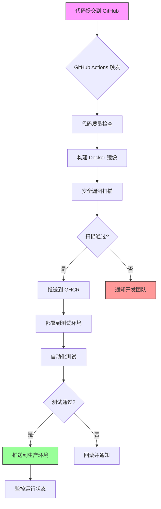

# GitHub 容器镜像（GitHub Container Registry）详解

## 一、GitHub 容器镜像服务总览

### 1. **GitHub 提供的容器服务**

```
GitHub 容器生态系统:
┌─────────────────────────────────────────────────────┐
│                   GitHub Container Registry          │ ← 容器镜像仓库
│                   (ghcr.io)                         │
├─────────────────────────────────────────────────────┤
│                 GitHub Actions                       │ ← CI/CD 流水线
├─────────────────────────────────────────────────────┤
│                GitHub Packages                       │ ← 包管理（包括容器）
└─────────────────────────────────────────────────────┘
```

### 2. **GitHub Container Registry (GHCR) 特点**

**核心优势：**
- ✅ **完全免费**（有一定限制）
- ✅ **与 GitHub 深度集成**
- ✅ **支持私有和公共镜像**
- ✅ **自动安全扫描**
- ✅ **地理冗余存储**

**免费额度（个人账户/组织）：**
```
存储: 500 MB 免费
数据传输: 每月 1 GB 免费
               ↓
超出部分才收费，小项目完全够用
```

---

## 二、三种创建容器镜像的方式

### 方式1：使用 GitHub Actions 自动构建（推荐）

```yaml
# .github/workflows/docker-image.yml
name: Build and Push Docker Image

on:
  push:
    branches: [ main ]
    tags: [ 'v*' ]
  pull_request:
    branches: [ main ]

env:
  REGISTRY: ghcr.io
  IMAGE_NAME: ${{ github.repository }}

jobs:
  build-and-push:
    runs-on: ubuntu-latest
    permissions:
      contents: read
      packages: write
    
    steps:
      # 1. 检出代码
      - name: Checkout repository
        uses: actions/checkout@v4
      
      # 2. 登录到 GitHub Container Registry
      - name: Log in to GHCR
        uses: docker/login-action@v3
        with:
          registry: ghcr.io
          username: ${{ github.actor }}
          password: ${{ secrets.GITHUB_TOKEN }}
      
      # 3. 设置 Docker 构建参数
      - name: Set up Docker Buildx
        uses: docker/setup-buildx-action@v3
      
      # 4. 提取元数据（标签、标签）
      - name: Extract metadata
        id: meta
        uses: docker/metadata-action@v5
        with:
          images: ghcr.io/${{ github.repository }}
          tags: |
            type=ref,event=branch
            type=ref,event=pr
            type=semver,pattern={{version}}
            type=semver,pattern={{major}}.{{minor}}
            type=sha,prefix={{branch}}-
      
      # 5. 构建并推送镜像
      - name: Build and push
        uses: docker/build-push-action@v5
        with:
          context: .
          push: ${{ github.event_name != 'pull_request' }}
          tags: ${{ steps.meta.outputs.tags }}
          labels: ${{ steps.meta.outputs.labels }}
          cache-from: type=gha
          cache-to: type=gha,mode=max
```

### 方式2：本地构建后手动推送

```bash
# 1. 构建镜像（基于项目中的 Dockerfile）
docker build -t ghcr.io/your-username/your-image:latest .

# 2. 登录 GitHub Container Registry
echo "你的个人访问令牌" | docker login ghcr.io -u 你的用户名 --password-stdin

# 3. 推送镜像
docker push ghcr.io/your-username/your-image:latest

# 4. 查看已推送的镜像
docker image ls ghcr.io/your-username/your-image
```

### 方式3：多架构镜像构建（ARM/AMD）

```yaml
# .github/workflows/multi-arch.yml
name: Build Multi-arch Docker Image

jobs:
  build:
    runs-on: ubuntu-latest
    strategy:
      matrix:
        platform:
          - linux/amd64
          - linux/arm64
          - linux/arm/v7
    
    steps:
      - uses: actions/checkout@v4
      
      - name: Set up QEMU
        uses: docker/setup-qemu-action@v3
      
      - name: Set up Docker Buildx
        uses: docker/setup-buildx-action@v3
      
      - name: Login to GHCR
        uses: docker/login-action@v3
        with:
          registry: ghcr.io
          username: ${{ github.actor }}
          password: ${{ secrets.GITHUB_TOKEN }}
      
      - name: Build and push
        uses: docker/build-push-action@v5
        with:
          context: .
          platforms: ${{ matrix.platform }}
          push: true
          tags: |
            ghcr.io/${{ github.repository }}:latest
            ghcr.io/${{ github.repository }}:${{ github.sha }}
```

---

## 三、完整实战示例：Unity 构建镜像

### 1. **Dockerfile 示例：Unity 构建环境**

```dockerfile
# Dockerfile.unity-builder
# 阶段1：基础 Unity 环境
FROM unityci/editor:ubuntu-2021.3.21f1-base-1.0.1 AS builder

# 安装额外工具
RUN apt-get update && apt-get install -y \
    git \
    curl \
    wget \
    zip \
    unzip \
    python3 \
    python3-pip \
    && rm -rf /var/lib/apt/lists/*

# 设置工作目录
WORKDIR /workspace

# 复制构建脚本
COPY BuildScripts/ ./BuildScripts/
COPY Assets/ ./Assets/

# 设置环境变量
ENV UNITY_PROJECT_PATH=/workspace
ENV OUTPUT_PATH=/output

# 阶段2：运行时环境（轻量级）
FROM ubuntu:22.04 AS runtime

# 只安装运行时必要的工具
RUN apt-get update && apt-get install -y \
    ca-certificates \
    && rm -rf /var/lib/apt/lists/*

WORKDIR /app

# 从构建阶段复制构建好的 AB 包
COPY --from=builder /output/ ./ab/

# 暴露端口（如果需要）
EXPOSE 8080

# 设置启动命令
CMD ["python3", "-m", "http.server", "8080"]
```

### 2. **GitHub Actions 工作流配置**

```yaml
# .github/workflows/unity-ab-pipeline.yml
name: Unity AB Pipeline with Docker

on:
  push:
    branches: [main, develop]
    paths:
      - 'Assets/**'
      - 'BuildScripts/**'
      - 'Dockerfile.unity-builder'
      - '.github/workflows/unity-ab-pipeline.yml'
  release:
    types: [published]

jobs:
  # 工作流1：构建 Unity AB 包
  build-unity-ab:
    runs-on: ubuntu-latest
    outputs:
      ab_version: ${{ steps.version.outputs.version }}
    
    steps:
      - name: Checkout code
        uses: actions/checkout@v4
        with:
          submodules: recursive
      
      - name: Set up Docker Buildx
        uses: docker/setup-buildx-action@v3
      
      - name: Build Unity AB Docker image
        run: |
          docker build \
            -f Dockerfile.unity-builder \
            -t unity-ab-builder:latest \
            .
      
      - name: Run Unity AB build in container
        run: |
          docker run --rm \
            -v $(pwd)/output:/output \
            unity-ab-builder:latest \
            python3 BuildScripts/build_ab.py \
              --platform StandaloneWindows64 \
              --type Full \
              --version 1.0.${{ github.run_number }}
      
      - name: Generate version info
        id: version
        run: |
          echo "version=1.0.${{ github.run_number }}" >> $GITHUB_OUTPUT
  
  # 工作流2：构建并推送 Docker 镜像
  build-and-push-docker:
    needs: build-unity-ab
    runs-on: ubuntu-latest
    permissions:
      contents: read
      packages: write
    
    steps:
      - name: Checkout code
        uses: actions/checkout@v4
      
      - name: Download AB artifacts
        uses: actions/download-artifact@v4
        with:
          name: ab-output
          path: output/
      
      - name: Set up Docker Buildx
        uses: docker/setup-buildx-action@v3
      
      - name: Login to GHCR
        uses: docker/login-action@v3
        with:
          registry: ghcr.io
          username: ${{ github.actor }}
          password: ${{ secrets.GITHUB_TOKEN }}
      
      - name: Extract metadata
        id: meta
        uses: docker/metadata-action@v5
        with:
          images: ghcr.io/${{ github.repository }}
          tags: |
            type=raw,value=${{ needs.build-unity-ab.outputs.ab_version }}
            type=raw,value=latest
            type=sha,prefix={{branch}}-
      
      - name: Build and push AB runtime image
        uses: docker/build-push-action@v5
        with:
          context: .
          file: Dockerfile.runtime
          push: true
          tags: ${{ steps.meta.outputs.tags }}
          labels: ${{ steps.meta.outputs.labels }}
          build-args: |
            AB_VERSION=${{ needs.build-unity-ab.outputs.ab_version }}
  
  # 工作流3：部署到测试环境
  deploy-to-test:
    needs: build-and-push-docker
    runs-on: ubuntu-latest
    environment: test
    
    steps:
      - name: Deploy to test environment
        run: |
          echo "部署镜像到测试环境..."
          echo "镜像: ghcr.io/${{ github.repository }}:${{ needs.build-unity-ab.outputs.ab_version }}"
          # 这里可以是实际的部署命令，如：
          # kubectl set image deployment/my-game ab-server=ghcr.io/...
```

### 3. **多阶段构建优化**

```dockerfile
# Dockerfile.optimized
# 阶段1：依赖安装
FROM node:18-alpine AS deps
WORKDIR /app
COPY package*.json ./
RUN npm ci --only=production

# 阶段2：构建应用
FROM node:18-alpine AS builder
WORKDIR /app
COPY --from=deps /app/node_modules ./node_modules
COPY . .
RUN npm run build

# 阶段3：运行时镜像（最小化）
FROM nginx:alpine AS runner
COPY --from=builder /app/dist /usr/share/nginx/html
COPY nginx.conf /etc/nginx/conf.d/default.conf
EXPOSE 80
CMD ["nginx", "-g", "daemon off;"]
```

---

## 四、GitHub Packages 与 GHCR 对比

### 功能对比表

| 特性 | GitHub Container Registry (GHCR) | GitHub Packages (Docker) | Docker Hub |
|------|----------------------------------|--------------------------|------------|
| **完全免费额度** | 500 MB + 1 GB/月 | 同 GHCR | 有限免费（需订阅） |
| **私有仓库** | ✅ 无限 | ✅ 无限 | ❌ 有限制 |
| **公共仓库** | ✅ 无限 | ✅ 无限 | ✅ 无限 |
| **与 GitHub 集成** | ✅ 深度集成 | ✅ 集成 | ❌ 有限 |
| **自动安全扫描** | ✅ 高级扫描 | ✅ 基础扫描 | ✅ 需付费 |
| **地理冗余** | ✅ 自动 | ✅ 自动 | ❌ 有限 |
| **访问控制** | ✅ 精细控制 | ✅ 精细控制 | ✅ 基础控制 |
| **Webhooks** | ✅ 支持 | ✅ 支持 | ✅ 支持 |
| **使用率统计** | ✅ 详细 | ✅ 详细 | ✅ 详细 |

### 迁移指南：从 Docker Hub 到 GHCR

```bash
# 1. 从 Docker Hub 拉取现有镜像
docker pull username/image:tag

# 2. 重新标记为 GHCR 格式
docker tag username/image:tag ghcr.io/your-username/image:tag

# 3. 登录 GHCR
echo $GHCR_TOKEN | docker login ghcr.io -u your-username --password-stdin

# 4. 推送到 GHCR
docker push ghcr.io/your-username/image:tag

# 5. 更新你的部署配置
# 之前: image: username/image:tag
# 之后: image: ghcr.io/your-username/image:tag
```

---

## 五、访问控制与权限管理

### 1. **访问令牌类型**

| 令牌类型 | 用途 | 权限范围 | 示例用途 |
|---------|------|---------|---------|
| **GITHUB_TOKEN** | Actions 自动认证 | 当前仓库 | CI/CD 流水线 |
| **个人访问令牌** | 手动操作/脚本 | 可配置范围 | 本地推送镜像 |
| **部署密钥** | 只读访问 | 单个仓库 | 生产环境拉取 |

### 2. **权限配置示例**

```yaml
# 在 GitHub Actions 中配置权限
permissions:
  # 容器镜像权限
  packages: write    # 允许推送镜像
  contents: read     # 允许读取代码
  actions: read      # 允许读取 Actions
  checks: write      # 允许写入检查结果
  
  # 或者使用预设权限级别
  id-token: write    # OIDC token 用于云提供商认证
```

### 3. **组织级权限管理**

```yaml
# 组织设置 → Packages → 权限管理
权限结构:
组织 (your-org)
├── 包仓库 (ghcr.io/your-org/base-image)
│   ├── 管理员: team-devops
│   ├── 写入: team-backend
│   └── 读取: team-frontend
├── 包仓库 (ghcr.io/your-org/web-app)
│   ├── 管理员: team-frontend
│   └── 读取: team-qa
└── 包仓库 (ghcr.io/your-org/database)
    ├── 管理员: team-dba
    └── 读取: team-backend
```

---

## 六、镜像管理与维护

### 1. **标签策略最佳实践**

```yaml
# 推荐标签命名规则
tags: |
  # 语义化版本
  type=semver,pattern={{version}}              # v1.2.3
  type=semver,pattern={{major}}.{{minor}}      # v1.2
  type=semver,pattern={{major}}                # v1
  
  # 分支标签
  type=ref,event=branch                        # main, develop
  type=ref,event=tag                           # 从标签触发
  
  # 提交哈希
  type=sha,prefix=sha-                         # sha-abc123
  
  # 环境标签
  type=raw,value=latest                        # 最新稳定版
  type=raw,value=nightly                       # 每日构建
```

### 2. **自动清理旧镜像**

```yaml
# .github/workflows/cleanup-images.yml
name: Cleanup Old Docker Images

on:
  schedule:
    - cron: '0 3 * * 0'  # 每周日凌晨3点
  workflow_dispatch:      # 手动触发

jobs:
  cleanup:
    runs-on: ubuntu-latest
    permissions:
      packages: write
      contents: read
    
    steps:
      - name: Cleanup old images
        uses: snok/container-retention-policy@v2
        with:
          # 保留策略
          image-names: |
            ghcr.io/${{ github.repository }}/*
          
          # 保留规则
          keep-at-least: 10           # 至少保留10个镜像
          keep-tags: |
            ^latest$                  # 保留 latest 标签
            ^v[0-9]+\.[0-9]+\.[0-9]+$ # 保留正式版本
            ^main$                    # 保留 main 分支构建
          
          # 删除规则
          cut-off: P30D               # 删除30天前的镜像
          dry-run: false              # 实际执行删除
```

### 3. **镜像安全扫描**

```yaml
# .github/workflows/security-scan.yml
name: Security Scan Docker Images

on:
  push:
    branches: [main]
    tags: [v*]

jobs:
  scan:
    runs-on: ubuntu-latest
    
    steps:
      - name: Checkout code
        uses: actions/checkout@v4
      
      - name: Build Docker image
        run: docker build -t myapp:latest .
      
      # 使用 Trivy 扫描
      - name: Run Trivy vulnerability scanner
        uses: aquasecurity/trivy-action@master
        with:
          image-ref: 'myapp:latest'
          format: 'sarif'
          output: 'trivy-results.sarif'
      
      # 使用 Grype 扫描
      - name: Run Grype vulnerability scanner
        uses: anchore/scan-action@v3
        with:
          image: myapp:latest
          fail-build: false
      
      # 上传安全扫描结果
      - name: Upload SARIF results
        uses: github/codeql-action/upload-sarif@v2
        with:
          sarif_file: trivy-results.sarif
```

---

## 七、高级使用场景

### 1. **跨仓库共享基础镜像**

```yaml
# 仓库A：构建基础镜像
# Dockerfile.base
FROM ubuntu:22.04
RUN apt-get update && apt-get install -y \
    python3 python3-pip nodejs npm
# 推送到：ghcr.io/org/base-image:latest

# 仓库B：使用基础镜像
# Dockerfile.app
FROM ghcr.io/org/base-image:latest AS builder
WORKDIR /app
COPY . .
RUN npm install && npm run build

FROM nginx:alpine
COPY --from=builder /app/dist /usr/share/nginx/html
```

### 2. **使用缓存加速构建**

```yaml
# 利用 GitHub Actions 缓存
- name: Set up Docker Buildx with cache
  uses: docker/setup-buildx-action@v3
  with:
    driver-opts: |
      image=moby/buildkit:latest
      # 使用 GitHub Actions 缓存
      cache-from=type=gha
      cache-to=type=gha,mode=max

# 或者使用外部缓存
cache-from: |
  type=registry,ref=ghcr.io/${{ github.repository }}:buildcache
cache-to: |
  type=registry,ref=ghcr.io/${{ github.repository }}:buildcache,mode=max
```

### 3. **多云部署策略**

```yaml
# 部署到多个云平台
deploy:
  strategy:
    matrix:
      cloud: [aws, azure, gcp]
  
  steps:
    - name: Authenticate to ${{ matrix.cloud }}
      uses: docker/login-action@v3
      with:
        # 使用 OIDC 进行云认证
        registry: ${{ matrix.cloud == 'aws' && 'public.ecr.aws' || 
                    matrix.cloud == 'azure' && 'azurecr.io' || 
                    matrix.cloud == 'gcp' && 'gcr.io' }}
    
    - name: Push to ${{ matrix.cloud }}
      run: |
        # 从 GHCR 拉取
        docker pull ghcr.io/${{ github.repository }}:${{ env.VERSION }}
        
        # 重新打标签
        docker tag ghcr.io/${{ github.repository }}:${{ env.VERSION }} \
                   ${{ matrix.cloud.registry }}/${{ github.repository }}:${{ env.VERSION }}
        
        # 推送到目标云
        docker push ${{ matrix.cloud.registry }}/${{ github.repository }}:${{ env.VERSION }}
```

---

## 八、成本优化策略

### 1. **镜像层优化技巧**

```dockerfile
# 优化前的 Dockerfile（问题示例）
FROM ubuntu:22.04
RUN apt-get update
RUN apt-get install -y python3  # ❌ 分开 RUN 命令
RUN apt-get install -y nodejs   # ❌ 创建多层
RUN apt-get install -y git      # ❌ 每层都增加大小
COPY package.json .             # ❌ 频繁变更的层放前面
RUN npm install                 # ❌ 每次构建都执行

# 优化后的 Dockerfile（最佳实践）
FROM ubuntu:22.04 AS builder

# 1. 合并 RUN 命令，清理缓存
RUN apt-get update && \
    apt-get install -y \
        python3 \
        nodejs \
        git \
    && rm -rf /var/lib/apt/lists/*

# 2. 分离依赖安装和代码复制
WORKDIR /app
COPY package*.json ./          # ✅ 依赖文件单独复制
RUN npm ci --only=production   # ✅ 使用 ci 更稳定

# 3. 代码放在后面（变更频繁）
COPY . .                       # ✅ 代码层在依赖层之后

# 4. 多阶段构建减小最终镜像
FROM node:18-alpine AS runner  # ✅ 使用更小的基础镜像
COPY --from=builder /app /app
```

### 2. **存储成本控制**

```bash
# 查看镜像大小
docker images --format "table {{.Repository}}\t{{.Tag}}\t{{.Size}}"

# 清理无用镜像
docker image prune -a --filter "until=24h"

# 使用 dive 分析镜像层
docker run --rm -it \
    -v /var/run/docker.sock:/var/run/docker.sock \
    wagoodman/dive:latest ghcr.io/your-org/image:latest
```

### 3. **传输成本优化**

```yaml
# 使用内容寻址存储减少重复传输
- name: Build with content-based tagging
  run: |
    # 构建时不指定标签
    docker build -t myapp .
    
    # 获取镜像摘要（唯一ID）
    DIGEST=$(docker inspect myapp --format='{{.Id}}')
    
    # 使用摘要作为标签
    docker tag myapp ghcr.io/${{ github.repository }}@${DIGEST}
    docker push ghcr.io/${{ github.repository }}@${DIGEST}
```

---

## 九、故障排查与监控

### 1. **常见问题解决**

| 问题 | 原因 | 解决方案 |
|------|------|---------|
| **推送失败：denied** | 权限不足 | 检查 GITHUB_TOKEN 或 PAT 权限 |
| **镜像过大超限** | 超过免费额度 | 优化镜像大小，删除旧镜像 |
| **构建超时** | 网络问题或构建复杂 | 增加 timeout，使用镜像缓存 |
| **安全扫描失败** | 存在高危漏洞 | 更新基础镜像，修复漏洞 |
| **拉取缓慢** | 地理距离远 | 使用镜像加速器或 CDN |

### 2. **监控指标**

```yaml
# 使用 GitHub API 监控使用情况
- name: Check package usage
  run: |
    curl -s -H "Authorization: token ${{ secrets.GH_TOKEN }}" \
      https://api.github.com/users/${{ github.actor }}/packages?package_type=container \
      | jq '.[] | {name: .name, version_count: .version_count}'
```

### 3. **日志与调试**

```bash
# 启用详细日志
docker build --progress=plain --no-cache -t myapp .

# 检查 Actions 日志
gh run view --log $RUN_ID

# 检查镜像元数据
docker inspect ghcr.io/username/image:tag

# 查看镜像历史
docker history ghcr.io/username/image:tag --no-trunc
```

---

## 十、完整实战工作流

### 企业级镜像流水线



### 配置清单总结

1. **必须文件**：
   - `.github/workflows/docker.yml` - CI/CD 配置
   - `Dockerfile` - 镜像构建定义
   - `.dockerignore` - 排除不必要的文件

2. **推荐配置**：
   - `docker-compose.yml` - 本地开发环境
   - `Makefile` - 构建命令封装
   - `scripts/` - 辅助脚本目录

3. **安全配置**：
   - GitHub Secrets（存储敏感信息）
   - 代码签名（可选）
   - 访问控制策略

---

## 总结

**GitHub Container Registry 的核心优势：**
1. **无缝集成** - 与 GitHub Actions、Packages 深度集成
2. **成本效益** - 对开源项目和小团队完全免费
3. **安全性** - 内置漏洞扫描和访问控制
4. **易用性** - 使用熟悉的 GitHub 界面和 API

**使用建议：**
- 小型项目/初创公司 → **直接使用 GHCR**
- 企业级应用 → **GHCR + 自建镜像仓库混合**
- 需要多云部署 → **GHCR 作为主仓库，同步到各云**

**一句话总结：** GitHub 不仅可以打镜像，而且提供了一套完整的、与代码仓库深度集成的容器镜像解决方案，特别适合 GitOps 和 DevOps 工作流。
