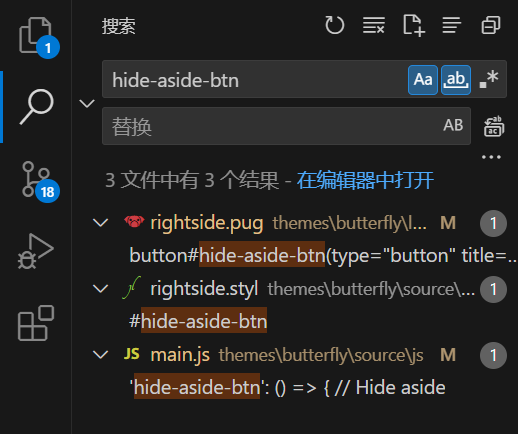

F12调试，查找对应元素的id:页面点击关联至页面元素html标签

themes\butterfly\layout\includes\rightside.pug

themes\butterfly\source\js\main.js


查找 hide-aside-btn  



pug写布局
styl写样式
main.js控件调用的功能逻辑

```js
pug代码，遍历生成自定义按钮：

mixin rightsideItem(array)
  each item in array
    case item
      when 'customButton'
        button#custom-button(type="button" title="全屏阅读")
          i.fas.fa-star

添加按钮到列表：

#rightside
  - const { enable, hide, show } = theme.rightside_item_order
  - const hideArray = enable ? hide && hide.split(',') : ['readmode','translate','darkmode','hideAside', 'customButton']
  - const showArray = enable ? show && show.split(',') : ['toc','chat','comment']

```
按钮click事件：
```js
'custom-button': () => { 
      // 自定义按钮（阅读模式）
      // document.getElementById("custom-button").addEventListener("click", function () {
        console.log('click');
        var page;
        const _page = document.getElementById("page");
        if (_page)
          page = _page;
        const _post = document.getElementById("post");
        if (_post)
          page = _post;
        page.style.width = "100%"; // 撑满屏幕
        // page.style.setProperty("padding", "160px", "important");
        page.style.padding = "86px"; // 撑满屏幕 不加单位视为百分百
        const content = document.getElementById("content-inner");
        content.style.maxWidth = "100%"; // 撑满屏幕
        content.style.margin = "0"; // 撑满屏幕
        content.style.padding = "0"; // 撑满屏幕
      // })
    },
```


## 方案二

_config.butterfly.yml
```yml
inject:
  head:
  bottom:
    - '<link rel="stylesheet" href="https://cdnjs.cloudflare.com/ajax/libs/font-awesome/5.15.4/css/all.min.css">'
    - '<style>'
    - '  .custom-action-buttons {'
    - '    position: fixed;'
    - '    bottom: -5px;' # 调整按钮位置
    - '    right: 10px;'
    - '    z-index: 100;'
    - '  }'
    - '  .custom-action-buttons .action-item {'
    - '    width: 35px;'
    - '    height: 35px;'
    - '    background-color: #1f1f1f;'
    - '    border-radius: 5px;'
    - '    display: flex;'
    - '    justify-content: center;'
    - '    align-items: center;'
    - '    color: white;'
    - '    cursor: pointer;'
    - '    margin-bottom: 10px;'
    - '  }'
    - '  .custom-action-buttons .action-item:hover {'
    - '    background-color: #555;'
    - '  }'
    - '</style>'
    - '<div class="custom-action-buttons">'
    - '  <div class="action-item" id="custom-music-button" onclick="toggleMusic()">'
    - '    <i class="fas fa-music"></i>'
    - '  </div>'
    - '</div>'
    - '<script>'
    - '  function toggleMusic() {'
    - '    const musicPlayer = document.getElementById("music-player");'
    - '    if (musicPlayer.style.display === "none") {'
    - '      musicPlayer.style.display = "block";'
    - '    } else {'
    - '      musicPlayer.style.display = "none";'
    - '    }'
    - '  }'
    - '</script>'
    - '<div id="music-player" style="display: none;"></div>'
    - '<link rel="stylesheet" type="text/css" href="https://cdn.jsdelivr.net/npm/aplayer/dist/APlayer.min.css">'
    - '<script src="https://cdn.jsdelivr.net/npm/aplayer/dist/APlayer.min.js"></script>'
    - '<script>'
    - '  fetch("/music/playlist.json")'
    - '    .then(response => response.json())'
    - '    .then(data => {'
    - '      const ap = new APlayer({'
    - '        container: document.getElementById("music-player"),'
    - '        fixed: true,'
    - '        autoplay: false,'
    - '        audio: data,'
    - '        lrcType: 3'
    - '      });'
    - '    })'
    - '    .catch(error => console.error("Error loading playlist:", error));'
    - '</script>'
```

### 分别创建
将 HTML、CSS 和 JavaScript 提取到独立的文件中，利用 Hexo 的 `asset` 机制进行引用。：

1. **HTML** (通过 `inject` 注入)

在 `inject.bottom` 配置中，只保留最简洁的 HTML 结构，避免将 CSS 和 JavaScript 内联。

```yaml
inject:
  head:
    - '<link rel="stylesheet" href="https://cdnjs.cloudflare.com/ajax/libs/font-awesome/5.15.4/css/all.min.css">'
    - '<link rel="stylesheet" href="/path/to/custom/styles.css">'
  bottom:
    - '<div class="custom-action-buttons">'
    - '  <div class="action-item" id="custom-music-button">'
    - '    <i class="fas fa-music"></i>'
    - '  </div>'
    - '</div>'
    - '<div id="music-player" style="display: none;"></div>'
    - '<script src="https://cdn.jsdelivr.net/npm/aplayer/dist/APlayer.min.js"></script>'
    - '<script src="/path/to/custom/scripts.js"></script>'
```

2. **CSS** (放在 `themes/butterfly/source/css/custom/styles.css` 文件中)

```css
/* custom/styles.css */
.custom-action-buttons {
  position: fixed;
  bottom: -5px; /* 调整按钮位置 */
  right: 10px;
  z-index: 100;
}

.custom-action-buttons .action-item {
  width: 35px;
  height: 35px;
  background-color: #1f1f1f;
  border-radius: 5px;
  display: flex;
  justify-content: center;
  align-items: center;
  color: white;
  cursor: pointer;
  margin-bottom: 10px;
}

.custom-action-buttons .action-item:hover {
  background-color: #555;
}
```

3. **JavaScript** (放在 `themes/butterfly/source/js/custom/scripts.js` 文件中)

```javascript
// custom/scripts.js
document.getElementById("custom-music-button").addEventListener("click", toggleMusic);

function toggleMusic() {
  const musicPlayer = document.getElementById("music-player");
  if (musicPlayer.style.display === "none") {
    musicPlayer.style.display = "block";
  } else {
    musicPlayer.style.display = "none";
  }
}

// 加载音乐播放器
fetch("/music/playlist.json")
  .then(response => response.json())
  .then(data => {
    const ap = new APlayer({
      container: document.getElementById("music-player"),
      fixed: true,
      autoplay: false,
      audio: data,
      lrcType: 3
    });
  })
  .catch(error => console.error("Error loading playlist:", error));
```

## 总结

两种方式都有弊端：
- 第一种方式更加规范，但是由于带动了主题代码，升级主题可能会导致原来的脚本丢失。
- 第二种方式更灵活，但是这么写不方便调试和阅读，如果将代码分别放到新建立的css和js代码中，使用引用脚本又有点小题大做。

### 优化建议

1. **减少 HTML 字符串的拼接**：
   在 Hexo 的 `inject` 配置中，你目前是通过多行字符串拼接的方式插入 HTML、CSS 和 JavaScript。这会增加代码的冗长并且可能使其难以维护。可以考虑将 HTML、CSS 和 JavaScript 提取到独立的文件中，利用 Hexo 的 `asset` 机制进行引用。

2. **减少内联 CSS 和 JavaScript**：
   将 CSS 和 JavaScript 移动到外部文件中，而不是直接嵌入在 `inject` 配置中。这不仅可以减少页面的大小，还能提高代码的可重用性和可维护性。

3. **使用 Pug 或 CSS 来代替 HTML 和内联样式**：
   如果你希望代码更简洁，可以使用 Pug 模板和 CSS 来实现布局和样式，而不是直接在 `inject` 中写 HTML 和 CSS。

4. **优化 JavaScript 和事件绑定**：
   通过 `addEventListener` 方式绑定事件，而不是在 HTML 中使用 `onclick` 属性，这样可以使 JavaScript 更加分离并且可维护。
