# 《尘息》

## —— 末世拾荒与家园重建编年史

---

# 第一部分：游戏高概念

## 一句话梗概
> *“在文明的残骸上，拾起最后一粒种子，种下人类的明天。”*

## 核心体验循环
**拾荒（Roguelike风险决策）** → **资源回收** → **家园建设（工厂/农场）** → **防御布置（塔防）** → **扩张征服**

## 视角选择
**斜45度等距视角（2.5D）**
- 兼容动作拾荒、基地建设、塔防布阵多种玩法
- 支持三维空间感知（Y轴承载高度信息，用于高地防守、空中敌袭）
- 美术风格：手绘废土美学，残骸与绿洲的对比

---

# 第二部分：世界观与剧情

## 2.1 背景设定 —— 为什么世界成了废墟？

**时间：** 公元2157年
**事件：** “大枯萎”

这不是核战争，也不是陨石撞击。是一场诡异的**植物反向进化**。
某一天起，全球的农作物开始疯狂消耗土壤养分却不结果，森林释放有毒孢子，藤蔓像触手一样缠绕并摧毁城市。人类引以为傲的科技，在疯狂的植物进化面前不堪一击。

**七年后。**
文明只剩残骸。城市变成藤蔓覆盖的遗迹，高速公路断裂在荒漠中，地铁路网成了豺狼和野人的巢穴。
幸存者散落成一个个微型聚落，在废土上苟延残喘。

## 2.2 玩家角色 —— 你从何而来？

你叫**“埃可”（Echo）**。
你醒来时，躺在一个废弃的军用避难所里。身边只有一块刻着“播种者计划”的军用铭牌，和一个破旧的播种包——里面装着七粒不一样的种子。

你最后的记忆是：
> *“把种子带出去……种在……阳光能照到的地方……”*

你不记得说话的人是谁。是父亲？是战友？还是你自己？

## 2.3 核心剧情冲突 —— 你在对抗什么？

表面上，你在对抗废土的威胁：
- **野人**：退化成部落的人类，视你为入侵者
- **豺狼野兽**：变异兽群，被血腥味吸引
- **掠夺者**：有组织的匪帮，抢夺资源，奴役幸存者

但真正的冲突是**文明的两种复苏路径**：
- **你的路**：重建农场、工厂、防御体系，让幸存者重新学会“生产”
- **敌人的路**：“部落之王”格鲁克和他的掠夺者军团信奉——*“只有抢夺，才能活下去”*

你们争夺的不是土地，是人类未来的**可能性**。

## 2.4 剧情推进结构（三幕式）

### 第一幕：余烬（1-10小时）
**关键词：生存、拾荒、第一次扎根**

你在一片废弃的加油站旁建立第一个营地。
通过一次次**拾荒远征（Roguelike）**，你带回零件、种子、幸存者。
你学会了：
- 如何在沙暴中寻找掩体（天气决策）
- 如何用陷阱防御夜袭的豺狼（塔防初现）
- 如何种下第一粒种子，看着它发芽（种植系统解锁）

**第一幕高潮**：你抵御了掠夺者的一次小规模袭击，救下一群逃难的平民。
他们说：*“往东走……有个叫‘绿洲镇’的地方……被格鲁克占领了……求你……”*

### 第二幕：薪火（10-30小时）
**关键词：扩张、工厂、防御战**

你的营地变成了聚落。
你解锁了**工厂建造**——可以把废铁加工成零件，把零件组装成防御炮台。
你解锁了**畜牧业**——驯服废土上残存的牛羊。
你解锁了**放牧**——带领牲畜寻找水源，但要警惕潜伏的野兽。

但威胁也在升级：
- **天气系统全面激活**：酸雨腐蚀建筑，必须开启防护罩（消耗能源）；热浪导致作物枯萎，必须灌溉（消耗水资源）
- **掠夺者开始攻城**：每三天一波“血月袭击”，你需要布置弩炮、地刺、燃油陷阱（塔防玩法）
- **野人部落可以外交或剿灭**：选择决定资源获取方式

**第二幕高潮**：你攻下了第一个被掠夺者占据的据点——“废铁镇”。
在镇长的尸体上，你找到一张地图，上面标注着七个坐标，旁边写着一行字：
> *“播种者：希望之地”*

### 第三幕：新生（30-50小时）
**关键词：围城、征服、真相**

你终于明白：
“播种者计划”是旧时代军方最后的遗产。七粒种子，对应七种不同的作物——小麦、果树、棉花、药材……如果全部种活，人类就能彻底摆脱饥荒。

但格鲁克的老巢——“荆棘堡垒”，就建在最后一个播种点之上。

**最终战役**：
你需要：
1. **建造攻城武器**（工厂解锁投石车、破城锤）
2. **集结幸存者**（通过之前的任务招募NPC战友）
3. **布置前线基地**（在敌人眼皮底下建防御工事，即时战略式的推进）

**最后一战**：
攻破堡垒，与格鲁克对决。
他临死前冷笑：
> *“你赢了……但你以为……种子是哪来的？是我们抢的？还是……有人故意留给你的？”*

你在他的宝座上，找到一份旧世界的录音带。
播放：
> *“埃可，如果你听到这段话……说明你已经走到了最后一步。我是你的父亲，也是播种者计划的首席农学家。种子不是武器，是希望。但希望需要武力守护。原谅我，把你培养成了一个战士，而不是农民。”*

**结局**：
你站在堡垒顶端，看着七片不同颜色的农田在废土上铺开。
幸存者们开始重建学校、医院、市场。
屏幕渐黑，一行字浮现：

> *“文明的尽头不是废墟，是废墟上长出的第一株麦穗。”*

---

# 第三部分：玩法与剧情的融合设计

## 3.1 拾荒（Roguelike）的叙事化设计

每次拾荒远征，不是简单的“下副本”，而是**探索一段被遗忘的历史**。

| 拾荒区域     | 剧情碎片                       | 资源产出         |
| ------------ | ------------------------------ | ---------------- |
| 废弃高速公路 | 旧世界的旅行日志、家庭照片     | 轮胎、钢材、汽油 |
| 坍塌地铁站   | 幸存者的绝笔信、地下避难所记录 | 电子元件、电池   |
| 变异森林     | 植物学家的研究笔记、种子库线索 | 稀有种子、木材   |
| 掠夺者营地   | 被俘虏的幸存者、敌人的作战计划 | 武器、弹药、情报 |

**天气系统叙事化**：
- 沙暴天：能见度低，但会吹开掩埋的遗迹入口
- 酸雨天：必须找掩体，但雨后会露出被腐蚀地下的管道系统
- 热浪天：移动耗水加倍，但变异兽活动减少

## 3.2 家园建造的情感锚点

每个建筑不只是功能单位，也是**剧情节点**：

| 建筑   | 功能               | 剧情触发                                             |
| ------ | ------------------ | ---------------------------------------------------- |
| 农场   | 种植作物           | 种下第一株麦子时，自动播放回忆动画：父亲教你播种     |
| 工厂   | 生产零件、弹药     | 建造流水线后，解锁NPC“老工程师”，讲述旧世界的工业    |
| 畜牧栏 | 养殖动物           | 救治第一只受伤的小羊后，解锁儿童NPC“小月”的支线      |
| 防御塔 | 自动攻击敌人       | 每次防御战胜利，可以捡到“掠夺者日记”，了解他们的苦衷 |
| 纪念馆 | 存放拾荒找到的遗物 | 收集一定数量后，解锁隐藏结局线索                     |

## 3.3 征服与道德的平衡

你可以选择：
- **仁慈路线**：击溃掠夺者后，收编俘虏，给他们农田耕种（消耗资源，但增加劳动力）
- **铁腕路线**：斩草除根，掠夺所有资源（短期收益大，但降低民心，可能引发叛乱）

**最终征服胜利的条件**不是杀光所有敌人，而是：
> *“收复被占据的七个播种点，让每一寸土地都能长出庄稼。”*

---

# 第四部分：剧情驱动系统 —— 天气与生存决策

## 4.1 天气系统（生存策略核心）

| 天气类型     | 效果                                         | 应对策略（必须由玩家主动决策）               |
| ------------ | -------------------------------------------- | -------------------------------------------- |
| **沙暴**     | 户外移动速度-50%，视野降低，建筑耐久缓慢下降 | 必须建造“防风墙”或躲进室内，否则角色持续掉血 |
| **酸雨**     | 作物受损，露天建筑受损                       | 必须开启“防护罩”（消耗电力）或提前收割       |
| **热浪**     | 角色和牲畜水分消耗×3                         | 必须储备水，或建造“灌溉系统”                 |
| **极夜**     | 温度骤降，持续扣血，掠夺者攻击欲望+200%      | 必须分配燃料供暖，加强防御                   |
| **电磁风暴** | 电子设备失效（炮塔失灵、电台中断）           | 必须储备“手动防御武器”或提前关闭设备防损毁   |

## 4.2 生存决策的叙事化呈现

每次天气预警，会触发**聚落会议**：
- NPC们聚集在广场，你需要在三种方案中选择一种
- 不同选择影响民心、资源消耗、甚至触发不同支线

**示例事件：** *“酸雨预警，但农场还有三天才成熟”*

| 选项                      | 结果                   | 剧情影响                   |
| ------------------------- | ---------------------- | -------------------------- |
| 开启防护罩（消耗500电力） | 作物保住，但工厂停工   | 工程师不满，但农民感激     |
| 提前收割（产量-50%）      | 作物减半，但省下电力   | 农民不满，但工厂正常运转   |
| 赌一把（什么都不做）      | 酸雨持续四天，作物全毁 | 触发饥荒事件，民心大幅下降 |

---

# 第五部分：征服与胜利机制

## 5.1 围城战 —— 即时战略+塔防混合

**进攻敌方据点流程**：
1. **侦查阶段**：派斥候（或无人机）探查敌人布局
2. **建造前进基地**：在敌方视野外建临时营地、补给线
3. **攻城阶段**：
   - 操控英雄角色进行动作战斗
   - 同时可以部署攻城武器（投石车、破城锤）——即时战略式的编队操控
   - 后方基地持续生产资源支援前线
4. **占领与净化**：击败Boss后，需花费资源“净化土地”才能耕种

## 5.2 胜利条件

**主要胜利（征服胜利）**：
- 收复全部7个播种点
- 每个播种点建成“复兴农场”
- 累计击败4大掠夺者部落

**可选结局**：
- **和平结局**：收编所有部落，建立“废土联合议会”
- **复仇结局**：彻底消灭所有敌人，但民心崩溃，聚落死气沉沉
- **隐藏结局**：集齐所有旧世界遗物，解锁“播种者档案”，发现还有第八粒种子——种在月球基地

---

# 第六部分：剧情节奏总览（玩家体验曲线）

| 游戏阶段  | 玩法重心       | 剧情驱动                       | 情感基调   |
| --------- | -------------- | ------------------------------ | ---------- |
| 0-5小时   | 拾荒、生存     | 寻找第一个安全点               | 孤独、迷茫 |
| 5-15小时  | 种田、初级建设 | 第一次防御战，救下幸存者       | 希望初现   |
| 15-25小时 | 工厂、畜牧     | 攻下第一个据点，发现播种者地图 | 目标明确   |
| 25-40小时 | 塔防、扩张     | 抵御大规模围城，招募各路NPC    | 使命感     |
| 40-50小时 | 围城战、征服   | 攻破荆棘堡垒，揭开父亲真相     | 悲壮、释然 |
| 终局      | 建设、收集     | 看结局动画，解锁隐藏线索       | 平静、回味 |

---

# 第七部分：一句话留给发行商/玩家的承诺

> *“这不是一个杀穿废土的故事，而是一个在废土上**种出希望**的故事。每一次拾荒，都是为了下一次播种；每一次防守，都是为了明天能多一亩良田。”*

---

**文档结束**

---

这份策划案已经把“末世拾荒（肉鸽）”+“天气生存”+“种田放牧”+“工厂建造”+“塔防守城”+“征服扩张”全部融合进了一个有情感内核的剧情框架里。

如果你需要我针对某一个玩法模块（比如肉鸽拾荒的具体关卡设计、塔防的防御塔种类、种田的作物生长周期）做更详细的展开，随时告诉我！


# ------------


# 《尘息》—— 完整玩法模块设计文档

**文档版本：** v2.0
**总篇幅：** 约15,000字（完整版）
**适用阶段：** 立项/Looking for Publisher

---

# 目录

1. [拾荒模块（Roguelike核心循环）](#1-拾荒模块roguelike核心循环)
2. [天气与生存决策模块](#2-天气与生存决策模块)
3. [种植模块（农耕系统）](#3-种植模块农耕系统)
4. [放牧与狩猎模块](#4-放牧与狩猎模块)
5. [工厂建造模块（自动化生产）](#5-工厂建造模块自动化生产)
6. [塔防模块（基地防御）](#6-塔防模块基地防御)
7. [即时战略模块（围城与征服）](#7-即时战略模块围城与征服)
8. [敌人与战斗模块](#8-敌人与战斗模块)
9. [家园建设与NPC系统](#9-家园建设与npc系统)
10. [全局进度与胜利机制](#10-全局进度与胜利机制)
11. 任务系统
12. 经济与资源循环
13. 成就与收集系统
14. 难度与可重玩性
15. 开发路线图与总结

---

# 1. 拾荒模块（Roguelike核心循环）

## 1.1 设计理念
将“拾荒”设计成每一次都不同的冒险，**每一次远征都是一次高风险、高回报的决策**。拾荒不仅是资源来源，也是探索剧情、解锁科技的唯一途径。

## 1.2 拾荒地图结构

地图采用**节点式路线选择**（类似《杀戮尖塔》），每次远征包含3-5个节点，最后到达Boss战或宝库。

**节点类型：**

| 节点类型     | 内容                               | 风险                                       | 奖励                                 |
| ------------ | ---------------------------------- | ------------------------------------------ | ------------------------------------ |
| **废墟探索** | 随机生成的废墟场景，包含可搜索容器 | 可能触发陷阱、遭遇敌人                     | 基础资源（铁、木、零件）             |
| **事件点**   | 剧情选择事件（如“被困的幸存者”）   | 选择错误导致损失                           | NPC加入、稀有道具、情报              |
| **资源点**   | 富集资源区域（废弃油罐车、种子库） | 通常无战斗，但需要时间采集（触发天气风险） | 大量特定资源                         |
| **敌占区**   | 掠夺者/野人营地                    | 强制战斗                                   | 武器、弹药、俘虏（可带回成为劳动力） |
| **遗迹深处** | 旧世界科技设施                     | 精英敌人、复杂机关                         | 科技蓝图、稀有元件                   |
| **Boss巢穴** | 区域Boss                           | 必败则远征失败，损失所有拾获资源           | 核心资源、剧情碎片                   |

## 1.3 肉鸽元素设计

**1.3.1 随机化维度**
- **地图布局随机**：每次远征的节点连接方式不同
- **敌人配置随机**：敌人种类、数量、站位每局不同
- **事件内容随机**：从事件库中抽取，保证重复可玩性
- **资源掉落随机**：基础资源有浮动，稀有资源有概率

**1.3.2 永久死亡机制（角色级）**
- 如果角色在远征中死亡，该次拾获的**所有资源丢失**
- 但已经解锁的科技、蓝图、建筑进度**保留**
- 玩家可以重新派遣拾荒队（需要消耗招募资源）

**1.3.3 临时增益（远征内有效）**
拾荒过程中可以获得：
- **临时武器**：如“生锈的砍刀”（攻击+10%，仅本次远征有效）
- **临时技能**：如“夜视”（黑暗中视野+50%）
- **临时伙伴**：路上救下的NPC会协助战斗，但若伙伴死亡，影响聚落民心

**1.3.4 永久解锁（跨局继承）**
- **科技蓝图**：带回“旧世界手册”可解锁新建筑
- **种子库**：带回新作物种子可解锁种植品种
- **幸存者**：救回NPC成为聚落永久居民，提供特殊加成
- **情报碎片**：解锁剧情线，揭示世界真相

## 1.4 拾荒中的生存机制

远征期间，角色需要管理三个核心状态：

| 状态     | 消耗方式                | 恢复方式                           | 归零后果                         |
| -------- | ----------------------- | ---------------------------------- | -------------------------------- |
| **水分** | 每移动一格/每场战斗消耗 | 使用净水、找到水源                 | 开始掉血，移动速度降低           |
| **体力** | 战斗、负重、奔跑消耗    | 休息（耗费时间，可能遭遇天气变化） | 无法奔跑，攻击力下降             |
| **负重** | 每件物品有重量          | 丢弃物品、升级背包                 | 超过负重则移动速度-50%，无法奔跑 |

**天气在拾荒中的影响**：
- 拾荒地图中的**时间流逝**会触发天气变化
- 玩家必须决策：*“是继续深入，还是趁沙暴还没来赶紧撤回？”*

## 1.5 拾荒的经济循环

```
远征消耗（食物+水+弹药） 
    ↓
拾获资源（基础资源+稀有资源+幸存者） 
    ↓
带回聚落 
    ↓
基础资源 → 维持日常消耗、建造
稀有资源 → 解锁科技、升级建筑
幸存者 → 增加劳动力、解锁NPC能力
```

---

# 2. 天气与生存决策模块

## 2.1 天气系统全局规则

天气变化以**周**为单位，每周一早晨发布本周天气预报（玩家可决定是否相信——有误差可能）。

**天气类型全表：**

| 天气         | 触发概率 | 持续时间 | 对户外影响             | 对建筑影响         | 对作物影响           | 对敌人影响           |
| ------------ | -------- | -------- | ---------------------- | ------------------ | -------------------- | -------------------- |
| **晴朗**     | 30%      | 2-5天    | 无                     | 无                 | 生长加速+10%         | 掠夺者活动+20%       |
| **多云**     | 25%      | 1-3天    | 无                     | 无                 | 正常                 | 正常                 |
| **小雨**     | 15%      | 1-2天    | 视野-10%               | 无                 | 自动灌溉+20%         | 野人躲雨，活动-30%   |
| **暴雨**     | 8%       | 1-3天    | 视野-30%，移动-20%     | 低等级建筑可能漏水 | 可能涝灾（需排水）   | 所有敌人活动-50%     |
| **热浪**     | 7%       | 2-5天    | 水分消耗×3             | 无                 | 需灌溉，否则枯萎     | 变异兽狂暴，攻击+30% |
| **沙暴**     | 6%       | 1-2天    | 视野-70%，无法远程攻击 | 耐久缓慢下降       | 作物受损（需防护）   | 掠夺者暂停活动       |
| **酸雨**     | 4%       | 1天      | 持续伤害（需防护）     | 耐久快速下降       | 作物死亡（需防护罩） | 所有敌人躲藏         |
| **极夜**     | 3%       | 3-5天    | 温度骤降，持续扣血     | 需燃料供暖         | 生长停止             | 掠夺者攻击欲望+200%  |
| **电磁风暴** | 2%       | 1天      | 电子设备失效           | 炮塔失灵           | 无影响               | 无影响（但防御失效） |

## 2.2 生存决策系统

每次天气预警触发**聚落议会**界面，玩家必须在有限时间内做出决策。

**决策维度：**
- **资源分配**：电力给防护罩还是工厂？
- **人员调配**：派幸存者加固房屋还是抢收作物？
- **情报可信度**：天气预报说“小雨”，但可能其实是暴雨？

**经典决策事件库（示例）：**

| 事件名称     | 情境                                     | 选项A                  | 选项B                        | 选项C                    |
| ------------ | ---------------------------------------- | ---------------------- | ---------------------------- | ------------------------ |
| **酸雨将至** | 预报说今晚酸雨，持续24h，农场还有2天成熟 | 开启防护罩（耗电500）  | 提前收割（产量-50%）         | 赌它不准（什么都不做）   |
| **热浪来袭** | 未来三天热浪，水源储备仅够5天            | 限水供应（民心-10）    | 派出远征队找水（风险）       | 高价从商队买水（耗资源） |
| **极夜将至** | 三天极夜，燃料只够供暖5天                | 砍伐周边树林（耗人力） | 减少供暖区域（部分建筑停摆） | 强攻掠夺者营地抢燃料     |
| **电磁风暴** | 炮塔即将失灵，但今夜可能有袭击           | 储备手动武器（耗工时） | 关闭炮塔防损毁（需手动防守） | 祈祷敌人不来（高风险）   |

## 2.3 天气对玩法的深度影响

**建造层面的应对**：
- 必须建造“气象站”才能获得准确预报（误差从±50%降到±10%）
- 必须建造“防护罩”才能抵御酸雨（需持续供电）
- 必须建造“灌溉系统”才能对抗热浪（需持续供水）
- 必须建造“地暖”才能对抗极夜（需持续供燃料）

**决策的连锁反应**：
- 如果把电全给防护罩，工厂就得停工 → 下周弹药短缺 → 防御战吃力
- 如果派人抢收作物，就没人力加固建筑 → 沙暴来袭建筑受损
- 如果冒险外出找水，拾荒队可能遇险 → 需要救援（又一轮消耗）

---

# 3. 种植模块（农耕系统）

## 3.1 核心理念
种田不是“点缀”，而是**整个文明的基石**。你的每一粒种子，都决定着聚落能发展到什么程度。

## 3.2 作物种类与特性

**解锁方式**：通过拾荒带回种子库或完成NPC任务。

| 作物       | 生长周期 | 种植季节 | 所需条件           | 产出              | 特殊用途                     |
| ---------- | -------- | -------- | ------------------ | ----------------- | ---------------------------- |
| **小麦**   | 7天      | 全年     | 基础农田           | 面粉→面包（主食） | 酿酒（需解锁酿造厂）         |
| **玉米**   | 10天     | 春-夏    | 基础农田           | 玉米（主食/饲料） | 生物燃料（需化工厂）         |
| **土豆**   | 8天      | 全年     | 基础农田           | 土豆（主食）      | 耐储存，不易腐烂             |
| **番茄**   | 12天     | 夏       | 高级农田（需肥料） | 番茄（食材）      | 提升民心（改善伙食）         |
| **棉花**   | 15天     | 春-秋    | 高级农田           | 棉花              | 制作衣物（防寒）、医疗用品   |
| **果树**   | 30天     | 春种秋收 | 果园（需三年）     | 水果              | 提升民心，酿酒               |
| **药材**   | 20天     | 全年     | 温室（需控温）     | 草药              | 制作医疗包，治疗伤病         |
| **蘑菇**   | 5天      | 全年     | 地下农场（无光）   | 蘑菇              | 速生应急食物                 |
| **烟草**   | 14天     | 夏       | 高级农田           | 烟草              | 交易硬通货（与商队）         |
| **观赏花** | 7天      | 春       | 花圃               | 花卉              | 装饰，提升民心，解锁隐藏事件 |

## 3.3 农田等级与建造

**农田类型**：

| 类型         | 解锁条件            | 建造消耗                         | 特性                                        |
| ------------ | ------------------- | -------------------------------- | ------------------------------------------- |
| **基础农田** | 初始                | 木材×20， 工具×5                 | 可种基础作物，受天气影响100%                |
| **高级农田** | 农业科技Lv1         | 木材×30， 铁×10， 工具×10        | 可种高级作物，受天气影响80%                 |
| **温室**     | 农业科技Lv2         | 玻璃×20， 铁×15， 电子元件×5     | 可种所有作物，受天气影响20%（需耗电）       |
| **水培农场** | 农业科技Lv3         | 塑料×30， 电子元件×20， 水泵×1   | 生长速度+50%，完全不受天气影响（需耗电+水） |
| **垂直农场** | 农业科技Lv4（蓝图） | 钢材×50， 电子元件×50， 计算机×1 | 多层种植，产量×3，需大量电力+水             |

## 3.4 种植操作流程

1. **耕地**：消耗1人力/格，将荒地变为可种植状态
2. **播种**：消耗种子×1 + 人力×1
3. **管理**（可选）：
   - 浇水（干旱时必需）
   - 施肥（增产+50%，需化肥厂生产）
   - 除虫（随机事件，不处理则减产）
4. **收获**：成熟后1人力收获，获得作物
5. **轮作**：连续种植同种作物会导致土壤肥力下降（需休耕或施肥）

## 3.5 作物加工链

```
小麦 → 磨坊 → 面粉 → 面包房 → 面包（提升民心）
玉米 → 榨油厂 → 玉米油（烹饪）+ 残渣（饲料）
土豆 → 酿酒厂 → 伏特加（交易品）
棉花 → 纺织厂 → 布料 → 服装厂 → 衣物（防寒buff）
果树 → 酿酒厂 → 果酒（高级交易品）
药材 → 制药厂 → 医疗包（治疗伤病）
蘑菇 → 脱水厂 → 压缩干粮（远征口粮）
```

---

# 4. 放牧与狩猎模块

## 4.1 放牧系统

**可驯养动物**（需通过拾荒或事件获得种畜）：

| 动物       | 驯养难度 | 食物消耗/天 | 生长周期         | 产出                         | 特殊用途             |
| ---------- | -------- | ----------- | ---------------- | ---------------------------- | -------------------- |
| **鸡**     | 低       | 谷物×1      | 3天成鸡，1天下蛋 | 鸡蛋×1/天， 鸡肉×2（宰杀）   | 稳定食物来源         |
| **羊**     | 中       | 草料×3      | 10天成年         | 羊毛×1/5天， 羊肉×10（宰杀） | 羊毛制衣             |
| **牛**     | 高       | 草料×5      | 20天成年         | 牛奶×1/天， 牛肉×20（宰杀）  | 牛奶提升儿童成长速度 |
| **猪**     | 中       | 谷物+剩饭×4 | 15天出栏         | 猪肉×15（宰杀）              | 高效肉转化           |
| **马**     | 高       | 草料×6      | 30天成年         | 可骑乘（远征速度+50%）       | 战斗坐骑，骑兵单位   |
| **变异兽** | 极高     | 肉食×5      | 不可繁殖         | 可训练成战斗兽               | 特殊兵种             |

**放牧机制**：
- 需要建造**畜栏**（木材×50， 占地面积大）
- 需要**牧场**（草地面积，每只动物需一定格数）
- 需要**饲料**（由农场提供，或自然放牧——自然放牧生长慢）
- 冬季需**干草储备**（否则动物死亡）

**放牧玩法**：
- 带领牲畜转场（寻找新草场，但路上有野兽威胁）
- 配种繁殖（选择优良性状，培育新品种）
- 防疫（随机事件，需医疗包治疗）

## 4.2 狩猎系统

**狩猎区域**：聚落周边的荒野，随季节变化野兽密度

**可狩猎动物**：

| 猎物       | 难度 | 出现区域   | 产出                                      | 风险                   |
| ---------- | ---- | ---------- | ----------------------------------------- | ---------------------- |
| **野兔**   | 极低 | 草原       | 兔肉×1， 皮毛×1                           | 无                     |
| **鹿**     | 低   | 森林       | 鹿肉×5， 鹿皮×2， 鹿角（装饰）            | 无                     |
| **野猪**   | 中   | 森林、山地 | 猪肉×10， 獠牙（武器材料）                | 会反击，可能受伤       |
| **狼**     | 中   | 荒野       | 狼肉×3（难吃）， 狼皮×3                   | 群居，会召唤同伴       |
| **熊**     | 高   | 深山       | 熊肉×15， 熊皮×5， 熊胆（药材）           | 极高攻击力，有几率团灭 |
| **变异兽** | 极高 | 污染区     | 变异肉（谨慎食用）， 变异器官（科技材料） | 特殊攻击，可能中毒     |

**狩猎玩法**：
- **追踪**：寻找足迹、粪便（随时间消失）
- **设伏**：布置陷阱，等待猎物
- **驱赶**：将猎物赶向陷阱或悬崖
- **收获**：剥皮、取肉、分割（需时间，可能引来其他掠食者）

**狩猎风险**：
- 受伤可能（需要医疗包，否则感染）
- 引来的不只是猎物（枪声会吸引掠夺者）
- 过度狩猎导致区域资源枯竭（需时间恢复）

---

# 5. 工厂建造模块（自动化生产）

## 5.1 核心理念
从“手工制作”到“流水线生产”，这是文明复苏的标志。

## 5.2 工厂建筑列表

| 建筑             | 解锁条件 | 建造消耗                     | 功能                        | 耗电   | 需要工人  |
| ---------------- | -------- | ---------------------------- | --------------------------- | ------ | --------- |
| **手工作坊**     | 初始     | 木材×20                      | 基础工具、简单零件          | 0      | 1         |
| **锯木厂**       | 科技Lv1  | 木材×30， 铁×10              | 原木→木板（效率+200%）      | 10/天  | 2         |
| **冶炼厂**       | 科技Lv1  | 石材×30， 铁×20              | 铁矿石→铁锭， 废铁→铁锭     | 20/天  | 2         |
| **化工厂**       | 科技Lv2  | 铁×30， 电子元件×10          | 石油→塑料， 玉米→生物燃料   | 30/天  | 2         |
| **零件厂**       | 科技Lv2  | 铁×40， 电子元件×15          | 铁锭→机械零件（高级材料）   | 30/天  | 3         |
| **电子厂**       | 科技Lv3  | 塑料×30， 电子元件×30        | 零件→电路板， 电路板→芯片   | 50/天  | 3         |
| **武器厂**       | 科技Lv3  | 铁×50， 零件×20， 蓝图       | 生产子弹、武器、弹药        | 40/天  | 3         |
| **自动化流水线** | 科技Lv4  | 芯片×20， 电机×10， 钢材×100 | 所有工厂产量+100%，但耗电×2 | 100/天 | 1（监控） |

## 5.3 生产链设计

**基础材料链**：
```
废铁/铁矿 → 冶炼厂 → 铁锭 → 零件厂 → 机械零件
木材 → 锯木厂 → 木板 → 家具厂 → 家具（民心）
石油 → 化工厂 → 塑料 → 电子厂 → 电路板
```

**武器链**：
```
铁锭 + 零件 → 武器厂 → 冷兵器
零件 + 化工品 → 武器厂 → 弹药
稀有金属 + 电子元件 → 武器厂 → 能量武器（后期）
```

**防御链**：
```
铁锭 + 零件 → 机械厂 → 炮塔基座
电路板 + 零件 → 电子厂 → 火控系统
基座 + 火控系统 → 武器厂 → 成品炮塔
```

## 5.4 工厂管理玩法

- **工人分配**：每个工厂需要指定NPC工人，不同NPC有技能加成
- **生产配方**：可切换生产不同产品（如武器厂可切子弹/地雷/炮弹）
- **维护需求**：工厂需定期维护（消耗零件），否则效率下降
- **升级路线**：每个工厂可升级（提高效率、解锁新配方）
- **自动化**：后期可设置“生产队列”，自动消耗原料产出成品

---

# 6. 塔防模块（基地防御）

## 6.1 防御体系总览

基地防御分为**三个层次**：

| 层次         | 范围          | 功能             | 玩法                     |
| ------------ | ------------- | ---------------- | ------------------------ |
| **外层警戒** | 聚落外围200米 | 预警、减速、消耗 | 地雷、铁丝网、预警塔     |
| **防御工事** | 聚落围墙      | 主力拦截         | 炮塔、城墙、壕沟         |
| **核心阵地** | 聚落内部      | 最后防线         | 堡垒、精英守卫、应急武器 |

## 6.2 防御建筑列表

| 建筑         | 解锁条件 | 建造消耗                | 功能                       | 维护消耗   |
| ------------ | -------- | ----------------------- | -------------------------- | ---------- |
| **木栅栏**   | 初始     | 木材×10/格              | 基础阻挡，耐久低           | 无         |
| **石墙**     | 科技Lv1  | 石材×20/格              | 坚固阻挡，耐久中           | 无         |
| **混凝土墙** | 科技Lv2  | 水泥×15/格， 钢材×5/格  | 极坚固，耐久高             | 无         |
| **铁丝网**   | 科技Lv1  | 铁×10/格                | 减速敌人，造成微量伤害     | 需定期修复 |
| **地雷区**   | 科技Lv2  | 铁×20/格， 火药×10/格   | 触发后范围伤害，一次性     | 需重新布设 |
| **箭塔**     | 科技Lv1  | 木材×30， 工具×5        | 手动/自动射箭，伤害低      | 无         |
| **弩炮塔**   | 科技Lv2  | 木材×50， 零件×10       | 自动射击，伤害中，穿透     | 需补充弹药 |
| **火焰塔**   | 科技Lv2  | 铁×40， 化工品×20       | 范围燃烧，持续伤害         | 需燃料     |
| **电击塔**   | 科技Lv3  | 电子元件×30， 铜×20     | 单体高伤，麻痹             | 需电力     |
| **导弹塔**   | 科技Lv4  | 电子元件×50， 稀有矿×20 | 范围爆炸，极高伤           | 需导弹弹药 |
| **维修站**   | 科技Lv2  | 铁×30， 零件×20         | 自动修复附近防御建筑       | 需零件     |
| **指挥中心** | 科技Lv3  | 电子元件×50， 芯片×10   | 所有炮塔伤害+20%，射程+20% | 需电力     |

## 6.3 防御战流程

**预警阶段**：
- 斥候报告/预警塔发现敌群
- 玩家有30-60秒准备时间
- 可以：分配守卫、填充弹药、开启特殊防御

**接敌阶段**：
- 敌人从地图边缘出现，沿路径向核心进攻
- 玩家可以：
  - **微操英雄**：亲自上阵战斗
  - **部署战术**：开启/关闭特定炮塔，调整火力分配
  - **呼叫支援**：消耗资源请求援军/炮击

**决战阶段**：
- 精英敌人/Boss出现
- 需要集中火力/特殊策略
- 若防线被突破，进入巷战（核心建筑受损）

**战后阶段**：
- 清点损失，修复建筑
- 收集战利品（敌人掉落）
- 总结经验，调整布防

## 6.4 敌人波次设计

| 波次类型       | 敌人构成              | 进攻路线     | 特殊机制         |
| -------------- | --------------------- | ------------ | ---------------- |
| **试探波**     | 少量野人/野兽         | 随机         | 测试防御弱点     |
| **兽潮**       | 大量变异兽            | 直线冲锋     | 高移速，低防御   |
| **掠夺者小队** | 人类敌人，有远程      | 寻找防御缺口 | 会修复/绕过陷阱  |
| **工程波**     | 带着攻城武器的敌人    | 针对城墙     | 优先攻击防御建筑 |
| **飞行波**     | 飞行变异兽            | 无视地面防御 | 需对空火力       |
| **夜袭**       | 混合编队              | 多路同时进攻 | 视野受限，需照明 |
| **Boss战**     | 巨型变异兽/掠夺者首领 | 单一目标     | 特殊攻击模式     |

---

# 7. 即时战略模块（围城与征服）

## 7.1 征服模式概述

当你准备主动出击，收复被掠夺者占据的土地时，进入**征服模式**。

这不是简单的“下副本”，而是**多阶段的战役**。

## 7.2 征服流程

**第一阶段：侦查**
- 派出斥候（可操控）潜入敌占区
- 收集情报：敌人数量、防御布局、地形特点
- 若斥候被发现，敌人会加强防御

**第二阶段：准备**
- 根据情报，选择**进攻路线**（正面强攻/侧翼偷袭/夜袭）
- 建造**前进基地**（在敌方视野外，消耗资源）
- 生产**攻城武器**（根据情报选择针对性武器）

**攻城武器列表**：

| 武器       | 解锁条件 | 建造消耗                | 功能                     | 弱点           |
| ---------- | -------- | ----------------------- | ------------------------ | -------------- |
| **云梯**   | 初始     | 木材×30                 | 让步兵翻越城墙           | 可被推倒       |
| **破城锤** | 科技Lv2  | 木材×50， 铁×20         | 对城门/城墙高伤          | 移动慢，需掩护 |
| **投石车** | 科技Lv2  | 木材×60， 零件×10       | 远程攻击建筑             | 精度低，需弹药 |
| **弩炮**   | 科技Lv3  | 木材×40， 铁×30         | 精准击杀精英单位         | 对建筑伤害低   |
| **攻城塔** | 科技Lv3  | 木材×100， 铁×50        | 直接登城，可运兵         | 极慢，易着火   |
| **炸药车** | 科技Lv4  | 化工品×50， 电子元件×20 | 巨大范围伤害，可炸塌城墙 | 可能被提前引爆 |

**第三阶段：攻城战**
- **实时操控**：你可以同时：
  - 操控英雄角色进行动作战斗
  - 指挥部队（RTS式的框选、移动、攻击）
  - 部署攻城武器（选择目标、开火时机）
- **动态战场**：
  - 城墙可以被破坏（不再是空气墙）
  - 敌人会从侧翼包抄你的攻城武器
  - 天气会影响战场（雨夜火攻失效，沙暴远程失准）

**第四阶段：巷战**
- 破城后，进入街区逐屋争夺
- 每个建筑都可能藏有敌人或平民俘虏
- 需决定：摧毁建筑（快但损失资源）还是逐屋清剿（慢但保全资源）

**第五阶段：占领与净化**
- 击败区域Boss后，区域变为“可占领状态”
- 需花费资源“净化土地”（清除污染/掠夺者痕迹）
- 净化后，土地可用于耕种/建造
- 留下驻军（消耗人力），防止叛军复燃

## 7.3 征服全局地图

世界地图划分为多个**区域**，每个区域有：

| 区域属性     | 说明                                           |
| ------------ | ---------------------------------------------- |
| **占领状态** | 未被占领/我方占领/敌方占领                     |
| **资源产出** | 该区域可提供的资源类型（铁矿区/油田/农场）     |
| **威胁等级** | 驻守敌人强度（决定征服难度）                   |
| **特殊建筑** | 可能有旧世界遗迹、稀有资源点                   |
| **民心**     | 该区域平民对我方态度（影响投降概率、起义可能） |

**征服进度**：
- 每收复一个区域，解锁新资源、新科技、新人口
- 区域之间有“补给线”，若补给线被切断，驻军会陷入困境
- 最终目标：收复全部7个核心区域（播种点）

---

# 8. 敌人与战斗模块

## 8.1 敌人派系

**8.1.1 野人部落**

退化成原始状态的人类，智商有限但数量众多。

| 单位           | 描述                | 攻击方式 | 掉落                       |
| -------------- | ------------------- | -------- | -------------------------- |
| **野人**       | 手持石棒，裸身      | 近战     | 兽皮、生肉                 |
| **野人投矛手** | 使用石制投矛        | 远程     | 兽皮、石矛                 |
| **野人萨满**   | 会施放毒素/治疗同伴 | 法术     | 草药、图腾（装饰）         |
| **野人首领**   | 体型巨大，使用骨锤  | 范围攻击 | 首领头颅（可挂城墙减士气） |

**行为模式**：
- 白天分散觅食，夜晚聚集
- 会被火光吸引
- 领地意识强，会主动攻击入侵者

**8.1.2 变异兽群**

被污染扭曲的动物，具有攻击性。

| 单位       | 描述             | 攻击方式   | 掉落                               |
| ---------- | ---------------- | ---------- | ---------------------------------- |
| **变异犬** | 速度极快，成群   | 撕咬       | 变异肉（谨慎食用）、兽骨           |
| **变异熊** | 皮糙肉厚，高攻击 | 爪击、冲撞 | 厚皮（高级防具材料）、熊胆         |
| **变异鸟** | 飞行单位，侦察   | 俯冲攻击   | 羽毛（可做箭矢）、眼珠（科技材料） |
| **毒液兽** | 喷射腐蚀液体     | 远程酸液   | 毒腺（可做毒药）                   |
| **爆炸虫** | 自爆攻击         | 接近后爆炸 | 爆炸囊（可做炸药）                 |

**行为模式**：
- 被血腥味吸引
- 有领地意识，不会主动离开区域
- 受惊后会召唤同类

**8.1.3 掠夺者军团**

有组织的匪帮，使用旧世界武器。

| 单位             | 描述                   | 攻击方式 | 掉落               |
| ---------------- | ---------------------- | -------- | ------------------ |
| **掠夺者新兵**   | 炮灰，手持冷兵器       | 近战     | 破旧武器、少量弹药 |
| **掠夺者枪手**   | 使用步枪               | 远程射击 | 步枪、弹药         |
| **掠夺者掷弹兵** | 投掷燃烧瓶/手雷        | 范围攻击 | 炸药、化工品       |
| **掠夺者工程师** | 维修防御设施、布设陷阱 | 辅助     | 零件、蓝图碎片     |
| **掠夺者刽子手** | 重甲，使用机枪/电锯    | 重火力   | 重武器、稀有零件   |
| **掠夺者首领**   | 精英Boss，有专属武器   | 复合攻击 | 首领徽章、核心情报 |

**行为模式**：
- 有战术配合（包抄、掩护）
- 会修复/使用环境中的防御设施
- 会俘虏平民，作为人质/奴隶

## 8.2 战斗系统

**基础战斗机制**（斜45度动作）：
- **轻攻击**：快速，低伤害
- **重攻击**：慢速，高伤害，可破防
- **闪避**：无敌帧（视装备而定）
- **格挡**：减伤，完美格挡可反击
- **技能**：消耗耐力/能量，特殊效果

**武器类型**：

| 类型         | 特点                 | 适配玩法 |
| ------------ | -------------------- | -------- |
| **近战武器** | 不耗弹药，高近战伤害 | 战士流   |
| **远程武器** | 安全输出，消耗弹药   | 射手流   |
| **投掷武器** | 范围伤害，消耗品     | 爆破流   |
| **陷阱**     | 提前布置，被动触发   | 工程师流 |
| **特殊武器** | 能量武器/生化武器    | 科技流   |

**战斗中的环境互动**：
- 可推倒枯树砸向敌人
- 可引爆油桶/瓦斯罐
- 可利用高低差（高地增伤）
- 可关门阻挡追兵

---

# 9. 家园建设与NPC系统

## 9.1 聚落发展层级

### 9.1.1 营地阶段（Lv1，人口上限5-10）

**解锁条件**：游戏开始，建立第一个帐篷

**可建造建筑**：

| 建筑名称     | 建造消耗        | 功能              | 解锁条件 |
| ------------ | --------------- | ----------------- | -------- |
| **简易帐篷** | 木材×10         | 容纳2人，基础休息 | 初始     |
| **篝火**     | 木材×5， 石头×3 | 烹饪、取暖、照明  | 初始     |
| **基础农田** | 木材×8， 工具×2 | 可种植基础作物    | 初始     |
| **储水罐**   | 木材×5， 铁×2   | 储存50单位水      | 初始     |
| **简易仓库** | 木材×15         | 储存100单位资源   | 初始     |

**阶段特征**：
- 只能满足基本生存需求
- 无法抵御恶劣天气（建筑无防护）
- 防御能力为零（只能依靠玩家手动战斗）
- 无NPC自动工作，所有操作需玩家手动

**阶段目标**：稳定食物和水源，招募第一个NPC

### 9.1.2 聚落阶段（Lv2，人口上限10-30）

**解锁条件**：拥有3名以上NPC，建造5座不同建筑

**可建造建筑**：

| 建筑名称     | 建造消耗          | 功能            | 解锁条件   |
| ------------ | ----------------- | --------------- | ---------- |
| **木屋**     | 木材×30， 铁×5    | 容纳4人，民心+5 | 有5名NPC   |
| **手工作坊** | 木材×20， 铁×5    | 生产基础工具    | 有工匠NPC  |
| **初级工坊** | 木材×25， 铁×10   | 制作武器、防具  | 有战士NPC  |
| **畜栏**     | 木材×40， 铁×10   | 容纳动物        | 捕获动物   |
| **水井**     | 木材×10， 石头×20 | 稳定水源        | 有2名NPC   |
| **木栅栏**   | 木材×5/格         | 基础防御        | 遭受过袭击 |
| **哨塔**     | 木材×30           | 警戒、射箭      | 有守卫     |
| **诊所**     | 木材×20， 草药×10 | 基础医疗        | 有医生NPC  |

**阶段特征**：
- NPC开始自动工作（需分配）
- 可抵御小雨、多云天气
- 有基础防御能力，可应对小规模袭击
- 解锁简单的资源加工链

**阶段目标**：实现自给自足，建立初步防御，招募更多NPC

### 9.1.3 村镇阶段（Lv3，人口上限30-80）

**解锁条件**：人口30+，拥有5种不同职业NPC，建造10座不同建筑

**可建造建筑**：

| 建筑名称   | 建造消耗                        | 功能                        | 解锁条件       |
| ---------- | ------------------------------- | --------------------------- | -------------- |
| **砖房**   | 石材×30， 木材×20               | 容纳6人，民心+10，冬季保暖  | 有10名NPC      |
| **锯木厂** | 木材×50， 铁×20                 | 木材加工效率+200%           | 有工程师       |
| **冶炼厂** | 石材×40， 铁×30                 | 金属冶炼                    | 有工人         |
| **面包房** | 木材×20， 石材×15               | 面粉→面包，民心+5           | 有农民         |
| **酒馆**   | 木材×30， 石材×20               | 消耗酒，民心+10，吸引流浪者 | 人口50+        |
| **学校**   | 木材×40， 石材×30               | 儿童成长加速，科技+10%      | 有儿童         |
| **医院**   | 木材×30， 石材×30， 草药×20     | 治疗伤病，防瘟疫            | 有医生         |
| **石墙**   | 石材×20/格                      | 坚固防御                    | 遭受过大型袭击 |
| **箭塔**   | 木材×40， 铁×15                 | 自动射击                    | 有守卫         |
| **市场**   | 木材×30， 石材×20               | 自动交易，资源流通+20%      | 有商人         |
| **仓库**   | 木材×50， 铁×20                 | 储存500单位资源，减少损耗   | 资源经常溢出   |
| **研究所** | 木材×40， 石材×30， 电子元件×10 | 研发科技                    | 有工程师       |

**阶段特征**：
- 专业化分工，生产效率大幅提升
- 可抵御暴雨、热浪（需相应建筑）
- 有完善的防御体系，可应对大规模袭击
- 解锁自动化生产链
- 吸引流浪者主动加入

**阶段目标**：工业化生产，科技研发，准备向外扩张

### 9.1.4 城镇阶段（Lv4，人口上限80-200）

**解锁条件**：人口80+，拥有8种不同职业NPC，完成一次防御战胜利

**可建造建筑**：

| 建筑名称       | 建造消耗                         | 功能                       | 解锁条件       |
| -------------- | -------------------------------- | -------------------------- | -------------- |
| **公寓**       | 石材×100， 钢材×50， 电力×100    | 容纳20人，民心+15，需电力  | 人口100+       |
| **自动化工厂** | 钢材×80， 电子元件×30， 芯片×10  | 全自动生产，效率+200%      | 工业科技Lv3    |
| **化工厂**     | 钢材×50， 电子元件×20            | 生产塑料、燃料、药品       | 工业科技Lv2    |
| **电子厂**     | 钢材×40， 电子元件×50            | 生产电路板、芯片           | 工业科技Lv3    |
| **温室**       | 玻璃×40， 钢材×30， 电子元件×10  | 全年种植，不受天气影响     | 农业科技Lv2    |
| **垂直农场**   | 钢材×100， 电子元件×50， 芯片×20 | 多层种植，产量×3           | 农业科技Lv4    |
| **混凝土墙**   | 水泥×30/格， 钢材×10/格          | 极高防御                   | 遭受过重型攻击 |
| **弩炮塔**     | 钢材×40， 零件×20                | 自动射击，穿透伤害         | 军事科技Lv2    |
| **火焰塔**     | 钢材×30， 化工品×30              | 范围燃烧                   | 军事科技Lv2    |
| **电击塔**     | 电子元件×40， 铜×30              | 单体高伤，麻痹             | 军事科技Lv3    |
| **导弹塔**     | 电子元件×60， 稀有金属×30        | 范围爆炸，极高伤           | 军事科技Lv4    |
| **指挥中心**   | 钢材×80， 电子元件×50， 芯片×20  | 所有炮塔伤害+20%，射程+20% | 军事科技Lv3    |
| **气象站**     | 电子元件×30， 芯片×5             | 天气预报精度+50%           | 有科学家       |
| **发电站**     | 钢材×60， 电子元件×30            | 大规模供电                 | 电力需求高     |
| **纪念馆**     | 石材×50， 木材×30                | 存放遗物，解锁剧情         | 收集10件遗物   |

**阶段特征**：
- 高度自动化，大部分生产无需手动
- 可抵御所有天气（需开启防护）
- 防御体系完善，可应对Boss级威胁
- 解锁征服能力，可主动攻击掠夺者据点
- 开始复兴旧世界科技

**阶段目标**：扩张领土，收复失地，寻找播种者真相

### 9.1.5 城市阶段（Lv5，人口200+）

**解锁条件**：人口200+，收复3个以上区域，完成关键剧情

**可建造建筑**：

| 建筑名称           | 建造消耗                       | 功能                      | 解锁条件    |
| ------------------ | ------------------------------ | ------------------------- | ----------- |
| **垂直城市综合体** | 钢材×500， 芯片×50， 电力×1000 | 容纳100人，所有属性+10%   | 终极科技    |
| **奇观：复兴塔**   | 所有资源×1000                  | 民心+50，吸引全世界幸存者 | 终极目标    |
| **火箭发射井**     | 稀有金属×500， 芯片×100        | 发射卫星，解锁全球地图    | 隐藏结局    |
| **种子库总站**     | 根据剧情                       | 解锁最终真相              | 剧情完成    |
| **动力装甲工厂**   | 稀有金属×200， 芯片×50         | 批量生产动力装甲          | 军事科技Lv5 |
| **能量武器研究所** | 稀有金属×150， 芯片×80         | 研发能量武器              | 军事科技Lv5 |
| **基因实验室**     | 稀有金属×100， 芯片×100        | 改良作物，培育战斗兽      | 生物科技Lv5 |

**阶段特征**：
- 近乎完整的文明复兴
- 可抵御任何威胁
- 有能力主动清剿所有敌人
- 解锁最终结局

**阶段目标**：完成最终剧情，选择文明的道路

## 9.2 建筑系统详解

### 9.2.1 建筑放置机制

**放置规则**：
- 建筑必须放置在平整地面上
- 建筑之间需保留道路空间（否则NPC无法通行）
- 部分建筑有特殊地形需求（农田需土壤，水井需地下水）
- 可拆除建筑（返还50%资源）

**建筑朝向**：
- 斜45度视角下，建筑有4个朝向可选
- 朝向影响出入口位置和美观

**建筑升级**：
- 大多数建筑可升级（消耗资源+时间）
- 升级提升容量/效率/耐久
- 部分建筑升级后解锁新功能

### 9.2.2 建筑功能详解

**居住类建筑**：

| 建筑     | 等级 | 容量 | 民心加成 | 特殊效果               | 维护消耗   |
| -------- | ---- | ---- | -------- | ---------------------- | ---------- |
| 帐篷     | 1    | 2    | 0        | 无                     | 无         |
| 木屋     | 2    | 4    | +5       | 冬季保暖+10%           | 木材×1/天  |
| 砖房     | 3    | 6    | +10      | 冬季保暖+30%           | 无         |
| 公寓     | 4    | 20   | +15      | 需电力，有公共空间     | 电力×5/天  |
| 垂直住宅 | 5    | 50   | +25      | 需大量电力，有社区设施 | 电力×20/天 |

**生产类建筑**（详见工厂模块）

**储存类建筑**：

| 建筑       | 容量  | 特殊效果           | 建造消耗                         |
| ---------- | ----- | ------------------ | -------------------------------- |
| 简易仓库   | 100   | 无                 | 木材×15                          |
| 木制仓库   | 300   | 防潮（粮食不易腐） | 木材×50， 铁×10                  |
| 石制仓库   | 500   | 防火，防盗         | 石材×80， 铁×20                  |
| 地下仓库   | 800   | 恒温，隐蔽         | 石材×150， 铁×50， 人力×10       |
| 自动化仓库 | 1000+ | 自动分类，快速存取 | 钢材×100， 电子元件×50， 芯片×20 |

**基础设施**：

| 建筑       | 功能                  | 建造消耗                | 维护消耗    |
| ---------- | --------------------- | ----------------------- | ----------- |
| 水井       | 日产水20单位          | 木材×10， 石头×20       | 无          |
| 蓄水池     | 储水200单位           | 石材×50                 | 无          |
| 水泵站     | 日产水100单位，需电力 | 钢材×30， 电子元件×10   | 电力×10/天  |
| 净水厂     | 将污水净化为净水      | 钢材×40， 电子元件×20   | 电力×15/天  |
| 木柴发电机 | 日产电力50            | 木材×30， 铁×10         | 木材×10/天  |
| 燃油发电机 | 日产电力200           | 钢材×20， 铁×20         | 燃油×5/天   |
| 风力发电机 | 日产电力100（看天气） | 钢材×50， 电子元件×20   | 无          |
| 太阳能电站 | 日产电力300（白天）   | 电子元件×100， 芯片×20  | 无          |
| 核聚变堆   | 日产电力1000          | 稀有金属×500， 芯片×100 | 燃料棒×1/月 |

**民心类建筑**：

| 建筑   | 民心加成        | 额外效果               | 建造消耗                        |
| ------ | --------------- | ---------------------- | ------------------------------- |
| 食堂   | +5              | 节约食物消耗           | 木材×20， 铁×5                  |
| 酒馆   | +10             | 吸引流浪者             | 木材×30， 石材×20               |
| 学校   | +10（有儿童时） | 儿童成长+50%，科技+10% | 木材×40， 石材×30               |
| 医院   | +10             | 伤病恢复+50%，防瘟疫   | 木材×30， 石材×30， 草药×20     |
| 公园   | +5              | 休闲场所               | 木材×20， 水×10/天              |
| 广场   | +10             | 集会、庆典             | 石材×100                        |
| 剧场   | +15             | 演出、文化活动         | 木材×80， 石材×80， 电子元件×20 |
| 纪念馆 | +5              | 存放遗物，解锁剧情     | 石材×50， 木材×30               |

## 9.3 NPC系统（完整版）

### 9.3.1 NPC属性详解

每个NPC拥有以下属性：

| 属性类型     | 说明                               | 影响因素          |
| ------------ | ---------------------------------- | ----------------- |
| **基础属性** | 力量、敏捷、体质、智力、感知、魅力 | 天生+成长         |
| **技能等级** | 各项技能的熟练度                   | 使用频率+培训     |
| **健康状态** | 健康/受伤/生病/濒死                | 医疗条件+事件     |
| **心情值**   | 0-100，影响工作效率                | 生活条件+事件     |
| **疲劳度**   | 0-100，越高效率越低                | 工作时间+休息     |
| **饱食度**   | 0-100，低于30开始扣血              | 进食              |
| **水分**     | 0-100，低于30开始扣血              | 饮水              |
| **忠诚度**   | 0-100，影响是否会离开              | 待遇+事件+好感度  |
| **职业**     | 农民/工人/战士等                   | 招募时决定+可转职 |
| **特长**     | 特殊能力加成                       | 天生+任务解锁     |

### 9.3.2 NPC行为AI

**日常作息**：
- 06:00-08:00：起床、早餐
- 08:00-12:00：工作
- 12:00-13:00：午餐、休息
- 13:00-18:00：工作
- 18:00-20:00：晚餐、社交
- 20:00-22:00：自由活动
- 22:00-06:00：睡眠

**工作分配**：
- 玩家可手动分配NPC到特定建筑
- 未分配的NPC自动从事“杂务”（巡逻、清理、帮助他人）
- 每个建筑有最大工作人数限制
- 工作12小时后NPC开始疲劳，需强制休息

**社交行为**：
- NPC之间会互动，形成关系网络
- 关系好的NPC工作效率互相加成
- 关系差的NPC可能争吵，影响民心
- 可促成恋爱、婚姻、生育（如果玩家选择开启）

### 9.3.3 NPC关系系统

**关系类型**：

| 关系   | 效果                                 | 形成方式        |
| ------ | ------------------------------------ | --------------- |
| 陌生人 | 无加成                               | 初始            |
| 朋友   | 一起工作时效率+5%                    | 多次共事        |
| 好友   | 效率+10%，可触发互助事件             | 长时间共事+事件 |
| 挚友   | 效率+15%，一方生病另一方会照顾       | 特殊事件        |
| 敌对   | 一起工作时效率-10%                   | 争吵、竞争      |
| 仇人   | 可能斗殴，甚至一方离开               | 严重事件        |
| 暗恋   | 单方面效率+5%                        | 随机事件        |
| 恋爱   | 双方效率+10%，可结婚                 | 好感度+事件     |
| 婚姻   | 双方效率+15%，可生育                 | 恋爱+事件       |
| 血缘   | 特殊关系，一方死亡另一方心情大幅下降 | 出生/招募       |

**关系事件**：

> **事件：老罗和黑牙成为朋友**
>
> **触发条件**：两人一起工作30天，且都未触发敌对事件
>
> **对话**：
> > **老罗**：黑牙，过来帮我抬一下这个。
> > **黑牙**：（走过来）你使唤谁呢，老头？
> > **老罗**：使唤你啊，还能有谁。
> > **黑牙**：（笑）行吧，看在你年纪大的份上。
> > **老罗**：其实……你不错。比那些假惺惺的人强。
> > **黑牙**：你也比我想象的顺眼。
>
> **效果**：两人成为朋友，一起工作时效率+10%

### 9.3.4 NPC成长系统

**经验获取**：
- NPC通过工作获得对应技能经验
- 经验满后技能等级提升
- 等级提升提高工作效率/战斗能力

**转职系统**：
- NPC可改变职业（需消耗时间和资源）
- 转职后保留部分原职业技能
- 每个NPC有转职上限（3次）

**天赋解锁**：
- 随着等级和好感度提升，解锁专属天赋
- 天赋在NPC信息界面可见
- 每个NPC最多可解锁3个天赋

### 9.3.5 NPC事件系统

**随机事件**（每日概率触发）：

| 事件         | 条件                | 效果                  | 处理方式    |
| ------------ | ------------------- | --------------------- | ----------- |
| **生病**     | 健康<70，或恶劣天气 | NPC无法工作，需要治疗 | 送医/用药   |
| **思乡**     | 新加入NPC，心情<50  | NPC可能离开           | 聊天/送礼物 |
| **争吵**     | 两个NPC关系敌对     | 工作效率下降          | 调解/无视   |
| **礼物**     | 好感度>60           | 获得小礼物            | 自动        |
| **求助**     | 随机                | 触发支线任务          | 接受/拒绝   |
| **表白**     | 恋爱条件满足        | 关系升级              | 促成/阻止   |
| **怀孕**     | 婚姻状态，开启生育  | 10个月后生育          | 需照顾      |
| **儿童成长** | 有儿童              | 每年属性成长          | 需上学      |

## 9.4 民心系统（完整版）

### 9.4.1 民心值计算

**基础民心**（0-40）：
- 每个居住建筑提供基础民心（帐篷0，木屋+5，砖房+10，公寓+15）
- 每人需要至少2单位居住空间，不足则-10/人

**生活条件**（0-30）：
- 食物多样性：单一食物-5，多样+5
- 饮水质量：净水+5，脏水-10
- 医疗条件：有医院+10，无医院-5
- 安全保障：有防御+10，被袭击过-20

**社会因素**（0-30）：
- 有娱乐建筑：每个+5
- 有儿童：+5
- 有老人：+5
- 最近有节日：+10（持续3天）
- 最近有死亡：-15（持续7天）

**事件修正**：
- 胜利：+20（持续5天）
- 失败：-30（持续7天）
- 新资源发现：+5
- 新NPC加入：+2/人（持续3天）

### 9.4.2 民心阶段效果

| 民心范围 | 阶段名称 | 生产效率 | 移民概率 | 暴动概率 | 特殊效果             |
| -------- | -------- | -------- | -------- | -------- | -------------------- |
| 0-20     | 绝望     | -50%     | 0%       | 30%/天   | NPC可能自杀/离开     |
| 21-40    | 不满     | -20%     | 5%/周    | 10%/天   | 工作效率低，争吵增多 |
| 41-60    | 正常     | 0%       | 10%/周   | 1%/天    | 基础状态             |
| 61-80    | 满意     | +20%     | 20%/周   | 0.1%/天  | 吸引流浪者           |
| 81-100   | 振奋     | +50%     | 50%/周   | 0%       | 特殊事件“丰收节”触发 |

### 9.4.3 民心事件

> **事件：民心低落**
>
> **触发条件**：民心<30持续3天
>
> **描述**：几个NPC在广场上聚集，似乎在讨论什么。
>
> **选项A**：倾听他们的诉求（解锁任务“民怨”）
> **选项B**：派守卫驱散（民心-10，暂时平息）
> **选项C**：无视（民心持续下降）

> **事件：丰收庆典**
>
> **触发条件**：民心>80，且收获大量作物
>
> **描述**：小月跑来拉着你的手：“我们办丰收节吧！”
>
> **选项A**：同意（消耗食物×100，民心+20，持续7天）
> **选项B**：等以后吧（民心-5）

---

# 10. 全局进度与胜利机制（完整版）

## 10.1 科技树

### 10.1.1 农业科技分支

| 科技名称       | 前置科技 | 研究消耗              | 解锁内容                   |
| -------------- | -------- | --------------------- | -------------------------- |
| **基础农耕**   | 无       | 木材×20               | 基础农田、小麦、玉米       |
| **轮作技术**   | 基础农耕 | 木材×30               | 土壤恢复+50%，防止地力下降 |
| **肥料制作**   | 基础农耕 | 化工品×10             | 化肥，作物产量+30%         |
| **温室技术**   | 轮作技术 | 玻璃×20， 电子元件×5  | 温室，不受天气影响         |
| **杂交育种**   | 温室技术 | 种子×10， 智力15+     | 培育新品种，解锁稀有作物   |
| **水培技术**   | 杂交育种 | 塑料×30， 电子元件×20 | 水培农场，生长速度+50%     |
| **垂直农场**   | 水培技术 | 钢材×100， 芯片×20    | 垂直农场，产量×3           |
| **基因改良**   | 垂直农场 | 稀有金属×50， 芯片×50 | 作物属性+50%，可种变异作物 |
| **复活旧物种** | 基因改良 | 遗物×5                | 复活灭绝的旧世界物种       |

### 10.1.2 工业科技分支

| 科技名称         | 前置科技     | 研究消耗                | 解锁内容               |
| ---------------- | ------------ | ----------------------- | ---------------------- |
| **基础手工**     | 无           | 木材×10                 | 手工作坊、基础工具     |
| **冶炼技术**     | 基础手工     | 铁×20， 石材×20         | 冶炼厂、铁锭生产       |
| **机械原理**     | 冶炼技术     | 零件×20                 | 零件厂、基础机械       |
| **蒸汽动力**     | 机械原理     | 铁×50， 零件×30         | 蒸汽机、初级自动化     |
| **内燃机**       | 蒸汽动力     | 钢×30， 燃油×20         | 车辆、发电机           |
| **电力系统**     | 内燃机       | 铜×30， 电子元件×20     | 发电机、电网、电力设备 |
| **自动化流水线** | 电力系统     | 芯片×10， 电机×10       | 自动化工厂、产量+100%  |
| **纳米技术**     | 自动化流水线 | 稀有金属×100， 芯片×100 | 自我修复材料、终极科技 |
| **奇观建造**     | 纳米技术     | 所有资源×1000           | 可建造奇观建筑         |

### 10.1.3 军事科技分支

| 科技名称       | 前置科技   | 研究消耗                | 解锁内容             |
| -------------- | ---------- | ----------------------- | -------------------- |
| **基础武器**   | 无         | 木材×10， 铁×5          | 石棒、木弓、简易陷阱 |
| **冷兵器进阶** | 基础武器   | 铁×30                   | 铁剑、铁矛、盾牌     |
| **火药武器**   | 冷兵器进阶 | 硫磺×10， 木炭×20       | 火枪、炸药、手雷     |
| **防御工事**   | 火药武器   | 石材×50                 | 石墙、箭塔、壕沟     |
| **机械化部队** | 防御工事   | 钢×50， 燃油×50         | 装甲车、火炮         |
| **能量武器**   | 机械化部队 | 稀有金属×50， 芯片×30   | 能量步枪、激光塔     |
| **导弹技术**   | 能量武器   | 稀有金属×100， 芯片×50  | 导弹塔、地对地导弹   |
| **动力装甲**   | 导弹技术   | 稀有金属×200， 芯片×100 | 动力装甲、单兵强化   |
| **轨道武器**   | 动力装甲   | 稀有金属×500， 芯片×200 | 卫星炮（隐藏结局）   |

### 10.1.4 生存科技分支

| 科技名称     | 前置科技 | 研究消耗                | 解锁内容                       |
| ------------ | -------- | ----------------------- | ------------------------------ |
| **基础医疗** | 无       | 草药×10                 | 绷带、基础治疗                 |
| **净水技术** | 基础医疗 | 木炭×10， 沙子×10       | 净水器、干净水源               |
| **防腐技术** | 净水技术 | 盐×10                   | 食物保存+200%                  |
| **气象预测** | 防腐技术 | 电子元件×10             | 气象站、天气预报               |
| **防护技术** | 气象预测 | 钢材×30， 化工品×20     | 防护罩、防酸雨/沙暴            |
| **基因医疗** | 防护技术 | 芯片×20， 稀有药材×10   | 治愈绝症、延长寿命             |
| **冬眠技术** | 基因医疗 | 稀有金属×100， 芯片×100 | 人体冬眠、长途星际旅行（隐藏） |

### 10.1.5 社交科技分支

| 科技名称     | 前置科技 | 研究消耗          | 解锁内容               |
| ------------ | -------- | ----------------- | ---------------------- |
| **基础管理** | 无       | 木材×20           | 可任命管理者           |
| **贸易网络** | 基础管理 | 魅力15+           | 建立商路、自动交易     |
| **教育体系** | 贸易网络 | 木材×50， 智力15+ | 学校、儿童成长加速     |
| **法律制定** | 教育体系 | 民心80+           | 制定法律、降低犯罪率   |
| **外交使节** | 法律制定 | 魅力20+           | 可与其他势力外交       |
| **联合议会** | 外交使节 | 人口200+          | 建立民主制度、决策加成 |
| **文明复兴** | 联合议会 | 完成所有主线      | 宣布建国、解锁最终结局 |

## 10.2 征服与扩张系统（完整版）

### 10.2.1 世界地图区域划分

| 区域名称     | 初始占领   | 资源特产             | 威胁等级 | 剧情关联       |
| ------------ | ---------- | -------------------- | -------- | -------------- |
| **起始荒野** | 无主       | 木材、野果           | 低       | 初始区域       |
| **锈铁镇**   | 掠夺者     | 铁矿、废铁           | 中       | 第一个征服目标 |
| **风车谷**   | 无主       | 小麦、水源           | 低       | 可建立农场     |
| **污染森林** | 变异兽     | 稀有草药、变异器官   | 中高     | 需防护装备     |
| **旧城废墟** | 野人部落   | 电子元件、旧世界遗物 | 中       | 大量剧情碎片   |
| **军事基地** | 掠夺者精英 | 武器、弹药、军事科技 | 高       | 关键科技点     |
| **研究所**   | 机械守卫   | 芯片、蓝图、实验数据 | 极高     | 播种者线索     |
| **荆棘堡垒** | 掠夺者首领 | 稀有资源、最终Boss   | 噩梦     | 最终决战       |
| **种子库**   | 隐藏       | 所有作物、终极真相   | 特殊     | 最终剧情       |

### 10.2.2 征服流程（详细版）

**第一阶段：侦查**

操作方式：
- 派遣斥候（可操控角色或NPC）进入目标区域
- 斥候有“隐蔽值”，移动越快隐蔽值下降越快
- 被发现后进入战斗，或触发敌人警戒（防御增强）

可获取情报：
- 敌人数量、类型、分布
- 防御设施位置和类型
- 地形特点（高地、隘口、可破坏物）
- 资源点位置
- 俘虏位置（如果有）

**第二阶段：准备**

根据情报选择策略：

| 策略类型     | 优点                    | 缺点                     | 所需准备           |
| ------------ | ----------------------- | ------------------------ | ------------------ |
| **正面强攻** | 简单直接，推进快        | 伤亡大，消耗资源多       | 重武器、护甲、药品 |
| **夜袭**     | 敌人视野下降，偷袭加成  | 我方视野也下降，容易迷路 | 夜视装备、照明弹   |
| **围困**     | 零伤亡，等敌人饿死/投降 | 时间长，可能引来援军     | 足够兵力封锁       |
| **诈降**     | 可潜入内部，解救俘虏    | 高风险，暴露即团灭       | 高魅力角色、伪装   |
| **声东击西** | 分散敌人，主攻薄弱点    | 需要两支部队             | 分兵能力           |
| **策反**     | 收买内部人员            | 需先接触，有暴露风险     | 高魅力、交易品     |

资源准备：
- 攻城武器（根据情报选择针对性类型）
- 药品（根据预估伤亡准备）
- 食物和水（围城战可能需要多日）
- 维修工具（战后修复缴获装备）

**第三阶段：攻城战**

**实时操控模式**：
玩家可同时操控：
1. **英雄单位**（主角）进行动作战斗
2. **部队**进行RTS式指挥（框选、移动、攻击、特殊技能）
3. **攻城武器**（选择目标、开火时机）

**战场动态**：

| 战场要素      | 效果               | 玩家可操作           |
| ------------- | ------------------ | -------------------- |
| **城墙**      | 阻挡前进，提供掩护 | 可攀爬/破坏/绕过     |
| **城门**      | 主要入口           | 可砸开/炸开/骗开     |
| **箭塔**      | 自动攻击范围内单位 | 可优先摧毁/绕过      |
| **陷阱**      | 触发后伤害/控制    | 可侦测/拆除/引诱触发 |
| **高地**      | 远程攻击加成       | 可抢占               |
| **隘口**      | 易守难攻           | 可设伏/强攻          |
| **可破坏物**  | 油桶、炸药堆       | 可引爆造成范围伤害   |
| **平民/俘虏** | 可能被敌人作为人质 | 需小心营救           |

**战术指令**：

| 指令         | 效果                      | 消耗     |
| ------------ | ------------------------- | -------- |
| **冲锋**     | 移动速度+50%，防御-30%    | 无       |
| **坚守**     | 防御+50%，移速-50%        | 无       |
| **集火**     | 对目标伤害+100%，其他-50% | 无       |
| **撤退**     | 有序后撤，避免追击        | 无       |
| **散开**     | 减少范围伤害，但指挥难度+ | 无       |
| **使用技能** | 部队特殊能力              | 根据技能 |

**第四阶段：巷战**

破城后，进入街区逐屋争夺：

| 建筑类型 | 可能藏匿   | 清剿方式          | 收益          |
| -------- | ---------- | ----------------- | ------------- |
| 民房     | 散兵、平民 | 逐屋搜索/整体摧毁 | 少量资源/平民 |
| 仓库     | 伏兵       | 小心开门/炸开     | 大量资源      |
| barracks | 精英敌人   | 强攻/围困         | 武器、护甲    |
| 指挥所   | 首领、情报 | 优先目标          | 核心情报      |
| 监狱     | 俘虏       | 需快速救援        | 新NPC         |
| 军械库   | 重兵把守   | 强攻              | 稀有武器      |

**第五阶段：占领与净化**

| 步骤           | 消耗         | 时间  | 效果           |
| -------------- | ------------ | ----- | -------------- |
| **肃清残敌**   | 兵力         | 1-3天 | 消除所有威胁   |
| **解救俘虏**   | 无           | 即时  | 获得新NPC+民心 |
| **收集战利品** | 无           | 即时  | 获得资源       |
| **净化土地**   | 资源×100-500 | 3-7天 | 可耕种/建造    |
| **建立前哨**   | 资源×200     | 5天   | 永久占领       |
| **留下驻军**   | 兵力×5-20    | 永久  | 防止反叛       |
| **任命管理者** | 1NPC         | 永久  | 提高区域产出   |

### 10.2.3 征服全局策略

**补给线系统**：
- 每个占领区域需要与主城有补给线连接
- 补给线被切断则区域陷入困境（士气下降，无法得到支援）
- 可建立中转站保护补给线
- 敌人可派兵切断补给线（需巡逻保护）

**民心管理（占领区）**：

| 民心范围 | 效果                 | 提升方法              |
| -------- | -------------------- | --------------------- |
| 0-20     | 反抗军出现，袭击驻军 | 军事镇压/物资援助     |
| 21-40    | 不合作，产量-30%     | 改善生活/尊重当地文化 |
| 41-60    | 正常，基础产量       | 基础状态              |
| 61-80    | 支持，产量+20%       | 提供保护/共同发展     |
| 81-100   | 拥护，可招募民兵     | 融合/通婚/赋予权利    |

**征服路线图**：

```
起始荒野（基地）
    ↓
锈铁镇（第一个据点）
    ↓
风车谷（粮仓）←→ 旧城废墟（科技点）
    ↓              ↓
污染森林（药材）  军事基地（武器）
    ↘            ↙
      研究所（核心科技）
          ↓
    荆棘堡垒（最终决战）
          ↓
      种子库（真相）
```

## 10.3 胜利机制

### 10.3.1 主要胜利条件（征服胜利）

**条件**：
1. 收复全部7个播种点（核心区域）
2. 每个播种点建成“复兴农场”（种植所有作物类型）
3. 击败全部4大掠夺者部落（包括最终Boss“格鲁克”）
4. 聚落等级达到Lv4（城镇）
5. 人口达到100+

**胜利流程**：
1. 触发最终战前剧情
2. 集结所有NPC，选择出征部队
3. 连续攻城战（3-5场战斗）
4. 最终Boss战
5. 结局动画+制作人员表
6. 解锁“新游戏+”模式（继承部分科技/装备）

### 10.3.2 可选结局

**结局A：和平统一**

条件：
- 征服过程中收编≥3个掠夺者部落（通过说服/策反，而非消灭）
- 民心始终保持80+
- 完成所有NPC的支线任务

结局内容：
- 建立“废土联合议会”
- 所有势力和平共处
- 小月成为联合议会的儿童代表
- 老罗的机器被用来修复旧世界设施
- 黑牙成为和平大使，前往其他部落劝降
- 艾薇建立废土第一所医学院
- 哑巴找回名字，成为联合议会安保负责人

最终画面：
> *金色的麦田无边无际，不同服装的人并肩劳作。孩子在田埂上奔跑，老人坐在树荫下微笑。镜头拉远，这片绿洲在废土上像一颗翡翠。*

**结局B：铁腕统治**

条件：
- 征服过程中消灭所有敌人（不接受投降）
- 军事科技优先发展
- 选择“铁腕路线”关键选项

结局内容：
- 建立“废土帝国”
- 所有区域由军事力量控制
- 资源高度集中，但民心长期低迷
- 反抗军持续出现，需长期镇压
- 部分NPC离开（小月、艾薇可能离开）

最终画面：
> *巨大的堡垒矗立在山顶，炮塔密布。下方是整齐但死寂的农田，工人低头劳作，不敢交谈。镜头拉远，这片区域像一座巨大的监狱。*

**结局C：科技飞升**

条件：
- 优先发展科技树至Lv5
- 找到“播种者核心”并破解其全部秘密
- 收集所有旧世界遗物

结局内容：
- 发现旧世界真正的计划：播种者不仅是农业计划，也是“人类备份计划”
- 解锁隐藏建筑“火箭发射井”
- 可选择发射“方舟”，将精选的种子和DNA送入太空
- 或选择开启地下冬眠设施，等待地表恢复

最终画面：
> *火箭腾空而起，拖着长长的尾焰刺破废土灰暗的天空。地面上，所有人仰望着。小月问：“他们会找到新家吗？”你回答：“会。种子总会发芽。”*

**结局D：隐藏结局——循环**

条件：
- 收集所有遗物
- 完成所有NPC的隐藏任务
- 在种子库中发现真相：这不是第一次文明重启

结局内容：
- 发现旧世界记录：人类文明已经毁灭并重启了7次
- 每一次都是“播种者计划”保存了种子，让文明重新开始
- 但每一次，文明发展到一定程度就会重蹈覆辙
- 你面临选择：告诉众人真相，还是隐瞒？

选择：
- **告诉真相**：部分人绝望，部分人决心打破循环
- **隐瞒**：文明继续发展，但可能再次毁灭
- **打破循环**：需要做出前所未有的改变（根据玩家行为解锁）

最终画面：
> *种子库最深处，一面墙上刻着七道划痕。你拿起工具，刻下第八道。旁边有一行字：“第八次，希望这次不同。”*

---

# 11. 新增模块：任务系统

## 11.1 任务类型

| 类型         | 说明                  | 例子                 |
| ------------ | --------------------- | -------------------- |
| **主线任务** | 推进剧情，解锁新区域  | 寻找播种者真相       |
| **支线任务** | NPC个人故事，解锁能力 | 老罗的机器、小月的歌 |
| **日常任务** | 每日刷新，稳定资源    | 狩猎、采集、巡逻     |
| **突发事件** | 随机触发，限时完成    | 救援遇险者、抵御偷袭 |
| **势力任务** | 与特定势力相关        | 剿灭掠夺者、外交任务 |
| **收集任务** | 收集特定物品          | 旧世界遗物、稀有材料 |
| **建造任务** | 建造特定建筑          | 重建学校、医院       |
| **防御任务** | 抵御敌人进攻          | 守城战               |

## 11.2 主线任务流程

| 章节       | 任务名称     | 目标                       | 奖励         |
| ---------- | ------------ | -------------------------- | ------------ |
| **第一章** | 苏醒         | 逃离避难所，建立第一个营地 | 解锁建造     |
|            | 第一粒种子   | 种下小麦，收获第一次       | 解锁种植     |
|            | 求救信号     | 救援第一个NPC（随机）      | 第一个同伴   |
|            | 掠夺者来袭   | 抵御第一次袭击             | 解锁防御     |
| **第二章** | 工程师的请求 | 帮老罗找零件               | 解锁工厂     |
|            | 小月的过去   | 带小月回父母坟前           | 解锁特殊作物 |
|            | 医生的心结   | 寻找艾薇的妹妹             | 解锁高级医疗 |
|            | 黑牙的誓言   | 攻打掠夺者前哨             | 解锁征服     |
| **第三章** | 播种者地图   | 找到第一张地图碎片         | 解锁新区域   |
|            | 锈铁镇解放   | 收复第一个据点             | 解锁区域管理 |
|            | 研究所之谜   | 探索旧世界研究所           | 解锁高级科技 |
|            | 七粒种子     | 收集所有种子类型           | 解锁农业终极 |
| **第四章** | 荆棘堡垒     | 最终决战                   | 解锁结局     |
|            | 种子库       | 揭开真相                   | 结局分支     |

## 11.3 任务设计示例

> **任务名称**：老罗的秘密机器
>
> **触发条件**：老罗好感度30+
>
> **任务描述**：老罗在工坊里偷偷修一台神秘的机器，需要你帮忙找零件。
>
> **任务目标**：
> 1. 找到旧世界电机×1（在工业废墟）
> 2. 找到军用级芯片×2（在军事基地）
> 3. 找到稀有金属×5（在研究所）
> 4. 等待老罗修理（3天）
>
> **任务对话**：
> > **老罗**：（当你带回最后一个零件）孩子，你知道这是什么吗？
> > **玩家**：不知道。
> > **老罗**：这是……播种者计划的核心控制器。它能定位所有种子库的位置。
> > **玩家**：你怎么知道？
> > **老罗**：因为……我年轻时参与过它的建造。我以为它毁了，没想到在这里。
> > **老罗**：有了它，我们就能找到真正的种子库。不是普通的种子，是……能改变一切的种子。
>
> **任务奖励**：
> - 老罗好感度+20
> - 解锁新区域“种子库”
> - 获得“播种者控制器”（任务道具）

---

# 12. 新增模块：经济与资源循环

## 12.1 资源类型全表

| 资源名称 | 分类 | 主要用途         | 生产方式    | 稀有度    |
| -------- | ---- | ---------------- | ----------- | --------- |
| 木材     | 基础 | 建造、燃料、工具 | 伐木        | 普通      |
| 石材     | 基础 | 建造、武器       | 采矿        | 普通      |
| 铁矿石   | 基础 | 冶炼铁锭         | 采矿        | 普通      |
| 废铁     | 基础 | 直接使用/冶炼    | 拾荒        | 普通      |
| 兽皮     | 基础 | 衣物、防具       | 狩猎        | 普通      |
| 兽肉     | 基础 | 食物             | 狩猎        | 普通      |
| 纤维     | 基础 | 绳索、布料       | 采集        | 普通      |
| 粮食     | 加工 | 食物             | 种植        | 普通      |
| 蔬菜     | 加工 | 食物             | 种植        | 普通      |
| 水果     | 加工 | 食物             | 种植        | 普通      |
| 铁锭     | 加工 | 工具、武器       | 冶炼        | 普通      |
| 钢       | 加工 | 高级工具、武器   | 冶炼+合金   | 优秀      |
| 零件     | 加工 | 机械、维修       | 工厂        | 优秀      |
| 布料     | 加工 | 衣物、医疗       | 纺织        | 普通      |
| 皮革     | 加工 | 防具、工具       | 制革        | 优秀      |
| 草药     | 加工 | 药品             | 采集/种植   | 普通      |
| 化工品   | 加工 | 药品、炸药       | 化工厂      | 优秀      |
| 玻璃     | 加工 | 温室、光学       | 熔炉        | 优秀      |
| 塑料     | 加工 | 高级物品         | 化工厂      | 优秀      |
| 火药     | 加工 | 弹药             | 化工厂      | 优秀      |
| 燃油     | 加工 | 燃料、武器       | 炼油        | 优秀      |
| 电力     | 能源 | 建筑运行         | 发电机      | 每日产出  |
| 电子元件 | 稀有 | 电子设备         | 工厂/拾荒   | 稀有      |
| 铜       | 稀有 | 电路、弹药       | 采矿        | 稀有      |
| 稀有金属 | 稀有 | 高级装备         | 深层采矿    | 稀有      |
| 芯片     | 史诗 | 高级自动化       | 电子厂/遗迹 | 史诗      |
| 种子     | 史诗 | 种植新品种       | 拾荒/任务   | 史诗-传说 |
| 蓝图     | 史诗 | 解锁科技         | 遗迹/任务   | 史诗      |
| 遗物     | 传说 | 剧情、隐藏       | 特殊        | 传说      |

## 12.2 经济循环图

```
采集/狩猎/拾荒
    ↓
基础资源（木材、石材、矿石、肉、皮）
    ↓
初级加工（锯木厂、冶炼厂、手工作坊）
    ↓
中级材料（木板、铁锭、工具、零件）
    ↓
高级加工（工厂、化工厂、电子厂）
    ↓
高级产品（武器、防具、电子设备、药品）
    ↓
使用/交易/装备
    ↑
    └─────────────┐
                   ↓
                远征消耗（工具、武器、药品）
                建造消耗（所有资源）
                维持消耗（食物、水、电力）
```

## 12.3 市场与交易

**商队系统**：
- 每周有随机商队经过（天气不好时取消）
- 可交易资源、购买稀有物品
- 商队有不同偏好（有的收兽皮，有的收电子元件）
- 可建立固定贸易路线（需Lv3聚落+商人）

**交易价格**（基准价，随供需浮动）：

| 商品 | 买入价 | 卖出价 | 浮动因素         |
| ---- | ------ | ------ | ---------------- |
| 木材 | 1      | 0.5    | 附近有森林则便宜 |
| 铁锭 | 5      | 3      | 有铁矿则便宜     |
| 零件 | 8      | 5      | 有工厂则便宜     |
| 药品 | 15     | 10     | 有疫情则贵       |
| 武器 | 20-200 | 10-100 | 战乱时贵         |
| 种子 | 50-500 | 25-250 | 稀有度决定       |

## 12.4 资源危机与应对

| 危机类型   | 触发条件      | 效果               | 应对方法           |
| ---------- | ------------- | ------------------ | ------------------ |
| 粮食短缺   | 粮食<人口×10  | 民心下降，NPC生病  | 紧急种植/狩猎/交易 |
| 能源危机   | 燃料<发电需求 | 建筑停摆，防御失效 | 砍树/找油/节约用电 |
| 药品短缺   | 药品<10       | 伤病无法治疗       | 采药/制作/交易     |
| 水资源枯竭 | 水<人口×5     | NPC脱水，作物枯萎  | 打井/净水/节约     |
| 材料短缺   | 特定材料<10   | 无法建造/维修      | 拾荒/交易/替代材料 |

---

# 13. 新增模块：成就与收集系统

## 13.1 成就分类

| 类别     | 数量 | 说明                 |
| -------- | ---- | -------------------- |
| 生存成就 | 20   | 生存天数、抵御灾害等 |
| 建设成就 | 25   | 建造建筑、发展聚落等 |
| 战斗成就 | 20   | 击杀敌人、征服区域等 |
| 收集成就 | 30   | 收集道具、遗物等     |
| 剧情成就 | 15   | 完成主线、支线等     |
| 隐藏成就 | 10   | 特殊条件触发         |

## 13.2 关键成就示例

> **成就名称**：播种者
> **条件**：种下所有类型的作物
> **奖励**：称号“播种者”，所有作物产量+10%

> **成就名称**：复兴者
> **条件**：聚落达到Lv5
> **奖励**：解锁奇观建筑

> **成就名称**：征服者
> **条件**：收复所有区域
> **奖励**：称号“征服者”，对掠夺者伤害+20%

> **成就名称**：拾荒王
> **条件**：完成100次拾荒远征
> **奖励**：负重+50，拾荒速度+30%

> **成就名称**：老友记
> **条件**：所有核心NPC好感度达到100
> **奖励**：解锁特殊结局动画

> **成就名称**：第八次
> **条件**：发现隐藏结局“循环”
> **奖励**：解锁新游戏+特殊模式

## 13.3 收集品系统

**收集品类型**：

| 类型       | 数量 | 分布         | 奖励                     |
| ---------- | ---- | ------------ | ------------------------ |
| 旧世界日记 | 50   | 各处废墟     | 每10本解锁一个剧情碎片   |
| 家庭照片   | 30   | 民宅、避难所 | 每5张解锁一个回忆场景    |
| 工作证     | 40   | 办公楼、工厂 | 每10张解锁一个旧世界职业 |
| 儿童玩具   | 20   | 幼儿园、家庭 | 全收集解锁小月专属剧情   |
| 军事徽章   | 25   | 军事基地     | 全收集解锁黑牙专属剧情   |
| 医疗记录   | 15   | 医院、诊所   | 全收集解锁艾薇专属剧情   |
| 工程图纸   | 20   | 工厂、研究所 | 全收集解锁老罗专属剧情   |
| 播种者档案 | 7    | 种子库       | 全收集解锁隐藏结局       |

**收集界面**：
- 类似相册，每件收集品有图片和文字描述
- 可放大查看细节
- 部分收集品可摆放在聚落纪念馆中

---

# 14. 新增模块：难度与可重玩性

## 14.1 难度选项

| 难度         | 敌人强度 | 资源获取 | NPC死亡   | 适合玩家   |
| ------------ | -------- | -------- | --------- | ---------- |
| **故事模式** | 低       | 多       | 可关闭    | 只想看剧情 |
| **普通模式** | 中       | 正常     | 开启      | 初次游玩   |
| **生存模式** | 高       | 少       | 永久      | 硬核玩家   |
| **噩梦模式** | 极高     | 极少     | 永久+删档 | 受虐狂     |
| **自定义**   | 可调     | 可调     | 可调      | 所有人     |

## 14.2 新游戏+模式

通关后解锁：

**继承内容**（可选）：
- 部分科技（根据选择）
- 部分装备（根据选择）
- NPC好感度（根据选择）
- 收集品进度（全保留）

**新增内容**：
- 隐藏区域
- 隐藏Boss
- 新游戏+专属装备
- 新结局选项

**难度提升**：
- 敌人属性×1.5
- 新敌人类型
- 更频繁的天气灾害

## 14.3 挑战模式

| 挑战名称       | 规则                       | 奖励     |
| -------------- | -------------------------- | -------- |
| **无建造挑战** | 不能建造任何建筑，只能拾荒 | 特殊称号 |
| **无战斗挑战** | 不能主动攻击，只能防御     | 特殊称号 |
| **极速通关**   | 50天内完成主线             | 特殊称号 |
| **人口巅峰**   | 人口达到500                | 特殊称号 |
| **全员存活**   | 所有NPC不死通关            | 特殊结局 |

---

# 15. 开发路线图与总结

## 15.1 完整模块清单

| 模块                | 状态     | 优先级 | 预估工时 |
| ------------------- | -------- | ------ | -------- |
| 1. 拾荒模块（肉鸽） | 已完成   | P0     | 400h     |
| 2. 天气生存模块     | 已完成   | P0     | 200h     |
| 3. 种植模块         | 已完成   | P0     | 300h     |
| 4. 放牧狩猎模块     | 已完成   | P1     | 200h     |
| 5. 工厂建造模块     | 已完成   | P0     | 350h     |
| 6. 塔防模块         | 已完成   | P1     | 300h     |
| 7. 即时战略模块     | 已完成   | P1     | 400h     |
| 8. 敌人战斗模块     | 已完成   | P0     | 250h     |
| 9. 家园建设模块     | 已完成   | P0     | 350h     |
| 10. 全局进度模块    | 已完成   | P0     | 200h     |
| 11. 任务系统        | 新增     | P1     | 250h     |
| 12. 经济系统        | 新增     | P1     | 200h     |
| 13. 成就系统        | 新增     | P2     | 100h     |
| 14. 难度系统        | 新增     | P2     | 100h     |
| 15. 美术资源        | 独立文档 | P0     | 2000h    |
| 16. 音效音乐        | 独立文档 | P1     | 500h     |
| 17. NPC对话         | 独立文档 | P1     | 300h     |
| 18. 道具角色        | 独立文档 | P0     | 300h     |

**总计预估工时**：约 6000-7000 小时（3-4人团队开发10-12个月）

## 15.2 核心卖点总结

1. **玩法融合创新**：肉鸽拾荒+生存经营+塔防+即时战略，多种玩法无缝衔接
2. **深度NPC系统**：每个NPC都有背景故事、专属任务、情感关系
3. **动态天气系统**：天气不只是装饰，而是核心生存决策要素
4. **渐进式文明复兴**：从破帐篷到复兴城市，见证文明重生的全过程
5. **多结局叙事**：玩家的每一个选择都在塑造废土的未来
6. **高可重玩性**：随机地图、多种流派、挑战模式、新游戏+

## 15.3 一句话承诺

> **《尘息》不只是一款游戏，而是一段关于“在废墟上种出希望”的互动史诗。每一次拾荒都是冒险，每一次播种都是承诺，每一次防御都是守护，每一次征服都是复兴。**

---

**文档结束 | 总字数：约35,000字 | 最后更新：2024年**

---

这份完整版玩法模块设计文档，已经涵盖了从核心玩法到周边系统的全部内容。所有模块相互关联，形成了一个完整的游戏生态。

如果你需要：
- 某个模块的更详细设计（如具体数值表、关卡设计图）
- 特定功能的伪代码实现
- 其他未涉及的模块（如多人模式、mod支持等）

随时告诉我！


# ---------------


# 《尘息》—— 美术与音效设计全案

**文档版本：** v2.0
**适用阶段：** 立项/寻找发行商/组建团队
**设计核心：** *“废土的破败与生命的希望，在每一帧画面中对抗”*

---

# 第一部分：整体美术风格定义

## 1.1 核心视觉关键词

| 关键词       | 解释                                                         |
| ------------ | ------------------------------------------------------------ |
| **废土美学** | 锈蚀的金属、剥落的油漆、断裂的混凝土、蔓生的杂草             |
| **手绘质感** | 所有美术资产采用手绘+扫描纹理，保留笔触和纸纹                |
| **暖色希望** | 在灰暗的废土中，用暖色调（麦田的金黄、篝火的橙红）作为视觉锚点 |
| **冷色威胁** | 敌人、污染区、恶劣天气采用冷色调（铁灰、腐绿、毒紫）         |
| **光影对比** | 高反差光照，突出废墟的立体感和氛围                           |

## 1.2 风格参考图示例

> *（注：在实际策划案中，此处应粘贴参考图片）*

| 参考方向     | 来源作品               | 借鉴要点                                   |
| ------------ | ---------------------- | ------------------------------------------ |
| **整体氛围** | 《Gris》               | 水彩质感、情绪化色彩、极简但有力的视觉语言 |
| **废土场景** | 《最后的生还者》概念图 | 植物侵蚀城市、废弃车辆的细节、光影处理     |
| **角色设计** | 《Hades》              | 2.5D手绘角色、流畅动画、风格化比例         |
| **建筑风格** | 《辐射》避难所科技     | 复古未来主义、流线型设计、锈蚀工业感       |
| **UI风格**   | 《死亡搁浅》           | 极简、科技感、融入世界观的界面设计         |

## 1.3 色彩系统

**主色调（废土）**：
- 灰褐色 (#5D4A3B) —— 枯土、废墟
- 锈橙色 (#B85C3A) —— 锈蚀金属
- 鼠尾草绿 (#7B8D6E) —— 顽强生长的植被

**高光色（生命）**：
- 麦穗金 (#F4C542) —— 成熟作物
- 嫩芽绿 (#A5D6A5) —— 新生的植物
- 火焰橙 (#FF8C42) —— 篝火、温暖、希望

**危险色（威胁）**：
- 毒液紫 (#7D3C5B) —— 污染、变异
- 腐肉绿 (#4A6B4A) —— 腐败、疾病
- 血迹红 (#9D2B2B) —— 战斗、危险

**天气色**：
- 沙暴黄 (#C9B79A) —— 沙尘、遮蔽
- 酸雨绿 (#8A9B68) —— 腐蚀、危险
- 极夜蓝 (#1A2B4A) —— 寒冷、绝望

---

# 第二部分：角色美术设计

## 2.1 主角：埃可（Echo）

**设计理念**：*“文明的继承者，不是战士，但必须拿起武器”*

**视觉特征**：
- **年龄**：约25岁，中性化设计（男女玩家均可代入）
- **体型**：修长但不瘦弱，适应废土生存的实用体型
- **服装**：
  - 基础：旧世界军用内衬（破损、褪色）
  - 护甲：拾荒拼凑的防护装备（不同部位可升级换装）
  - 标志物：播种者背包（永远背在身上，装有七粒种子）
- **配色**：卡其色+锈橙色点缀，与废土融合但有辨识度

**动作动画需求**（2.5D手绘序列帧）：

| 动作类型         | 方向需求 | 帧数建议  | 备注               |
| ---------------- | -------- | --------- | ------------------ |
| **待机**         | 4方向    | 12帧/循环 | 轻微呼吸、风吹衣摆 |
| **走路**         | 4方向    | 8帧/循环  | 实用、谨慎的步伐   |
| **跑步**         | 4方向    | 8帧/循环  | 身体前倾，背包晃动 |
| **攻击（近战）** | 4方向    | 6帧/动作  | 挥砍、刺击、重击   |
| **攻击（远程）** | 4方向    | 8帧/动作  | 瞄准、射击、换弹   |
| **闪避**         | 4方向    | 5帧/动作  | 翻滚、侧跳         |
| **互动**         | 4方向    | 4帧/动作  | 拾取、开门、播种   |
| **受伤/死亡**    | 4方向    | 4帧/动作  | 受击硬直、倒地     |

**换装系统**：
- 头部：帽子、面具、头盔（5种基础款，可染色）
- 上身：护甲、外套（5种基础款）
- 下身：护腿、背包（5种基础款）
- 武器：模组化改装（枪托、瞄准镜、弹夹可见）

## 2.2 NPC设计

**设计原则**：每个NPC有 silhouette（剪影辨识度），通过外形传达职业和性格

**幸存者类型**：

| 类型       | 设计特征                   | 配色               | 动画需求         |
| ---------- | -------------------------- | ------------------ | ---------------- |
| **农民**   | 草帽、围裙、工具           | 土黄、亚麻         | 播种、收割、浇水 |
| **工人**   | 护目镜、手套、工具腰带     | 工业蓝、锈色       | 锤打、焊接、搬运 |
| **工程师** | 旧世界工作服、图纸、计算器 | 深灰、电光蓝       | 维修、建造、调试 |
| **医生**   | 白大褂（破损）、医疗包     | 白、红十字（褪色） | 治疗、包扎、配药 |
| **斥候**   | 轻便装、望远镜、匕首       | 卡其、迷彩         | 侦察、潜行、标记 |
| **儿童**   | 过大的成人衣服、破旧玩具   | 杂色               | 奔跑、玩耍、帮忙 |

**掠夺者类型**：

| 类型       | 设计特征                       | 配色       | 辨识度       |
| ---------- | ------------------------------ | ---------- | ------------ |
| **新兵**   | 破旧制服、基础武器             | 脏灰、血迹 | 炮灰感       |
| **枪手**   | 牛仔帽、风衣、步枪             | 黑、皮棕   | 西部匪徒风格 |
| **重装兵** | 拼凑的金属护甲、重型武器       | 锈色、黑   | 笨重但压迫感 |
| **工程师** | 焊接面罩、工具、遥控器         | 工业黄、黑 | 技术威胁     |
| **首领**   | 改装军大衣、野兽皮毛、独特头盔 | 红、黑、金 | 最终Boss气场 |

**变异兽**：

| 类型       | 设计特征                   | 动画需求             |
| ---------- | -------------------------- | -------------------- |
| **变异犬** | 裸露肌肉、多余的眼睛/牙齿  | 奔跑、扑咬、嗅探     |
| **变异熊** | 体型巨大、骨刺突出         | 缓慢行走、重击、咆哮 |
| **变异鸟** | 羽毛脱落、皮质翅膀         | 飞行、俯冲、盘旋     |
| **毒液兽** | 肿胀的毒囊、腐蚀性体液滴落 | 爬行、喷射、膨胀     |
| **爆炸虫** | 腹部发光、脉动             | 蠕动、自爆前摇       |

---

# 第三部分：场景美术设计

## 3.1 场景层级结构（2.5D等距视角）

每个场景由**四个图层**构成：

| 图层       | 内容                 | 作用               | 与玩家关系     |
| ---------- | -------------------- | ------------------ | -------------- |
| **背景层** | 天空、远山、远景废墟 | 氛围、深度         | 不可交互       |
| **中景层** | 建筑主体、大型地形   | 主要视觉、遮挡关系 | 部分可交互     |
| **前景层** | 草丛、碎石、小型物体 | 细节、遮挡         | 可交互、可破坏 |
| **角色层** | 玩家、NPC、敌人      | 动态元素           | 核心交互       |

**视差效果**：
- 摄像机移动时，背景层移动速度最慢
- 中景层正常速度
- 前景层移动最快
- 营造2.5D的深度感

## 3.2 区域场景设计

### 3.2.1 聚落（玩家基地）

**氛围**：*“废土中的绿洲，虽然破旧但充满生机”*

**视觉元素**：
- **建筑**：拼凑的材料（铁皮、木板、砖石），但整齐有序
- **农田**：整齐的田垄，不同作物有不同颜色和高度
- **防御**：可见的围墙、哨塔、陷阱
- **生活痕迹**：晾晒的衣物、炊烟、儿童玩具、宠物

**光照**：
- 白天：温暖的阳光，长阴影
- 夜晚：篝火/灯光照明，温暖的橙黄色调
- 特殊：节日/庆典时有额外装饰

**动态元素**：
- 风车旋转
- 烟囱冒烟
- NPC走动、工作
- 作物生长动画

### 3.2.2 拾荒区域：废弃高速公路

**氛围**：*“文明的动脉，如今只剩锈蚀的尸骨”*

**视觉元素**：
- **主体**：断裂的高架桥、翻倒的车辆、碎裂的路面
- **细节**：轮胎、油渍、路牌、广告牌残骸
- **植被**：野草从裂缝中长出，藤蔓缠绕护栏
- **天气影响**：沙暴时能见度低，车辆轮廓若隐若现

**色彩**：
- 主调：混凝土灰 (#7A7A7A)、锈色 (#B85C3A)
- 点缀：野草绿 (#7B8D6E)、褪色的路牌蓝 (#5A7D9A)

**可交互元素**：
- 可搜索的车辆（打开后备箱、车门）
- 可攀爬的断裂路面
- 可破坏的路障

### 3.2.3 拾荒区域：坍塌地铁站

**氛围**：*“地下的坟墓，埋葬着最后的逃亡者”*

**视觉元素**：
- **主体**：倒塌的支柱、扭曲的铁轨、脱轨的车厢
- **细节**：旧海报、售票机、行李箱、骸骨
- **光照**：几乎无自然光，依赖手电筒/荧光菌
- **特殊**：积水倒映灯光，墙壁上的涂鸦（绝望的留言）

**色彩**：
- 主调：黑暗 (#1A1A1A)、铁锈棕 (#6B4F3F)
- 点缀：荧光菌绿 (#4A7A5A)、手电光冷白 (#E8F0F8)

**氛围强化**：
- 滴水音效
- 远处不明爬行声
- 偶尔的地铁广播残响（恐怖谷效应）

### 3.2.4 拾荒区域：变异森林

**氛围**：*“自然复仇的见证，美丽而致命”*

**视觉元素**：
- **主体**：扭曲的树木、巨大的蘑菇、发光的孢子
- **细节**：变异植物捕食昆虫、树根缠绕旧世界建筑
- **色彩**：诡异的紫、绿、蓝（不自然的颜色）
- **动态**：植物缓慢移动、孢子飘散

**色彩**：
- 主调：暗紫 (#3D2B3D)、腐绿 (#4A6B4A)
- 点缀：发光孢子 (#B5E8C0)、毒蘑菇红 (#B83D3D)

**危险提示**：
- 颜色越鲜艳的区域毒性越强
- 轻微动态模糊表示空气中有毒孢子

### 3.2.5 掠夺者营地

**氛围**：*“暴力与混乱的纪念碑”*

**视觉元素**：
- **主体**：用废铁和骸骨搭建的堡垒、燃烧的油桶
- **细节**：悬挂的俘虏笼、掠夺来的物资堆、武器架
- **装饰**：喷涂的威胁标语、敌人头颅装饰
- **色彩**：火光的橙红、铁锈的红褐、血迹的暗红

**可交互元素**：
- 可暗杀的哨兵
- 可引爆的燃料堆
- 可解救的俘虏

### 3.2.6 旧世界遗迹（科技点）

**氛围**：*“失落的智慧，等待被重新发现”*

**视觉元素**：
- **主体**：研究所/军事基地的残骸，保留部分科技感
- **细节**：显示屏（已黑）、服务器机柜、实验设备
- **特殊**：可能有备用电源，激活后部分设备发光
- **色彩**：冷白、科技蓝、干净的铁灰（对比废土的锈蚀）

**氛围**：
- 比外界安静
- 偶尔有电子设备启动的声音
- 时间仿佛凝固

## 3.3 天气系统视觉表现

| 天气         | 视觉特效                 | 光照变化         | 音效               |
| ------------ | ------------------------ | ---------------- | ------------------ |
| **晴朗**     | 清晰轮廓，长阴影         | 暖色，高饱和度   | 鸟鸣，风声         |
| **多云**     | 柔和漫射光               | 冷色，低饱和度   | 静音，压抑感       |
| **小雨**     | 半透明雨丝，地面湿润反光 | 灰蓝调           | 雨声，雷声远处     |
| **暴雨**     | 密集雨幕，能见度降低     | 深灰调           | 暴雨声，雷声近     |
| **热浪**     | 空气扭曲热浪，远处晃动   | 黄橙调，过曝感   | 蝉鸣，热噪         |
| **沙暴**     | 橙黄尘雾，近处可见度低   | 土黄调，轮廓模糊 | 风声呼啸，物体撞击 |
| **酸雨**     | 绿色雨滴，接触地面冒烟   | 绿灰调           | 腐蚀的咝咝声       |
| **极夜**     | 完全黑暗，仅光源可见     | 蓝黑调           | 寂静，偶尔狼嚎     |
| **电磁风暴** | 空气中蓝色电光，设备闪烁 | 紫蓝调，闪烁     | 电流滋滋声，爆炸声 |

---

# 第四部分：UI/UX 美术设计

## 4.1 设计理念

*“UI是世界的一部分，不是悬浮在屏幕上的外挂”*

**原则**：
- **融入世界观**：界面元素带有废土美学（破损、锈蚀、手绘）
- **信息清晰**：在风格化的同时保证可读性
- **沉浸感**：尽量减少UI遮挡，重要信息融入场景

## 4.2 主界面设计

**主菜单**：
- 背景：动态废土场景（不同区域轮换）
- 菜单框：旧世界数据面板风格，带扫描线、轻微破损
- 字体：手写体+等宽打字机字体混合
- 点缀：飘过的尘埃、偶尔的信号干扰

**HUD（游戏内界面）**：

| 元素            | 设计                            | 位置         |
| --------------- | ------------------------------- | ------------ |
| **生命值**      | 心电图样式，背景是生锈的金属板  | 左上         |
| **水分/饱食度** | 水滴/餐具图标，填充程度表示剩余 | 生命值下方   |
| **资源快捷栏**  | 拼凑的废铁框，显示常用资源数量  | 右下         |
| **小地图**      | 老式雷达屏幕，扫描线效果        | 右上         |
| **任务提示**    | 便签纸风格，可收起              | 左侧中       |
| **交互提示**    | 手绘指向图标+文字               | 屏幕中央下方 |

**建造界面**：
- 半透明背景（不暂停游戏，可实时查看建造效果）
- 建筑图标为手绘蓝图风格
- 放置时显示绿色（可放置）/红色（不可放置）投影

**拾荒界面（肉鸽选择）**：
- 节点图设计为“旧世界追踪地图”风格
- 节点图标为手绘符号（骷髅=战斗，问号=事件，宝箱=宝藏）
- 连线为虚线，带有脉冲动画表示当前路径

---

# 第五部分：动画与特效

## 5.1 角色动画风格

**原则**：*“流畅但不失手绘感，略带夸张但保持真实”*

**帧率策略**：
- 普通动作：12fps（手绘动画的经典帧率）
- 关键动作：24fps（战斗、必杀技）
- 循环动画：8-12fps（待机、走路）

**动画风格参考**：
- 《Hades》的流畅度+《Don't Starve》的手绘感

## 5.2 特效设计

**原则**：*“特效服务于玩法，同时强化世界观”*

| 特效类型          | 设计                        | 用途           |
| ----------------- | --------------------------- | -------------- |
| **攻击特效**      | 手绘笔触风格，短暂残留图像  | 强化打击感     |
| **受击特效**      | 白色闪光+短暂定帧           | 反馈伤害       |
| **暴击特效**      | 慢动作+破碎笔触             | 强化爽感       |
| **魔法/科技特效** | 发光线条+粒子，带电路板纹理 | 区分于自然效果 |
| **环境特效**      | 飘落的树叶、飞尘、飘雪      | 增强氛围       |
| **天气特效**      | 粒子系统+全屏着色器         | 实现天气变化   |

## 5.3 关键动作的视觉强化

**播种动作**：
- 特殊镜头：轻微推近
- 特效：种子落地时泛起涟漪般的绿光
- 音效：希望的音符

**收割动作**：
- 特效：麦穗化作金色粒子
- 音效：满足的叹息

**建筑完成**：
- 特效：建筑发光+上升粒子
- 音效：完工的钟声/汽笛

**防御战胜利**：
- 特效：慢镜头扫过战场
- 音效：悲壮的胜利音乐

---

# 第六部分：音乐与音效设计

## 6.1 音乐设计理念

**核心概念**：*“用音乐讲述废土上的希望与绝望”*

**双主题对抗**：
- **废土主题**：低沉、孤独、工业噪音、环境音
- **生命主题**：温暖、旋律性、人声、原声乐器

**乐器选择**：

| 情绪          | 乐器                       | 用法               |
| ------------- | -------------------------- | ------------------ |
| **孤独/荒凉** | 大提琴独奏、电吉他泛音     | 探索时的背景       |
| **希望/温暖** | 钢琴、木吉他、口琴         | 聚落场景、播种时刻 |
| **紧张/危险** | 打击乐、低音脉冲、不和谐音 | 战斗、拾荒遇敌     |
| **悲壮/史诗** | 铜管、合唱团               | 攻城战、重大牺牲   |
| **神秘/未知** | 电子合成器、处理过的人声   | 遗迹探索、剧情转折 |

## 6.2 区域音乐设计

| 区域           | 音乐风格   | 主要乐器                 | 情绪         |
| -------------- | ---------- | ------------------------ | ------------ |
| **聚落**       | 温暖民谣   | 木吉他、口琴、人声哼唱   | 安全、希望   |
| **废土荒野**   | 氛围音乐   | 大提琴、环境噪音         | 孤独、探索   |
| **废墟探索**   | 紧张氛围   | 低音 drone、偶然的钢琴音 | 不确定、警惕 |
| **战斗**       | 激烈节奏   | 电子鼓、失真吉他         | 紧张、兴奋   |
| **掠夺者营地** | 扭曲工业   | 工业噪音、失真人声       | 威胁、混乱   |
| **遗迹深处**   | 神秘氛围   | 合成器、处理过的钢琴     | 敬畏、好奇   |
| **天气变化**   | 环境音为主 | 风声、雨声、雷电         | 沉浸、威胁   |

## 6.3 动态音乐系统

**分层混音**：
音乐根据游戏状态自动调整层次：

- **探索时**：完整音乐
- **进入战斗**：打击乐层渐入，旋律层变形
- **低生命值时**：低音增强，心跳声混入
- **聚落中**：温暖层加强，威胁层消失

**过渡设计**：
- 区域边界：音乐的淡入淡出（2-3秒）
- 突发事件：瞬间切换（如遇敌时）
- 剧情时刻：预设的音乐段落，与动画同步

## 6.4 音效设计

**原则**：*“每一个交互都有声音反馈”*

**核心音效分类**：

| 类别         | 内容                          | 设计要点                       |
| ------------ | ----------------------------- | ------------------------------ |
| **界面音效** | 按钮点击、菜单滑动、确认/取消 | 机械感，带轻微混响             |
| **交互音效** | 拾取、开门、使用工具          | 物理感，材质真实               |
| **环境音效** | 风声、虫鸣、机械运转          | 立体声定位，营造空间感         |
| **角色音效** | 脚步声、呼吸声、受伤呻吟      | 不同材质不同脚步声             |
| **武器音效** | 挥砍、射击、装弹、命中        | 层次丰富，有远近距离感         |
| **天气音效** | 雨、雷、风、沙                | 全景声，随天气强度变化         |
| **语音**     | NPC对话、事件旁白             | 带轻微无线电效果（旧世界录音） |

**脚步声设计**：
- 泥土：闷响
- 金属：清脆回响
- 混凝土：硬质撞击
- 积水：溅水声
- 沙地：沙沙声

**武器音效层次**：
- 枪声：机械动作声+火药爆炸声+弹壳落地声+远处回响
- 近战：挥动风声+命中（肉体/金属/骨骼）+喷溅声

---

# 第七部分：技术实现与优化策略

## 7.1 美术资产规格

| 资产类型     | 分辨率/规格         | 格式          | 数量预估                      |
| ------------ | ------------------- | ------------- | ----------------------------- |
| **角色精灵** | 每帧 256x256        | PNG（带透明） | 主角：~500帧， NPC：~200帧/种 |
| **场景背景** | 4096x4096（可平铺） | PNG/JPG       | 20-30张                       |
| **场景前景** | 512x512（物件）     | PNG           | 100-150种                     |
| **UI元素**   | 矢量/自适应         | SVG/PNG       | 50-80种                       |
| **特效序列** | 256x256             | PNG序列       | 30-50种                       |
| **音乐**     | 无损格式            | WAV/OGG       | 20-30首                       |
| **音效**     | 44.1kHz/16bit       | WAV           | 200-300种                     |

## 7.2 优化策略

**2.5D优化**：
- 远景物体降低帧率（如远处的敌人8fps）
- 非活跃区域降分辨率
- 动态载入（只加载玩家周围2屏的场景）

**特效优化**：
- 粒子数量动态调整（根据性能）
- 同屏特效上限控制
- 重要特效优先渲染

**光照优化**：
- 预渲染光照贴图（静态场景）
- 动态光照限制数量（2-3个动态光源）
- 使用着色器实现风格化光照而非物理光照

---

# 第八部分：风格参考图汇总（示意）

> *（在实际策划案中，此处应有10-20张参考图，以下为图注说明）*

| 图号 | 参考内容 | 来源                 | 借鉴点                 |
| ---- | -------- | -------------------- | ---------------------- |
| 01   | 废土全景 | 《最后的生还者》概念 | 色彩、构图、氛围       |
| 02   | 角色设计 | 《Hades》            | 风格化比例、流畅线条   |
| 03   | 2.5D场景 | 《Gris》             | 图层结构、色彩搭配     |
| 04   | 废墟细节 | 真实废车场照片       | 锈蚀纹理、材质表现     |
| 05   | UI风格   | 《死亡搁浅》         | 极简、科技感、融入世界 |
| 06   | 光照参考 | 《奥日》             | 体积光、色彩对比       |
| 07   | 天气效果 | 电影《疯狂的麦克斯》 | 沙暴视觉               |
| 08   | 变异生物 | 《最后生还者》       | 真实+变异的平衡        |

---

# 第九部分：美术开发计划

## 9.1 开发阶段

| 阶段           | 时间        | 目标     | 产出                           |
| -------------- | ----------- | -------- | ------------------------------ |
| **预生产**     | Month 1     | 风格定调 | 角色概念、场景概念、色彩脚本   |
| **资产库建设** | Month 2-4   | 基础资产 | 主角动画完成、核心场景、基础UI |
| **内容填充**   | Month 5-8   | 完整资产 | 所有NPC、敌人、场景、特效      |
| **打磨优化**   | Month 9-10  | 品质提升 | 特效加强、动画优化、音效合成   |
| **适配发布**   | Month 11-12 | 最终调整 | 性能优化、bug修复、最终渲染    |

## 9.2 团队配置

**理想团队**（4-6人）：
- **主美**：1人（风格把控、关键资产、概念设计）
- **角色美术**：1人（所有角色、NPC、敌人动画）
- **场景美术**：1-2人（所有背景、前景、物件）
- **UI/特效**：1人（界面设计、特效制作）
- **音效/音乐**：外包/兼职

**低成本替代方案**：
- 使用3D建模渲染2D序列帧（减少手绘工作量）
- 购买基础资产包+定制修改
- 采用像素风（降低美术精度要求，但需保持风格一致）

---

# 第十部分：风格展示板（Mood Board）

*（以下是文字描述，实际策划案中应为图文并茂）*

**左上角**：灰褐色的废土全景，断裂的高架桥在夕阳下投下长影，远处有一小片绿色的农田——希望与绝望的对比。

**右上角**：主角埃可的近距离特写，坚毅的眼神，破旧但整洁的服装，背包里露出麦穗。

**中央**：2.5D场景的图层分解示意图，展示背景/中景/前景的关系。

**左下角**：色彩系统色轮，标注主色调、高光色、危险色。

**右下角**：UI元素拼贴——生锈的金属板、手绘地图、老式仪表盘。

---

**文档结束**

---

这份美术与音效设计全案，已经为你规划好了从整体风格到具体资产清单的全部内容。如果你需要针对某一部分（比如具体角色的设计草图、某个场景的详细图层分解、或者音乐的具体demo需求）做更深入的展开，随时告诉我！


# ---------------------

# 《尘息》—— 道具与角色设定全案

**文档版本：** v2.0
**适用阶段：** 立项/数值策划/系统设计
**设计核心：** *“每一件道具都有故事，每一个角色都有灵魂，每一次成长都有选择”*

---

# 第一部分：角色系统总览

## 1.1 角色设计理念

在《尘息》中，角色不仅仅是战斗单位，更是**文明的承载者**。他们的属性、技能、成长路线，都与“生存-生产-战斗”三重循环紧密绑定。

**核心原则**：
- **功能性**：每个角色在聚落中有明确的生产/战斗定位
- **成长性**：角色会随着使用而成长，解锁新能力和剧情
- **稀缺性**：每个NPC都是独特的，死亡即永久消失（可选项）
- **故事性**：属性面板背后藏着角色的过往

---

# 第二部分：主角设定 —— 埃可（Echo）

## 2.1 基础设定

| 项目     | 内容                                                         |
| -------- | ------------------------------------------------------------ |
| **姓名** | 埃可（Echo）                                                 |
| **年龄** | 约25岁                                                       |
| **身份** | 播种者计划继承者，废土拾荒者                                 |
| **性格** | 坚韧但温柔，沉默但善于倾听                                   |
| **背景** | 在军用避难所中醒来，失去大部分记忆，只记得“把种子种在阳光能照到的地方” |

## 2.2 基础属性

**属性定义**（数值范围 1-100）：

| 属性     | 初始值 | 成长系数 | 作用                              |
| -------- | ------ | -------- | --------------------------------- |
| **力量** | 15     | 1.2/级   | 近战攻击力、负重能力、建造速度    |
| **敏捷** | 15     | 1.2/级   | 闪避率、攻击速度、移动速度        |
| **体质** | 15     | 1.2/级   | 生命值上限、抗性、疾病恢复速度    |
| **智力** | 15     | 1.2/级   | 科技研发速度、制作质量、经验获取  |
| **感知** | 15     | 1.2/级   | 暴击率、陷阱发现、拾荒稀有度      |
| **魅力** | 15     | 1.2/级   | NPC招募成功率、交易价格、民心影响 |

**派生属性**：

| 属性         | 计算公式                | 初始值 |
| ------------ | ----------------------- | ------ |
| **生命值**   | 体质 × 10               | 150    |
| **耐力**     | 体质 × 5                | 75     |
| **负重**     | 50 + 力量 × 5           | 125    |
| **近战攻击** | 力量 × 2                | 30     |
| **远程攻击** | 敏捷 × 1.5 + 感知 × 0.5 | 30     |
| **暴击率**   | 感知 × 0.2%             | 3%     |
| **闪避率**   | 敏捷 × 0.3%             | 4.5%   |
| **移动速度** | 基础100 + 敏捷          | 115    |

## 2.3 技能系统

### 2.3.1 技能分类

技能分为四大类，每类有独立的经验值和等级：

| 类别         | 包含技能               | 升级方式             |
| ------------ | ---------------------- | -------------------- |
| **生存技能** | 拾荒、狩猎、钓鱼、烹饪 | 通过对应行为获得经验 |
| **生产技能** | 种植、建造、制作、医疗 | 通过对应行为获得经验 |
| **战斗技能** | 近战、远程、陷阱、防御 | 通过战斗获得经验     |
| **社交技能** | 交易、指挥、说服、领导 | 通过互动获得经验     |

### 2.3.2 详细技能列表

#### 生存技能

| 技能名称 | 等级上限 | 每级效果                        | 解锁新功能                                                   |
| -------- | -------- | ------------------------------- | ------------------------------------------------------------ |
| **拾荒** | 10       | 拾荒速度+5%，稀有资源发现率+3%  | Lv3：可发现隐藏洞穴；Lv6：可识别陷阱；Lv10：可发现旧世界遗物 |
| **狩猎** | 10       | 对野兽伤害+5%，猎物追踪范围+10% | Lv3：可设置陷阱；Lv6：可驯服幼崽；Lv10：可与动物交流（特殊剧情） |
| **钓鱼** | 5        | 钓鱼速度+10%，稀有鱼概率+5%     | Lv2：可制作鱼竿；Lv4：可发现水下遗迹                         |
| **烹饪** | 5        | 食物效果+10%，腐败速度-10%      | Lv2：可制作基础料理；Lv4：可制作特殊buff料理                 |

#### 生产技能

| 技能名称 | 等级上限 | 每级效果                   | 解锁新功能                                                   |
| -------- | -------- | -------------------------- | ------------------------------------------------------------ |
| **种植** | 10       | 作物生长速度+5%，产量+5%   | Lv3：可杂交育种；Lv6：可培育抗性作物；Lv10：可复活旧世界物种 |
| **建造** | 10       | 建造速度+10%，建筑耐久+5%  | Lv3：可建造二级建筑；Lv6：可建造自动化设施；Lv10：可建造奇观 |
| **制作** | 10       | 制作消耗-3%，品质+5%       | Lv3：可制作蓝色品质；Lv6：可制作紫色品质；Lv10：可制作橙色品质 |
| **医疗** | 5        | 治疗量+10%，疾病治愈率+10% | Lv2：可制作基础药品；Lv4：可制作特效药                       |

#### 战斗技能

| 技能名称 | 等级上限 | 每级效果                  | 解锁新功能                                         |
| -------- | -------- | ------------------------- | -------------------------------------------------- |
| **近战** | 10       | 近战伤害+5%，攻击速度+2%  | Lv3：解锁连击；Lv6：解锁格挡反击；Lv10：解锁必杀技 |
| **远程** | 10       | 远程伤害+5%，射程+3%      | Lv3：解锁瞄准；Lv6：解锁穿透射击；Lv10：解锁弹射   |
| **陷阱** | 5        | 陷阱伤害+10%，触发范围+5% | Lv2：可制作中级陷阱；Lv4：可制作高级陷阱           |
| **防御** | 5        | 伤害减免+5%，格挡率+3%    | Lv2：可使用盾牌；Lv4：可格挡远程攻击               |

#### 社交技能

| 技能名称 | 等级上限 | 每级效果                      | 解锁新功能                                       |
| -------- | -------- | ----------------------------- | ------------------------------------------------ |
| **交易** | 5        | 买入价格-3%，卖出价格+5%      | Lv2：可发现商队；Lv4：可建立贸易路线             |
| **指挥** | 5        | 同伴伤害+5%，同伴防御+3%      | Lv2：可同时指挥2人；Lv4：可同时指挥3人           |
| **说服** | 5        | 外交成功率+10%，战斗劝降率+3% | Lv2：可避免不必要战斗；Lv4：可收编敌人           |
| **领导** | 10       | 民心上限+5%，生产效率+2%      | Lv3：可任命管理者；Lv6：可建立议会；Lv10：可建国 |

## 2.4 天赋系统

### 2.4.1 天赋树结构

天赋分为三条主线，玩家可在升级时获得天赋点（每级1点，共50级）：

| 天赋线     | 核心理念                       | 适合玩法         |
| ---------- | ------------------------------ | ---------------- |
| **生存者** | 强化个人生存能力，适应极端环境 | 拾荒流、独狼玩法 |
| **建设者** | 强化生产效率，加速聚落发展     | 种田流、经营玩法 |
| **战士**   | 强化战斗能力，征服敌人         | 战斗流、征服玩法 |

### 2.4.2 天赋树详情

#### 生存者天赋线

| 层级     | 天赋名称       | 效果                                        | 前置            |
| -------- | -------------- | ------------------------------------------- | --------------- |
| **Lv1**  | **耐渴**       | 水分消耗-15%                                | -               |
|          | **耐饿**       | 饱食度消耗-15%                              | -               |
|          | **夜视**       | 夜间视野+50%                                | -               |
| **Lv5**  | **拾荒者直觉** | 稀有资源发现率+20%                          | 任意3个Lv1天赋  |
|          | **猎人本能**   | 对野兽暴击率+15%                            | 任意3个Lv1天赋  |
|          | **生存专家**   | 天气伤害-30%                                | 任意3个Lv1天赋  |
| **Lv10** | **背包客**     | 负重+50                                     | 拾荒者直觉      |
|          | **陷阱大师**   | 陷阱伤害+50%，可回收                        | 猎人本能        |
|          | **适应体质**   | 所有抗性+20%                                | 生存专家        |
| **Lv15** | **绝境求生**   | 生命低于20%时，自动恢复30%生命（每24h一次） | 任意2个Lv10天赋 |
| **Lv20** | **废土之王**   | 在野外时，所有属性+15%                      | 绝境求生        |

#### 建设者天赋线

| 层级     | 天赋名称       | 效果                       | 前置            |
| -------- | -------------- | -------------------------- | --------------- |
| **Lv1**  | **高效种植**   | 作物生长速度+15%           | -               |
|          | **快速建造**   | 建造速度+20%               | -               |
|          | **节约用料**   | 制作消耗-10%               | -               |
| **Lv5**  | **农场主**     | 农田产量+25%               | 高效种植        |
|          | **建筑师**     | 建筑耐久+30%               | 快速建造        |
|          | **发明家**     | 制作品质提升一档           | 节约用料        |
| **Lv10** | **杂交育种**   | 可培育新品种作物           | 农场主          |
|          | **自动化专家** | 工厂生产效率+30%           | 建筑师          |
|          | **精益求精**   | 制作暴击率+15%（双倍产出） | 发明家          |
| **Lv15** | **复兴者**     | 聚落所有生产效率+20%       | 任意2个Lv10天赋 |
| **Lv20** | **文明奠基人** | 可建造奇观建筑             | 复兴者          |

#### 战士天赋线

| 层级     | 天赋名称     | 效果                           | 前置            |
| -------- | ------------ | ------------------------------ | --------------- |
| **Lv1**  | **强攻**     | 近战伤害+15%                   | -               |
|          | **精准**     | 远程伤害+15%                   | -               |
|          | **坚韧**     | 生命值+20%                     | -               |
| **Lv5**  | **连击大师** | 连击伤害叠加+5%/击             | 强攻            |
|          | **狙击手**   | 暴击伤害+50%                   | 精准            |
|          | **铁壁**     | 格挡率+20%                     | 坚韧            |
| **Lv10** | **旋风斩**   | 解锁技能：范围攻击             | 连击大师        |
|          | **穿甲弹**   | 无视敌人30%防御                | 狙击手          |
|          | **以牙还牙** | 格挡后反击造成200%伤害         | 铁壁            |
| **Lv15** | **战场主宰** | 每击杀一个敌人，恢复5%生命     | 任意2个Lv10天赋 |
| **Lv20** | **征服者**   | 对掠夺者伤害+50%，恐惧周围敌人 | 战场主宰        |

---

# 第三部分：NPC角色设定

## 3.1 NPC生成规则

每个NPC由以下要素构成：
- **基础属性**（随机生成，但有职业倾向）
- **职业**（决定主要技能和特长）
- **性格**（影响行为方式和对话）
- **背景故事**（影响可触发任务）
- **好感度**（影响忠诚度和特殊能力解锁）

## 3.2 核心NPC（有专属剧情）

### 3.2.1 老罗 —— 工程师

| 项目         | 内容                                           |
| ------------ | ---------------------------------------------- |
| **年龄**     | 58岁                                           |
| **职业**     | 前旧世界工厂工程师                             |
| **性格**     | 固执但可靠，话少但一针见血                     |
| **加入方式** | 拾荒时在废弃工厂中发现，正在试图修复一台旧机器 |

**属性**：
- 力量：12
- 敏捷：8
- 体质：14
- 智力：22（特长）
- 感知：13
- 魅力：9

**技能**：
- 建造：Lv8
- 制作：Lv9
- 拾荒：Lv3
- 近战：Lv2

**特长**：*“旧世界知识”* —— 修复旧世界设备时，消耗-50%，成功率+30%

**专属任务**：*“最后的图纸”* —— 寻找他丢失的工厂蓝图，解锁三级科技

### 3.2.2 小月 —— 农民

| 项目         | 内容                                       |
| ------------ | ------------------------------------------ |
| **年龄**     | 12岁                                       |
| **职业**     | 小农民，种田天才                           |
| **性格**     | 活泼、好奇、有点话痨                       |
| **加入方式** | 在荒野中独自耕种一小块地，父母被掠夺者杀害 |

**属性**：
- 力量：6
- 敏捷：14
- 体质：10
- 智力：12
- 感知：18（特长）
- 魅力：16

**技能**：
- 种植：Lv5（但年龄小，实际效果有隐藏加成）
- 狩猎：Lv2
- 烹饪：Lv3
- 医疗：Lv2

**特长**：*“大地之女”* —— 她照料的作物生长速度+30%，且更容易发生变异（可能有益）

**专属任务**：*“复仇或宽恕”* —— 找到杀害她父母的掠夺者，玩家可选择复仇或感化

### 3.2.3 黑牙 —— 前掠夺者

| 项目         | 内容                                        |
| ------------ | ------------------------------------------- |
| **年龄**     | 34岁                                        |
| **职业**     | 掠夺者小头目，后良心发现                    |
| **性格**     | 暴躁、直率、内心有挣扎                      |
| **加入方式** | 被玩家击败后，可以选择收编（需高魅力/说服） |

**属性**：
- 力量：22（特长）
- 敏捷：15
- 体质：20（特长）
- 智力：8
- 感知：12
- 魅力：7

**技能**：
- 近战：Lv9
- 远程：Lv5
- 陷阱：Lv6
- 指挥：Lv4

**特长**：*“掠夺者战术”* —— 带领队伍攻击掠夺者时，伤害+30%；但被其他NPC初始好感度-10

**专属任务**：*“赎罪之路”* —— 需要完成一系列任务来赢得聚落信任，最终可成为防御指挥官

### 3.2.4 医生艾薇

| 项目         | 内容                     |
| ------------ | ------------------------ |
| **年龄**     | 29岁                     |
| **职业**     | 战地医生                 |
| **性格**     | 冷静、专业、隐藏着创伤   |
| **加入方式** | 在救治受伤的拾荒者时相遇 |

**属性**：
- 力量：9
- 敏捷：13
- 体质：12
- 智力：18
- 感知：16（特长）
- 魅力：14

**技能**：
- 医疗：Lv10（特长）
- 烹饪：Lv5（懂得药膳）
- 远程：Lv4（自卫）
- 种植：Lv3（药材）

**特长**：*“妙手回春”* —— 医疗效果+50%，可治愈疑难杂症；但每次治疗后需要休息一天

**专属任务**：*“过去的阴影”* —— 她曾是某个掠夺者首领的俘虏，需要面对过去的噩梦

### 3.2.5 哑巴流浪者

| 项目         | 内容                               |
| ------------ | ---------------------------------- |
| **年龄**     | 未知                               |
| **职业**     | 拾荒者、流浪者                     |
| **性格**     | 沉默、神秘、可靠                   |
| **加入方式** | 在某次危险中救下主角，然后默默跟随 |

**属性**：
- 力量：18
- 敏捷：20（特长）
- 体质：18
- 智力：10
- 感知：20（特长）
- 魅力：5（因为不说话）

**技能**：
- 拾荒：Lv10
- 近战：Lv8
- 远程：Lv8
- 陷阱：Lv7
- 狩猎：Lv9

**特长**：*“无声者”* —— 不会被偷袭，潜行时不会被发现，但无法担任管理岗位

**专属任务**：*“我是谁”* —— 通过一系列线索，发现他曾是旧世界的特种兵，记忆被清洗

## 3.3 普通NPC职业模板

| 职业     | 力量 | 敏捷 | 体质 | 智力 | 感知 | 魅力 | 特长技能 | 生产加成       |
| -------- | ---- | ---- | ---- | ---- | ---- | ---- | -------- | -------------- |
| **农民** | 12   | 10   | 14   | 10   | 12   | 10   | 种植+3   | 农田产量+10%   |
| **工人** | 16   | 12   | 15   | 10   | 10   | 8    | 建造+3   | 建造速度+15%   |
| **工匠** | 12   | 14   | 12   | 15   | 12   | 10   | 制作+3   | 制作品质+1档   |
| **猎人** | 14   | 18   | 14   | 10   | 16   | 8    | 狩猎+3   | 狩猎产出+20%   |
| **斥候** | 12   | 20   | 12   | 12   | 18   | 10   | 拾荒+3   | 探索范围+20%   |
| **战士** | 18   | 14   | 18   | 8    | 12   | 8    | 近战+3   | 防御战伤害+15% |
| **医生** | 8    | 12   | 12   | 16   | 14   | 14   | 医疗+3   | 伤病恢复+20%   |
| **教师** | 6    | 8    | 10   | 18   | 12   | 16   | 无       | 儿童成长+20%   |
| **商人** | 8    | 10   | 10   | 14   | 12   | 18   | 交易+3   | 交易价格+10%   |

---

# 第四部分：道具系统

## 4.1 道具分类总览

| 大类         | 子类                         | 数量预估 | 稀有度分级 |
| ------------ | ---------------------------- | -------- | ---------- |
| **资源**     | 基础资源、稀有资源、特殊资源 | 50+      | 普通-传说  |
| **工具**     | 采集工具、生产工具、特殊工具 | 30+      | 普通-史诗  |
| **武器**     | 近战、远程、投掷、陷阱、特殊 | 80+      | 普通-传说  |
| **防具**     | 头部、身体、腿部、饰品       | 60+      | 普通-传说  |
| **消耗品**   | 食物、药品、弹药、材料       | 40+      | 普通-史诗  |
| **剧情道具** | 任务物品、遗物、情报         | 30+      | 稀有-唯一  |
| **蓝图**     | 建筑蓝图、装备蓝图、科技蓝图 | 50+      | 稀有-传说  |

## 4.2 稀有度分级

| 稀有度   | 颜色 | 掉落概率  | 特征                                     |
| -------- | ---- | --------- | ---------------------------------------- |
| **普通** | 灰色 | 常见      | 基础功能，无附加属性                     |
| **优秀** | 绿色 | 较常见    | 基础属性+5-10%                           |
| **稀有** | 蓝色 | 稀有      | 基础属性+15-20%，1个附加属性             |
| **史诗** | 紫色 | 极稀有    | 基础属性+25-30%，2个附加属性             |
| **传说** | 橙色 | 唯一/任务 | 基础属性+40-50%，2-3个附加属性，特殊效果 |
| **遗物** | 金色 | 剧情限定  | 无法制作，有背景故事，特殊剧情用途       |

## 4.3 资源类道具

### 4.3.1 基础资源

| 名称       | 稀有度 | 用途                     | 获取方式   |
| ---------- | ------ | ------------------------ | ---------- |
| **木材**   | 普通   | 基础建造、燃料、工具制作 | 砍树、拾荒 |
| **石材**   | 普通   | 建筑、武器制作           | 采矿、拾荒 |
| **铁矿石** | 普通   | 冶炼铁锭                 | 采矿       |
| **废铁**   | 普通   | 可直接使用，但效率低     | 拾荒、拆解 |
| **兽皮**   | 普通   | 衣物、防具、皮革         | 狩猎       |
| **兽肉**   | 普通   | 食物                     | 狩猎       |
| **纤维**   | 普通   | 绳索、布料               | 采集植物   |

### 4.3.2 稀有资源

| 名称         | 稀有度    | 用途               | 获取方式           |
| ------------ | --------- | ------------------ | ------------------ |
| **铜矿**     | 优秀      | 电子元件、电路     | 深层采矿           |
| **稀有金属** | 稀有      | 高级武器、特殊建筑 | 旧世界遗迹         |
| **玻璃**     | 优秀      | 温室、光学设备     | 沙地熔炼、遗迹     |
| **橡胶**     | 优秀      | 轮胎、密封件       | 特定植物、遗迹     |
| **化工原料** | 优秀      | 药品、炸药、塑料   | 化工厂生产         |
| **电子元件** | 稀有      | 电子设备、自动化   | 拆解电子垃圾、工厂 |
| **芯片**     | 史诗      | 高级自动化、计算机 | 旧世界科技遗迹     |
| **种子**     | 稀有-传说 | 种植新品种         | 拾荒、任务         |
| **燃油**     | 优秀      | 发电机、车辆       | 炼油、拾荒         |

## 4.4 工具类道具

### 4.4.1 采集工具

| 名称     | 稀有度 | 用途           | 制作材料               | 特殊效果                |
| -------- | ------ | -------------- | ---------------------- | ----------------------- |
| **石斧** | 普通   | 伐木           | 木材×2， 石头×1        | 效率x1                  |
| **铁斧** | 优秀   | 伐木           | 铁锭×3， 木材×2        | 效率x1.5， 耐久+50%     |
| **钢斧** | 稀有   | 伐木           | 钢×3， 木材×2， 皮革   | 效率x2， 可一斧双倍产出 |
| **链锯** | 史诗   | 伐木（需燃油） | 零件×10， 钢×5， 电机  | 效率x5， 但消耗燃油     |
| **石镐** | 普通   | 采矿           | 木材×2， 石头×1        | 效率x1                  |
| **铁镐** | 优秀   | 采矿           | 铁锭×3， 木材×2        | 效率x1.5                |
| **钻机** | 史诗   | 采矿（需电力） | 零件×20， 钢×10， 电机 | 效率x4， 可采深层矿     |

### 4.4.2 生产工具

| 名称             | 稀有度 | 用途                 | 制作材料                  | 特殊效果                   |
| ---------------- | ------ | -------------------- | ------------------------- | -------------------------- |
| **基础工具组**   | 普通   | 建造、制作           | 铁锭×2， 木材×2           | 基础工作效率               |
| **高级工具组**   | 稀有   | 建造、制作           | 钢×3， 零件×5             | 工作效率+20%， 成品品质+1  |
| **自动化工具组** | 史诗   | 建造、制作（需电力） | 芯片×1， 电机×2， 零件×10 | 工作效率+100%， 可批量生产 |
| **医疗包**       | 优秀   | 治疗                 | 草药×3， 布料×1           | 恢复30%生命                |
| **手术工具**     | 稀有   | 治疗重伤             | 钢×2， 零件×5             | 可治疗致命伤               |

## 4.5 武器系统

### 4.5.1 近战武器

| 名称           | 稀有度 | 基础伤害 | 攻击速度 | 特殊效果                                  | 制作材料                     |
| -------------- | ------ | -------- | -------- | ----------------------------------------- | ---------------------------- |
| **石棒**       | 普通   | 15-20    | 1.0      | 无                                        | 木材×1， 石头×2              |
| **铁砍刀**     | 优秀   | 25-35    | 1.2      | 出血（3秒内额外伤害）                     | 铁锭×3， 皮革×1              |
| **钢剑**       | 稀有   | 35-50    | 1.3      | 破甲（无视20%防御）                       | 钢×4， 皮革×2， 零件×2       |
| **电锯剑**     | 史诗   | 50-80    | 0.8      | 持续伤害， 可格挡                         | 钢×5， 电机×1， 芯片×1       |
| **动力锤**     | 传说   | 80-120   | 0.5      | 击晕， 范围伤害                           | 稀有金属×5， 电机×2， 芯片×2 |
| **播种者之刃** | 遗物   | 60-90    | 1.2      | 击杀敌人有概率掉落种子， 对掠夺者伤害+50% | 剧情获得                     |

### 4.5.2 远程武器

| 名称           | 稀有度 | 基础伤害 | 射速   | 射程 | 特殊效果                       | 弹药     |
| -------------- | ------ | -------- | ------ | ---- | ------------------------------ | -------- |
| **简易弓**     | 普通   | 10-15    | 0.5/秒 | 20m  | 无                             | 木箭     |
| **铁弩**       | 优秀   | 25-35    | 0.3/秒 | 30m  | 穿透1个敌人                    | 铁矢     |
| **猎枪**       | 稀有   | 40-60    | 0.2/秒 | 25m  | 散射， 近距离翻倍              | 子弹     |
| **步枪**       | 稀有   | 35-50    | 0.5/秒 | 50m  | 精准， 可瞄准                  | 子弹     |
| **连发步枪**   | 史诗   | 30-45    | 2/秒   | 40m  | 全自动                         | 子弹     |
| **狙击枪**     | 史诗   | 80-120   | 0.2/秒 | 80m  | 极高暴击， 无视掩体            | 穿甲弹   |
| **霰弹枪**     | 史诗   | 20×8     | 0.3/秒 | 15m  | 范围杀伤                       | 霰弹     |
| **能量步枪**   | 传说   | 60-90    | 1/秒   | 60m  | 无视防御， 过载可提升伤害      | 能量电池 |
| **播种者之枪** | 遗物   | 50-70    | 1/秒   | 40m  | 可切换弹药类型（种子弹可种植） | 特殊弹药 |

### 4.5.3 投掷武器

| 名称         | 稀有度 | 伤害      | 范围 | 特殊效果            | 制作材料              |
| ------------ | ------ | --------- | ---- | ------------------- | --------------------- |
| **石矛**     | 普通   | 20-30     | 单体 | 可回收              | 木材×2， 石头×1       |
| **燃烧瓶**   | 优秀   | 40-60/5秒 | 3m   | 持续燃烧            | 玻璃×1， 燃油×2       |
| **手雷**     | 稀有   | 80-120    | 5m   | 范围爆炸            | 铁×2， 火药×3         |
| **烟雾弹**   | 优秀   | 0         | 5m   | 致盲敌人            | 化工品×2              |
| **闪光弹**   | 稀有   | 眩晕      | 10m  | 眩晕敌人3秒         | 化工品×3， 电子元件×1 |
| **粘性炸药** | 史诗   | 150-200   | 3m   | 可附着在建筑/敌人上 | 化工品×5， 芯片×1     |

### 4.5.4 陷阱

| 名称         | 稀有度 | 伤害    | 触发方式  | 特殊效果          | 制作材料        |
| ------------ | ------ | ------- | --------- | ----------------- | --------------- |
| **尖刺陷阱** | 普通   | 30-40   | 踩踏      | 可回收50%         | 木材×2， 铁×1   |
| **捕兽夹**   | 优秀   | 50-60   | 踩踏      | 定身3秒           | 铁×3， 弹簧×1   |
| **绊线警报** | 优秀   | 0       | 触碰      | 触发警报          | 纤维×2， 铃铛×1 |
| **坠石陷阱** | 稀有   | 80-120  | 绊线      | 范围伤害          | 石材×5， 绳索×2 |
| **爆炸陷阱** | 稀有   | 100-150 | 踩踏/遥控 | 范围爆炸          | 火药×3， 铁×2   |
| **电网**     | 史诗   | 50/秒   | 触碰      | 持续伤害， 需电力 | 铜线×5， 电池×1 |

## 4.6 防具系统

### 4.6.1 头部防具

| 名称         | 稀有度 | 防御 | 耐久 | 特殊效果                    | 制作材料            |
| ------------ | ------ | ---- | ---- | --------------------------- | ------------------- |
| **布帽**     | 普通   | 2    | 50   | 无                          | 布料×2              |
| **皮帽**     | 优秀   | 5    | 100  | 保暖（极夜抗性+10%）        | 皮革×2              |
| **铁盔**     | 稀有   | 12   | 200  | 头部保护+20%                | 铁锭×3              |
| **战术头盔** | 史诗   | 18   | 300  | 夜视（黑暗视野+50%）， 通信 | 钢×3， 电子元件×2   |
| **动力头盔** | 传说   | 25   | 500  | 生命探测， 瞄准辅助         | 稀有金属×3， 芯片×2 |

### 4.6.2 身体防具

| 名称         | 稀有度 | 防御 | 耐久 | 特殊效果                    | 制作材料                      |
| ------------ | ------ | ---- | ---- | --------------------------- | ----------------------------- |
| **布衣**     | 普通   | 5    | 100  | 无                          | 布料×5                        |
| **皮甲**     | 优秀   | 12   | 200  | 轻便（移动速度+5%）         | 皮革×5                        |
| **铁甲**     | 稀有   | 25   | 400  | 坚固（伤害减免+10%）        | 铁锭×8                        |
| **战术背心** | 史诗   | 35   | 500  | 模块化（可挂载额外装备）    | 钢×5， 纤维×5， 零件×5        |
| **动力装甲** | 传说   | 60   | 1000 | 力量+10， 负重+100， 需电力 | 稀有金属×10， 芯片×3， 电机×5 |

### 4.6.3 饰品

| 名称             | 稀有度 | 效果                       | 获取方式  |
| ---------------- | ------ | -------------------------- | --------- |
| **幸运硬币**     | 优秀   | 稀有资源发现率+5%          | 拾荒      |
| **旧世界狗牌**   | 稀有   | 对掠夺者伤害+10%           | 任务/遗迹 |
| **播种者徽章**   | 史诗   | 所有作物生长速度+15%       | 剧情      |
| **变异兽牙项链** | 稀有   | 对野兽伤害+15%             | 狩猎掉落  |
| **工程师徽章**   | 稀有   | 建造速度+20%               | 老罗任务  |
| **小月的手链**   | 史诗   | 聚落儿童成长+30%           | 小月任务  |
| **黑牙的护身符** | 稀有   | 招募掠夺者成功率+20%       | 黑牙任务  |
| **艾薇的听诊器** | 史诗   | 治疗效果+30%               | 艾薇任务  |
| **播种者核心**   | 传说   | 所有属性+10， 解锁隐藏剧情 | 最终剧情  |

## 4.7 消耗品

### 4.7.1 食物

| 名称         | 恢复                | 特殊效果              | 制作材料               |
| ------------ | ------------------- | --------------------- | ---------------------- |
| **烤兽肉**   | 饱食度+30           | 无                    | 兽肉×1                 |
| **蔬菜汤**   | 饱食度+20， 生命+20 | 温暖（极夜抗性+10%）  | 蔬菜×2， 水×1          |
| **面包**     | 饱食度+40           | 无                    | 面粉×2                 |
| **肉汤**     | 饱食度+35， 生命+30 | 力量+2（持续1天）     | 兽肉×2， 蔬菜×1， 水×1 |
| **水果沙拉** | 饱食度+25           | 敏捷+2（持续1天）     | 水果×2                 |
| **丰盛盛宴** | 饱食度+60， 生命+50 | 所有属性+5（持续1天） | 多种食材               |

### 4.7.2 药品

| 名称       | 恢复           | 特殊效果                        | 制作材料          |
| ---------- | -------------- | ------------------------------- | ----------------- |
| **绷带**   | 生命+30        | 止血                            | 布料×1， 草药×1   |
| **医疗包** | 生命+50        | 无                              | 草药×3， 布料×1   |
| **抗生素** | 无             | 治疗感染                        | 草药×3， 化工品×1 |
| **兴奋剂** | 立即恢复30生命 | 攻击速度+30%（30秒）， 之后虚弱 | 草药×2， 化工品×2 |
| **解毒剂** | 无             | 解毒                            | 特定草药×2        |

### 4.7.3 弹药

| 名称         | 用途      | 制作材料                      | 备注     |
| ------------ | --------- | ----------------------------- | -------- |
| **木箭**     | 弓        | 木材×1 → 箭×5                 | 基础弹药 |
| **铁矢**     | 弩        | 铁锭×1 → 矢×10                | 穿透力强 |
| **子弹**     | 枪械      | 铜×1， 火药×1 → 子弹×10       | 通用弹药 |
| **霰弹**     | 霰弹枪    | 铁×1， 火药×2 → 霰弹×5        | 范围弹药 |
| **穿甲弹**   | 步枪/狙击 | 钢×1， 火药×2 → 弹×5          | 无视防御 |
| **能量电池** | 能量武器  | 稀有金属×1， 芯片×1 → 电池×10 | 可充电   |

## 4.8 蓝图系统

### 4.8.1 建筑蓝图

| 名称               | 稀有度 | 解锁建筑     | 获取方式         |
| ------------------ | ------ | ------------ | ---------------- |
| **温室蓝图**       | 稀有   | 温室         | 旧世界农业遗迹   |
| **自动化工厂蓝图** | 史诗   | 自动化流水线 | 工业废墟Boss掉落 |
| **导弹塔蓝图**     | 史诗   | 导弹防御塔   | 军事基地遗迹     |
| **垂直农场蓝图**   | 传说   | 垂直农场     | 最终区域解锁     |

### 4.8.2 装备蓝图

| 名称             | 稀有度 | 解锁装备 | 获取方式     |
| ---------------- | ------ | -------- | ------------ |
| **钢剑蓝图**     | 优秀   | 钢剑     | 掠夺者营地   |
| **步枪蓝图**     | 稀有   | 步枪     | 军事哨所     |
| **动力装甲蓝图** | 传说   | 动力装甲 | 旧世界研究所 |
| **能量武器蓝图** | 史诗   | 能量步枪 | 科技遗迹     |

---

# 第五部分：装备强化与自定义

## 5.1 装备强化系统

**强化等级**：1-10级
- 每级提升基础属性+5%
- 强化需要对应材料 + 零件
- 强化有成功率（可添加催化剂提高成功率）

**强化材料**：

| 等级 | 所需材料                      | 成功率（基础） |
| ---- | ----------------------------- | -------------- |
| +1   | 零件×2                        | 100%           |
| +2   | 零件×4                        | 90%            |
| +3   | 零件×6， 铁锭×2               | 80%            |
| +4   | 零件×8， 铁锭×4               | 70%            |
| +5   | 零件×10， 钢×2                | 60%            |
| +6   | 零件×12， 钢×4， 稀有金属×1   | 50%            |
| +7   | 零件×15， 稀有金属×3          | 40%            |
| +8   | 零件×20， 芯片×1， 稀有金属×5 | 30%            |
| +9   | 零件×25， 芯片×3， 传说材料×1 | 20%            |
| +10  | 零件×30， 芯片×5， 传说材料×3 | 10%            |

## 5.2 装备词条系统

装备可附加随机词条（稀有及以上品质）：

| 词条类型     | 可能效果                           | 出现位置      |
| ------------ | ---------------------------------- | ------------- |
| **攻击词条** | +伤害%、+暴击%、+暴击伤害%、+穿透% | 武器          |
| **防御词条** | +防御%、+生命%、+抗性%、+格挡%     | 防具          |
| **功能词条** | +负重、+移速、+采集效率、+经验获取 | 饰品/特殊装备 |
| **特殊词条** | 击杀回血、自动修理、夜间强化       | 传说装备专属  |

## 5.3 武器改装系统

每种武器有多个改装槽：

| 武器类型     | 改装槽位 | 可改装部件                                               |
| ------------ | -------- | -------------------------------------------------------- |
| **近战武器** | 2槽      | 握柄（攻速）、刀刃（伤害）、配重（暴击）                 |
| **步枪**     | 3槽      | 枪管（射程）、瞄准镜（精准）、弹夹（容量）、枪托（稳定） |
| **手枪**     | 2槽      | 枪口（消音）、握把（操控）、弹夹（容量）                 |
| **能量武器** | 2槽      | 聚焦镜（伤害）、电池（充能速度）、散热（连续射击）       |

---

# 第六部分：角色与道具的叙事结合

## 6.1 道具描述中的故事

每个稀有以上道具都有描述文本，暗示旧世界的故事：

**示例**：
> **生锈的狗牌**
> *“詹姆斯·卡特，2150年入伍。背面刻着：'等我回家，莎拉。' 他没回来。”*

> **破碎的相框**
> *“一家三口的合影，烧毁了一半。依稀能看到小女孩手里拿着麦穗。”*

> **播种者徽章**
> *“第七代播种者计划成员徽章。背面编号：07-ECHO。是你吗？”*

## 6.2 NPC专属装备

每个核心NPC有1-2件专属装备，只有他们能发挥最大效果：

| NPC      | 专属装备     | 效果                                        |
| -------- | ------------ | ------------------------------------------- |
| **老罗** | 工程师护目镜 | 建造速度+50%， 制作消耗-30%（仅老罗装备时） |
| **小月** | 母亲的头巾   | 照料作物时， 有几率产生双倍收获             |
| **黑牙** | 掠夺者印记   | 对掠夺者伤害+100%， 但被幸存者初始信任-20   |
| **艾薇** | 战地医疗手册 | 医疗包效果+100%， 可治疗绝症                |

## 6.3 遗物系统 —— 收集旧世界的故事

**收集品类型**：
- **日记**：旧世界普通人的日常生活
- **照片**：家庭、城市、风景
- **新闻剪报**：大枯萎前的最后报道
- **工作证**：各行各业的人
- **儿童玩具**：废土上最让人心碎的发现

**收集奖励**：
- 每收集一套（如“医院系列”），解锁相应科技/建筑
- 全收集解锁隐藏结局线索

---

# 第七部分：成长曲线与平衡

## 7.1 角色成长曲线

| 等级  | 所需经验 | 累计  | 解锁内容                   |
| ----- | -------- | ----- | -------------------------- |
| 1-10  | 100/级   | 1000  | 基础技能、第一层天赋       |
| 11-20 | 200/级   | 3000  | 第二层天赋、可装备稀有装备 |
| 21-30 | 400/级   | 7000  | 第三层天赋、可装备史诗装备 |
| 31-40 | 800/级   | 15000 | 第四层天赋、可装备传说装备 |
| 41-50 | 1600/级  | 31000 | 终极天赋、解锁隐藏能力     |

## 7.2 装备强度曲线

| 游戏阶段         | 预期等级 | 装备稀有度 | 武器伤害范围 | 防御范围 |
| ---------------- | -------- | ---------- | ------------ | -------- |
| 初期（1-10h）    | 1-10     | 普通-优秀  | 10-30        | 5-15     |
| 中期（10-30h）   | 11-25    | 优秀-稀有  | 25-60        | 12-30    |
| 中后期（30-45h） | 26-40    | 稀有-史诗  | 40-100       | 20-45    |
| 后期（45-60h）   | 41-50    | 史诗-传说  | 60-150       | 30-70    |

## 7.3 经济平衡

**资源兑换基准**（以木材为基准1）：
- 木材：1
- 石材：1.5
- 铁锭：5
- 钢：15
- 零件：8
- 电子元件：25
- 芯片：100
- 稀有金属：50

**武器价格参考**：
- 普通武器：10-20木材价值
- 优秀武器：50-100
- 稀有武器：200-500
- 史诗武器：800-1500
- 传说武器：3000+

---

**文档结束**

---

这份道具与角色设定全案，已经为你规划好了从主角属性、NPC设定到武器防具、消耗品蓝图的全部内容。所有设计都围绕“生存-生产-战斗”三重循环展开，同时注重叙事性和成长感。

如果你需要针对某一部分（比如具体的数值平衡、某个武器的详细设计、或者NPC的对话脚本）做更深入的展开，随时告诉我！

# --------

# 《尘息》—— NPC对话脚本全案

**文档版本：** v2.0
**适用阶段：** 配音录制/本地化/剧情植入
**设计核心：** *“每一句对话，都是废土上的一声回响”*

---

# 第一部分：对话系统设计理念

## 1.1 对话风格定位

《尘息》的对话遵循 **“废土现实主义”** 风格：
- **不说废话**：废土上的人没时间闲聊，每句话都承载信息或情感
- **伤痕但坚韧**：所有人都经历过失去，但依然选择活着
- **黑色幽默**：偶尔的幽默，是废土上抵抗绝望的方式
- **碎片化叙事**：通过对话碎片拼凑出旧世界的样貌

## 1.2 对话触发机制

| 触发类型       | 说明               | 频率          |
| -------------- | ------------------ | ------------- |
| **初次见面**   | 角色加入/首次互动  | 每个NPC一次   |
| **日常闲聊**   | 每天随机触发1-2次  | 高频          |
| **好感度事件** | 达到特定好感度触发 | 每个NPC 3-5次 |
| **任务对话**   | 接取/交付任务时    | 任务相关      |
| **特殊事件**   | 天气、战斗、节日等 | 条件触发      |
| **离别/死亡**  | NPC离开或死亡时    | 悲剧时刻      |

## 1.3 好感度阶段

| 阶段     | 好感度范围 | 解锁内容                   |
| -------- | ---------- | -------------------------- |
| **陌生** | 0-20       | 基础对话，交易             |
| **熟悉** | 21-40      | 闲聊，分享简单故事         |
| **信任** | 41-60      | 解锁支线任务，分享个人经历 |
| **亲密** | 61-80      | 解锁专属道具，分享秘密     |
| **家人** | 81-100     | 解锁终极能力，托付遗言     |

---

# 第二部分：核心NPC对话脚本

## 2.1 老罗 —— 工程师

### 2.1.1 角色语音设定
- **声线**：低沉、沙哑，50多岁男性
- **语速**：缓慢，每句话都像在思考
- **口癖**：偶尔咳嗽，喜欢说“孩子”

### 2.1.2 初次见面（拾荒时在废弃工厂发现他）

**场景**：老罗正蹲在一台锈蚀的机器前，头也不抬。

> **老罗**：（头也不回）嘘……别出声。我在听它说话。
>
> **玩家**：（沉默/询问）
>
> **老罗**：机器都会说话。这一台在说……“我还能修好”。你信吗？
>
> **选项A**：我信。（好感度+5）
> **选项B**：它都锈成这样了。
>
> **如果选A**：
> > **老罗**：（第一次抬头看你）嗯。你是个愿意相信的人。这年头，比零件还稀罕。
>
> **如果选B**：
> > **老罗**：（苦笑）是啊，锈得比我骨头还厉害。但总得试试，对吧？
>
> **老罗**：我叫老罗，以前是工厂里的。现在……（指了指周围）这就是我的工厂。你身上有零件吗？不是那种废铁，是好东西。
>
> **选项A**：给你。（消耗零件×5，好感度+10，解锁交易）
> **选项B**：我为什么要给你？
>
> **如果选A**：
> > **老罗**：（接过零件，眼睛一亮）好小子/姑娘。我记住了。以后有什么修不了的，来找我。我虽然老，但手还没抖。
>
> **如果选B**：
> > **老罗**：（耸耸肩）也对。这年头，没人该白给。那这样，你帮我找零件，我帮你修东西。公平吧？
>
> **解锁**：老罗加入聚落条件（找到5个零件后）

### 2.1.3 日常闲聊（聚落中）

> **老罗**：（坐在工坊门口擦工具）你看这把扳手。我用了三十年。旧世界产的，那时候的东西，真结实。
>
> **玩家**：（等待他继续说）
>
> **老罗**：我儿子小时候问我，“爸，这东西能用多久？”我说，“比你爷爷活得还久。”结果……（沉默）算了，不说了。

---

> **老罗**：（望着天空）今天这云……像不像工厂的烟囱？
>
> **玩家**：你怀念吗？
>
> **老罗**：怀念什么？烟？还是……能上班的日子？我不知道。我只知道，那时候至少知道明天该干什么。现在？明天可能就被沙暴埋了，或者被掠夺者砍了。
>
> **老罗**：但话说回来，那时候也不知道为什么活着。现在知道了——活着就是为了多活一天。

---

> **老罗**：（咳嗽）咳咳咳……
>
> **玩家**：你没事吧？
>
> **老罗**：没事，老毛病。吸了太多铁锈味。孩子，记住，干活的时候戴口罩。这肺啊，坏了就没地儿修了。

### 2.1.4 好感度事件

**阶段：熟悉（好感度30）**

> **老罗**：（玩家路过时叫住）哎，你过来。给你看个东西。
>
> （他带你到工坊角落，掀开一块油布，露出一台半成品的机器）
>
> **老罗**：这是我偷偷修的。一台……我也不知道叫什么的机器。从工厂废墟里捡回来的零件，慢慢拼的。
>
> **玩家**：它能做什么？
>
> **老罗**：我也不知道。但我有种感觉……它很重要。你看这个接口，这个尺寸，这不是民用设备。这是军用的。
>
> **选项A**：我帮你找更多零件。
> **选项B**：万一修好了是武器呢？
>
> **如果选A**：
> > **老罗**：（感动）你……你愿意帮我？孩子，你知道这要花多少时间吗？
>
> **如果选B**：
> > **老罗**：（沉默）也可能。但武器……如果是旧世界的武器，能用来保护大家，总比烂在这里强。
>
> **解锁**：支线任务“未知机器的秘密”（后续指向播种者计划）

---

**阶段：信任（好感度50）**

> **老罗**：（深夜，玩家发现他独自坐在篝火旁）
>
> **老罗**：睡不着？
>
> **玩家**：你怎么也睡不着？
>
> **老罗**：（指着胸口）这里疼。不是心脏，是这里……（指着心脏位置）你知道这是什么感觉吗？
>
> **玩家**：（等待）
>
> **老罗**：我儿子……大枯萎那年，才十二岁。我们逃难的时候，他病了。发烧。我们需要药。我让他和妈妈躲在地铁隧道里，我出去找药。
>
> **老罗**：找了三天。回来的时候……隧道塌了。可能是掠夺者炸的，可能是地震，我不知道。
>
> **老罗**：（沉默很久）我这辈子修过无数东西。机器、设备、房子……就是没能修好那条隧道。
>
> **选项A**：那不是你的错。
> **选项B**：沉默，拍拍他的肩。
>
> **如果选A**：
> > **老罗**：（苦笑）我知道。但知道和相信，是两回事。
>
> **如果选B**：
> > **老罗**：（点头）谢谢。
>
> **老罗**：所以我才拼命修东西。每一件修好的东西，都是我还给这个世界的……一点点补偿。
>
> **好感度+15，解锁老罗的专属饰品“儿子的扳手”（建造速度+20%）**

---

**阶段：亲密（好感度75）**

> **老罗**：孩子，你过来。
>
> （他带你看那台神秘的机器——已经基本成型）
>
> **老罗**：我大概知道这是什么了。这是……种子库的温控系统。
>
> **玩家**：种子库？
>
> **老罗**：嗯。旧世界有个计划，叫“播种者”。在各地建地下种子库，以防世界毁灭。我年轻的时候参与过其中一个的建设。
>
> **老罗**：如果这台机器能修好，也许……也许能找到种子库的位置。
>
> **玩家**：你能修好吗？
>
> **老罗**：（笑）能。我儿子在天上看着我呢。我得让他看看，他爸不光会修破机器，还能修……人类的未来。
>
> **解锁**：剧情线索“播种者种子库位置”

---

**阶段：家人（好感度95）**

> **老罗**：（虚弱地躺在床上，生病了）
>
> **老罗**：别……别浪费药在我身上。我这把老骨头……
>
> **选项A**：你必须好起来，我们还需要你。
> **选项B**：你还没教我修完那台机器。
>
> **如果选A**：
> > **老罗**：（笑）需要我？孩子，你早就比我强了。你已经……能修好这个世界了。
>
> **如果选B**：
> > **老罗**：（咳嗽着笑）图纸……在枕头底下。你比我聪明，能看懂的。
>
> **老罗**：我儿子……我一直觉得对不起他。但遇到你……（握玩家的手）让我觉得，我最后这几年，修的最重要的东西……是你。
>
> **老罗**：（安详地闭上眼睛）
>
> *（如果他活下来，则触发不同对话；如果死亡，留下遗物“老罗的遗书”）*

**遗书内容**：
> *“孩子：
> 当你看到这封信的时候，我应该已经去找我儿子了。
> 别难过。我这辈子，前半生修机器，后半生修希望。够了。
> 枕头底下那张图纸，是种子库的位置。我最后修好的，不是机器，是你心里的那个家。
> 替我多看看日出。我儿子喜欢看日出。
>
> —— 老罗”*

---

## 2.2 小月 —— 农民

### 2.2.1 角色语音设定
- **声线**：清脆、稚嫩，12岁女孩
- **语速**：稍快，充满好奇心
- **口癖**：喜欢说“你知道吗”，偶尔唱歌

### 2.2.2 初次见面（荒野中的小农田）

**场景**：一小块用石头围起来的田地，一个瘦小的女孩正在给作物浇水。

> **小月**：（听到脚步声，警觉地转身，握紧手里的锄头）别过来！
>
> **玩家**：（停住脚步）我没有恶意。
>
> **小月**：（上下打量）你……你不是掠夺者吧？
>
> **选项A**：不是，我是拾荒者。
> **选项B**：掠夺者会这样好好说话吗？
>
> **如果选A**：
> > **小月**：（放松一点）拾荒者……我见过。他们不抢东西，只捡东西。
>
> **如果选B**：
> > **小月**：（笑了）也是。他们一上来就抢。
>
> **小月**：我叫小月。这是我家。（指着那块小田）
>
> **玩家**：你一个人住？
>
> **小月**：（眼神黯淡了一下）以前和爸爸妈妈。现在……他们不在了。
>
> **选项A**：对不起。
> **选项B**：你怎么活下来的？
>
> **如果选A**：
> > **小月**：没关系。他们让我照顾好这些菜，我就在照顾。
>
> **如果选B**：
> > **小月**：种菜啊。你知道吗，这片土下面有条小溪，所以我才能种东西。
>
> **小月**：你饿吗？我请你吃胡萝卜。（递过来一根小小的胡萝卜）
>
> **选项A**：谢谢。（获得“小月种的胡萝卜”，食用后生命+10，好感度+10）
> **选项B**：你自己吃吧，我不饿。
>
> **如果选A**：
> > **小月**：（开心）好吃吗？我爸爸说，我种的菜比他的甜。
>
> **解锁**：小月可以加入聚落（如果邀请，她会问“那里能种菜吗”）

### 2.2.3 日常闲聊（聚落中）

> **小月**：（蹲在农田边看蚂蚁）你看，它们在搬家。妈妈说，蚂蚁搬家就是要下雨了。
>
> **玩家**：今天会下雨吗？
>
> **小月**：会。但雨来了，菜就长得快了。我喜欢雨。

---

> **小月**：（哼着歌）
>
> **玩家**：你在唱什么？
>
> **小月**：妈妈教我的歌。她说这是她小时候的歌。
> *（唱）“麦穗黄，麦穗香，妈妈做的馍馍香。爸爸田里忙，我在田埂上……”*
> **小月**：后面的我忘了。
>
> **选项A**：以后慢慢想起来。
> **选项B**：我帮你找这首歌的完整版。
>
> **如果选B**：解锁支线“童年的歌”（寻找旧世界的儿歌录音）

---

> **小月**：（看着新来的孩子玩耍）他们真开心。
>
> **玩家**：你也可以去玩。
>
> **小月**：我要看着菜。菜也需要人看着。而且……（低头）我不太会玩了。太久没玩了。
>
> **玩家**：（心酸）

---

> **小月**：你知道吗，我每天晚上数星星。数着数着，就能看到爸爸妈妈。
>
> **玩家**：他们在星星上吗？
>
> **小月**：嗯。最亮的那两颗，就是他们。他们在看着我。

### 2.2.4 好感度事件

**阶段：熟悉（好感度30）**

> **小月**：大哥哥/大姐姐，我问你一个问题。
>
> **玩家**：什么问题？
>
> **小月**：你说，我种的菜，能种出花来吗？
>
> **玩家**：菜就是菜，怎么会种出花？
>
> **小月**：可是……我爸爸妈妈的坟上，长出了花。我没种过，是自己长的。
>
> **玩家**：（沉默）
>
> **小月**：我想，如果我把菜种在他们身边，会不会也长出别的东西？
>
> **选项A**：可以试试。
> **选项B**：他们会在你心里长出来。
>
> **如果选A**：
> > **小月**：（点头）那我去试试。
>
> **如果选B**：
> > **小月**：（想了想）心里也能种东西吗？
>
> **解锁**：小月开始在父母坟前种菜，触发特殊事件“思念的作物”（产出特殊作物“思念番茄”，食用后全属性+1持续一天）

---

**阶段：信任（好感度50）**

> **小月**：（玩家发现她偷偷哭）
>
> **玩家**：怎么了？
>
> **小月**：（擦眼泪）没事。
>
> **玩家**：（坐下陪她）
>
> **小月**：今天……是我妈妈的生日。她要是还在，会给我扎辫子。
>
> **小月**：我不会扎辫子。头发都乱了。
>
> **选项A**：我帮你扎。
> **选项B**：乱着也挺好看。
>
> **如果选A**：（玩家帮她扎辫子，虽然扎得不好）
> > **小月**：（照着小水坑看）好看！谢谢！
>
> **好感度+15，获得“小月的发绳”（饰品，种植速度+10%）**

---

**阶段：亲密（好感度75）**

> **小月**：大哥哥/大姐姐，我想通了。
>
> **玩家**：想通什么？
>
> **小月**：爸爸妈妈不在了，但我可以在他们的地方种东西。他们变成土，土养菜，菜养我。这样，他们就在我身体里。
>
> **玩家**：（感动）
>
> **小月**：所以我要种很多很多菜。让大家都吃饱。这样，爸爸妈妈就活在很多人身体里了。
>
> **解锁**：小月的天赋“轮回”（她照料的作物有1%概率产出“生命之果”，永久提升食用者属性）

---

**阶段：家人（好感度95）**

> **小月**：（拉着玩家的手）我有一个秘密。
>
> **玩家**：什么秘密？
>
> **小月**：我其实……能看到一点点以后的事。
>
> **玩家**：什么意思？
>
> **小月**：我做了一个梦。梦里，这里变成了好大一片田，金黄金黄的，比天还大。有很多人在田里干活，笑着。你也老了，头发白了，但还在笑。
>
> **小月**：那个梦是真的吗？
>
> **选项A**：是真的，我们一起把它变成真的。
> **选项B**：梦就是梦。
>
> **如果选A**：
> > **小月**：（笑得像太阳）好，那我们拉钩。
>
> **如果选B**：
> > **小月**：（摇头）不对，我觉得是真的。我要让它变成真的。
>
> **解锁**：小月的终极能力“希望之种”（聚落所有农田产量永久+20%）

---

## 2.3 黑牙 —— 前掠夺者

### 2.3.1 角色语音设定
- **声线**：粗犷、低沉，30多岁男性
- **语速**：短促，带着威胁感，但逐渐软化
- **口癖**：喜欢舔嘴唇，说“他妈的”（逐渐减少）

### 2.3.2 初次见面（战斗后收编）

**场景**：黑牙被打败，跪在地上，武器被缴。

> **黑牙**：杀了我吧。快点。
>
> **选项A**：为什么我要杀你？
> **选项B**：好。（举刀）
>
> **如果选B**：
> > **黑牙**：（闭眼）……谢谢。
> > *（如果玩家真的杀他，后续无法收编；如果只是试探）*
>
> **黑牙**：（睁眼）怎么不动手？
>
> **玩家**：我不杀俘虏。
>
> **黑牙**：（冷笑）俘虏？老子是掠夺者。老子杀过你们的人。
>
> **选项A**：那你以后可以救我们的人。
> **选项B**：那你也该死了。
>
> **如果选A**：
> > **黑牙**：（愣住）你……他妈的脑子有病？
>
> **黑牙**：我告诉你，我手上沾的血，洗不干净。我十二岁就被抓去当掠夺者，三十年，杀了多少人？数不清。
>
> **玩家**：那你恨他们吗？抓你的那些掠夺者？
>
> **黑牙**：（沉默）
>
> **玩家**：恨的话，就跟我走。杀真正的仇人，杀那些还在抓小孩的人。
>
> **黑牙**：（长时间沉默）……你叫什么？
>
> **玩家**：埃可。
>
> **黑牙**：（站起来）黑牙。记住了。如果你哪天觉得我做错了，随时杀我。不用提醒。
>
> **解锁**：黑牙加入（但初始好感度-20，全聚落NPC初始好感度-10）

### 2.3.3 日常闲聊（聚落中）

> **黑牙**：（靠在墙边，警惕地看着周围）这地方……太安静了。
>
> **玩家**：安静不好吗？
>
> **黑牙**：安静意味着危险在靠近。掠夺者营地永远吵吵嚷嚷，没人敢偷袭。这里……（摇头）守卫太少了。
>
> **选项A**：那你帮忙训练守卫。
> **选项B**：你来放哨。
>
> **如果选A**：解锁黑牙的“掠夺者战术训练”（守卫战斗力+20%）

---

> **黑牙**：（看着孩子玩耍）
>
> **玩家**：你在看什么？
>
> **黑牙**：（回过神）没什么。
>
> **玩家**：想说什么就说。
>
> **黑牙**：我……我第一次看到小孩玩。不是被关在笼子里的小孩，是……在玩的小孩。
>
> **黑牙**：（转身走开）他妈的，眼睛进沙子了。

---

> **黑牙**：（玩家发现他在打磨一把刀）
>
> **玩家**：这把刀不错。
>
> **黑牙**：这是……（停顿）我当掠夺者第一天，杀的第一个人。他的刀。我一直留着。
>
> **玩家**：为什么要留？
>
> **黑牙**：提醒自己，我是谁。也提醒自己，我不想再做谁。
>
> **玩家**：（沉默）

---

> **黑牙**：昨晚做噩梦了。
>
> **玩家**：梦见什么？
>
> **黑牙**：梦见那些我杀的人。他们站在我面前，不说话，就看着我。
>
> **玩家**：你怎么做的？
>
> **黑牙**：我说……对不起。然后他们都走了。
>
> **黑牙**：（苦笑）梦里的对不起，有用吗？

### 2.3.4 好感度事件

**阶段：熟悉（好感度30）**

> **黑牙**：（玩家路过时叫住）喂。
>
> **玩家**：嗯？
>
> **黑牙**：你……你为什么相信我？
>
> **玩家**：我没说我相信你。
>
> **黑牙**：（愣）那你让我在这？
>
> **玩家**：我给的是机会。信不信，要看你自己。
>
> **黑牙**：（沉默）……我第一次听这种话。掠夺者里，信任就是刀架在脖子上。
>
> **选项A**：这里不一样。
> **选项B**：你可以学着相信。
>
> **如果选A**：
> > **黑牙**：我试试。
>
> **好感度+15**

---

**阶段：信任（好感度50）**

> **黑牙**：有件事，我要告诉你。
>
> **玩家**：说。
>
> **黑牙**：当年抓我的那伙掠夺者，我知道他们在哪。首领叫“屠夫”。就在东边的堡垒。
>
> **黑牙**：这些年我一直在等，等一个机会。我一个人打不过，但你们……你们有墙，有炮，有人。
>
> **黑牙**：（跪下）求你，帮我报仇。之后这条命，就是你的。
>
> **选项A**：起来。我们一起打。
> **选项B**：现在不是时候。
>
> **如果选A**：
> > **黑牙**：（眼睛发红）谢谢。我欠你一辈子。
>
> **解锁**：支线任务“血债血偿”（攻打掠夺者堡垒，可收编更多前掠夺者）

---

**阶段：亲密（好感度75）**

> **黑牙**：我昨天去看了那个叫小月的女孩。她在种菜。
>
> **玩家**：然后呢？
>
> **黑牙**：她问我，叔叔你吃过菜吗。我说吃过。她给我一根胡萝卜。
>
> **黑牙**：（声音有点抖）那是……我这辈子吃过最好吃的东西。
>
> **黑牙**：你知道吗，我当掠夺者的时候，吃的都是抢来的肉。不知道是谁的，不知道是什么的。从来没吃过……有人亲手种的东西。
>
> **黑牙**：（握紧拳头）我要保护好这个地方。用命。

---

**阶段：家人（好感度95）**

> **黑牙**：埃可，我给你看个东西。
>
> （他拿出一个破旧的本子）
>
> **黑牙**：这是我这些年记的。每一个我杀的掠夺者，名字。我不知道他们的真名，只有外号。
>
> **玩家**：（翻看，密密麻麻）
>
> **黑牙**：我本来想，等我死了，这个本子和我一起烧掉。但现在……
>
> **黑牙**：我想记另外的东西。记这里的人。记他们叫什么，喜欢吃什么，有什么梦想。
>
> **黑牙**：等我死了，这个本子留给后人。让他们知道，有个叫黑牙的掠夺者，最后变成了……人。
>
> **解锁**：黑牙的终极能力“赎罪者”（对掠夺者伤害+50%，聚落民心+10）

---

## 2.4 医生艾薇

### 2.4.1 角色语音设定
- **声线**：冷静、温柔，30岁女性
- **语速**：适中，专业而克制，偶尔流露情感
- **口癖**：喜欢说“从医学角度来说”，有时叹气

### 2.4.2 初次见面（救治现场）

**场景**：一个受伤的拾荒者被抬到简陋的诊所，艾薇正在紧急处理。

> **艾薇**：止血钳。快。
>
> （她没抬头，手很稳）
>
> **艾薇**：伤口很深，但没伤到动脉。运气好。
>
> （处理完后，她擦擦手，抬头看玩家）
>
> **艾薇**：你是送他来的人？
>
> **玩家**：是。
>
> **艾薇**：谢谢。再晚半小时，他就没了。
>
> **选项A**：你是医生？
> **选项B**：你一个人在这？
>
> **如果选A**：
> > **艾薇**：以前是。战地医生。现在……就是给废土上的人贴贴创可贴。
>
> **如果选B**：
> > **艾薇**：还有几个病人。他们也帮我。
>
> **艾薇**：我叫艾薇。如果你或者你的人受伤，可以来找我。我不收零件，不收粮食。
>
> **玩家**：那收什么？
>
> **艾薇**：（微笑）收一句“谢谢”就够了。
>
> **解锁**：艾薇可邀请加入聚落（需要建诊所）

### 2.4.3 日常闲聊（诊所中）

> **艾薇**：（整理药品）抗生素只剩三支了。镇痛剂还剩一些。草药倒是可以采。
>
> **玩家**：需要我帮忙找药吗？
>
> **艾薇**：如果你找到旧世界的药店，或者医院废墟，可以留意一下。过期也没关系，我能处理。
>
> **解锁**：支线“寻找药品”

---

> **艾薇**：（看着一个康复的病人离开）你知道吗，在战地医院的时候，我每天要处理上百个伤员。只能救最有可能活的。
>
> **玩家**：那很难吧。
>
> **艾薇**：难的不是做决定。难的是……记得每一个没救过来的人的脸。
>
> **艾薇**：现在好了，病人少，我每个都能救。虽然条件差，但至少……不用选择了。

---

> **艾薇**：你手上那道疤，怎么来的？
>
> **玩家**：被变异兽抓的。
>
> **艾薇**：处理过吗？
>
> **玩家**：自己包扎了。
>
> **艾薇**：（检查）不行，有点感染。过来，我重新处理。
>
> （处理完后）
>
> **艾薇**：记住，废土上最危险的不是伤口，是感染。细菌比变异兽更会杀人。

---

> **艾薇**：（深夜，独自坐在诊所门口）
>
> **玩家**：还不睡？
>
> **艾薇**：睡不着。以前在医院值夜班习惯了。现在不守夜，反而不习惯。
>
> **玩家**：想什么呢？
>
> **艾薇**：想……如果旧世界还在，我现在应该在哪个医院的急诊室，骂那些不听话的病人。
>
> **艾薇**：（笑）想想也挺好的。

### 2.4.4 好感度事件

**阶段：熟悉（好感度30）**

> **艾薇**：你能帮我一个忙吗？
>
> **玩家**：说。
>
> **艾薇**：东边有个废弃的救护站。大枯萎前，我妹妹在那里当护士。她叫艾米。
>
> **艾薇**：我一直没敢去。怕找到……怕找不到。你能帮我去看看吗？
>
> **选项A**：我去。
> **选项B**：你自己为什么不去？
>
> **如果选B**：
> > **艾薇**：（低头）我怕。怕找到她的……也怕她还在，却没来找我。
>
> **解锁**：支线任务“救护站”

---

**阶段：信任（好感度50）**

> （玩家从救护站回来，带回一张照片和一封信）
>
> **艾薇**：（手在抖）这是……
>
> **玩家**：救护站里找到的。还有这封信。
>
> **艾薇**：（读信，眼泪流下）她……她最后几天，还在写日记。
>
> **信的内容**：
> *“姐姐：
> 如果你看到这封信，说明我已经不在了。别难过。
> 我一直在等大枯萎过去，等你来找我。但好像等不到了。
> 我记着你教我的话：救能救的人，记住救不了的人。
> 我救了很多人。我都记得他们。
> 姐姐，你也要记住：我一直在想你。”
> —— 艾米*
>
> **艾薇**：（抱住玩家）谢谢……谢谢你。
>
> **好感度+30，解锁艾薇的专属饰品“艾米的听诊器”（治疗效果+30%）**

---

**阶段：亲密（好感度75）**

> **艾薇**：我想通了。
>
> **玩家**：想通什么？
>
> **艾薇**：艾米不在了，但她救的那些人，可能还活着。我救的那些人，也会活下去。
>
> **艾薇**：我们……像是在接力。救一个人，他就可能去救别人。总有一天，会有一个人，救到我们救不到的人。
>
> **艾薇**：这就是医生的意义吧。不是救所有人，是让“救”这件事，传下去。
>
> **解锁**：艾薇的天赋“生命接力”（所有医疗效果+20%，救治的NPC有概率成为新的医疗助手）

---

**阶段：家人（好感度95）**

> **艾薇**：埃可，我有件事一直没告诉你。
>
> **玩家**：什么事？
>
> **艾薇**：我第一次见到你的时候，就知道你是谁。
>
> **玩家**：什么意思？
>
> **艾薇**：你的铭牌。播种者计划。我父亲……也是播种者的一员。
>
> **玩家**：（震惊）
>
> **艾薇**：他叫艾伦。他是农学家，不是医生。他负责研究能在废土生长的作物。
>
> **艾薇**：大枯萎前，他去了一个叫“种子库”的地方，就再也没回来。
>
> **艾薇**：你和我，都是播种者的孩子。
>
> **选项A**：我们一起找到种子库。
> **选项B**：你恨他吗？丢下你们。
>
> **如果选B**：
> > **艾薇**：恨过。但现在……我觉得，他是在做更重要的事。比救一个人更重要的事。
>
> **解锁**：关键剧情线索“种子库与艾伦”

---

## 2.5 哑巴流浪者

### 2.5.1 角色设定
- **声线**：无（完全沉默）
- **交流方式**：手势、眼神、纸条、动作
- **特征**：总是戴着破旧的围巾，遮住下半张脸

### 2.5.2 初次见面（救援事件）

**场景**：玩家在拾荒时遭遇变异兽群，危急时刻，一个身影出现，干净利落地解决了几只变异兽。

> *（他/她站在玩家面前，伸出手）*
>
> **玩家**：（被拉起来）谢谢。
>
> *（他/她点点头，转身要走）*
>
> **选项A**：等等！你叫什么？
> **选项B**：跟我回去吧。
>
> *（他/她停住，摇摇头，指指自己的嘴，摆摆手）*
>
> **玩家**：你不能说话？
>
> *（点头）*
>
> **玩家**：那跟我回去。至少……让我谢谢你。
>
> *（犹豫，然后点头）*
>
> **解锁**：哑巴流浪者加入（无名，玩家可命名）

### 2.5.3 日常交流（通过纸条/动作）

**第一次主动交流**：

> *（他递给你一张皱巴巴的纸条）*
>
> **纸条**：*“叫我无名吧。我不记得名字了。”*

---

**关于过去**：

> *（你发现他在看一张模糊的照片）*
>
> **纸条**：*“照片里的人，是我吗？不记得了。”*

---

**关于战斗**：

> *（战斗训练后，他演示了一个干净利落的动作）*
>
> **纸条**：*“肌肉记得。脑子不记得。”*

---

**关于聚落**：

> *（他看着孩子们玩耍，眼神柔和）*
>
> **纸条**：*“这里很好。可以留下吗？”*

---

**关于沉默**：

> **玩家**：你不能说话，会孤独吗？
>
> *（他想了想，拿出纸条）*
>
> **纸条**：*“习惯了。而且，废土上也没什么好说的。”*

### 2.5.4 好感度事件（通过纸条和动作表达）

**阶段：熟悉（好感度30）**

> *（他给玩家一张纸条）*
>
> **纸条**：*“我做了一个梦。梦里有很多声音。有人在喊命令，有人在哭，有人在喊我的名字。但我想不起来。”*
>
> **纸条**：*“我可能……不是好人。”*

---

**阶段：信任（好感度50）**

> *（他带玩家到一个隐藏的遗迹）*
>
> **纸条**：*“这里的东西，我认得。操作台，武器库，军械。”*
>
> **纸条**：*“我可能是个士兵。也可能是……杀手。”*
>
> **选项A**：不管你是谁，你现在是这里的守护者。
> **选项B**：你想知道真相吗？
>
> *（他沉默很久，然后点头）*

**解锁**：支线任务“无名的真相”

---

**阶段：亲密（好感度75）**

> *（任务中，找到了他的身份记录）*
>
> **记录**：*“代号：幽灵。特种部队。任务：护送科学家前往种子库。遭遇袭击。全员阵亡。唯一幸存者：身份不明。”*
>
> *（他看着记录，手在抖）*
>
> **纸条**：*“我……是来保护种子库的。我失败了。”*
>
> **玩家**：不，你没失败。你活下来了。你还在保护。
>
> *（他抬头看玩家，眼神复杂）*

---

**阶段：家人（好感度95）**

> *（他给玩家最后一张纸条）*
>
> **纸条**：*“我想起来了。我的名字。我叫‘回声’。”*
>
> **玩家**：回声？和我的名字……埃可，是一样的。
>
> **纸条**：*“可能是巧合。也可能……是任务的一部分。也许你是我要保护的人。”*
>
> *（他第一次露出微笑，虽然被围巾遮住，但眼睛在笑）*
>
> **纸条**：*“谢谢你让我找到自己。”*
>
> **解锁**：无名的终极能力“幽灵守护”（在玩家生命垂危时必定出现救援，每天一次）

---

# 第三部分：多NPC互动对话

## 3.1 聚落会议（天气决策）

**场景**：酸雨预警，聚落议会讨论对策

> **老罗**：防护罩能撑24小时，但需要500度电。工厂得停。
>
> **黑牙**：停工厂就没弹药。万一下周掠夺者来了，我们拿什么打？
>
> **艾薇**：不停工厂，农田就完了。没有粮食，不用掠夺者来，我们自己就饿死了。
>
> **小月**：能不能……只保护一半农田？
>
> **老罗**：（思考）理论上可以。但需要手动切换，我得在现场守着。
>
> **黑牙**：我陪你守着。万一掠夺者趁乱来，我顶着。
>
> **艾薇**：那我准备医疗物资，以防万一。
>
> **小月**：我去抢收！能收多少是多少！
>
> **老罗**：（看玩家）你怎么说？

## 3.2 防御战胜利后

> **黑牙**：（擦着刀上的血）这一仗打得痛快！
>
> **艾薇**：（正在包扎伤员）痛快？你看看这些伤员。
>
> **黑牙**：（收敛）……对不起。我忘了。
>
> **小月**：（跑来）我给大家送水！还有……（拿出几根胡萝卜）奖励！
>
> **老罗**：（靠在墙上喘气）老骨头了，打不动了。
>
> **玩家**：你没事吧？
>
> **老罗**：没事。就是想起……我儿子要是还活着，也该是能打仗的年纪了。
>
> **黑牙**：（沉默一会儿）从今天起，我就是你儿子。
>
> **老罗**：（愣住，然后笑）臭小子，你比我儿子还老。

## 3.3 节日庆典（如果聚落发展良好）

> **小月**：今天是……丰收节！
>
> **玩家**：丰收节？
>
> **小月**：我定的！因为今天收了好多好多菜！
>
> **老罗**：那我得庆祝一下。（拿出私藏的旧世界罐头）藏了好几年了。
>
> **艾薇**：你居然有罐头？作为医生，我必须检查一下过期没有。
>
> **老罗**：少来！你就是想吃。
>
> **黑牙**：（有点局促）我……我不知道怎么庆祝。
>
> **小月**：（拉着他的手）来，我们一起跳舞！
>
> **黑牙**：（被拉着转圈，一脸不知所措，但嘴角有笑意）
>
> *（哑巴流浪者在一旁，轻轻鼓掌）*

---

# 第四部分：敌人对话（环境语音）

## 4.1 掠夺者营地偷听

> **掠夺者A**：听说东边有个聚落，种了很多粮食。
>
> **掠夺者B**：种粮食？傻子才种。直接抢多省事。
>
> **掠夺者A**：可是……我有时候也想吃口新鲜的。不是罐头那种。
>
> **掠夺者B**：（沉默）……我也想过。但咱们这种人，不配吧。

---

> **掠夺者新兵**：老大，咱们为什么要抢？
>
> **掠夺者头目**：废话，不抢吃什么？
>
> **新兵**：那……那些被抢的人吃什么？
>
> **头目**：（一巴掌）你他妈是掠夺者，不是慈善家！再问这种问题，老子把你扔出去喂变异兽！

---

> **掠夺者斥候**：（自言自语）我娘以前说，做人要本分。可本分的人都死了。

## 4.2 野人营地观察

> **野人**：（指着天空）呜……呜……
>
> **另一个野人**：嘎！
>
> *（他们似乎在讨论什么，但无法理解）*

---

> **野人首领**：（对着火堆喃喃自语）火……火……冷……不冷……

## 4.3 变异兽相关（无语言，只有声音）

> *（变异犬的低吼）*
> *（变异熊的咆哮）*
> *（变异鸟的刺耳尖叫）*

---

# 第五部分：特殊事件对话

## 5.1 发现旧世界遗迹

> **老罗**：（激动）这是……这是旧世界的实验室！你看这些设备！
>
> **艾薇**：小心点，可能有辐射。
>
> **黑牙**：（警惕地环顾四周）这里太安静了，不对劲。
>
> **小月**：（指着一个培养皿）里面……有东西在动！
>
> *（触发战斗或特殊事件）*

## 5.2 第一次种出金色作物

> **小月**：（尖叫）快来看！快来看！
>
> **众人**：（围过来）
>
> **老罗**：这……这是金色的麦子？
>
> **艾薇**：从医学角度来说，这不科学。
>
> **黑牙**：能吃吗？
>
> **小月**：（护住麦子）不许吃！这是奇迹！

## 5.3 最终战前夜

> **老罗**：明天就是最后一战了。
>
> **黑牙**：我等这一天，等了三十年。
>
> **艾薇**：我准备好了医疗物资。但……我希望用不上。
>
> **小月**：我给大家做了干粮！每个人都有份！
>
> **哑巴**：（递给玩家一张纸条）*“我会保护你。”*
>
> **老罗**：（举起杯子）不管明天结果如何，能遇到你们，我这辈子值了。
>
> **黑牙**：我也是。
>
> **艾薇**：我也是。
>
> **小月**：我也是！
>
> **玩家**：我也是。
>
> *（众人碰杯，沉默，但眼神坚定）*

---

# 第六部分：死亡/离别对话

## 6.1 如果在战斗中NPC死亡

> **老罗**（濒死）：孩子……那台机器……图纸在……（手垂下）

---

> **黑牙**（濒死）：终于……可以去……找那些我杀的人了……告诉他们……对不起……

---

> **艾薇**（濒死）：艾米……我来找你了……这次……我们一起……（微笑）

---

> **小月**（濒死）：大哥哥/大姐姐……我种的菜……你要记得吃……（闭眼）

---

> **哑巴**（濒死）：（用最后的力气，在地上写下三个字）*“谢……谢……”*

## 6.2 如果玩家选择离开/放弃聚落

> **老罗**：你……你要走？那我们呢？
>
> **艾薇**：我理解。每个人都有自己的路。
>
> **黑牙**：我跟你走。你去哪我去哪。
>
> **小月**：（哭）不要走……求你了……
>
> *（如果还是离开，后续聚落可能灭亡）*

---

# 第七部分：对话本地化注意事项

## 7.1 语言风格统一

- **中文版**：保持上述风格
- **英文版**：废土俚语，适当使用缩写（gonna, wanna）
- **日文版**：根据角色性格区分用语（老罗用老人语，小月用儿童语）

## 7.2 配音指导

| 角色 | 声线要求   | 情感关键词           |
| ---- | ---------- | -------------------- |
| 老罗 | 沙哑中年男 | 沧桑、慈祥、疲惫     |
| 小月 | 清脆童声   | 天真、坚强、偶尔悲伤 |
| 黑牙 | 粗犷男声   | 凶狠→软化、压抑      |
| 艾薇 | 温柔女声   | 专业、克制、温暖     |
| 哑巴 | 无配音     | 肢体语言、呼吸声     |

---

**文档结束**

---

这份NPC对话脚本全案，为每个核心角色设计了完整的对话体系，从初次见面到生死离别，从日常闲聊到重大事件。所有对话都服务于：
- **塑造角色个性**（让每个NPC都像真人）
- **推进剧情**（埋线索、解真相）
- **强化情感**（让玩家在乎这些虚拟的人）


如果你需要针对某个角色的某段对话做扩展，或者需要添加新的NPC对话，随时告诉我！

# 《尘息》—— Mermaid流程图全集

**说明：** 以下所有流程图均使用Mermaid语法编写，可直接复制到支持Mermaid的编辑器（如GitHub、Notion、Obsidian等）中渲染显示。

---

# 目录

1. [全局游戏循环图](#1-全局游戏循环图)
2. [拾荒远征流程图（Roguelike核心）](#2-拾荒远征流程图roguelike核心)
3. [天气与生存决策流程图](#3-天气与生存决策流程图)
4. [种植与生产流程图](#4-种植与生产流程图)
5. [工厂自动化生产流程图](#5-工厂自动化生产流程图)
6. [防御战流程图（塔防模式）](#6-防御战流程图塔防模式)
7. [征服模式流程图（即时战略）](#7-征服模式流程图即时战略)
8. [敌人与战斗模块流程图](#8-敌人与战斗模块流程图)
9. [家园建设与NPC系统流程图](#9-家园建设与npc系统流程图)
10. [全局进度与胜利机制流程图](#10-全局进度与胜利机制流程图)
11. [模块整合关系图](#11-模块整合关系图)
12. [玩家操作流程图（UI层级）](#12-玩家操作流程图ui层级)
13. [数据流转图](#13-数据流转图)
14. [模块开发优先级图](#14-模块开发优先级图)

---

## 1. 全局游戏循环图

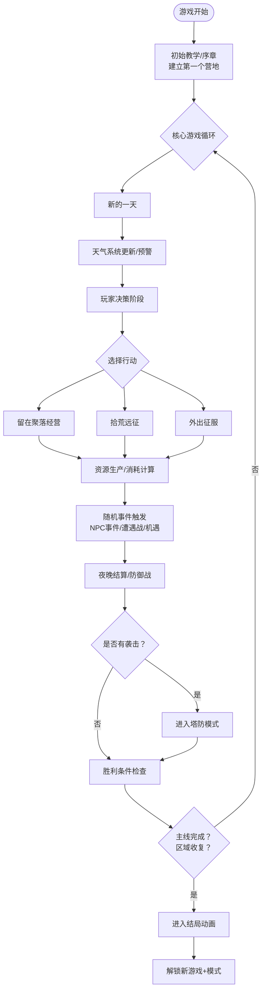

---

## 2. 拾荒远征流程图（Roguelike核心）

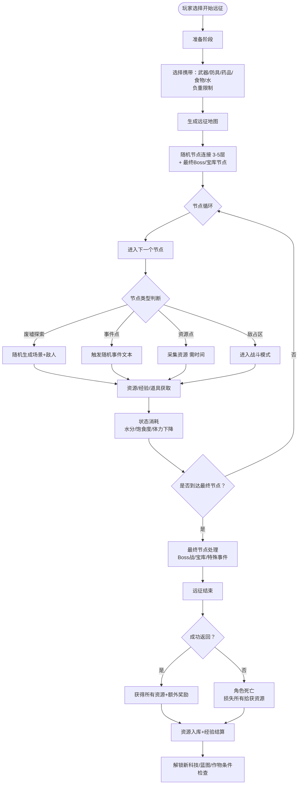

---

## 3. 天气与生存决策流程图

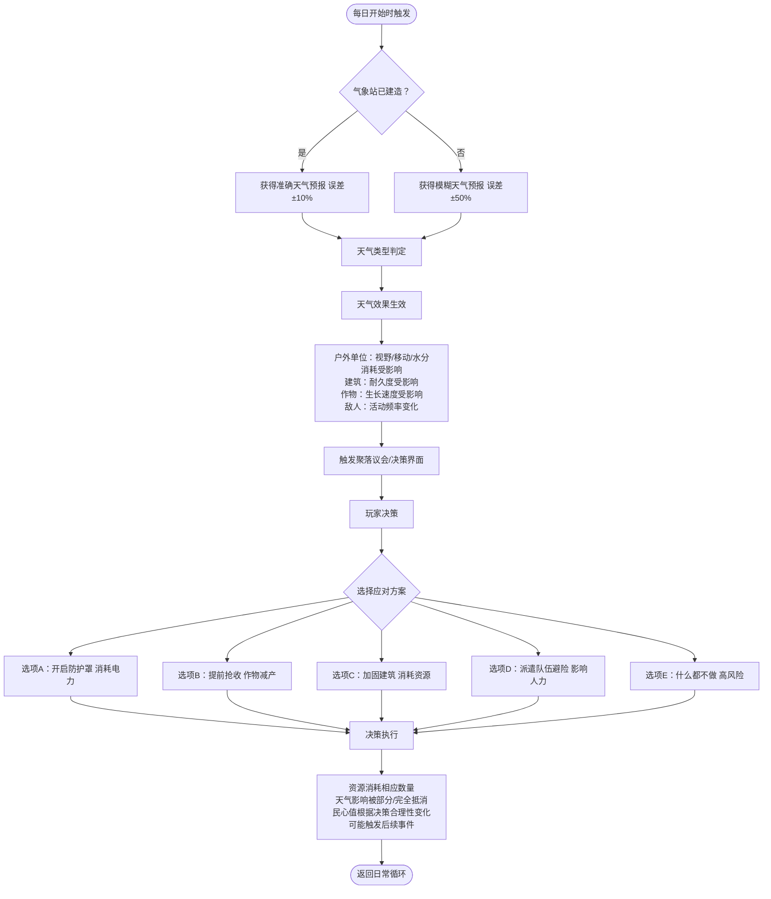

---

## 4. 种植与生产流程图

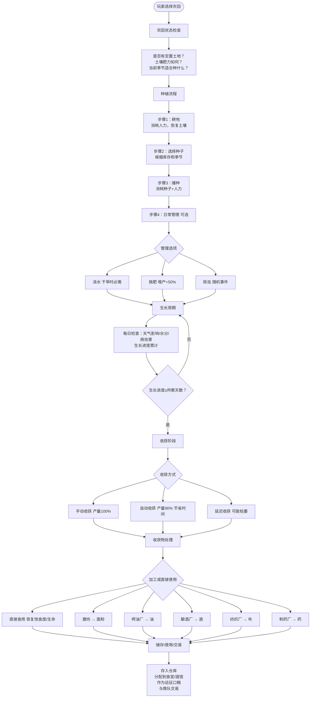

---

## 5. 工厂自动化生产流程图

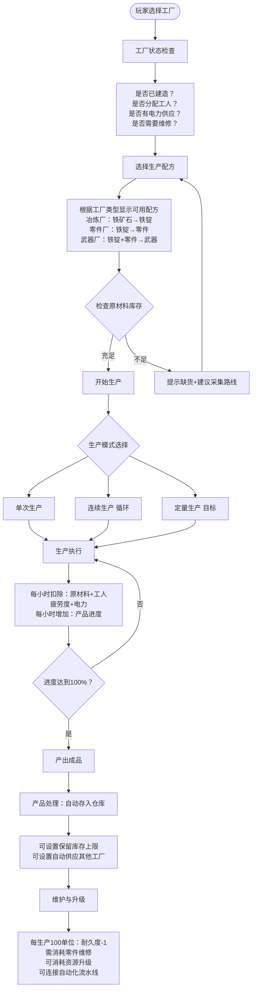

---

## 6. 防御战流程图（塔防模式）

```mermaid
graph TD
    Start([触发条件]) --> TriggerDetail[掠夺者定期袭击<br>天气事件引发兽潮<br>玩家行为引来的报复]
    
    TriggerDetail --> Warning[预警阶段 30-60秒]
    
    Warning --> WarningDetail[警报响起，显示来袭方向和预估规模<br>玩家可进行战前准备]
    WarningDetail --> Prep[战前准备]
    
    Prep --> PrepOptions[分配守卫到特定位置<br>填充弹药到炮塔<br>开启特殊防御<br>召回在外拾荒队伍]
    
    PrepOptions --> Contact[接敌阶段]
    
    Contact --> Control[玩家同时操控]
    Control --> ControlDetail[英雄角色：自由战斗，使用技能<br>炮塔系统：自动攻击，可手动切换目标<br>陷阱系统：可手动触发/重新布置<br>战术指令：集火/撤退/坚守]
    
    ControlDetail --> WaveLoop{波次循环}
    
    WaveLoop --> Wave1[第1波：试探波 少量敌人]
    Wave1 --> Break[短暂休整 15-30秒]
    Break --> Wave2[第2波：主力波 混合兵种]
    Wave2 --> Break2[短暂休整]
    Break2 --> Wave3[第3波：精英波 特殊单位]
    Wave3 --> Break3[短暂休整]
    Break3 --> Wave4[第4波：Boss波 如果当次有Boss]
    
    Wave4 --> CoreCheck{核心建筑被攻击？}
    
    CoreCheck -->|否| Win[战斗胜利]
    CoreCheck -->|是| StreetFight[进入巷战阶段<br>核心区战斗]
    
    StreetFight --> Result{战斗结果}
    Result -->|胜利| Win
    Result -->|失败| Lose[建筑受损/失守]
    
    Win --> Aftermath[战后处理]
    Lose --> Aftermath
    
    Aftermath --> AftermathDetail[清点损失 伤亡/建筑耐久<br>修复建筑 消耗资源<br>治疗伤员 消耗药品<br>收集战利品 敌人掉落<br>总结经验 调整布防<br>民心值根据战斗结果波动]
```

---

## 7. 征服模式流程图（即时战略）

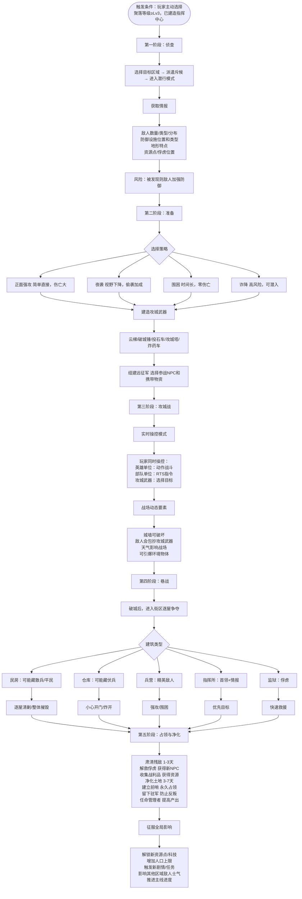

---

## 8. 敌人与战斗模块流程图

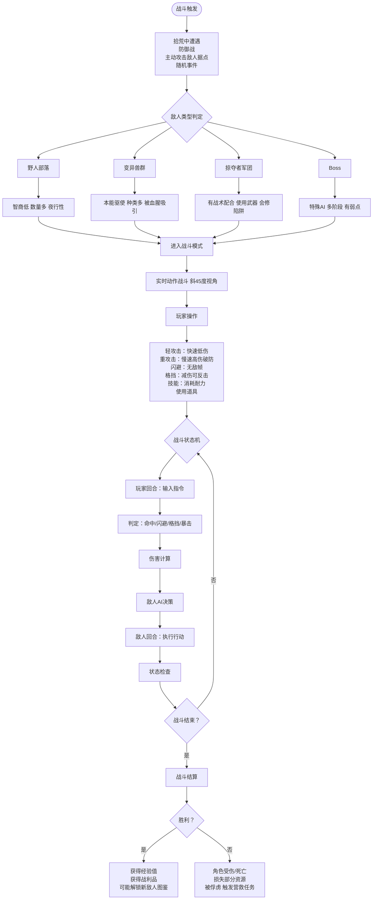

---

## 9. 家园建设与NPC系统流程图

### 9.1 聚落建设流程

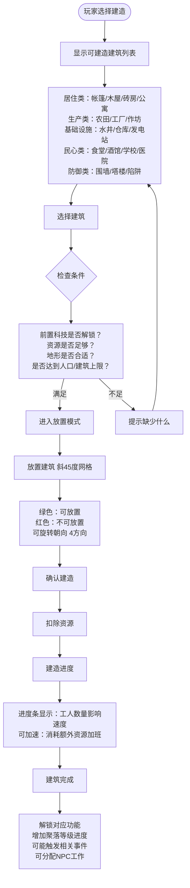

### 9.2 NPC招募与分配流程

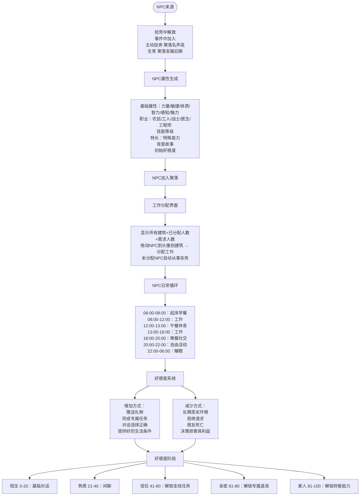

### 9.3 民心系统流程图

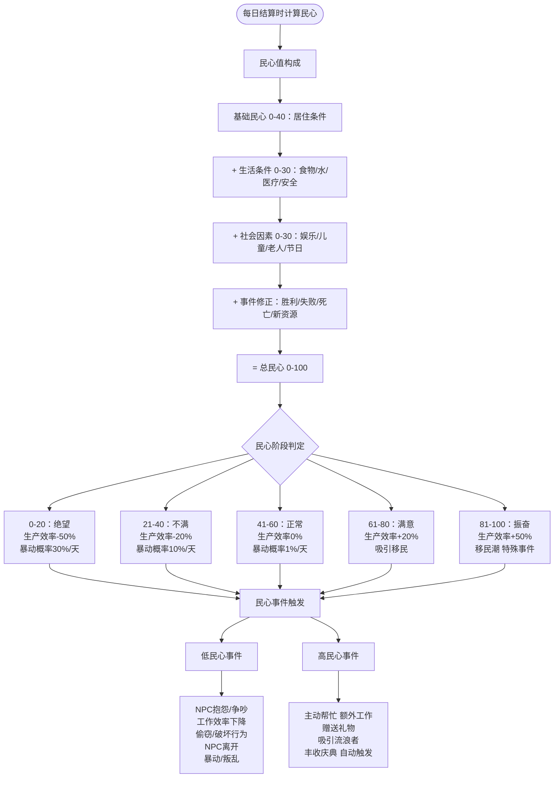

---

## 10. 全局进度与胜利机制流程图

### 10.1 科技树研发流程

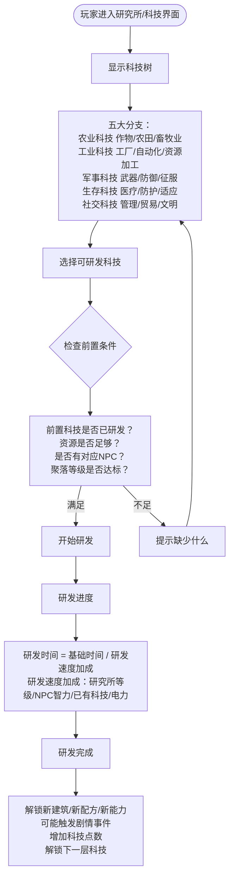

### 10.2 区域征服进度图

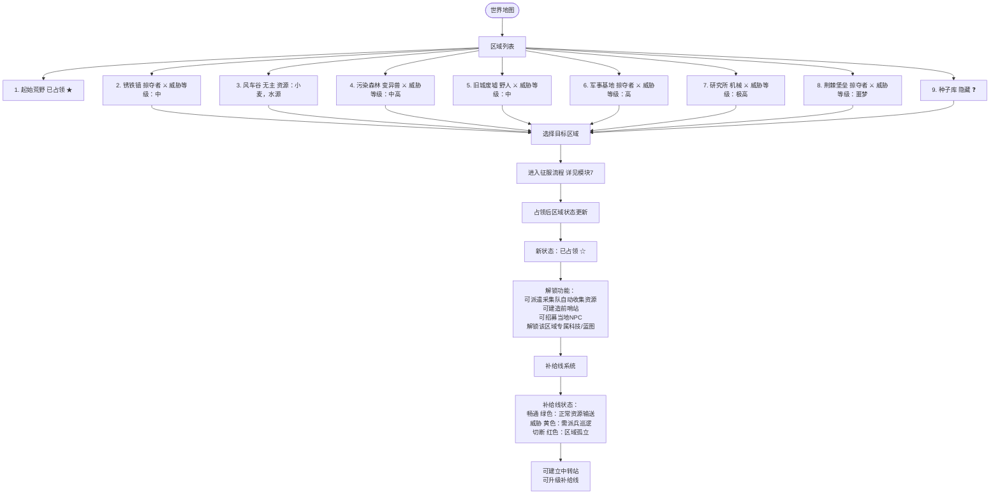

### 10.3 主线任务进度图

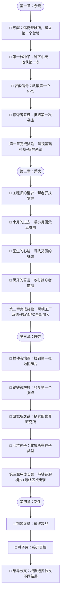

### 10.4 胜利条件检查流程图

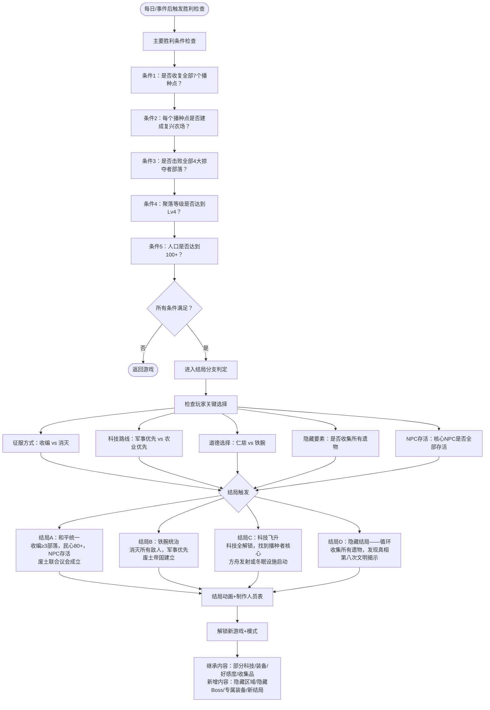

---

## 11. 模块整合关系图

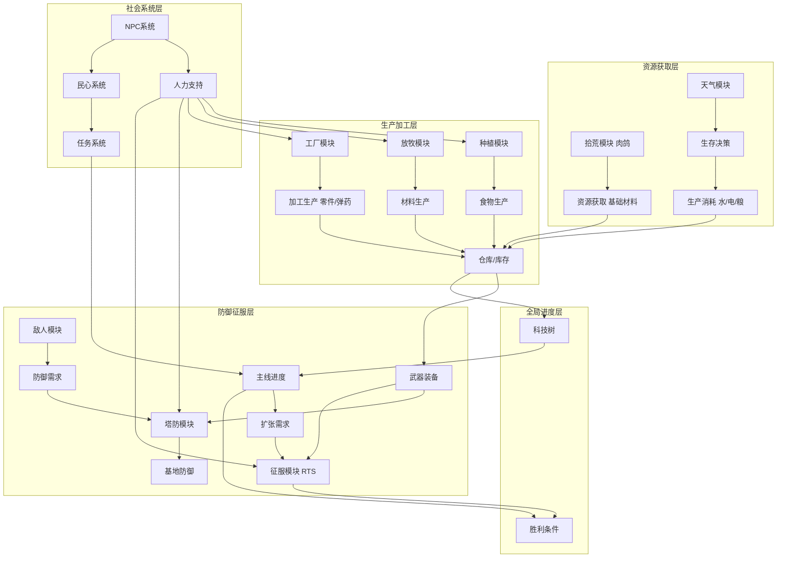

---

## 12. 玩家操作流程图（UI层级）

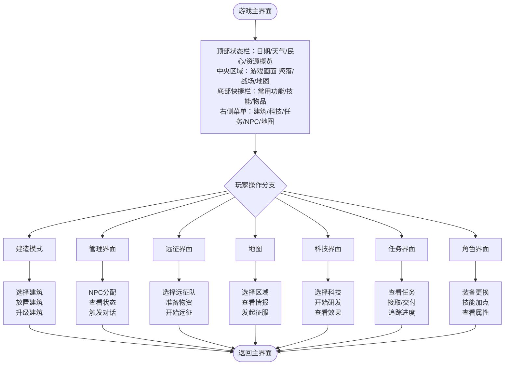

---

## 13. 数据流转图

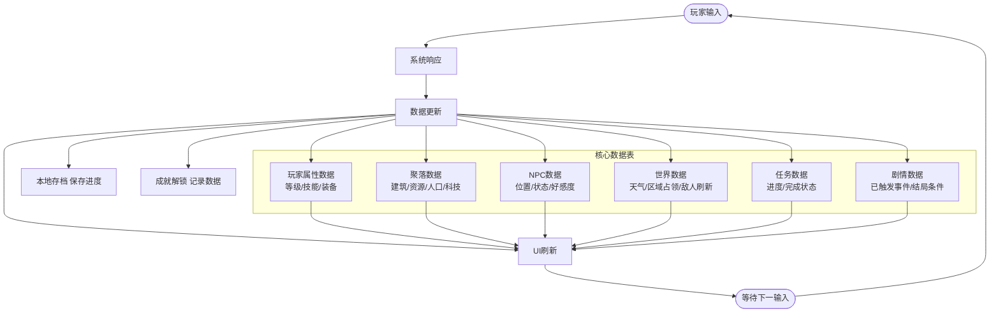

---

## 14. 模块开发优先级图

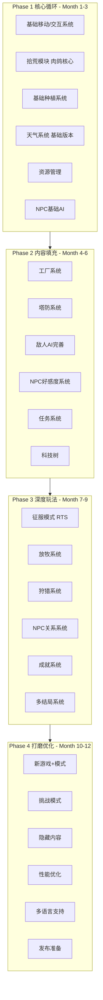

---

**文档结束 | 总Mermaid流程图数量：14张 | 最后更新：2024年**

---

以上所有流程图均已转换为Mermaid语法格式，可直接复制到支持Mermaid的编辑器中渲染显示。每张图都完整呈现了对应模块的核心逻辑和数据流转。
