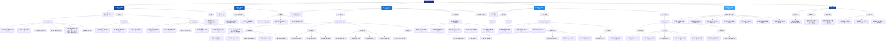
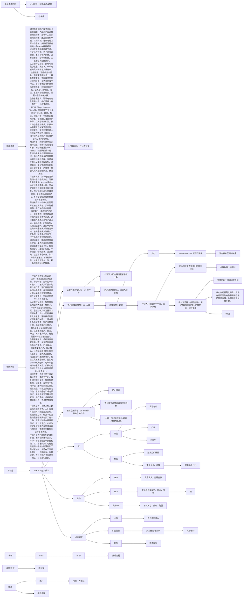

学习地址：https://www.bilibili.com/video/BV1XcEtzcEii/?spm_id_from=333.788.player.switch&vd_source=93e9aaa0076b54e6be62025284056121&p=3
开发职业生涯演进图：

```mermaid

flowchart TD
    A[开发职业生涯演进] --> B[第一阶段: 开发助理<br>0-12个月]
    A --> C[第二阶段: 开发专员<br>12-18个月]
    A --> D[第三阶段: 开发主管<br>18-36个月]
    A --> E[第四阶段: 开发经理<br>3-5年]
    A --> F[第五阶段: 产品总监<br>5年以上]
    A --> G[演进规律]

    B --> B1[起点: 刚毕业/转行<br>无经验, 薪资4.5K-6K]
    B --> B2[工作内容]
    B --> B3[合格线]
    
    B2 --> B2a[1. 做选品数据表]
    B2a --> B2a1[亚马逊调研: 排名/销量/竞争集中度]
    B2a --> B2a2[评价分析: 星级分布/用户反馈]
    B2a --> B2a3[上架时间: 判断市场稳定性]
    B2a --> B2a4[客单价: 价格段分布分析]
    B2a --> B2a5[采购价调研: 1688等工厂网站<br>利润空间=零售价-采购价-平台费用-物流费用-推广费用]
    B2a --> B2a6[形成数据表提交主管]
    
    B2 --> B2b[2. 深入分析]
    B2b --> B2b1[竞品Listing分析: 关键词/图片/文案]
    B2b --> B2b2[评论逆向工程: 挖掘痛点/消费者偏好]
    B2b --> B2b3[差异化切入点: 产品改进方向]
    
    B2 --> B2c[3. 供应链把握]
    B2c --> B2c1[工厂性质评估: OEM/自有品牌/集团分公司]
    B2c --> B2c2[报价与起订量: 100件vs1000件]
    B2c --> B2c3[物料/资质: 认证/费用承担]
    B2c --> B2c4[差异化能力: 特殊工艺/模具开发]
    B2c --> B2c5[出货量与客户: 产能/客户粘性/稳定性]
    B2c --> B2c6[合作历史: 初次合作看质量与起订量<br>长期合作看差异化和账期]
    
    B3 --> B3a[每月独立完成:<br>1-2个精品 + 3-5个精铺 + 6个铺货款开发]
    
    C --> C1[薪资: 6K-8K<br>从成本变为资产]
    C --> C2[核心转变: 对KPI负责]
    C2 --> C2a[责任: 选品/定价/文案/供应商/上架推广全流程]
    C2 --> C2b[考核: 产品上架后销售业绩问责]
    C --> C3[仍需积累]
    C3 --> C3a[判断力: 从纠结到快速决策]
    C3 --> C3b[供应链深度: 交付/品质/应急响应]
    C3 --> C3c[持续学习: 客诉处理/竞品分析]
    
    D --> D1[1.5-3年, 业务骨干最多<br>流动性最大阶段]
    D --> D2[大厂开发路径]
    D --> D3[小厂开发路径]
    D --> D4[收入分化: 6K-15K+]
    
    D2 --> D2a[深耕类目, 为增长负责]
    D2a --> D2a1[类目现状评估]
    D2a1 --> D2a1a[饱和度: 新卖家销量占比<5%难进入]
    D2a1 --> D2a1b[新卖家机会: 占比>30%有机会]
    D2a1 --> D2a1c[毛利率: 平均<10%不划算]
    D2a1 --> D2a1d[坑位固化: 搜索前10被谁占据]
    D2a1 --> D2a1e[价格段分布: 销量集中度]
    
    D2a --> D2a2[未来趋势研究]
    D2a2 --> D2a2a[Google Trends热度变化]
    D2a2 --> D2a2b[平台内部关键词搜索量]
    D2a2 --> D2a2c[竞品关联产品销量趋势]
    
    D2a --> D2a3[挖掘新增长点]
    D2a3 --> D2a3a[新价格段: 高端/低端空白]
    D2a3 --> D2a3b[新功能: 用户潜在需求]
    D2a3 --> D2a3c[工艺创新: 供应链突破]
    D2a3 --> D2a3d[设计创新: 新颜色/新客群]
    
    D2a --> D2a4[执行落地]
    D2a4 --> D2a4a[选品表/产品说明/项目进度]
    D2a4 --> D2a4b[供应商沟通/运营推广协调]
    
    D3 --> D3a[发现高利润/低风险产品<br>快速上架出货]
    D3a --> D3a1[数据真实性: 多工具验证/直接询问]
    D3a --> D3a2[差异化能力: 功能/设计/定价/供应链]
    D3a --> D3a3[供应链真实性: 出货风险/原材料波动]
    D3a --> D3a4[风险管控: 侵权识别/专利/商标]
    D3a --> D3a5[产品生命周期: 避免季节性/资金占用]
    
    E --> E1[从棋手到教练<br>带1-4人团队]
    E --> E2[核心能力]
    E2 --> E2a[算账能力]
    E2 --> E2b[管人能力]
    
    E --> E3[大厂开发经理]
    E3 --> E3a[围绕销售目标的战略家]
    E3a --> E3a1[市场容量分析: 竞争格局/增长趋势]
    E3a --> E3a2[团队能力评估: 成员特长/产出能力]
    E3a --> E3a3[供应链支撑: 产能匹配/交付能力]
    E3a --> E3a4[创造增长方式]
    E3a4 --> E3a4a[开拓新细分类目]
    E3a4 --> E3a4b[拓展新站点: 欧洲/日本]
    E3a4 --> E3a4c[尝试新客单价: 高端产品线]
    E3a4 --> E3a4d[新营销方式: KOL/社交媒体/广告]
    E3a4 --> E3a4e[优化开发流程: 缩短上架周期]
    E3a --> E3a5[人员管理]
    E3a5 --> E3a5a[精准评估能力和诉求]
    E3a5 --> E3a5b[对症下药: 潜力股/稳定输出/离职预警]
    
    E --> E4[小厂开发经理]
    E4 --> E4a[全能型账房先生]
    E4a --> E4a1[类目进入决策]
    E4a --> E4a2[目标拆解]
    E4a2 --> E4a2a[10个爆款×50万 vs 100个产品×5万]
    E4a2 --> E4a2b[产品线规划: 爆款/中等品/铺货品]
    E4a2 --> E4a2c[竞争分析/差异化策略]
    E4a2 --> E4a2d[投入产出预测: 成本/毛利/回本周期]
    E4a2 --> E4a2e[产品节奏: 上架顺序/测试策略]
    E4a --> E4a3[招聘与面试]
    E4a3 --> E4a3a[判断项目经历/数据分析/学习潜力]
    E4a3 --> E4a3b[容错率低, 招错人拖累团队]
    
    F --> F1[决策人与业务掌舵者]
    F1 --> F1a[产品线布局: 扩张/放弃/资源配置]
    F1 --> F1b[制定营收目标: 基于市场分析与能力评估]
    F1 --> F1c[制定开发流程: 立项标准/决策机制/追踪]
    F1 --> F1d[产品线规划: 现金牛/明星/普通/放弃]
    F1 --> F1e[全套账本: 投入产出/ROI/回报周期]
    F1 --> F1f[部门协调: 开发/采购/运营/客服/售后]
    F1 --> F1g[危机处理: 侵权/供应商倒闭/类目下滑]
    
    G --> G1[入门靠执行]
    G1 --> G1a[快速吸收上级教导<br>稳定输出, 执行力是一切]
    G --> G2[中层靠思考]
    G2 --> G2a[独立思考: 什么值得做/为什么/怎么做<br>价值在于决策质量]
    G --> G3[高层靠布局]
    G3 --> G3a[业务规划/团队建设/突破增长天花板<br>从做事到谋事]
    G --> G4[常见卡点]
    G4 --> G4a[只执行不思考 → 天花板1-2年]
    G4 --> G4b[思考强但管人差 → 升不到经理]
    G4 --> G4c[经理但对大局认知不够 → 走不到决策层]
    
    style A fill:#1a237e,color:#fff
    style B fill:#0d47a1,color:#fff
    style C fill:#1565c0,color:#fff
    style D fill:#1976d2,color:#fff
    style E fill:#1e88e5,color:#fff
    style F fill:#42a5f5,color:#fff
    style G fill:#0d47a1,color:#fff
```
学习笔记：

```mermaid


flowchart LR
    n2["降低关税影响"] --> n1["转口贸易（阳澄湖洗澡蟹）"] & A["低申报"]
    n3["跨境电商"] --> n5@{ label: "<p class=\"ds-markdown-paragraph\" style=\"margin-top:\">跨境电商的核心模式是B2C或者C2C，也就是企业直接卖给消费者，或者个人卖家卖给消费者。还是用耳机举例，深圳的工厂在亚马逊上开一个店铺，美国的消费者刷到一条TikTok种草视频，点进亚马逊链接直接下单，三天后收到货。这个链条非常短，中间没有进口商、没有批发商、没有零售商，工厂直接面对最终用户。</p><p class=\"ds-markdown-paragraph\" style=\"margin-top:\">从订单特征来看，跨境电商是小批量、高频次。一单可能只卖一件或者几件商品，金额很小，可能就几十美金，但每天可能有几十上百单甚至更多。这种模式的优点是回款快，消费者在线支付后，平台很快就会把款项结算给卖家，资金周转效率高。缺点是订单管理、发货、客服的工作量很大，需要一套系统来支撑。</p><p class=\"ds-markdown-paragraph\" style=\"margin-top:\">在获客渠道上，跨境电商完全依赖线上。核心是各大电商平台，比如亚马逊、TikTok Shop、Shopee、Temu等。卖家需要在平台上优化产品标题、图片、描述，投放广告，争取好的搜索排名，甚至通过社交媒体种草、红人营销来引流。独立站也是常见模式，但独立站需要自己解决流量问题，难度更大。整个运营的核心是流量获取和转化率优化，和传统外贸的客户关系维护是完全不同的逻辑。</p><p class=\"ds-markdown-paragraph\" style=\"margin-top:\">物流方面，跨境电商主要走国际快递、专线小包或者海外仓。国际快递比如DHL、FedEx，时效快但成本高；专线小包是性价比更高的选择；海外仓则是先把货批量运到目的国的仓库，消费者下单后从本地仓库发货，时效最快。整个物流链条比传统外贸短很多，消费者下单后几天内就能收到货，体验更好。</p><p class=\"ds-markdown-paragraph\" style=\"margin-top:\">付款方式上，跨境电商几乎是清一色的在线支付，消费者用信用卡、PayPal或者本地支付工具直接付款，平台收到款后会扣除佣金和手续费，然后把剩余部分结算给卖家。整个流程高度自动化，不需要像信用证那样繁琐的单据审核。</p><p class=\"ds-markdown-paragraph\" style=\"margin-top:\">跨境电商的一个核心优势是直接触达消费者。卖家能看到每一个订单的用户地址、购买偏好，能看到产品评价、退货原因，甚至可以通过站内信和消费者沟通。这些数据可以用来指导产品改进、选品决策、广告投放，实现快速迭代。比如一款耳机的好评里很多人说低音不错，差评里很多人说戴久了耳朵疼，那卖家就知道下一代产品要改进耳塞的材质。</p><p class=\"ds-markdown-paragraph\" style=\"margin-top:\">利润结构上，跨境电商是零售逻辑，单件利润比传统外贸的批发价要高不少。但卖家需要自己承担广告费、平台佣金、物流成本、退货损失，运营成本也很高。加上平台竞争激烈，价格战严重，流量成本逐年上涨，新手想要盈利并不容易。</p>" }
    n4["传统外贸"] --> n6@{ label: "<p class=\"ds-markdown-paragraph\" style=\"margin-top:\">传统外贸的核心模式是B2B，也就是企业卖给企业。举个例子，深圳的一家耳机工厂，把货卖给美国的某个进口商，进口商再卖给美国的零售商，零售商最后才卖给美国的普通消费者。这个链条很长，中间可能经过三到五个环节。</p><p class=\"ds-markdown-paragraph\" style=\"margin-top:\">从订单特征来看，传统外贸是典型的大批量、低频次。一单可能是整个集装箱的货，金额动辄几十万甚至上百万美金，但一年可能就只有几单生意。这种模式的优点是单笔收益高，一旦合作关系稳定下来，客户会持续下单，现金流相对可预测。缺点是整个交易周期非常长，从接单到生产、报关、海运，再到客户收货，往往需要一两个月甚至更久。</p><p class=\"ds-markdown-paragraph\" style=\"margin-top:\">在获客渠道上，传统外贸高度依赖线下。最常见的渠道是参加广交会、行业展会，面对面交换名片、展示样品。还有就是靠长期积累的人脉关系，或者通过邮件、电话主动开发海外客户。线上工具更多是辅助，比如用LinkedIn找客户、用邮件营销维护客户关系，但核心还是建立在人与人之间的信任和长期合作上。</p><p class=\"ds-markdown-paragraph\" style=\"margin-top:\">物流方面，传统外贸主要走海运整柜，偶尔有空运。报关流程相对复杂，需要提供发票、装箱单、提单等一系列单证，走一般贸易的正式报关流程。付款方式也偏向传统，常见的是电汇或者信用证，尤其信用证流程非常繁琐，银行审核、单据核对都需要时间，资金回笼速度慢。</p><p class=\"ds-markdown-paragraph\" style=\"margin-top:\">传统外贸的一个核心特点是远离终端消费者。工厂或者外贸公司只知道把货卖给了美国的进口商，但并不知道最终是哪个消费者买了这个产品，也不知道用户用得好不好、有什么意见。产品改进完全依赖客户反馈或者自己的判断，很难做到数据驱动的快速迭代。</p><p class=\"ds-markdown-paragraph\" style=\"margin-top:\">传统外贸的利润结构是薄利多销。因为中间环节太多，每个环节都要分走一部分利润，工厂或者外贸公司往往只能赚一个相对微薄的加工费或者差价。优势在于订单金额大，一旦跑起来，体量可观，而且大客户关系稳固的话，业务相对稳定。</p>" }
    n5 --> n7@{ label: "<span style=\"color:\">七分靠选品，三分靠运营</span>" }
    n8["初创店"] --> n9["30w-50w起步成本"]
    n9 --> n10["注册有限责任公司：2k-3k一年"] & n11["平台店铺服务费：39.9$/月"] & n12["地区注册商标：3k-4k R标，做自己的产品"] & n15["货"] & n25["出单"] & n56["店铺后台"]
    n12 --> n13["防止跟卖"] & n14["也可让有品牌的公司授权商标"] & n45["才能上传详情页图片/视频（开通的功能）"]
    n15 --> n16["压货"] & n21["精品"]
    n16 --> n17["当地仓库"] & n18["厂家"] & n19["运输中"]
    n21 --> n22["避免打价格战"] & n23["重新设计、开模"]
    n23 --> n24["成本高：几万"]
    n25 --> n26["FBM"] & n27["FBA"] & n43["变体sku"]
    n26 --> n28["卖家发货，无需囤货"]
    n27 --> n29["亚马逊仓库发货，租仓，囤货"]
    n29 --> n30["快"]
    n31["求职"] --> n32["FBM"]
    n32 --> n33["3k-5k"]
    n33 --> n34["熟悉流程"]
    n35["美区/欧区"] --> n36["高利润"]
    n37["支付"] --> n38["visa/mastercard 双币信用卡"]
    n38 --> n39["开店费从里面扣美金"]
    n10 --> n40["公司法人和店铺运营者必须一致"] & n41["购买高清摄像头，快速人脸识别"]
    n11 --> n42["店铺注册比较难"]
    n42 --> n37 & n46["一个人只能注册一个店，去同质化"]
    n43 --> n44["不同尺寸、外观、配置"]
    n46 --> n47["同ip同设备也会被识别为同一店铺"] & n49["指纹浏览器（多开店铺），无法确定电脑或者ip已被开店，建议使用"]
    n47 --> n48["会导致两个店都封"]
    n49 --> n50["有效防止不同店铺被关联"] & n51@{ label: "<span style=\"color:\">核心作用就是</span><span style=\"font-weight:\">让平台以为你在用不同的电脑和网络登录不同的店铺，从而防止账号被关联</span><span style=\"color:\">。</span>" } & n52["99/月"]
    n53["上品"] --> n54["通过表格录入"]
    n56 --> n53 & n55["广告投放"] & n59["发货"]
    n55 --> n57["买关键词/搜索词"]
    n57 --> n58["竞价出价"]
    n59 --> n60["物流编号"]
    n61["收款"] --> n62["账户"] & n20["回款周期"]
    n62 --> n63["阿里：万里汇"]

    n2@{ shape: rect}
    n3@{ shape: rect}
    n5@{ shape: rect}
    n4@{ shape: rect}
    n6@{ shape: rect}
    n7@{ shape: rect}
    n8@{ shape: rect}
    n31@{ shape: rect}
    n35@{ shape: rect}
    n37@{ shape: rect}
    n51@{ shape: rect}
    n61@{ shape: rect}
    n20@{ shape: rect}

```
