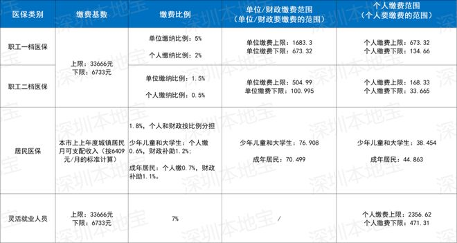

# 灵活就业一档医保报销政策
深圳灵活就业人员缴纳的医保是职工一档医保，享受的也是职工一档医保待遇。普通门诊统筹支付比例与医疗机构级别挂钩，最高可报销75%，更多报销内容说明见正文。

## 一档医保报销比例

深圳灵活就业人员缴纳的医保是职工一档医保，享受的也是职工一档医保待遇。

### 一、门诊报销比例

职工基本医保、居民基本医保普通门诊统筹支付比例与医疗机构级别挂钩。

- 一级以下医疗机构(例如社康)报销比例：75%;
- 二级医院报销比例：65%;
- 三级医院报销比例：55%;

退休人员、60周岁及以上居民在上述基础上相应提高5%。

### 二、一档医保市内住院报销比例

在一级以下医院支付比例为94%;

二级医院支付比例为92%;

三级医院支付比例为90%;

退休人员支付比例为95%。

住院起付线

参保人在市内定点医疗机构住院发生的基本医疗费用，未超过起付线的由参保人支付;超过起付线的部分，由基本医疗保险统筹基金按规定支付。

住院起付线按照医院级别设定，其中一级以下医院为200元，二级医院为400元，三级医院为600元。

参保人在一个医疗保险年度内二次及以上住院的，住院起付线分别为：一级以下医院为100元，二级医院为200元，三级医院为300元。

灵活就业医保缴费标准
---

>缴费金额：

6733x0.02 个人余额134

6733x0.07 个人缴纳医保费用471

一级医院  限额1万多  报销 75% 费用，个人只需要支付剩余的 25% 费用。

`小知识`：社康是一级，三甲医院是是三级

`各级别医院医保报销比例一般情况`（医保内的项目和药物）：

- 一级医院（社区医院）： 报销比例最高，鼓励患者首诊在社区医院。
- 二级医院： 报销比例次之，适合治疗一些常见的疾病。
- 三级医院（三甲医院）： 报销比例最低，主要用于治疗疑难杂症和重症疾病。

`不同级别医院的医保报销限额`（医保内的项目和药物）：

- 一级医院（社区医院）： 报销限额相对较低，但报销比例较高。
- 二级医院： 报销限额比一级医院高，但比三级医院低。
- 三级医院（三甲医院）： 报销限额最高，但报销比例相对较低。

门诊和住院医保报销的区别
---
|项目	|门诊	|住院
|---|---|---|
|报销比例	|一般较低|	一般较高
|起付线	|一般有	|一般有
|年度限额	|一般有	|一般有
|报销范围	|诊疗费、药费、检查费等	|所有医疗费用