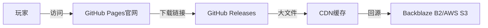

使用 **GitHub + CDN** 作为游戏下载官网的试水方案，是一种**低成本、易上手**的方式，适合独立开发者或小团队快速验证游戏需求，同时规避高额服务器和维护成本。以下是具体操作步骤和优化建议：

---

### **1. 核心架构**


- **GitHub Pages**：托管静态官网（HTML/CSS/JS）。  
- **GitHub Releases**：存放游戏安装包（小文件直接下载）。  
- **CDN + 对象存储**：分流大文件（避免GitHub流量限制）。  

---

### **2. 具体操作步骤**
#### **（1）上传游戏文件到GitHub Releases**
1. 在GitHub仓库中，点击 **"Releases"** → **"Draft a new release"**。  
2. 上传游戏包（如 `game_windows_v1.0.zip`），版本号命名规范（如 `v1.0.0`）。  
3. 获取直链：  
   - 右键文件 → **"Copy link address"**，格式如：  
     ```
     https://github.com/用户名/仓库名/releases/download/v1.0/game.zip
     ```

#### **（2）用GitHub Pages搭建官网**
1. 创建仓库 `用户名.github.io`（如 `MyGame.github.io`），启用GitHub Pages。  
2. 编写简易官网HTML，添加下载按钮：  
   ```html
   <a href="https://github.com/MyGame/repo/releases/latest/download/game.zip" 
      class="download-button">
      下载游戏（Windows）
   </a>
   ```
   - 使用 `latest/download` 自动指向最新版本。  

#### **（3）设置CDN分流（应对大文件/高流量）**
**方案A：Cloudflare CDN + Backblaze B2（免费层可用）**  
1. 将游戏包上传至 **Backblaze B2**（免费10GB存储，1GB/天下载流量）。  
2. 在Cloudflare中：  
   - 添加B2存储桶为源站，绑定自定义域名（如 `download.mygame.com`）。  
   - 开启 **Cache Everything** 和 **Brotli压缩**。  
3. 替换官网下载链接为CDN地址：  
   ```
   https://download.mygame.com/file/game.zip
   ```

**方案B：jsDelivr（免费CDN，适合开源项目）**  
1. 通过GitHub Releases的 `tag` 生成jsDelivr链接：  
   ```
   https://cdn.jsdelivr.net/gh/用户名/仓库名@v1.0/game.zip
   ```
   - 需公开仓库，且有版本标签（如 `v1.0`）。  

---

### **3. 优化技巧**
#### **（1）绕过GitHub流量限制**
- **分卷压缩**：将游戏包拆分为多个小文件（如 `part1.zip`, `part2.zip`），减少单文件下载压力。  
- **多仓库备份**：热门游戏可同步上传到多个GitHub仓库，分散下载请求。  

#### **（2）提升下载速度**
- **CDN预热**：提前将文件缓存到CDN边缘节点（Cloudflare企业版支持）。  
- **P2P分发**：在官网集成 [WebTorrent](https://webtorrent.io/)，允许玩家互相分享下载。  

#### **（3）监控与安防**
- **流量统计**：  
  - 用 **Google Analytics** 跟踪官网访问量。  
  - 在Cloudflare面板查看CDN请求数。  
- **防滥用**：  
  - 设置Cloudflare防火墙规则，拦截高频IP（如每秒>5次请求）。  

---

### **4. 适用场景与限制**
| 场景                | 推荐方案                | 注意事项                          |
|---------------------|-----------------------|---------------------------------|
| **免费游戏试玩**     | GitHub Releases直链   | 文件需<2GB，避免频繁更新触发限流。     |
| **开源项目分发**     | jsDelivr CDN          | 必须公开仓库，适合Demo或工具类游戏。    |
| **商业游戏早期测试** | Cloudflare+B2         | 超出免费流量后成本可控（$0.01/GB）。   |
| **大规模正式发布**   | 需迁移至专业CDN/自建   | GitHub不适合高并发（>1000次/小时）。 |

---

### **5. 成本对比**
| 方案                | 存储成本       | 流量成本（1TB下载） | 适用阶段         |
|---------------------|--------------|-------------------|----------------|
| **GitHub直链**      | 免费          | 免费（但有限流风险） | 原型/测试       |
| **Cloudflare+B2**   | $0.005/GB/月 | $10~$50           | 小规模发布      |
| **AWS S3+CloudFront** | $0.023/GB/月 | $85~$120          | 中等规模        |

---

### **总结**
**GitHub + CDN试水的最佳实践**：  
1. 用 **GitHub Pages** 快速上线官网，**Releases** 托管小文件。  
2. 大文件通过 **Cloudflare + Backblaze B2** 分流，月成本可控制在$10以内。  
3. 监控流量，超出免费层后迁移至专业CDN（如AWS CloudFront）。  

此方案适合：  
- 独立开发者验证游戏热度。  
- 开源项目或免费游戏分发。  
- 规避早期服务器运维成本。
