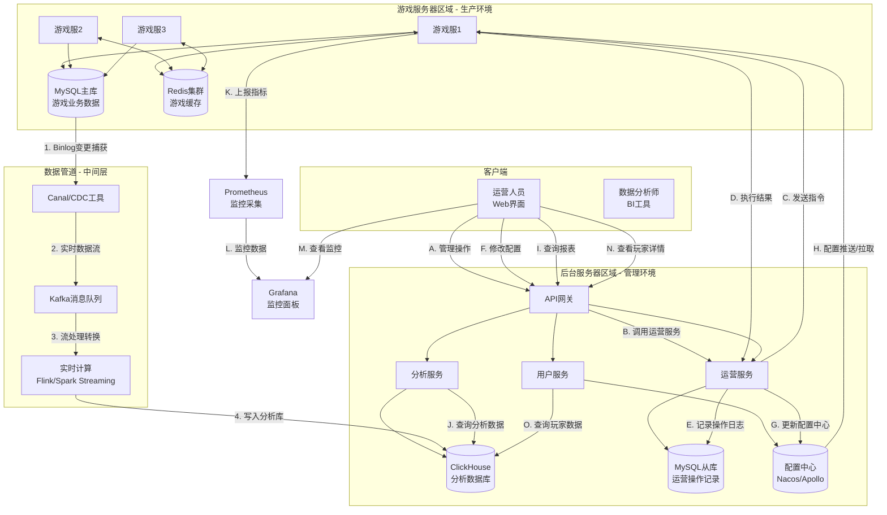
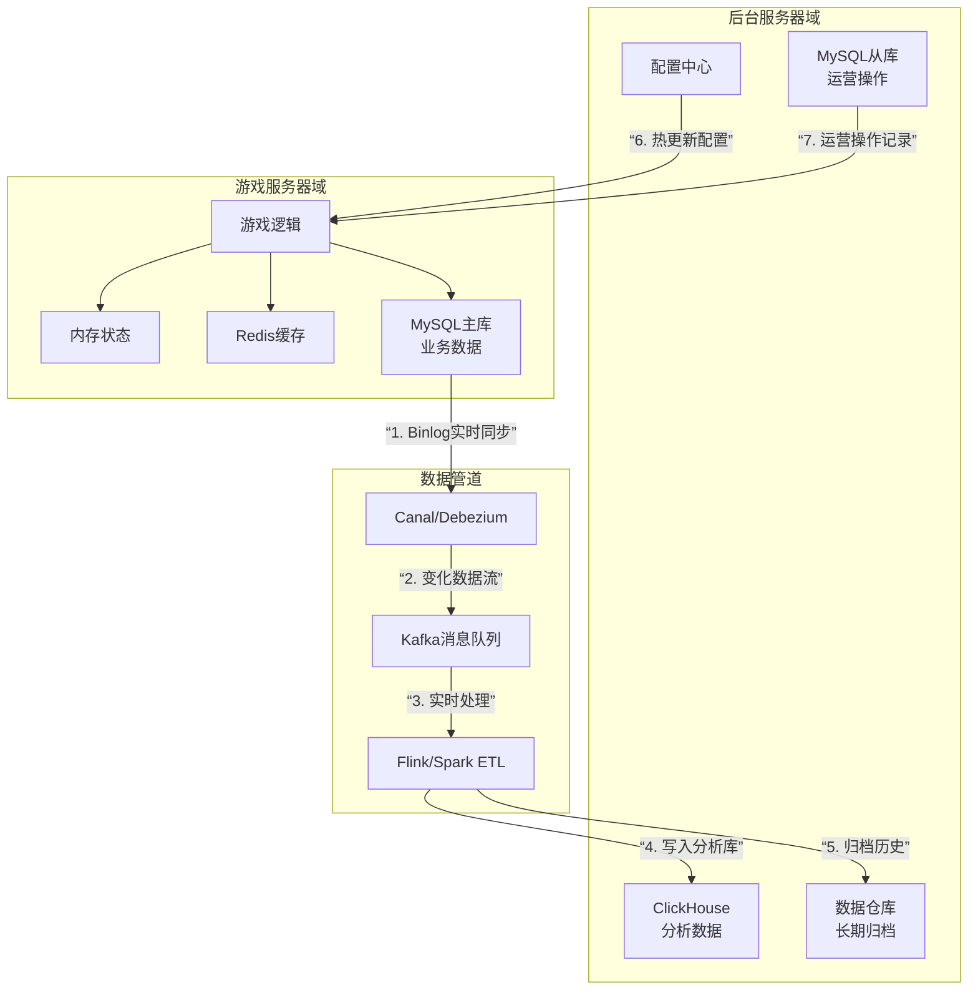

开发游戏网页版后台分析和管理系统，你需要从以下几个方面进行规划和准备：

### 一、明确核心功能模块
1. **数据看板**
   - 实时数据：在线人数、实时收入、服务器状态
   - KPI概览：DAU/MAU、留存率、付费率、ARPU等
   - 可视化图表：折线图、柱状图、热力图等

2. **玩家管理**
   - 玩家信息查询：账号、等级、装备、付费记录
   - 行为分析：登录频率、关卡进度、游戏时长
   - 人工操作：封禁/解封、补偿发放、消息推送

3.**游戏内容管理**
   - 配置管理：活动配置、商品定价、概率调整
   - 版本控制：热更新、公告发布、资源管理

4. **运营分析**
   - 多维分析：渠道分析、区服对比、用户分层
   - 留存分析：N日留存漏斗
   - 付费分析：LTV、付费习惯、充值渠道

5. **安全与监控**
   - 操作日志：管理员操作审计
   - 异常检测：数据异常报警、外挂监控
   - 权限管理：角色权限控制

### 二、技术架构选型
1. **前端技术栈**
   - 框架：React/Vue/Angular（建议选React+Ant Design）
   - 图表库：ECharts/D3.js
   - 打包工具：Webpack/Vite

2. **后端技术栈**
   - 语言：Java(Spring Boot)/Python(Django)/Node.js
   - 数据库：MySQL（业务数据）+ Redis（缓存）+ ClickHouse（分析数据）
   - 大数据处理：Spark/Flink（可选，用于复杂分析）

3. **数据管道**
   - 数据采集：SDK埋点 + 服务端日志
   - 数据传输：Kafka/RabbitMQ
   - 数据仓库：分层设计（ODS->DWD->DWS）

4. **基础设施**
   - 部署：Docker + Kubernetes
   - 监控：Prometheus + Grafana
   - 日志：ELK Stack（Elasticsearch, Logstash, Kibana）

### 三、数据体系设计
1. **指标体系**
   - 基础指标：DAU、收入、付费率
   - 核心指标：留存率、LTV、ROI
   - 自定义指标：根据游戏类型定义

2. **维度体系**
   - 时间维度：小时/日/周/月
   - 渠道维度：应用商店、广告来源
   - 用户维度：新老用户、付费等级

3. **数据模型**
   - 事件模型：用户行为事件标准化
   - 用户模型：360°用户画像
   - 漏斗模型：关键路径转化分析

### 四、安全与权限设计
1. **权限体系**
   - RBAC模型：角色-权限分离
   - 数据权限：按区服/渠道划分
   - 操作权限：敏感操作二次验证

2. **安全措施**
   - 接口安全：HTTPS、防SQL注入
   - 数据安全：敏感数据脱敏
   - 操作安全：关键操作留痕

---


## 游戏服务器数据库 与 后台分析数据库
核心矛盾：**游戏服务器是为“实时交互”设计的，而后台是为“分析查询”设计的。两者的目标和技术要求完全相反。**


### 主要区别与选择分析数据库的原因：

| 维度 | 游戏服务器（业务主库） | 后台使用分析数据库（推荐方案） | 后台直接查询游戏服务器的问题 |
| :--- | :--- | :--- | :--- |
| **1. 查询模式** | **写多读少**。核心是处理玩家动作（如移动、战斗、交易），简单查询为主。 | **读多写少**。复杂分析查询（多表JOIN、分组聚合、时间范围扫描）。 | 复杂的分析SQL会**锁表**，导致游戏卡顿甚至崩溃。 |
| **2. 性能要求** | **低延迟、高实时**。要求毫秒级响应，保证游戏流畅。 | **高吞吐、可接受延迟**。查询耗时几秒到几分钟都可以接受，但数据要完整。 | 一个后台的复杂报表查询可能跑几分钟，**严重占用游戏数据库连接池**，拖垮游戏。 |
| **3. 数据结构** | **高度范式化、为事务优化**。减少数据冗余，保证ACID（如玩家金币扣减和物品增加必须在同一事务）。 | **反范式化、为分析优化**。大量预聚合表、宽表、星型/雪花模型，方便快速查询。 | 需要跨几十张表JOIN才能出一个报表，极其低效且难以维护。 |
| **4. 数据时效** | **严格实时**。玩家看到的必须是当前最新状态。 | **近实时/准实时**。T+1或延迟几分钟完全可以接受。 | 追求实时反而会增加系统复杂度和风险。 |
| **5. 资源影响** | **资源敏感**。CPU和内存主要服务于游戏逻辑。 | **资源独立**。可以部署在单独的集群，进行大规模计算。 | 后台的密集型计算（如计算全服玩家LTV）会**吃光游戏服务器CPU**。 |
| **6. 历史数据** | **只保留当前有效数据**。通常会定期归档或删除老数据（如一年前的邮件）。 | **存储全量历史数据**。用于分析趋势、对比同期数据。 | 查不到历史数据，无法做年度同比分析。 |
| **7. 稳定性** | **绝对核心，必须稳定**。宕机=游戏停服=重大事故。 | **相对独立，容错性高**。短暂不可用不影响玩家游戏。 | 将后台的风险（如一个Bug查询）直接引入核心链路。 |

---

### 典型的混合架构方案（最佳实践）

不是二选一，而是**两者结合，各司其职**：

```
玩家客户端 <--> [游戏服务器] <--> (游戏业务主数据库：MySQL/PostgreSQL)
                                      |
                                      | (通过CDC工具如Canal/Debezium，或ETL任务)
                                      ↓
                    [消息队列：Kafka] ← 实时数据流
                                      |
                                      ↓
              (分析数据库：ClickHouse/StarRocks) ← 离线批量导入
                                      |
                                      ↓
                            [后台管理系统] ← 运营人员查询
```

**工作流程：**
1.  **游戏主库**处理所有实时写操作和简单读操作。
2.  **数据同步**：游戏主库的变更通过**异步**方式（日志解析或消息队列）同步到分析数据库。
3.  **后台系统**所有复杂查询都指向**分析数据库**。
4.  **少量实时操作**（如封禁玩家、发送邮件）通过**专门、轻量的API**调用游戏服务器执行。

### 什么情况下可以/应该直接查询游戏服务器？

1.  **超轻量级管理后台**：玩家数量极少（<1000），无需复杂分析。
2.  **实时操作接口**：
    *   封号/解封
    *   发送全服邮件/补偿
    *   手动处理订单
    *   这些操作不是“查询”，而是通过API**触发游戏服务器执行一个动作**，然后由游戏服务器去写主库。
3.  **实时监控仪表盘**：显示当前在线人数、服务器状态。这些数据通常有独立的缓存或统计接口，**绝不直接查业务主表**。

### 总结

**“不要用运营的Excel去连生产数据库”**，这是血泪教训。
- **游戏服务器（主库）是【生产车间】**：要求精密、高效、稳定，专事专办。
- **分析数据库是【数据分析中心】**：负责汇总、加工、分析生产数据。

建立独立的分析数据库，本质上是进行 **“读写分离”和“数据库异构”** ，用合适的工具做合适的事，这是保障游戏稳定运营和实现高效数据分析的**基石**。虽然初期成本略高，但随着业务发展，其必要性和价值会飞速体现。


---

## 核心关系：**Web后台 ⊇ 大数据系统**

```mermaid
flowchart TD
    A[游戏网页后台管理系统] --> B{功能模块分类}
    
    B --> C[“运营操作层<br>(非大数据)”]
    B --> D[“数据分析层<br>(大数据系统)”]
    
    C --> C1[“玩家管理<br>(封禁/补偿)”]
    C --> C2[“内容管理<br>(配置/公告)”]
    C --> C3[“实时监控<br>(服务器状态)”]
    
    D --> D1[“数据看板与报表”]
    D --> D2[“用户行为分析”]
    D --> D3[“业务智能分析<br>(BI)”]
    
    D1 --> E1[“需要大数据技术栈<br>处理海量数据”]
    D2 --> E2[“需要大数据技术栈<br>处理海量数据”]
    D3 --> E3[“需要大数据技术栈<br>处理海量数据”]
```

---

### 具体区别与联系：

| 维度 | **Web后台管理系统** | **大数据系统** |
| :--- | :--- | :--- |
| **本质** | **业务应用系统**，面向人（运营人员）操作 | **数据技术体系**，面向数据处理和分析 |
| **目标** | 提升运营效率，实现业务管理 | 处理海量数据，挖掘数据价值 |
| **用户** | 运营、客服、策划人员 | 数据分析师、算法工程师、后台开发 |
| **技术侧重** | **应用开发**：Web框架、API设计、权限管理、UI/UX | **数据处理**：分布式计算、实时流处理、数据仓库、OLAP引擎 |
| **典型组件** | 用户界面、业务逻辑API、权限控制、操作日志 | Hadoop/Spark/Flink、Kafka、数据仓库、OLAP数据库 |
| **输出结果** | 可操作的界面、配置结果、管理动作 | 数据报表、分析模型、用户画像、推荐结果 |

---

### Web后台中的“非大数据”部分（约40-50%）

这部分是纯粹的**业务管理系统**，不需要大数据技术：

1. **玩家账号管理**
   - 手动封号/解封
   - 发放补偿礼包
   - 查看玩家基础信息
   - **技术**：简单的CRUD操作，直接读/写业务数据库

2. **游戏内容配置**
   - 活动配置（时间、奖励）
   - 商品上下架与定价
   - 公告发布
   - **技术**：配置表管理，可能使用Redis缓存

3. **实时运维操作**
   - 服务器启停
   - 热更新发布
   - 实时监控面板（CPU、内存、在线人数）
   - **技术**：调用服务器API，简单计数

4. **权限与安全管理**
   - 角色权限分配
   - 操作审计日志
   - **技术**：RBAC系统，操作日志表

---

### Web后台中的“大数据”部分（约50-60%）

这部分**必须依赖大数据技术**才能实现：

1. **数据看板与报表系统**
   - 问题：原始游戏日志每天可能TB级，MySQL无法快速聚合
   - 大数据方案：使用**ClickHouse/Doris**等OLAP数据库，预聚合计算
   - 示例：实时计算全服DAU、实时收入曲线

2. **用户行为分析**
   - 问题：需要分析千万级用户的点击流、路径转化
   - 大数据方案：**Flink实时计算**用户行为漏斗，**Spark**进行离线用户分群
   - 示例：分析新用户从注册到付费的转化漏斗

3. **深度运营分析**
   - 问题：多维交叉分析（渠道×时间段×用户等级）
   - 大数据方案：**数据仓库分层建模**（ODS→DWD→DWS→ADS）
   - 示例：对比不同渠道用户的30日LTV（生命周期价值）

4. **预测与智能化**
   - 问题：需要预测流失用户、识别作弊模式
   - 大数据方案：基于**用户画像**的机器学习模型
   - 示例：构建流失预警模型，提前干预

---

### 总结回答你的问题

**“Web后台” ≠ “大数据系统”，但“现代游戏Web后台”必须“构建在大数据系统之上”。**

- 如果你的游戏后台**只需要做玩家封禁、发公告、改配置**，那它不是一个大数据系统。
- 如果你的游戏后台**要分析千万用户行为、做实时数据看板、计算复杂业务指标**，那么它的**后端必须依赖大数据技术栈**。

可以这样理解：
- **大数据系统是“发动机和炼油厂”**——处理原始数据，提炼出有价值的信息燃料
- **Web后台是“汽车仪表盘和控制系统”**——将燃料转化为可视信息，并提供操作按钮

在现代游戏运营中，一个完整的后台系统**一定会包含大数据组件**，因为数据驱动的运营决策已经成为行业标准。但Web后台作为一个**产品形态**，它的范畴比纯大数据系统更广，既包含数据分析，也包含业务操作。

---

# 游戏后台核心框架及协同通信架构

## 一、核心框架分层设计

### 1. **展示层（Presentation Layer）**
```
├── 前端应用
│   ├── 运营后台（React/Vue + Ant Design）
│   ├── 数据大屏（ECharts/DataV）
│   ├── 移动端管理（小程序/H5）
│   └── 实时监控墙（WebSocket长连接）
└── API网关
    ├── 路由分发
    ├── 限流熔断
    ├── 认证授权
    └── 请求聚合
```

### 2. **应用服务层（Application Layer）**
```python
# 微服务架构示例
服务集群：
├── 用户管理服务（User-Service）
│   ├── 账号CRUD
│   ├── 权限验证
│   └── 会话管理
├── 运营服务（Operation-Service）
│   ├── 活动配置
│   ├── 公告管理
│   └── 邮件推送
├── 数据分析服务（Analytics-Service）
│   ├── 报表生成
│   ├── 实时计算
│   └── 数据导出
├── 监控告警服务（Monitor-Service）
│   ├── 健康检查
│   ├── 性能监控
│   └── 异常报警
└── 任务调度服务（Scheduler-Service）
    ├── 定时报表
    ├── 数据同步
    └── 批量处理
```

### 3. **数据服务层（Data Layer）**
```
数据存储矩阵：
┌─────────────┬───────────────┬───────────────┐
│  数据类型   │   在线业务    │   分析查询    │   缓存加速    │
├─────────────┼───────────────┼───────────────┤
│  关系数据   │   MySQL集群   │   数据同步    │   Redis集群  │
│   (玩家、物品)│   (主从复制)  │   → ClickHouse │   (热数据)   │
├─────────────┼───────────────┼───────────────┤
│  日志数据   │   Kafka队列   │   HDFS/对象存储 │   Elasticsearch│
│   (行为日志) │   (实时流)    │   (长期归档)   │   (快速检索)  │
├─────────────┼───────────────┼───────────────┤
│  配置数据   │   Apollo/Nacos│   配置同步     │   本地缓存    │
│   (游戏配置) │   (配置中心)   │   → 游戏服     │   + Redis    │
└─────────────┴───────────────┴───────────────┘
```

### 4. **基础设施层（Infrastructure Layer）**
```
├── 容器编排：Kubernetes + Docker
├── 服务网格：Istio（流量管理、可观测性）
├── 持续集成：GitLab CI/Jenkins Pipeline
├── 配置管理：Ansible/Terraform
└── 监控体系：Prometheus + Grafana + ELK
```

## 二、关键通信模式与协议

### 1. **内部服务间通信**



**通信协议矩阵：**

| 场景 | 推荐协议 | 特点 | 使用示例 |
|------|----------|------|----------|
| **前端↔后端** | HTTP/HTTPS + REST | 通用、易调试、浏览器友好 | 运营配置、玩家查询 |
| **实时数据推送** | WebSocket | 全双工、低延迟 | 实时监控、在线人数 |
| **服务间调用** | gRPC/HTTP2 | 高性能、多语言、流式支持 | 微服务内部通信 |
| **异步消息** | AMQP (RabbitMQ) | 可靠、灵活路由 | 任务队列、事件通知 |
| **大数据流** | Kafka协议 | 高吞吐、持久化 | 日志收集、实时计算 |
| **服务发现** | DNS/Consul | 动态服务注册发现 | 微服务负载均衡 |
| **配置同步** | 长轮询/WebSocket | 实时配置生效 | 游戏热更新配置 |

### 2. **与游戏服务器的关键通信**

#### A. **实时指令通道（运营→游戏服）**
```yaml
# 协议设计示例
指令类型:
  1. 玩家操作类:
    - 封禁/解封玩家
    - 发送邮件/补偿
    - 角色属性修改
  
  2. 服务器控制类:
    - 热更新配置
    - 服务器启停
    - 紧急维护
  
  3. 全局事件类:
    - 全服公告
    - 活动开启/关闭
    - 版本更新

通信保障:
  - 双向确认机制（ACK/NACK）
  - 指令幂等性设计
  - 超时重试与死信队列
  - 操作审计日志
```

#### B. **数据采集通道（游戏服→后台）**
```python
# 数据上报架构
class DataCollector:
    # 1. 实时流数据（高频率）
    def report_realtime_data():
        # 在线状态、战斗日志、聊天监控
        # 协议: UDP/TCP自定义协议
        # 工具: Protobuf + Netty
        
    # 2. 批量日志数据（中频率）
    def upload_batch_logs():
        # 玩家行为日志、经济系统日志
        # 协议: HTTP + JSON压缩
        # 工具: Log4j + Flume
        
    # 3. 业务快照数据（低频率）
    def sync_business_snapshot():
        # 玩家档案、物品库存
        # 协议: MySQL Binlog同步
        # 工具: Canal + Kafka
```

#### C. **状态监控通道（双向心跳）**
```
监控体系：
┌─────────────────┐     Health Check     ┌─────────────────┐
│                 │◄────────────────────►│                 │
│  游戏服务器     │     Metrics Push     │  监控中心       │
│                 │─────────────────────►│                 │
│  - 服务状态     │     Alert Trigger    │  - 聚合展示     │
│  - 性能指标     │◄─────────────────────│  - 告警规则     │
│  - 资源使用     │     Config Update    │  - 自动扩缩容   │
└─────────────────┘                      └─────────────────┘

监控数据流:
  1. Pull模式: Prometheus定期抓取
  2. Push模式: StatsD主动上报
  3. 日志模式: ELK集中分析
```

### 3. **与第三方系统集成**

#### A. **支付与财务系统**
```javascript
// 支付回调接口设计
POST /api/payment/callback
Headers:
  - X-Signature: HMAC-SHA256验证
Body:
{
  "order_id": "202401150001",
  "player_id": "10086",
  "channel": "apple",
  "amount": 648,
  "currency": "CNY",
  "status": "success",
  "callback_time": "2024-01-15T10:30:00Z"
}

// 对账流程
1. 支付渠道回调 → 后台支付服务
2. 验证签名 → 更新订单状态
3. 调用游戏服 → 发放游戏币
4. 异步通知 → 财务系统记录
5. 每日对账 → 确保数据一致性
```

#### B. **客服与工单系统**
```
集成模式:
┌─────────────┐    Webhook    ┌─────────────┐
│             ├───────────────►│             │
│  客服系统   │    同步玩家数据  │  游戏后台   │
│             │◄───────────────┤             │
└─────────────┘    API调用    └─────────────┘

共享数据:
  - 玩家基本信息
  - 登录/充值记录
  - 封禁/处罚历史
  - 聊天记录(脱敏后)
```

#### C. **安全与风控系统**
```java
// 实时风控检查点
public class RiskControlInterceptor {
    // 1. 登录时
    void checkLoginRisk(LoginRequest req) {
        // IP异常、设备指纹、频率控制
    }
    
    // 2. 交易时
    void checkTransactionRisk(PaymentRequest req) {
        // 大额支付、频繁支付
    }
    
    // 3. 交互时
    void checkBehaviorRisk(ChatMessage msg) {
        // 敏感词、广告、欺诈信息
    }
}
```

## 三、通信保障机制

### 1. **可靠性保障**
```yaml
消息可靠性:
  - 至少一次投递（At-least-once）
  - 消息持久化（磁盘+副本）
  - 消费确认机制（ACK）
  - 死信队列与重试

数据一致性:
  - 分布式事务（Saga/TCC）
  - 最终一致性补偿
  - 对账与修复脚本
  - 数据版本控制
```

### 2. **性能优化策略**
```python
# 多级缓存设计
class CacheManager:
    L1_cache = {}  # 本地缓存（Caffeine/Guava）
    L2_cache = RedisCluster()  # 分布式缓存
    L3_cache = Database()  # 持久化存储
    
    def get_player_data(player_id):
        # 1. 查本地缓存（纳秒级）
        # 2. 查Redis（毫秒级）
        # 3. 查数据库（百毫秒级）
        # 4. 回填缓存
        
# 连接池管理
- 数据库连接池（Druid/HikariCP）
- HTTP连接池（Apache HttpClient）
- Redis连接池（Lettuce/JedisPool）
```

### 3. **安全通信机制**
```java
public class SecurityManager {
    // 传输层安全
    void enableTLS() {
        // HTTPS/TLS 1.3
        // 双向证书认证
    }
    
    // 数据加密
    void encryptSensitiveData() {
        // 字段级加密（AES）
        // 密钥管理（KMS）
    }
    
    // 访问控制
    void setupAccessControl() {
        // OAuth2/JWT令牌
        // IP白名单
        // 速率限制
    }
}
```

### 4. **可观测性设计**
```yaml
监控指标:
  通信层:
    - 请求成功率/错误率
    - 响应时间（P50/P95/P99）
    - 吞吐量（QPS）
    - 连接数/队列长度
  
  业务层:
    - 指令执行成功率
    - 数据同步延迟
    - 缓存命中率
    - 订单处理时效

追踪体系:
  - 分布式追踪（OpenTelemetry）
  - 全链路日志（TraceID贯穿）
  - 结构化日志（JSON格式）
  - 业务指标埋点
```

## 四、典型通信场景示例

### 场景1：**运营发放全服补偿**
```sequence
Title: 全服补偿发放流程

运营人员->后台系统: 1. 创建补偿任务
后台系统->配置中心: 2. 存储补偿配置
后台系统->游戏服务器: 3. 广播补偿指令
游戏服务器->玩家: 4. 实时推送补偿
游戏服务器->后台系统: 5. 返回执行结果
后台系统->数据库: 6. 记录发放日志
后台系统->运营人员: 7. 显示完成状态
```

### 场景2：**实时数据分析看板**
```
数据流: 游戏服 → Kafka → Flink → ClickHouse → 后台

1. 游戏服产生日志
   └→ 写入本地文件 + 实时上传Kafka

2. 流处理层（Flink）
   ├→ 实时计算: 在线人数、收入
   ├→ 窗口统计: 5分钟活跃、留存
   └→ 异常检测: 数据突增/突降

3. 存储层（ClickHouse）
   ├→ 物化视图: 预聚合指标
   ├→ 分布式表: 全量数据
   └→ 数据分区: 按时间分片

4. 查询层（后台API）
   ├→ 缓存热点查询（Redis）
   ├→ 异步导出服务
   └→ WebSocket实时推送
```

## 五、技术选型建议

### 通信中间件矩阵
| 需求场景 | 推荐方案 | 替代方案 | 注意事项 |
|----------|----------|----------|----------|
| **服务发现** | Consul + DNS | Nacos, Eureka | 健康检查机制很重要 |
| **API网关** | Kong/Nginx | Spring Cloud Gateway | 插件生态、性能 |
| **RPC框架** | gRPC | Dubbo, Thrift | Protobuf代码生成 |
| **消息队列** | Kafka（日志） RabbitMQ（任务） | RocketMQ, Pulsar | 顺序性、持久化需求 |
| **实时通信** | WebSocket + STOMP | Socket.IO, SignalR | 断线重连、心跳 |
| **配置中心** | Apollo | Nacos, etcd | 灰度发布、回滚 |
| **缓存层** | Redis Cluster | Memcached, Aerospike | 数据分片策略 |

## 六、总结要点

1. **架构核心**：分层解耦，各司其职
2. **通信原则**：异步优先，最终一致
3. **关键路径**：保障核心指令通道的可靠性
4. **数据驱动**：建立完整的数据采集→处理→消费管道
5. **可观测性**：全链路监控，快速定位问题
6. **弹性设计**：应对流量高峰，自动扩缩容
7. **安全底线**：传输加密，权限最小化

这个框架设计的关键在于**平衡实时性与可靠性**，游戏后台既要能快速响应运营需求，又要确保不影响游戏主流程的稳定性。通过合理的通信架构设计，可以实现高效、安全、可扩展的游戏运营管理。


---

**很好的问题！这是游戏架构中最容易混淆的概念之一。**

让我用更清晰的视角来解释：

## 核心答案：**两者都有，但职责完全分离**

**数据层不是一个单一的整体，而是根据不同用途、不同性能要求、不同数据特性，被划分到不同位置和不同类型的数据库中。**

```mermaid
quadrantChart
    title “游戏数据分层存储架构”
    x-axis “实时操作需求” --> “分析查询需求”
    y-axis “高频事务处理” --> “批量计算分析”
    quadrant-1 “游戏服务器核心区”
    quadrant-2 “后台服务器操作区”
    quadrant-3 “后台服务器分析区”
    quadrant-4 “大数据平台核心区”
    “玩家状态内存”: [0.1, 0.9]
    “游戏业务DB(MySQL)”: [0.3, 0.7]
    “后台操作DB(MySQL从库)”: [0.4, 0.6]
    “配置中心”: [0.5, 0.5]
    “分析DB(ClickHouse)”: [0.7, 0.3]
    “数据仓库/Hadoop”: [0.9, 0.1]
```

---

## 具体分解：哪些数据在哪里？

### **1. 游戏服务器专属数据层**（追求极致性能）

| 数据存储 | 位置 | 特点 | 示例数据 |
|---------|------|------|---------|
| **内存数据** | 游戏服务器内存中 | 极致快、易失、重启丢失 | 玩家在线状态、战斗临时数据 |
| **本地缓存** | 游戏服务器本地Redis | 微秒级响应、服务私有 | Session数据、本地排行榜 |
| **业务主库** | MySQL主集群（靠近游戏服） | ACID事务、强一致、低延迟 | 玩家账号、背包物品、金币 |

**这些数据的特点：**
- 必须极快响应（毫秒级）
- 强一致性要求
- **不对外开放查询**，防止被复杂查询拖垮

### **2. 后台服务器专属数据层**（追求查询分析能力）

| 数据存储 | 位置 | 特点 | 示例数据 |
|---------|------|------|---------|
| **配置数据库** | 后台服务器管理的MySQL | 版本管理、灰度发布 | 活动配置、商品定价表 |
| **分析数据库** | ClickHouse/Doris集群 | 列式存储、快速聚合 | 历史日志、统计报表 |
| **文档数据库** | MongoDB/Elasticsearch | 灵活Schema、全文检索 | 客服工单、审计日志 |

**这些数据的特点：**
- 为查询和分析优化
- 可接受秒级响应
- **仅供后台系统使用**

### **3. 共享/同步数据层**（桥梁作用）

这是最关键的部分——**数据如何从游戏服务器流向后台**：

```
游戏服务器专属域             后台服务器专属域
┌─────────────────┐    ┌─────────────────┐
│                 │    │                 │
│  玩家状态(内存)  │    │  运营操作日志  │
│   │              │    │   │             │
│   ▼              │    │   │             │
│  业务主库(MySQL) │    │  分析DB(ClickHouse)│
│       │          │    │       ▲         │
└───────┼──────────┘    └───────┼─────────┘
        │                        │
        └─────────数据同步───────┘
              (异步、单向)
```

---

## 详细数据流向图



---

## 关键数据同步场景

### 场景1：**玩家数据双向同步**
```
游戏服务器方向（写）：
玩家购买道具 → 游戏服务器 → MySQL主库
                                   │
                                   ↓ (异步复制)
                            MySQL从库 ← 后台查询玩家信息

后台方向（读+有限写）：
运营修改玩家等级 → 后台API → 游戏服务器执行 → MySQL主库
                                          │
                                          ↓ (异步复制)
                                   后台看到修改结果
```

### 场景2：**日志数据单向流动**
```
游戏服务器产生日志 → 本地文件 → Logstash采集 → Kafka
                                                    │
                                                    ├→ Elasticsearch（实时检索）
                                                    ├→ ClickHouse（聚合分析）
                                                    └→ HDFS（长期存储）
```

### 场景3：**配置数据单向下发**
```
策划在后台配置活动 → 配置中心（MySQL）
                                  │
                                  ├→ 后台界面显示
                                  ├→ 游戏服务器拉取更新
                                  └→ Redis缓存加速
```

---

## 所有权与访问权限

| 数据类别 | 物理位置 | 写入者 | 主要读取者 | 同步方向 |
|---------|---------|--------|-----------|---------|
| **玩家实时状态** | 游戏服务器内存 | 游戏逻辑 | 游戏逻辑 | 不共享 |
| **玩家持久化数据** | MySQL主库 | 游戏逻辑 | 游戏逻辑 | 主→从 |
| **玩家查询副本** | MySQL从库 | 无（只读） | 后台系统 | 异步同步 |
| **行为日志** | Kafka+数据湖 | 游戏服务器 | 后台/BI系统 | 单向流动 |
| **运营配置** | 配置中心DB | 后台系统 | 游戏服务器 | 配置下发 |
| **分析报表** | ClickHouse | ETL作业 | 后台/BI系统 | 加工产生 |

---

## 总结：回答你的问题

**“数据层既不属于游戏服务器，也不属于后台服务器，而是根据数据类型和用途分布在不同的存储系统中。”**

更准确地说：

1. **高性能事务数据** → **靠近游戏服务器**（低延迟）
2. **分析查询数据** → **靠近后台服务器**（优化查询）
3. **配置数据** → **独立的配置中心**（双方都可访问）
4. **日志数据** → **大数据平台**（单向流动）

**设计原则：**
- **读写分离**：游戏主写，后台主读
- **数据异构**：不同场景用不同数据库
- **异步同步**：避免相互阻塞
- **权限隔离**：游戏不能直接写后台DB，后台不能直接写游戏DB

这样的架构确保了：
- 游戏服务器专注于高性能处理
- 后台系统可以自由进行复杂查询
- 双方通过清晰的接口和数据管道通信
- 系统整体稳定且可扩展
