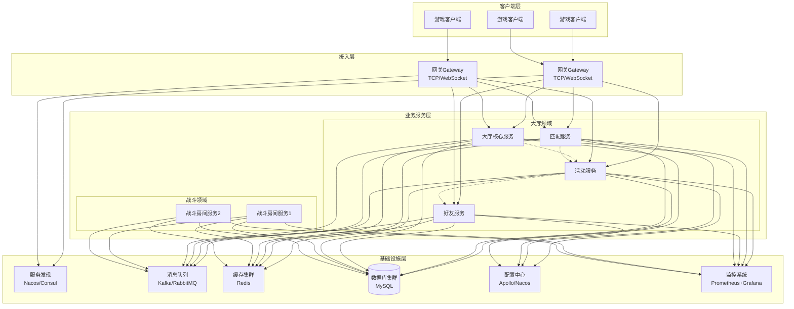
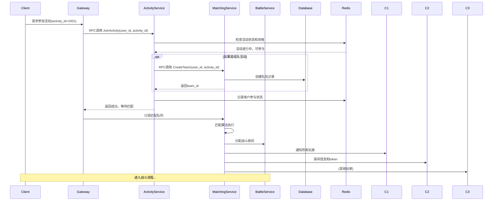

好的，这是一个非常实际且重要的问题。我将结合图示和具体工程实践来详细讲解。

## 一、宏观架构图示

首先，我们通过一张宏观架构图来理解整体布局：



## 二、代码工程结构管理

### 1. 代码仓库策略

**方案一：Monorepo（单一仓库） - 适合中小团队**

```
game-server/
├── .github/                    # CI/CD配置
├── apps/                       # 所有服务应用
│   ├── gateway/               # 网关服务
│   ├── lobby-core/            # 大厅核心服务
│   ├── activity/              # 活动服务
│   ├── matching/              # 匹配服务
│   ├── friend/                # 好友服务
│   └── battle/                # 战斗服务
├── libs/                      # 共享库
│   ├── common/               # 通用工具
│   ├── protocol/             # 协议定义
│   ├── database/             # 数据库操作
│   └── rpc/                  # RPC框架封装
├── configs/                   # 配置文件
├── scripts/                   # 部署脚本
├── docs/                      # 文档
├── docker-compose.yml         # 本地开发环境
└── README.md
```

**方案二：Polyrepo（多仓库）- 适合大型团队**

```
# 仓库1：游戏协议仓库
game-protocol/
├── proto/                    # Protobuf定义
├── generated/               # 生成的代码
└── README.md

# 仓库2：公共库仓库
game-common/
├── core/                    # 核心工具
├── database/                # 数据库封装
└── rpc/                     # RPC客户端

# 仓库3：网关服务仓库
game-gateway/
├── src/
├── Dockerfile
└── go.mod

# 仓库4：活动服务仓库
game-activity/
├── src/
├── Dockerfile
└── go.mod
```

### 2. 依赖管理示例（Go语言）

```go
// go.mod 示例 - 活动服务
module github.com/yourcompany/game-activity

go 1.20

require (
    github.com/yourcompany/game-protocol v1.2.0
    github.com/yourcompany/game-common v0.5.0
    github.com/gin-gonic/gin v1.9.0
    google.golang.org/grpc v1.55.0
    github.com/redis/go-redis/v9 v9.0.5
)

// 使用共享包示例
import (
    "github.com/yourcompany/game-protocol/proto/activity"
    "github.com/yourcompany/game-common/database"
    "github.com/yourcompany/game-common/rpc"
)
```

## 三、微服务拆分实践

### 1. 服务间通信时序图

以一个"参加限时活动"的完整流程为例：



### 2. 服务拆分的具体步骤

**步骤一：领域分析**

```go
// 识别领域边界 - 以活动服务为例
type ActivityDomain struct {
    // 核心聚合根：活动
    Activity struct {
        ID          int64
        Type        string  // 单人、组队、全服
        Config      ActivityConfig
        Status      string  // 未开始、进行中、已结束
        Statistics  ActivityStats
    }
    
    // 值对象
    ActivityReward struct {
        Items    []Item
        Currency map[string]int64
    }
    
    // 实体：用户活动进度
    UserProgress struct {
        UserID     int64
        ActivityID int64
        Progress   int
        Score      int
        Rank       int
        ReceivedRewards []int64
    }
}
```

**步骤二：定义服务接口（Protobuf示例）**

```protobuf
// protos/activity_service.proto
syntax = "proto3";

package game.activity.v1;

service ActivityService {
  // 获取活动列表
  rpc GetActivityList(GetActivityListReq) returns (GetActivityListResp);
  
  // 参加活动
  rpc JoinActivity(JoinActivityReq) returns (JoinActivityResp);
  
  // 提交活动进度
  rpc SubmitProgress(SubmitProgressReq) returns (SubmitProgressResp);
  
  // 领取活动奖励
  rpc ClaimReward(ClaimRewardReq) returns (ClaimRewardResp);
  
  // 获取活动排行榜
  rpc GetLeaderboard(GetLeaderboardReq) returns (GetLeaderboardResp);
}

// 消息定义
message JoinActivityReq {
  int64 user_id = 1;
  int64 activity_id = 2;
  string token = 3;
}

message JoinActivityResp {
  bool success = 1;
  string match_token = 2;  // 用于匹配服务
  int32 estimated_wait_time = 3;
}
```

**步骤三：实现服务内部结构**

```
game-activity-service/
├── cmd/
│   └── server/
│       └── main.go          # 服务入口
├── internal/
│   ├── handler/            # gRPC处理器
│   │   ├── activity_handler.go
│   │   └── leaderboard_handler.go
│   ├── service/           # 业务逻辑层
│   │   ├── activity_service.go
│   │   └── reward_service.go
│   ├── repository/        # 数据访问层
│   │   ├── activity_repo.go
│   │   └── redis_repo.go
│   └── model/             # 领域模型
│       ├── activity.go
│       └── user_progress.go
├── pkg/
│   ├── config/           # 配置读取
│   └── client/           # 对其他服务的客户端
├── api/                  # 生成的protobuf代码
├── configs/              # 配置文件
│   ├── config.yaml
│   └── config.local.yaml
├── deployments/          # 部署配置
│   ├── Dockerfile
│   ├── k8s-deployment.yaml
│   └── docker-compose.yml
└── tests/               # 测试文件
```

**步骤四：核心业务代码示例**

```go
// internal/service/activity_service.go
package service

type ActivityServiceImpl struct {
    repo        repository.ActivityRepository
    redis       *redis.Client
    rpcClients  *clients.RPCClients  // 其他服务的客户端
    pubSub      *message.PubSub
}

func (s *ActivityServiceImpl) JoinActivity(ctx context.Context, req *pb.JoinActivityReq) (*pb.JoinActivityResp, error) {
    // 1. 验证活动状态
    activity, err := s.repo.GetActivity(ctx, req.ActivityId)
    if err != nil {
        return nil, err
    }
    
    if activity.Status != "running" {
        return nil, errors.New("activity not available")
    }
    
    // 2. 检查用户资格
    canJoin, err := s.checkUserQualification(ctx, req.UserId, activity)
    if err != nil || !canJoin {
        return nil, errors.New("user not qualified")
    }
    
    // 3. 记录参与状态到Redis
    key := fmt.Sprintf("activity:%d:participants", req.ActivityId)
    err = s.redis.SAdd(ctx, key, req.UserId).Err()
    if err != nil {
        return nil, err
    }
    
    // 4. 如果是组队活动，创建队伍
    var matchToken string
    if activity.Type == "team_activity" {
        // 调用匹配服务的RPC
        resp, err := s.rpcClients.Matching.CreateTeam(ctx, &matching.CreateTeamReq{
            LeaderId:    req.UserId,
            ActivityId:  req.ActivityId,
            MinPlayers:  activity.MinPlayers,
            MaxPlayers:  activity.MaxPlayers,
        })
        if err != nil {
            return nil, err
        }
        matchToken = resp.MatchToken
    }
    
    // 5. 发布事件到消息队列
    s.pubSub.Publish(ctx, "activity.join", map[string]interface{}{
        "user_id":      req.UserId,
        "activity_id":  req.ActivityId,
        "timestamp":    time.Now().Unix(),
    })
    
    return &pb.JoinActivityResp{
        Success:            true,
        MatchToken:        matchToken,
        EstimatedWaitTime: 30,
    }, nil
}
```

## 四、关键实现技术

### 1. 服务发现与配置中心

```yaml
# configs/config.yaml
activity-service:
  server:
    port: 50051
    grpc_port: 50052
  database:
    main:
      host: ${DB_HOST:localhost}
      port: 3306
      database: game_activity
    replica:
      host: ${DB_REPLICA_HOST}
  redis:
    cluster:
      - host: redis-node-1
        port: 6379
      - host: redis-node-2
        port: 6379
  services:
    matching:
      service_name: game-matching-service
    friend:
      service_name: game-friend-service
```

### 2. 容器化部署（Docker示例）

```dockerfile
# Dockerfile
FROM golang:1.20-alpine AS builder
WORKDIR /app
COPY go.mod go.sum ./
RUN go mod download
COPY . .
RUN CGO_ENABLED=0 GOOS=linux go build -o activity-service ./cmd/server

FROM alpine:latest
RUN apk --no-cache add ca-certificates tzdata
WORKDIR /root/
COPY --from=builder /app/activity-service .
COPY --from=builder /app/configs ./configs
EXPOSE 50051 50052
CMD ["./activity-service", "-config", "./configs/config.yaml"]
```

### 3. Kubernetes部署配置

```yaml
# deployments/k8s-deployment.yaml
apiVersion: apps/v1
kind: Deployment
metadata:
  name: activity-service
spec:
  replicas: 3
  selector:
    matchLabels:
      app: activity-service
  template:
    metadata:
      labels:
        app: activity-service
    spec:
      containers:
      - name: activity-service
        image: registry.example.com/game-activity:v1.2.0
        ports:
        - containerPort: 50051
        - containerPort: 50052
        env:
        - name: DB_HOST
          valueFrom:
            configMapKeyRef:
              name: game-config
              key: db.host
        resources:
          requests:
            memory: "256Mi"
            cpu: "250m"
          limits:
            memory: "512Mi"
            cpu: "500m"
        livenessProbe:
          httpGet:
            path: /health
            port: 50051
          initialDelaySeconds: 30
          periodSeconds: 10
---
apiVersion: v1
kind: Service
metadata:
  name: activity-service
spec:
  selector:
    app: activity-service
  ports:
  - name: grpc
    port: 50051
    targetPort: 50051
  - name: http
    port: 8080
    targetPort: 8080
  type: ClusterIP
```

## 五、最佳实践建议

### 1. 开发流程

```
开发新功能流程：
1. 更新 protobuf 定义（如果需要）
2. 生成接口代码（protoc）
3. 实现服务端逻辑
4. 编写单元测试和集成测试
5. 本地用docker-compose测试
6. 提交代码，CI/CD自动部署到测试环境
```

### 2. 监控与告警

```go
// 在代码中埋点
func (s *ActivityServiceImpl) JoinActivity(ctx context.Context, req *pb.JoinActivityReq) (*pb.JoinActivityResp, error) {
    // 监控埋点
    startTime := time.Now()
    metrics.ActivityJoinRequests.Inc()
    
    defer func() {
        duration := time.Since(startTime)
        metrics.ActivityJoinDuration.Observe(duration.Seconds())
    }()
    
    // ...业务逻辑
}
```

### 3. 数据库设计策略

```sql
-- 活动服务专用数据库
CREATE DATABASE game_activity;

-- 活动主表
CREATE TABLE activities (
    id BIGINT PRIMARY KEY,
    name VARCHAR(255) NOT NULL,
    type ENUM('solo', 'team', 'server') NOT NULL,
    config JSON,  -- 活动配置
    start_time DATETIME,
    end_time DATETIME,
    status ENUM('pending', 'running', 'ended') DEFAULT 'pending',
    created_at TIMESTAMP DEFAULT CURRENT_TIMESTAMP
);

-- 用户进度表（按活动分表）
CREATE TABLE user_progress_1001 (
    user_id BIGINT,
    activity_id BIGINT,
    progress INT DEFAULT 0,
    score INT DEFAULT 0,
    last_update TIMESTAMP,
    PRIMARY KEY (user_id, activity_id)
) PARTITION BY HASH(user_id) PARTITIONS 10;
```

## 总结

游戏后端微服务拆分的关键点：

1. **按领域拆分**：活动、匹配、好友等独立领域各自为服务
2. **明确接口**：使用Protobuf等IDL定义清晰的接口契约
3. **独立数据**：每个服务管理自己的数据库，通过API通信
4. **事件驱动**：使用消息队列进行服务解耦
5. **完善监控**：每个服务都要有完整的监控和日志
6. **自动化部署**：CI/CD流水线，容器化部署

这样的架构虽然初期搭建复杂，但随着项目规模扩大，在维护性、扩展性和团队协作效率上会有巨大优势。特别适合需要长期运营、频繁更新活动的网络游戏项目。
