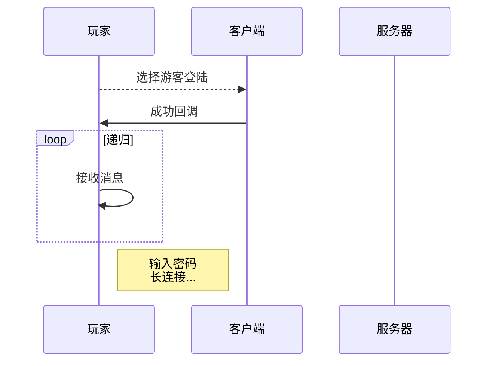
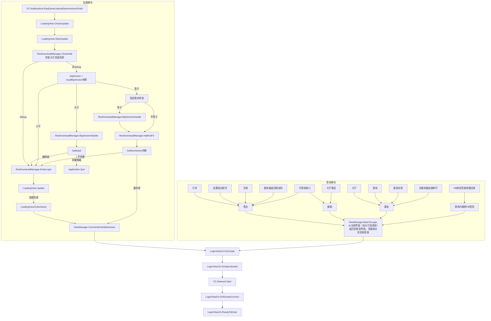

```
LoginWithProcess()
└── LoginWithToken()
    └── LoadPlayerWithPropType()
        └── RegToPublisher()
            └── ParallelRequest()   ← 当前方法
                ├── 新手签到
                ├── CV锁状态
                ├── 排行榜数据
                ├── 邀请代理信息
                ├── IP分析
                ├── 新手任务
                └── 其他游戏数据
```

``` lua
LoginDefine.LoginType = {
	Common = 1,--正常登陆
	Logout = 2,--登出登陆
	Reconnect = 3,--重连
	AutoFacebook = 4,--fb自动登录，在游戏内返回登陆页面
	AutoLine = 5,--废弃
	Kickedout = 6--被挤下线
}

LoginDefine.LoginWay = {
	Guest = 1,
	Facebook = 2,
	Line = 3,--废弃
	OPPO = 4--废弃
}
```

[mermaid在线编辑器](https://mermaid-live.nodejs.cn/edit#pako:eNpVU39P2zAQ_SonS0NMoukP2pBGAwQtAybEJsY0bQRNbnJNPJw4sp2Vru1339lpYeQv-3Lv3rv3khVLVYYsZnOpFmnBtYX7aVIBPWcPN4pnosrh290NzLmQmAXwHSHlFVi9BKtgLvJGI6jGwqJYBo_Q6Zysp-hmwqevn2_XcL7_RSI3hCowfQJb0ElVRkl0eIPoS64XeJUBaq00ZGiJzgTvWyXnbixMVtfmtTlVWmNqTzdty8Qz_0CzhumOcSIFMRaoPdUdF1Qj6cKYBkFUkAtbNLPgw0x3T66rVDZ-Wccw0-oJK5CienKNrtSifC8shJRgasQMmtq_nYvnndhWya1aw8VqKjIwqkRVbaEGacelaggkjJ-_W-DidYGPD2fGO1W2FhHEg1uc86-sJVr0-Mf_4Y710rO63lTVy63iNzCKc8d66Z3d-vamlLBbBfF-wtZwtX9PaTdm5869KJGoyVU-c_ZcCWOV3lLNtSrB8NKbuDCovZTGkFe0TKqR2zbyTPBc83JnW-rDmkKhcQ4JK6ytTdztbjMi7d0SdclF1vltXo5S_MEOZoLouz4g061wccqNEXmFaI73JJ-hNMezJt-zSPsTu7v80lgrbYMy27PCSjw-94m_G_ScpwkjBe334qcmjB2wXIuMxVY3eMC2_PTbrJz6hLmwqC2mY8Y1DUiqDWFqXv1UqtzBtGrygsVzLg3dmjojNdPWhpcWShv1RDWVZfFhGPkZLF6xZ7pGo2A86EXDYTgeHEWHowO2ZPFgEPSGR_1oMOyFh6MhlTcH7K9n7Qf9qD8Ko-goHIfjYRiFm39YsUmx)

---
## 时序图



---
## 流程图
> login

``` mermaid
graph TD
    subgraph 登录模块
        子游戏接口-->z
        z[登出]-->V
        引导-->z
        设置退出账号-->z
        子游戏接口-->被踢
        大厅推送-->被踢-->V
        大厅-->W[重连]
        游戏-->W
        重连失败-->W
        当服务器连接断开-->W
        W-->V
        FB绑定奖励领取回调-->游戏内跳转FB登陆-->V
        注销-->z
        服务器返回错误码-->z
        ViewManager.CommonEnterMainScene-->LoginViewCtr:OnCreate --> LoginViewCtr:OnOpenSocket-->CC.Network.Start-->
        LoginViewCtr:OnSocketConnect--> LoginViewCtr:ReadyToEnter
        V[ViewManager.BackToLogin,从当前界面（如大厅或游戏）返回到登录界面，清理相关状态和资源]-->LoginViewCtr:OnCreate
    end

    subgraph 登录模块2
        A(玩家登录) --> B1{存在登录方式}
        B1 -->|❌| B2[玩家选择登录方式]
        B2 --> B[ID登录]
        B2 --> C[游客登录]-->a3[LoginWithProcess]
        B2 --> D[FB登录]
        B --> F[RoyalLoginView] --> G[Login] --> OnAccountLogin-->C
        D --> |FB sdk 
        成功回调、
        失败回调注册|H[CC.FacebookPlugin.LogIn] --> K{成功登录FB} --> |✅|J[请求 FacebookLogin] -->
        a1{成功登录游戏} --> a2[保存玩家登录数据，向第三方分析平台发送注册事件，埋点统计、次日留存、本地缓存注册和新玩状态]-->
        a3-->|请求|a4[LoginWithToken]-->
        a5{请求回调}-->|✅|a6[保存玩家设备id,登录方式]-->
        a7{请求加载玩家的特定属性数据（如财富、称号、统计信息等），用于初始化玩家在游戏中的基础状态}-->
        |✅|a8[保存玩家个人信息]-->
        a9{将玩家的登录信息注册到游戏发布平台（如 Google Play、App Store 等），用于后续平台相关的功能验证或服务调用。}-->
        |✅|b1[存储成功发布状态]-->|并行请求业务数据|b2[ParallelRequest]-->b3[获取新手签到状态:如是否开启新手签到
        获取 CV 锁定状态:用于控制某些功能的解锁条件
        获取金币排行榜数据
        获取每日赢取排行榜数据
        获取大奖回放周榜数据
        获取新玩家标志:判断是否是新手玩家
        加载玩家的游戏相关数据:如上次登录信息等
        获取邀请代理相关信息
        分析玩家 IP 地址信息:可能用于风控或地区统计
        获取新手任务信息]-->LoginViewCtr:Update -->|percent >= 100|LoginViewCtr:EnterGame
        LoginViewCtr:Update-->LoginView:RefreshUI-->loadingNode,进度及按钮的展示
        D-->Request.FacebookLogin-->LoginWithProcess
        C-->Request.Login-->LoginWithProcess

        subgraph 共同请求模块
            LoginWithProcess-->Request.LoginWithToken-->Request.ReqLoadPlayerWithPropType-->Request.RegToPublisher-->ParallelRequest-->b3
        end
        
    end

   subgraph 新登录流程
        OnFacebookLogin-->NewFacebookLogin-->GetLoginProcess--> FacebookLogin:InitData-->LoginProcess:CommonReq
        -->CC.Request:NewLogin-->LoginProcess:OnLoginResponse-->ProcessingFacebookLoginTokenInfoData
        -->OnNewLoginSuc-->ProcessingLoginWithToken
        
        subgraph 合并请求回复的数据
            ProcessingLoginWithToken-->ProcessingLoadPlayerWithPropType-->ProcessingReqNewPlayerSignStatus
            -->ProcessingGetNewPlayerFlag-->ProcessingReqLoadPlayerGameInfo
        end

        ProcessingReqLoadPlayerGameInfo-->RegToPublisher-->并行请求数据



        OnGuestLogin-->NewGuestLogin-->GetLoginProcess-->GuestLogin:InitData-->LoginProcess:CommonReq
        LoginProcess:OnLoginResponse-->ProcessingGuestLoginTokenInfoData-->OnNewLoginSuc

        ReadyToEnter-->|Guest|NewAccountLogin
        ReadyToEnter-->|RoyalLogin|NewAccountLogin
        oa[OnAccountLogin]-->NewAccountLogin-->GetLoginProcess-->RoyalLogin:InitData-->LoginProcess:CommonReq
        LoginProcess:OnLoginResponse-->ProcessingAccountLoginTokenInfoData-->OnNewLoginSuc
    
        subgraph 各登录方式请求所需的数据
            FacebookLogin:InitData
            GuestLogin:InitData
            RoyalLogin:InitData
        end

        subgraph 各登录方式请求的成功回调
            ProcessingAccountLoginTokenInfoData
            ProcessingGuestLoginTokenInfoData
            ProcessingFacebookLoginTokenInfoData
        end

      
    
    end
    




```

``` mermaid
graph TD
    subgraph 登录模块
        子游戏接口-->z
        z[登出]-->V
        引导-->z
        设置退出账号-->z
        子游戏接口-->被踢
        大厅推送-->被踢-->V
        大厅-->W[重连]
        游戏-->W
        重连失败-->W
        当服务器连接断开-->W
        W-->V
        FB绑定奖励领取回调-->游戏内跳转FB登陆-->V
        注销-->z
        服务器返回错误码-->z
        ViewManager.CommonEnterMainScene-->LoginViewCtr:OnCreate --> LoginViewCtr:OnOpenSocket-->CC.Network.Start-->
        LoginViewCtr:OnSocketConnect
        --> LoginViewCtr:ReadyToEnter
        V[ViewManager.BackToLogin,从当前界面（如大厅或游戏）返回到登录界面，清理相关状态和资源]-->LoginViewCtr:OnCreate
    end

    subgraph 登录模块2
        A(玩家登录) --> B1{存在登录方式}
        B1 -->|❌| B2[玩家选择登录方式]
        B2 --> B[ID登录]
        B2 --> C[游客登录]-->a3[LoginWithProcess]
        B2 --> D[FB登录]
        B --> F[RoyalLoginView] --> G[Login] --> OnAccountLogin-->C
        D --> |FB sdk 
        成功回调、
        失败回调注册|H[CC.FacebookPlugin.LogIn] --> K{成功登录FB} --> |✅|J[请求 FacebookLogin] -->
        a1{成功登录游戏} --> a2[保存玩家登录数据，向第三方分析平台发送注册事件，埋点统计、次日留存、本地缓存注册和新玩状态]-->
        a3-->|请求|a4[LoginWithToken]-->
        a5{请求回调}-->|✅|a6[保存玩家设备id,登录方式]-->
        a7{请求加载玩家的特定属性数据（如财富、称号、统计信息等），用于初始化玩家在游戏中的基础状态}-->
        |✅|a8[保存玩家个人信息]-->
        a9{将玩家的登录信息注册到游戏发布平台（如 Google Play、App Store 等），用于后续平台相关的功能验证或服务调用。}-->
        |✅|b1[存储成功发布状态]-->|并行请求业务数据|b2[ParallelRequest]-->b3[获取新手签到状态:如是否开启新手签到
        获取 CV 锁定状态:用于控制某些功能的解锁条件
        获取金币排行榜数据
        获取每日赢取排行榜数据
        获取大奖回放周榜数据
        获取新玩家标志:判断是否是新手玩家
        加载玩家的游戏相关数据:如上次登录信息等
        获取邀请代理相关信息
        分析玩家 IP 地址信息:可能用于风控或地区统计
        获取新手任务信息]-->LoginViewCtr:Update -->|percent >= 100|LoginViewCtr:EnterGame
        LoginViewCtr:Update-->LoginView:RefreshUI-->loadingNode,进度及按钮的展示
    end
```


> loading

> 推荐下面的方式:在[Mermaid 在线编辑器](https://mermaid-live.nodejs.cn/edit#pako:eNpVU39P2zAQ_SonS0NMatOkaQuNBghaxg8xNjGmaSNocpNr4uHYke2sdG2_-2ynhZG_nMu9e-_ei1ckkzmShMy5XGQlVQbup6kA-5w-3EiaM1HAt7sbmFPGMQ_gO0JGBRi1BCNhzopGIcjGwKJcBo_Q7R6vp-hmwvXXz7drONv_wpFqiyoxewJT2pMUWnJ0eI3oS64XqMgBlZIKcjSWTgfvWyVnbixMVlf6tTmTSmFmTjZty8Qz_0C9humOccKZZSxReao7ymzNSmdaNwhMQMFM2cyCDzPVO74SGW_8so5hpuQTCuBMPLlGV2pRvhcWjHPQNWIOTe2_ztnzTmyr5Fau4Xw1ZTloWaEUW6hGu-NSNhbEtJ-_W-D8dYGPD6faO1W1FlmIB7c4519VczTo8Y__wx3rhWd1vZmsl1vFb2A2zh3rhXd269ubUkpuJST7KVnD5f69TbvRO3fuWYWW2rpKZ86eS6aNVFuquZIVaFp5ExcalZfSaOuVXSZTSE0bec5ooWi1sy3zYU2hVDiHlJTG1Drp9bYZWe29ClVFWd79rV-OnP3BLubM0vd8QLoncHFCtWaFQNRHe5zOkOujWVPsGbT7W3b38kthLZUJqnzPMMPx6Mwn_q4fOk9TYhW0_4ufmhLSIYViOUnmlGvskK0Ae29WTn5KXFq2L7HHnCo7IRUbC6qp-CllRRKjGgtTsinKlyFNnVs509aHlxYbN6qJbIQhydhPIMmKPJOkG4WDID4YRFF_MBwdxKNhhyxJEg2HwSg-HI8H42g0iML-waZD_nrSMBhH4zgKwziO-1F8GI46pHXrU3vp_d3f_ANXSlAf)绘制图标，完成后点击下方的【复制 Markdown】，将链接粘贴到md文档就可以预览，点击图表也能跳转到Mermaid继续编辑，并且Mermaid可以点击【分享Kroki】来全屏预览。不过为了确保数据不会丢失最好在文档中记录一份。Mermaid还可以团队协助一起编辑，这个要使用[国际版](https://mermaid.live/edit#pako:eNpdjstOwzAQRX_FuiuQkiiP5uUFUtPsWcAKzMJKnIdo7Mh1RCHKv-NaqoLwyjPnnplZ0ahWgML3fSYbJbuxp0wS98wgJkGJFu1yZdIlurP6agauDXmt7zFCjg_vDC_Gthk-Hv_0ie8_kWplqEUzXkYlGbYdVw6frPs8GwvJ0er_cb3jymF46PXYghq9CA-T0BO_lVhvKoO7moHab8v1JwOTm3VmLt-Umu6aVks_gHb8fLHVMrfciHrkveZ7RMhW6JNapAGNEjcCdMUVNImz4BBlcRQWaVSGRebhGzRNg0OSp3FRlnGYx2W-efhxO8OgyNPtF0tIahg)国际版还支持Playground-more featureS, no account required，点击【Playground】可以直接鼠标创建完成绘制图标像xmind一样，不用手敲语法，并且自带全屏预览效果，不用分享Kroki。

[](https://mermaid-live.nodejs.cn/edit#pako:eNp9lN9P01AUx_-V5j4Psq7bYE00ICSGBxOjPGl9KPTCFrd2absobEvmCFBgvwiOGUWUhClRXCD-KuvY_hh6b7un_Qve9srEgPap59xzzvdzvs1tFswrEgQ8WFTFdJyZnRZkQWbI4xwf22bBNj-hahHXT0ZGbqOzHtrexO0aec-hw1P3WzPXXy075y38dqW_Xr6atl65rUP2z6R26a9JtZJzaqH9Ldt8SXvxXgEdfvQm4MZ7eoxNExvVHC5t4MqRW67RQveg6f74ek0qdAV646qU26u5tSbFvFmNVlCNm9VC1-S4S5cmJ7KMFhfTkGfmVHEeagEmKc7BJM8IAFUsMkIATN6rpvV3_lM_I2u6mEwyD-ACVFWoMpP3Z9zKT1TdpdqCTNdwD46cTpvksLGLOkVkmoJMofsFy-1uu90zp17CK6to7fugY6APxUUxBRMS2RXXjYvCi6H91GJiVH-9aptlsuqgs3EJ7OEuP8aNJuo10Lstp3g26Lzu7xXc1gk6r98ES02nyFQeVTcpGTIaHra1g_f3Bp2S3e3Z7QqqVRzrC2nB5RYy1vB-7aJQfPLbrKmJ7L-Momx3yVKzS2lIqvWHSUXXmFsMG_CiqTjUvCjkR7PKM6hOE0xZgyTJCcBfjwja7c_9nS6uNP3v68PnkPEGWe1hmi5DQxAglyQhAX5BTGowAFJQTYleDLIekQD0OExBAXiIkqg-9UDzpCktyo8UJQV4Xc2QNlXJLMaHQzJpSdThdEIk9y81zKpQlqA6pWRkHfAhNjruTwF8FjwH_AgbDI9yY2GWDYUj0TEuGgmAJcCzkcholBuPxcIxNhpmg6GxfAAs-8LB0Rgb49hgkOO4EMuNB0kHlBK6ot6jl9__B-R_AQXhABI)

[![](https://mermaid.ink/img/pako:eNrVWP9P20YU_1csV9pAw01sJwSsDI0vpWOiXQSsk7ZMyHEujoVjZ7YDpAgJOkFbKNCKL11XOko7OjbxbeoXKJQidX_KYif5qf_C7nx2YtJAYWqrLlHA9-7ee5_37t279zxECmockBxJUVRUEVQlIYlcVCEImc-qGYMj4ryogahiTydkdUBI8ppB9LSgNQShMN9HyfydPXN_Pj9_o3jvQZT8gaCoJkIJwYnC9LY5s2Dt7FjXZsxrtwvLq8Wxqfz-xnk-BWRJN4gBEIMMjqhAJcfYmnlrAnOUxAbhIuv6rPlipDh_UJx9aU2vlCWE8JqAM2QRtrW13O6N3M6fhYO75u4j694yJ6uipBCXJDBQkkrTXwxBi2NA5ggo__GqOX4jHNOawmkNELqRlcHn0WiUTKiKQSX4lCRnuU-_AkaLxkuKjmaawnGp37Myxgt9oqZmlDglqLKqcWdoFn4DzgDE0BcznljF15HeLvDjeWB0ARE6D2g9ah9Qwj4ooCnsg_qb8HOUJIaJT6BR5b1BtljXJ63F3dcvfkGDdl4AMVXtc4YdbT4xA3SDs42Gv7JPG72eCasyDAiDp3RDkxRRSmQpI5vGyFUtDjQQp9DGojFeiEaUoQG8xtAywJ4TZF7XbVKa0iQh2WuAQaP3MKukxIFi2IvoMjVm67Gpfpta9h1FGQOULvAyoAY57FxZqsRbXWp5_lTyC5vb1l9XsI9hJJozD2sSMR8MX3PjgQ873Gdu_GwtPC88eWTObNeGfbIEt0mV8S7Zwdfw__FwTB2kdOkyBPY-_PuGdD3NK555fHg8Z6ETneRvJSNpn4SaYGMtYaAnc3bK3J37jA77kIQm7PT3CtXFw8cjMHECDYGKaGq6B-5dTaCWsCavw7yWn_7D3HhWHJ01x7ZzB8vW6CbC-IHAXQQDGFu3JCrdBm9k9Bo6wNYS-fWX5rUtjOcYl394d8JUVwLdLvNiDe2n4RZbC1vwaGFfWvevFjbHPyrU5SBA11yHklBrAgi1fadhL9fk51Zzu9PWwnp-96B4dcq8-yuehvRaiBgmYOr0n1NeWFV99nrtyqutEBBYUP_q2d9L9koo2XHhSVgOqWxVM5oENFsMPgKnEWWzCf3vRHtxbjQ_8cwaGS2F1jkkQMy29neqQp_tu9NCe6eOKV69Ze6MWo8Wrfkta2qjBLM7kwZaF698BBCtzRnr9krh6QP0_AbQNh6yfRxAzd9-N1cW0Kmae2neWoVYIcTerr5eBK8TXoEng5hINNYnEh6Iub2H-Zvj-cd7-b0lbHeH0i8ZoFmEKQSd9P8otyNSudo2EOYWgDOLubhl3hvByQMrblZ4OatLekfaq_P0qnEyze3tmRPLFfdED6_32UZhqVHUBDil8fFo05kYrDOSsHp0WLFgWLYyETwFNFRb4kznFrDewsipPWmngN8ZqSjg-ThMuhUlfD1qH-x6zLr7BJplLi2ZN6fKhSzN4IWN7ph2GNlDtb9dtHk6gGqmOpHnSfpuSd6S7QGy6zC3Dg8cUmAXh_-MjOKK8BiHHq3Fo8A1hnWMYVxCoJJQ7xBCXjQdEevhiPV0EvUBb8OAoi5jJDsi8OGISHuDB0t37urFNRjHTrEM7-2NrSp2OC0c7T9UFJ_8VisFFGwtceuISF_ystyqplKqgkadOH6a29xU4ASM3aGiS7vVboPRzEXVkATP-ALQdV4ELqO9GDbEorPEnB83l6YLG8uFJ8_zV57bEroHJENIuigiavqbNApcl_0S0HRJVZiQ389eYiD12IYDcSDlHpcx6JSgjDc9lv9pHZtSOhUsaqpzO5OF_X1z_SYuMspHgrGb9O3HhX24M7vWnU1YB-L9KS4_LclgGkonq1lKJISkY2ypM3elNTjrD7eMb2mM7bT0agu3xygxna5F9ib_6nnvDL42SuG4tIL9gZ1RypzlLtrjW9aPfDs2Zo68MJcm4Y6WHYu83txepsKDzqKGu72lRHOFOEeRCblB7ncItLsCvakozt0pbG7m74_mdiasiZVKKfYrCj3JpwFHaEAwhj39eRVyQ3WyVwjaBBAvZ5AjOAJH0ENH0P3V6cwRQFn_kZBYttoUWUeKmhQnuQQv66COTAEtxaMxOYT4YAucBCkQJVHwxXmtL0pGlWHIBLf5O1VNkRxqketIKFBMloRk0rDsB20SL2p8qkTVANSpwRBTDJKjWVsGyQ2RgyTHBkNnG4L-gJ8OMfBvoD5YR2ZJLkBDakMwCGmBUKCRZobryMu2Vv_ZRsYfpP0M-scyDBOqI0FcMlTtAn4BZ7-HG_4Xa7ylEQ?type=png)](https://mermaid-live.nodejs.cn/edit#pako:eNrVWP9P20YU_1csV9pAw01sJwSsDI0vpWOiXQSsk7ZMyHEujoVjZ7YDpAgJOkFbKNCKL11XOko7OjbxbeoXKJQidX_KYif5qf_C7nx2YtJAYWqrLlHA9-7ee5_37t279zxECmockBxJUVRUEVQlIYlcVCEImc-qGYMj4ryogahiTydkdUBI8ppB9LSgNQShMN9HyfydPXN_Pj9_o3jvQZT8gaCoJkIJwYnC9LY5s2Dt7FjXZsxrtwvLq8Wxqfz-xnk-BWRJN4gBEIMMjqhAJcfYmnlrAnOUxAbhIuv6rPlipDh_UJx9aU2vlCWE8JqAM2QRtrW13O6N3M6fhYO75u4j694yJ6uipBCXJDBQkkrTXwxBi2NA5ggo__GqOX4jHNOawmkNELqRlcHn0WiUTKiKQSX4lCRnuU-_AkaLxkuKjmaawnGp37Myxgt9oqZmlDglqLKqcWdoFn4DzgDE0BcznljF15HeLvDjeWB0ARE6D2g9ah9Qwj4ooCnsg_qb8HOUJIaJT6BR5b1BtljXJ63F3dcvfkGDdl4AMVXtc4YdbT4xA3SDs42Gv7JPG72eCasyDAiDp3RDkxRRSmQpI5vGyFUtDjQQp9DGojFeiEaUoQG8xtAywJ4TZF7XbVKa0iQh2WuAQaP3MKukxIFi2IvoMjVm67Gpfpta9h1FGQOULvAyoAY57FxZqsRbXWp5_lTyC5vb1l9XsI9hJJozD2sSMR8MX3PjgQ873Gdu_GwtPC88eWTObNeGfbIEt0mV8S7Zwdfw__FwTB2kdOkyBPY-_PuGdD3NK555fHg8Z6ETneRvJSNpn4SaYGMtYaAnc3bK3J37jA77kIQm7PT3CtXFw8cjMHECDYGKaGq6B-5dTaCWsCavw7yWn_7D3HhWHJ01x7ZzB8vW6CbC-IHAXQQDGFu3JCrdBm9k9Bo6wNYS-fWX5rUtjOcYl394d8JUVwLdLvNiDe2n4RZbC1vwaGFfWvevFjbHPyrU5SBA11yHklBrAgi1fadhL9fk51Zzu9PWwnp-96B4dcq8-yuehvRaiBgmYOr0n1NeWFV99nrtyqutEBBYUP_q2d9L9koo2XHhSVgOqWxVM5oENFsMPgKnEWWzCf3vRHtxbjQ_8cwaGS2F1jkkQMy29neqQp_tu9NCe6eOKV69Ze6MWo8Wrfkta2qjBLM7kwZaF698BBCtzRnr9krh6QP0_AbQNh6yfRxAzd9-N1cW0Kmae2neWoVYIcTerr5eBK8TXoEng5hINNYnEh6Iub2H-Zvj-cd7-b0lbHeH0i8ZoFmEKQSd9P8otyNSudo2EOYWgDOLubhl3hvByQMrblZ4OatLekfaq_P0qnEyze3tmRPLFfdED6_32UZhqVHUBDil8fFo05kYrDOSsHp0WLFgWLYyETwFNFRb4kznFrDewsipPWmngN8ZqSjg-ThMuhUlfD1qH-x6zLr7BJplLi2ZN6fKhSzN4IWN7ph2GNlDtb9dtHk6gGqmOpHnSfpuSd6S7QGy6zC3Dg8cUmAXh_-MjOKK8BiHHq3Fo8A1hnWMYVxCoJJQ7xBCXjQdEevhiPV0EvUBb8OAoi5jJDsi8OGISHuDB0t37urFNRjHTrEM7-2NrSp2OC0c7T9UFJ_8VisFFGwtceuISF_ystyqplKqgkadOH6a29xU4ASM3aGiS7vVboPRzEXVkATP-ALQdV4ELqO9GDbEorPEnB83l6YLG8uFJ8_zV57bEroHJENIuigiavqbNApcl_0S0HRJVZiQ389eYiD12IYDcSDlHpcx6JSgjDc9lv9pHZtSOhUsaqpzO5OF_X1z_SYuMspHgrGb9O3HhX24M7vWnU1YB-L9KS4_LclgGkonq1lKJISkY2ypM3elNTjrD7eMb2mM7bT0agu3xygxna5F9ib_6nnvDL42SuG4tIL9gZ1RypzlLtrjW9aPfDs2Zo68MJcm4Y6WHYu83txepsKDzqKGu72lRHOFOEeRCblB7ncItLsCvakozt0pbG7m74_mdiasiZVKKfYrCj3JpwFHaEAwhj39eRVyQ3WyVwjaBBAvZ5AjOAJH0ENH0P3V6cwRQFn_kZBYttoUWUeKmhQnuQQv66COTAEtxaMxOYT4YAucBCkQJVHwxXmtL0pGlWHIBLf5O1VNkRxqketIKFBMloRk0rDsB20SL2p8qkTVANSpwRBTDJKjWVsGyQ2RgyTHBkNnG4L-gJ8OMfBvoD5YR2ZJLkBDakMwCGmBUKCRZobryMu2Vv_ZRsYfpP0M-scyDBOqI0FcMlTtAn4BZ7-HG_4Xa7ylEQ)

