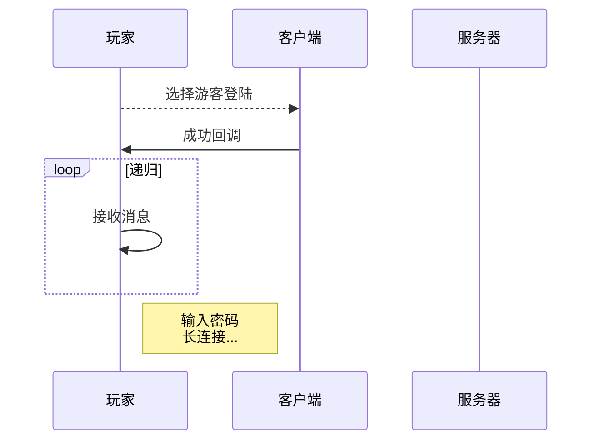
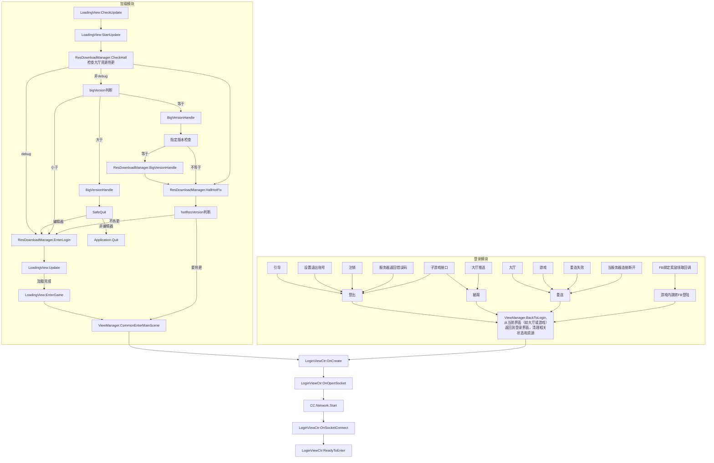

```
LoginWithProcess()
└── LoginWithToken()
    └── LoadPlayerWithPropType()
        └── RegToPublisher()
            └── ParallelRequest()   ← 当前方法
                ├── 新手签到
                ├── CV锁状态
                ├── 排行榜数据
                ├── 邀请代理信息
                ├── IP分析
                ├── 新手任务
                └── 其他游戏数据
```

``` lua
LoginDefine.LoginType = {
	Common = 1,--正常登陆
	Logout = 2,--登出登陆
	Reconnect = 3,--重连
	AutoFacebook = 4,--fb自动登录，在游戏内返回登陆页面
	AutoLine = 5,--废弃
	Kickedout = 6--被挤下线
}

LoginDefine.LoginWay = {
	Guest = 1,
	Facebook = 2,
	Line = 3,--废弃
	OPPO = 4--废弃
}
```

[mermaid在线编辑器](https://mermaid-live.nodejs.cn/edit#pako:eNpVU39P2zAQ_SonS0NMoukP2pBGAwQtAybEJsY0bQRNbnJNPJw4sp2Vru1339lpYeQv-3Lv3rv3khVLVYYsZnOpFmnBtYX7aVIBPWcPN4pnosrh290NzLmQmAXwHSHlFVi9BKtgLvJGI6jGwqJYBo_Q6Zysp-hmwqevn2_XcL7_RSI3hCowfQJb0ElVRkl0eIPoS64XeJUBaq00ZGiJzgTvWyXnbixMVtfmtTlVWmNqTzdty8Qz_0CzhumOcSIFMRaoPdUdF1Qj6cKYBkFUkAtbNLPgw0x3T66rVDZ-Wccw0-oJK5CienKNrtSifC8shJRgasQMmtq_nYvnndhWya1aw8VqKjIwqkRVbaEGacelaggkjJ-_W-DidYGPD2fGO1W2FhHEg1uc86-sJVr0-Mf_4Y710rO63lTVy63iNzCKc8d66Z3d-vamlLBbBfF-wtZwtX9PaTdm5869KJGoyVU-c_ZcCWOV3lLNtSrB8NKbuDCovZTGkFe0TKqR2zbyTPBc83JnW-rDmkKhcQ4JK6ytTdztbjMi7d0SdclF1vltXo5S_MEOZoLouz4g061wccqNEXmFaI73JJ-hNMezJt-zSPsTu7v80lgrbYMy27PCSjw-94m_G_ScpwkjBe334qcmjB2wXIuMxVY3eMC2_PTbrJz6hLmwqC2mY8Y1DUiqDWFqXv1UqtzBtGrygsVzLg3dmjojNdPWhpcWShv1RDWVZfFhGPkZLF6xZ7pGo2A86EXDYTgeHEWHowO2ZPFgEPSGR_1oMOyFh6MhlTcH7K9n7Qf9qD8Ko-goHIfjYRiFm39YsUmx)

---
## 时序图



---
## 流程图
> login

``` mermaid
graph TD
    subgraph 登录模块
        子游戏接口-->z
        z[登出]-->V
        引导-->z
        设置退出账号-->z
        子游戏接口-->被踢
        大厅推送-->被踢-->V
        大厅-->W[重连]
        游戏-->W
        重连失败-->W
        当服务器连接断开-->W
        W-->V
        FB绑定奖励领取回调-->游戏内跳转FB登陆-->V
        注销-->z
        服务器返回错误码-->z
        ViewManager.CommonEnterMainScene-->LoginViewCtr:OnCreate --> LoginViewCtr:OnOpenSocket-->CC.Network.Start-->
        LoginViewCtr:OnSocketConnect--> LoginViewCtr:ReadyToEnter
        V[ViewManager.BackToLogin,从当前界面（如大厅或游戏）返回到登录界面，清理相关状态和资源]-->LoginViewCtr:OnCreate
    end

    subgraph 登录模块2
        A(玩家登录) --> B1{存在登录方式}
        B1 -->|❌| B2[玩家选择登录方式]
        B2 --> B[ID登录]
        B2 --> C[游客登录]-->a3[LoginWithProcess]
        B2 --> D[FB登录]
        B --> F[RoyalLoginView] --> G[Login] --> OnAccountLogin-->C
        D --> |FB sdk 
        成功回调、
        失败回调注册|H[CC.FacebookPlugin.LogIn] --> K{成功登录FB} --> |✅|J[请求 FacebookLogin] -->
        a1{成功登录游戏} --> a2[保存玩家登录数据，向第三方分析平台发送注册事件，埋点统计、次日留存、本地缓存注册和新玩状态]-->
        a3-->|请求|a4[LoginWithToken]-->
        a5{请求回调}-->|✅|a6[保存玩家设备id,登录方式]-->
        a7{请求加载玩家的特定属性数据（如财富、称号、统计信息等），用于初始化玩家在游戏中的基础状态}-->
        |✅|a8[保存玩家个人信息]-->
        a9{将玩家的登录信息注册到游戏发布平台（如 Google Play、App Store 等），用于后续平台相关的功能验证或服务调用。}-->
        |✅|b1[存储成功发布状态]-->|并行请求业务数据|b2[ParallelRequest]-->b3[获取新手签到状态:如是否开启新手签到
        获取 CV 锁定状态:用于控制某些功能的解锁条件
        获取金币排行榜数据
        获取每日赢取排行榜数据
        获取大奖回放周榜数据
        获取新玩家标志:判断是否是新手玩家
        加载玩家的游戏相关数据:如上次登录信息等
        获取邀请代理相关信息
        分析玩家 IP 地址信息:可能用于风控或地区统计
        获取新手任务信息]-->LoginViewCtr:Update -->|percent >= 100|LoginViewCtr:EnterGame
        LoginViewCtr:Update-->LoginView:RefreshUI-->loadingNode,进度及按钮的展示
        D-->Request.FacebookLogin-->LoginWithProcess
        C-->Request.Login-->LoginWithProcess

        subgraph 共同请求模块
            LoginWithProcess-->Request.LoginWithToken-->Request.ReqLoadPlayerWithPropType-->Request.RegToPublisher-->ParallelRequest-->b3
        end
        
    end

   subgraph 新登录流程
        OnFacebookLogin-->NewFacebookLogin-->GetLoginProcess--> FacebookLogin:InitData-->LoginProcess:CommonReq
        -->CC.Request:NewLogin-->LoginProcess:OnLoginResponse-->ProcessingFacebookLoginTokenInfoData
        -->OnNewLoginSuc-->ProcessingLoginWithToken-->ProcessingLoadPlayerWithPropType-->ProcessingReqNewPlayerSignStatus
        -->ProcessingGetNewPlayerFlag-->ProcessingReqLoadPlayerGameInfo-->RegToPublisher-->并行请求数据

        OnGuestLogin-->NewGuestLogin-->GetLoginProcess-->GuestLogin:InitData-->LoginProcess:CommonReq
        LoginProcess:OnLoginResponse-->ProcessingGuestLoginTokenInfoData-->OnNewLoginSuc

        ReadyToEnter-->|Guest|NewAccountLogin
        ReadyToEnter-->|RoyalLogin|NewAccountLogin
        oa[OnAccountLogin]-->NewAccountLogin-->GetLoginProcess-->RoyalLogin:InitData-->LoginProcess:CommonReq
        LoginProcess:OnLoginResponse-->ProcessingAccountLoginTokenInfoData-->OnNewLoginSuc
    end
```

``` mermaid
graph TD
    subgraph 登录模块
        子游戏接口-->z
        z[登出]-->V
        引导-->z
        设置退出账号-->z
        子游戏接口-->被踢
        大厅推送-->被踢-->V
        大厅-->W[重连]
        游戏-->W
        重连失败-->W
        当服务器连接断开-->W
        W-->V
        FB绑定奖励领取回调-->游戏内跳转FB登陆-->V
        注销-->z
        服务器返回错误码-->z
        ViewManager.CommonEnterMainScene-->LoginViewCtr:OnCreate --> LoginViewCtr:OnOpenSocket-->CC.Network.Start-->
        LoginViewCtr:OnSocketConnect
        --> LoginViewCtr:ReadyToEnter
        V[ViewManager.BackToLogin,从当前界面（如大厅或游戏）返回到登录界面，清理相关状态和资源]-->LoginViewCtr:OnCreate
    end

    subgraph 登录模块2
        A(玩家登录) --> B1{存在登录方式}
        B1 -->|❌| B2[玩家选择登录方式]
        B2 --> B[ID登录]
        B2 --> C[游客登录]-->a3[LoginWithProcess]
        B2 --> D[FB登录]
        B --> F[RoyalLoginView] --> G[Login] --> OnAccountLogin-->C
        D --> |FB sdk 
        成功回调、
        失败回调注册|H[CC.FacebookPlugin.LogIn] --> K{成功登录FB} --> |✅|J[请求 FacebookLogin] -->
        a1{成功登录游戏} --> a2[保存玩家登录数据，向第三方分析平台发送注册事件，埋点统计、次日留存、本地缓存注册和新玩状态]-->
        a3-->|请求|a4[LoginWithToken]-->
        a5{请求回调}-->|✅|a6[保存玩家设备id,登录方式]-->
        a7{请求加载玩家的特定属性数据（如财富、称号、统计信息等），用于初始化玩家在游戏中的基础状态}-->
        |✅|a8[保存玩家个人信息]-->
        a9{将玩家的登录信息注册到游戏发布平台（如 Google Play、App Store 等），用于后续平台相关的功能验证或服务调用。}-->
        |✅|b1[存储成功发布状态]-->|并行请求业务数据|b2[ParallelRequest]-->b3[获取新手签到状态:如是否开启新手签到
        获取 CV 锁定状态:用于控制某些功能的解锁条件
        获取金币排行榜数据
        获取每日赢取排行榜数据
        获取大奖回放周榜数据
        获取新玩家标志:判断是否是新手玩家
        加载玩家的游戏相关数据:如上次登录信息等
        获取邀请代理相关信息
        分析玩家 IP 地址信息:可能用于风控或地区统计
        获取新手任务信息]-->LoginViewCtr:Update -->|percent >= 100|LoginViewCtr:EnterGame
        LoginViewCtr:Update-->LoginView:RefreshUI-->loadingNode,进度及按钮的展示
    end
```


> loading



