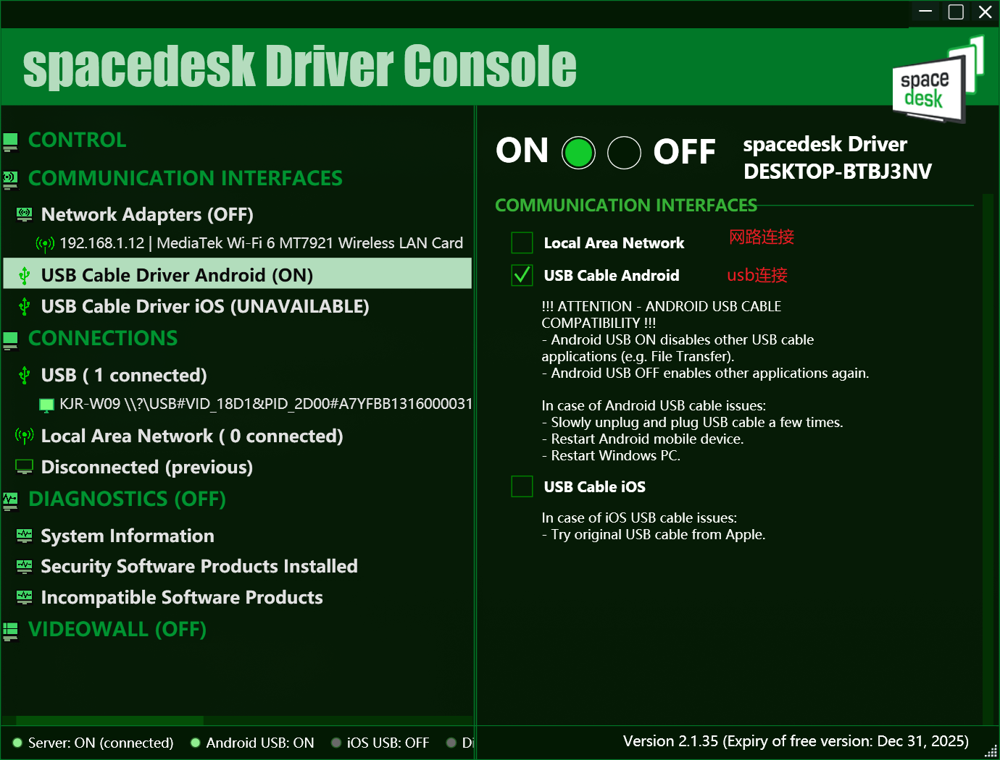

[安卓平板apk下载地址](https://spacedesk.en.uptodown.com/android/download)
[电脑端下载](https://www.spacedesk.net/download/)

## Spacedesk 版本介绍
**Spacedesk** 主要提供免费版本，适合大多数用户的基本需求。不过，它也有一些高级功能可能需要付费或通过捐赠支持开发。以下是 Spacedesk 的收费情况概述：

---

### **免费功能**：
1. **基本屏幕扩展**：
   - 支持将平板或手机作为电脑的扩展显示器。
   - 支持 Wi-Fi 和 USB 连接。

2. **多设备连接**：
   - 可以同时连接多个设备作为扩展屏幕。

3. **跨平台支持**：
   - 支持 Windows 电脑与 Android/iOS 设备连接。

4. **基本分辨率支持**：
   - 提供足够的分辨率用于日常办公和娱乐。

---

### **可能收费或需要捐赠的功能**：
1. **更高分辨率和刷新率**：
   - 免费版可能限制分辨率或刷新率，付费或捐赠后可解锁更高性能。

2. **高级功能**：
   - 某些高级功能（如低延迟模式或高级设置）可能需要捐赠或购买。

3. **商业用途**：
   - 如果用于商业环境，可能需要购买许可证。

---

### **捐赠支持**：
- Spacedesk 的开发团队接受捐赠以支持软件的持续开发和维护。用户可以通过官网捐赠以表达支持。

---

### **总结**：
- **免费版**：适合个人用户的基本需求，功能足够日常使用。
- **付费或捐赠**：如果需要更高分辨率、更低延迟或商业用途，可能需要付费或捐赠。

如果您只是偶尔使用或用于个人用途，免费版已经足够。如果需要更高级的功能，可以访问 [Spacedesk 官网](https://www.spacedesk.net/) 了解更多详情。

## 将电脑屏幕投射到平板电脑

使用 **Spacedesk** 将电脑屏幕投射到平板电脑的步骤如下：

### 准备工作：
1. **下载软件**：
   - 在电脑（Windows）上下载并安装 **Spacedesk** 驱动程序：[Spacedesk 官网](https://www.spacedesk.net/)。
   - 在平板电脑（Android 或 iOS）上下载并安装 **Spacedesk** 客户端应用（通过 Google Play 或 App Store）。

2. **确保设备在同一网络**：
   - 电脑和平板电脑需连接到同一 Wi-Fi 网络。

#### 在平板电脑上：
1. 打开 **Spacedesk** 客户端应用。
2. 应用会自动搜索同一网络中的电脑。找到您的电脑后，点击连接。
3. 连接成功后，平板电脑将显示电脑屏幕内容。

注意：
- WiFi连接需要同在一个局域网下
- WiFi有延迟
- USB需要打开显示器设备的开发者选项的调试模式
- Local Area Network： WiFi连接开关
- USB Cable Android：USB连接开关
- 若是数据线松动而连接失败，可以在电脑端控制台**CONTROL**重启连接: **off** ——> **on**
- 数据线连接了但是没有显示电脑画面，电脑端**USB cable Android**  先关了在开，然后屏幕端就重启Spacedesk软件就可以了
