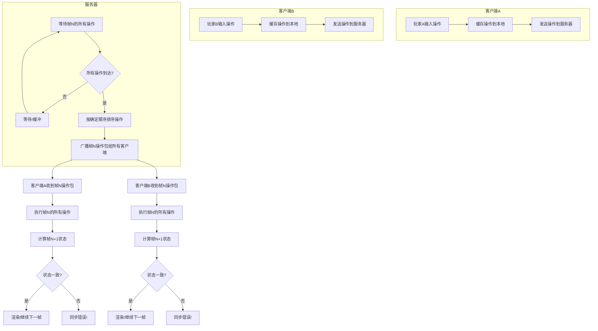

帧同步与状态同步是网络游戏中最常用的两种**网络同步方案**，它们的核心差异在于 **“状态”由谁计算、如何传输**。

---

## 🎯 **核心思想对比**

| 维度 | **帧同步 (Lockstep)** | **状态同步 (State Synchronization)** |
| :--- | :--- | :--- |
| **同步内容** | 玩家的**操作指令**（例如：按了W、释放技能Q） | 游戏对象的**关键状态**（例如：位置、血量、速度） |
| **计算位置** | **客户端计算**完全一致的游戏逻辑，结果理论上一致 | **服务器计算**权威状态，下发给客户端 |
| **网络流量** | 低（只传操作，数据量小） | 高（需频繁同步大量状态数据） |
| **安全性** | 较低（依赖客户端防作弊，可通过逻辑校验、关键逻辑服务器化提升） | 高（服务器为权威状态，客户端仅为表现层） |
| **断线重连** | 复杂（需要追帧，补发缺失的操作序列） | 简单（直接同步当前状态即可） |
| **回放实现** | 非常简单（记录操作流重新执行即可） | 较复杂（需记录状态快照流） |
| **适用场景** | 强一致性、操作频繁、单位量多的 **RTS、MOBA、格斗**（如：星际争霸、王者荣耀） | 状态复杂、实时性要求相对宽松、重视安全性的 **MMO、FPS、开放世界**（如：魔兽世界、原神） |
| **开发复杂度** | 逻辑层要求**严格确定性**（浮点数、随机数、遍历顺序等都需一致） | 需处理**状态同步的插值、预测和容错**，网络层更复杂 |
| **带宽敏感度** | 延迟敏感（操作必须按帧顺序到达，卡顿会拖慢所有人） | 带宽敏感（状态数据量大，需压缩、优化同步频率） |

---

## 🕹️ **帧同步详解**

### 工作原理
1. **操作同步**：每个客户端将当前帧（如第N帧）的操作发送给服务器。
2. **广播转发**：服务器收集所有玩家第N帧的操作后，按相同顺序广播给所有客户端。
3. **确定执行**：每个客户端在第N帧使用**相同的操作输入**和**相同的初始状态**执行游戏逻辑，得到**完全一致**的第N+1帧状态。

### 关键技术点
- **确定性**：所有客户端的逻辑运算必须绝对一致（相同硬件、编译器、库版本）。
- **锁帧等待**：如果某玩家操作延迟到达，所有客户端都会等待，直到该帧数据到齐。
- **逻辑与渲染分离**：逻辑帧率固定（如每秒20帧），渲染帧率可以自由提高。

### 优势
- **极低的带宽消耗**：只传操作指令，适合移动网络。
- **完美的战斗一致性**：杜绝了状态不同步导致的战斗结果争议。
- **回放与观战简单**：只需记录操作流，回放时重新演算即可。

### 劣势
- **防作弊弱**：理论上客户端可以篡改逻辑（可通过服务器关键校验缓解）。
- **断线重连体验差**：重连时需要补发所有缺失操作，可能耗时较长。
- **开发约束大**：必须保证逻辑的确定性，不能使用本地浮点数、不确定的随机数等。

---

## 🌐 **状态同步详解**

### 工作原理
1. **客户端发送操作**：玩家操作（如移动、攻击）发送到服务器。
2. **服务器计算**：服务器验证并计算出新的游戏状态。
3. **状态同步**：服务器将状态（或状态变化）广播给所有客户端。
4. **客户端表现**：客户端根据收到的状态更新本地表现，常配合**插值**和**预测**以平滑显示。

### 关键技术点
- **服务器权威**：服务器是唯一的状态仲裁者。
- **同步优化**：
  - **快照同步**：定时发送完整状态快照（如Quake III）。
  - **增量同步**：只发送发生变化的状态（如Delta Compression）。
  - **优先级与兴趣管理**：只同步玩家可见/关心的对象（如AOI）。
- **客户端预测与回滚**：为了抵消网络延迟，客户端会预测本地操作结果，收到服务器状态后不一致时进行校正（如守望先锋的“回溯补偿”）。

### 优势
- **安全性高**：核心逻辑在服务器，客户端难以作弊。
- **断线重连快**：直接发送当前状态即可恢复。
- **开发灵活**：不要求确定性，可使用常规的编程方式。

### 劣势
- **带宽要求高**：状态数据量大，对服务器和网络压力大。
- **状态不一致风险**：网络延迟或丢包可能导致客户端短暂的状态不一致（如“瞬移”）。
- **回放复杂**：需要记录完整的状态流，数据量大。

---

## 🛠️ **混合方案与趋势**

在实际项目中，常根据需求**混合使用**两种方案：

- **MOBA（如王者荣耀）**：采用**帧同步**保证战斗绝对一致，但将**技能命中判定、伤害计算**等关键逻辑放在服务器进行二次验证（称为“帧同步+服务器校验”）。
- **大型FPS（如守望先锋）**：采用**状态同步**，但对玩家的移动和射击使用**客户端预测+服务器回滚**，在保证权威的同时降低操作延迟感。
- **MMO（如魔兽世界）**：以状态同步为主，但对非关键行为（如角色移动）采用客户端预测，关键行为（如战斗、交易）由服务器严格验证。

---

## 📊 **如何选择？**

可以根据以下问题做决策：

1. **游戏类型**？
   - RTS、MOBA、格斗 → **优先帧同步**。
   - MMO、FPS、开放世界 → **优先状态同步**。
2. **最看重什么**？
   - 绝对一致性、低带宽 → 帧同步。
   - 安全性、开发便捷性、断线恢复 → 状态同步。
3. **团队技术储备**？
   - 有较强的数学、引擎底层确定性保障能力 → 帧同步。
   - 更熟悉传统的客户端-服务器架构 → 状态同步。

---

## 💎 **总结**
- **帧同步**是“**操作同步+确定性计算**”，追求过程的绝对一致。
- **状态同步**是“**状态广播+权威服务器**”，追求结果的最终一致。

---


**有的，很多现代游戏采用了混合方案，结合了帧同步和状态同步的优势。** 这种“二者都有”的混合设计越来越普遍，尤其是在对延迟、一致性和安全性都有高要求的竞技游戏中。

## 🎮 **典型混合方案游戏案例**

### **1. MOBA类：王者荣耀 / League of Legends Mobile**
- **核心战斗采用帧同步**：移动、技能释放、小兵AI等，保证所有玩家看到的战斗过程完全一致。
- **关键逻辑服务器校验**：
  - 技能命中判定、伤害计算由服务器二次验证
  - 经济系统、装备购买等数值变化由服务器权威管理
- **大厅/社交系统用状态同步**：好友列表、聊天、匹配系统等。
- **为什么这样设计**：帧同步保证MOBA最核心的“公平对战体验”，服务器校验防止外挂篡改伤害等关键数据。

### **2. 竞技FPS类：守望先锋 / VALORANT**
- **基础架构是状态同步**：服务器拥有所有状态的最终决定权。
- **但融入了帧同步思想**：
  - **确定性逻辑**：使用固定步长物理更新，保证服务器和客户端的逻辑计算一致。
  - **客户端预测+服务器回滚**：本质上是“带权威服务器的帧同步思维”——客户端预测自己的操作，服务器按固定时间步长（tick）计算，如果发现客户端的预测错误，则回滚并纠正。
  - **命中判定采用“服务器权威+客户端验证”**：服务器在收到射击指令时，会根据当时的“历史帧”状态重新计算是否命中（这就是帧同步的确定性思想）。
- **其他系统用传统状态同步**：玩家数据、技能冷却、游戏模式状态等。

### **3. 大逃杀类：PUBG / APEX英雄**
- **移动和射击采用混合模式**：
  - 移动：客户端预测 + 服务器校正（类似状态同步中的预测）
  - 射击：服务器端重演计算（类似帧同步的确定性验证）
- **车辆物理、世界状态用状态同步**
- **安全区、物品刷新用服务器权威状态同步**

### **4. 实时策略类：星际争霸2（后期改进）**
- 虽然是经典的帧同步游戏，但在星际2中：
  - **基础游戏逻辑采用帧同步**
  - **天梯积分、成就等用状态同步**（与暴雪服务器通信）
  - **录像分析系统**可以看作是帧同步的回放特性

## 🔧 **常见的混合模式设计**

### **模式1：主帧同步 + 辅状态同步**
```
游戏核心循环（战斗、移动） → 帧同步
经济系统、积分、任务进度 → 状态同步
```
**优点**：保证了核心玩法的绝对公平，又用状态同步保护了重要数据不被篡改。

### **模式2：主状态同步 + 辅帧同步特性**
```
所有状态服务器权威 → 状态同步
但使用固定时间步长、确定性物理 → 帧同步思想
关键操作服务器重演验证 → 帧同步的确定性校验
```
**优点**：既有服务器权威的安全性，又能通过确定性计算减少同步数据量。

### **模式3：分层同步策略**
- **高频率、低延迟需求**的操作（移动、射击）→ 客户端预测 + 服务器确定性验证
- **低频率、高安全需求**的数据（生命值、得分）→ 服务器直接同步
- **非实时**的内容（装备、技能树）→ 完全的服务器状态同步

## 🏆 **最成功的混合案例：英雄联盟手游**
这是一个教科书级的混合方案：

1. **战斗系统**：纯帧同步，60FPS逻辑帧，保证所有手机上的技能时机完全一致。
2. **命中判定**：帧同步计算，但服务器会记录所有操作流，赛后可用于反作弊分析。
3. **经济系统**：服务器状态同步，防止本地修改金币。
4. **匹配系统**：传统HTTP/状态同步。
5. **断线重连**：使用帧同步追帧 + 状态同步的“当前状态快照”加速恢复。

## 📊 **为什么需要混合？**

| 需求 | 帧同步擅长 | 状态同步擅长 | 混合方案如何结合 |
|------|-----------|------------|----------------|
| **操作响应** | 延迟敏感（需等待最慢玩家） | 可客户端预测 | 非关键操作客户端预测，关键操作帧同步等待 |
| **防作弊** | 弱（逻辑在客户端） | 强（服务器权威） | 帧同步执行，服务器关键逻辑校验 |
| **断线恢复** | 慢（需追所有帧） | 快（同步当前状态） | 状态同步恢复基础状态，再追少量关键帧 |
| **带宽消耗** | 极低 | 高 | 高频操作用帧同步，低频状态变化用状态同步 |
| **开发复杂度** | 高（需确定性） | 中（需同步策略） | 不同模块用不同方案，复杂度分离 |

## 🚀 **未来趋势：确定性网络（Deterministic Networking）**
现代游戏引擎（如Unity的Netcode for Entities、Unreal的Chaos系统）正在推广一种融合思想：
- **所有客户端和服务器运行相同的确定性仿真**
- **只同步玩家输入**（像帧同步）
- **但服务器有最终仲裁权**（像状态同步）
- **支持客户端预测和服务器回滚**

这本质上是**带权威服务器的帧同步**，结合了二者的优点，正在成为竞技游戏的新标准。

## 💎 **结论**
纯帧同步或纯状态同步的游戏已经越来越少。**大多数现代多人在线游戏都是混合方案**，只是比例不同：
- **偏向帧同步的混合**：MOBA、RTS、格斗游戏
- **偏向状态同步的混合**：FPS、MMO、大逃杀

开发者根据游戏类型、安全需求、平台限制（如移动端带宽），在二者之间找到最适合自己游戏的平衡点。

选择哪种方案，本质上是**在一致性、安全性、带宽、开发成本之间做权衡**。现代大型游戏往往会根据模块特性灵活选用，甚至自研混合架构，以达到最佳体验。

---
这是一个非常好的问题，触及了两种游戏类型的核心体验差异。简单来说，这是由**核心玩法、技术挑战和玩家体验需求**共同决定的。

---

### 🎯 **一句话概括**
- **MOBA选择帧同步**，是因为它**最需要“过程的绝对一致性”**，能容忍一定的操作延迟，但对“我看他死了，他却说我死了”这种结果矛盾**零容忍**。
- **FPS选择状态同步**，是因为它**最需要“低延迟的实时反馈”**，对“开火到命中”的延迟极度敏感，必须进行客户端预测，并用服务器权威来保证公平。

---

### 🕹️ **MOBA为什么偏爱帧同步？**

#### **1. 核心需求：战斗结果的绝对公平**
- **“技能是否命中”必须全球一致**。如果一个玩家屏幕上显示技能打中了，而另一个玩家显示没打中，会导致毁灭性的体验崩溃和争议。帧同步通过**相同的输入 + 相同的逻辑 = 完全相同的结果**，从根本上杜绝了这种不一致。
- **单位数量多，交互复杂**。一场团战可能有几十个单位（英雄、小兵、野怪）同时释放技能。帧同步只需要同步**10个玩家的操作指令**，带宽压力极小。如果改用状态同步，需要同步上百个单位的状态，数据量会爆炸。

#### **2. 对延迟的容忍度相对较高**
- MOBA的操作是 **“指令型”** 而非 **“瞄准型”** 。你点击“释放技能Q”，这个指令发送出去，到服务器确认，再到其他客户端表现，有**100-200ms的延迟**，玩家通常可以接受。因为技能释放后有一个飞行或生效过程，这个短暂延迟不影响“我是否按下了技能”这个决策。
- **网络延迟只会让所有人“一起慢”**。帧同步会等待最慢玩家的指令，大家同步进入下一帧。虽然偶尔会卡顿，但所有人的**游戏世界时间轴是完全一致的**，公平性不受影响。

#### **3. 逻辑的确定性容易保证**
- MOBA的战斗逻辑虽然复杂，但**不依赖高精度的实时物理运算**（如子弹弹道、物体碰撞）。更多的是**范围检测、属性计算和状态机切换**，这些逻辑更容易实现**确定性**（即在不同设备上运算结果完全相同）。

#### **4. 反作弊的权衡**
- 虽然帧同步客户端逻辑可被篡改（比如修改伤害），但MOBA可以通过 **“服务器关键逻辑校验”** 来缓解。例如，服务器可以二次验证“这个技能在那一刻是否能命中”、“造成的伤害是否正确”。由于单位不多，这种校验的计算成本可控。

**典型案例**：在《英雄联盟》或《王者荣耀》中，你永远不会因为网络延迟而和一个对手“同归于尽”（你俩都以为杀了对方）。服务器通过帧同步保证了，在同一逻辑帧内，一定是先判定一方死亡，另一方存活。

---

### 🔫 **FPS为什么偏爱状态同步？**

#### **1. 核心需求：极致的操作响应速度**
- FPS是 **“所见即所得”** 的游戏。你鼠标瞄准、开枪，希望**立刻**在屏幕上看到枪口火焰和命中效果。如果采用帧同步，必须等待服务器收集所有玩家这一帧的操作（比如等待16ms），你才能得到反馈，这种**输入延迟对射击游戏是致命的**。
- **状态同步允许“客户端预测”**：你开枪后，客户端**立即本地表现**命中效果（预测），同时将操作发给服务器。服务器计算后，如果发现你其实没打中，再通知客户端“校正”（可能看到敌人血条回弹）。这种“先反馈，后验证”对体验至关重要。

#### **2. 状态复杂且变化快**
- 每个玩家的**视角、准星位置、子弹弹道、身体部位命中**都是高度独立且实时变化的。如果同步所有人的所有子弹信息，数据量巨大。
- 状态同步可以**只同步结果**（谁掉了多少血），并使用 **“服务器权威的命中判定”** （Server-Side Hit Detection）。服务器根据收到射击指令时的游戏状态，用确定的物理计算判断是否命中。这比同步所有子弹轨迹高效且安全。

#### **3. 对抗高延迟的需求**
- FPS玩家遍布全球，延迟差异巨大（从10ms到200ms）。状态同步通过 **“延迟补偿”** （Lag Compensation）技术，让高延迟玩家也有机会打中低延迟玩家。服务器在判断命中时，会**回溯**到玩家开枪时的游戏状态进行计算。这在帧同步架构下几乎无法实现。

#### **4. 物理和环境的实时性**
- FPS常有可破坏场景、复杂的弹道物理（重力、下坠）、载具系统等。这些交互用帧同步实现确定性非常困难，且任何物理引擎的细微差异都会导致不同步。状态同步让服务器作为物理模拟的权威，只同步关键结果，更简单可靠。

**典型案例**：在《CS:GO》中，你躲在墙后，但仍可能被击杀，因为对手的客户端显示你还没完全躲进去（由于他的延迟）。服务器通过状态同步和延迟补偿，在他开枪的那个“过去”的时间点进行判定，保证了对他而言的公平性。虽然你可能觉得委屈，但这是为全球对战体验所做的必要权衡。

---

### 📊 **对比表格：MOBA vs FPS的核心差异**

| 维度 | **MOBA** | **FPS** |
|------|----------|---------|
| **核心体验** | 战术决策、技能配合 | 瞬间反应、精准瞄准 |
| **操作类型** | 指令型（点击/按键） | 瞄准型（鼠标/陀螺仪） |
| **一致性关键** | **过程一致性**（技能交互顺序） | **结果一致性**（谁先中枪） |
| **延迟敏感度** | 中等容忍（100-200ms可接受） | 极度敏感（>50ms即可感知劣势） |
| **数据量压力** | 单位多，但操作指令少 | 每个玩家的视角、瞄准线、弹道信息多 |
| **物理复杂度** | 低（主要是范围检测） | 高（弹道、碰撞、破坏） |
| **防作弊重点** | 防技能范围、伤害篡改 | 防自瞄、透视、位置篡改 |

---

### 🔄 **为什么不能互换？**

- **如果FPS用帧同步**：所有玩家会被最慢的玩家“拖慢”，开枪反馈延迟极高，游戏会感觉“粘滞”和“不跟手”，竞技体验完全崩溃。
- **如果MOBA用纯状态同步**：技能交互会出现大量“我打中了你没中”的矛盾状态，团战结果无法达成一致，游戏公平性基石崩塌。

---

### 🚀 **现代趋势：相互借鉴**

虽然核心架构不同，但两者正在相互借鉴对方的思想：

- **MOBA（帧同步为主）** 引入**服务器关键逻辑校验**（像状态同步的权威性）。
- **FPS（状态同步为主）** 引入**确定性物理和服务器重演**（像帧同步的确定性计算），如《守望先锋》的“服务器回滚判定”。

### 💎 **最终总结**

**MOBA选帧同步，是选择“绝对的公平”，牺牲一点延迟来换取所有人看到的世界完全相同。**  
**FPS选状态同步，是选择“极致的响应”，牺牲一点“回退校正”来保证你按下鼠标的瞬间就有反馈。**

这两种选择没有优劣，都是各自游戏类型为了提供最佳核心体验而做的 **“最不坏的取舍”**。


---
# 帧同步与状态同步核心流程图

## 📊 帧同步流程图（以MOBA为例）



### **帧同步关键特点：**
1. **锁步等待**：所有人必须等到当前帧所有玩家操作到齐
2. **确定性计算**：相同输入 → 相同输出
3. **操作广播**：服务器只转发，不计算
4. **逻辑与渲染分离**：逻辑帧固定，渲染帧可变

---

## 📊 状态同步流程图（以FPS为例）

```mermaid
graph TD
    subgraph “客户端A”
        A1[玩家A输入操作<br/>移动/射击] --> A2[立即本地表现<br/>客户端预测]
        A2 --> A3[发送操作到服务器]
        
        A9[收到服务器权威状态] --> A10{与本地预测一致?}
        A10 -- 是 --> A11[平滑更新状态]
        A10 -- 否 --> A12[校正/插值/回滚]
        A12 --> A11
    end

    subgraph “服务器”
        S1[收到客户端操作] --> S2[验证操作合法性]
        S2 --> S3[计算新的游戏状态]
        S3 --> S4[应用延迟补偿<br/>回退到操作时间点]
        S4 --> S5[进行权威物理计算]
        S5 --> S6[生成状态更新包]
        S6 --> S7[广播给相关客户端<br/>AOI筛选]
    end

    subgraph “客户端B”
        B1[收到服务器状态] --> B2[插值平滑更新]
        B2 --> B3[渲染表现]
    end

    A3 --> S1
    S7 --> A9
    S7 --> B1
    
    %% 时间线说明
    style A2 fill:#e1f5e1
    style S5 fill:#f0f8ff
    style A12 fill:#fff0f0
```

### **状态同步关键特点：**
1. **客户端预测**：立即响应用户操作
2. **服务器权威**：最终状态由服务器决定
3. **状态校正**：预测错误时平滑修正
4. **延迟补偿**：服务器回退计算命中
5. **增量同步**：只同步变化的状态

---

## 🔄 两种同步方案的时序对比

### **帧同步时序图**
```
时间轴:     t0     t1     t2     t3     t4
客户端A:  输入A → 等待 → 执行A,B → 渲染 → 输入A'
客户端B:  输入B → 等待 → 执行A,B → 渲染 → 输入B'
服务器:     收集 → 排序 → 广播A,B → 收集 → 排序
          操作    操作    操作     新操作  新操作
```

### **状态同步时序图**
```
时间轴:     t0       t1       t2       t3
客户端A:  输入 → 本地预测 → 渲染 → 收到状态 → 校正
服务器:      收到输入 → 计算状态 → 广播状态
客户端B:              收到状态 → 插值更新 → 渲染
```

---

## 🎯 关键差异可视化

```mermaid
graph LR
    subgraph “帧同步模式”
        FS1[操作输入] --> FS2[等待同步] --> FS3[同步执行] --> FS4[一致结果]
    end
    
    subgraph “状态同步模式”
        SS1[操作输入] --> SS2[立即响应] --> SS3[异步验证] --> SS4[最终一致]
    end
    
    FS4 -- “强调过程一致” --> Difference[核心差异]
    SS4 -- “强调最终一致” --> Difference
```

---

## ⚡ 混合方案参考流程图（现代MOBA）

```mermaid
graph TD
    subgraph “混合同步方案”
        Sub1[核心战斗逻辑<br/>帧同步] --> Sub2[技能命中计算<br/>服务器校验]
        Sub3[玩家移动/技能指令<br/>帧同步广播] --> Sub4[经济/装备系统<br/>状态同步]
        Sub5[小兵/AI行为<br/>确定性帧同步] --> Sub6[击杀/得分统计<br/>服务器权威记录]
        
        Sub1 & Sub3 & Sub5 --> MainLoop[主游戏循环]
        Sub2 & Sub4 & Sub6 --> AuthServer[权威服务器]
        
        AuthServer --> AntiCheat[反作弊分析]
    end
```

---

## 📋 流程图要点总结

| 流程图元素 | 帧同步 | 状态同步 |
|-----------|--------|----------|
| **数据流** | 操作指令 | 状态快照 |
| **同步点** | 每帧固定等待 | 异步随时更新 |
| **客户端角色** | 全逻辑计算 | 表现+预测 |
| **服务器角色** | 操作转发器 | 状态仲裁者 |
| **错误处理** | 全盘重算 | 插值校正 |
| **时间控制** | 全局锁步 | 本地时间+同步 |

---

## 💡 技术实现提示

### **帧同步实现要点：**
1. 使用**定点数**而非浮点数保证确定性
2. 随机数使用**确定性种子**
3. 逻辑更新与渲染更新分离
4. 实现**追帧机制**用于断线重连

### **状态同步实现要点：**
1. 设计**状态压缩**算法减少带宽
2. 实现**客户端预测与回滚**
3. 使用**兴趣管理（AOI）** 优化同步范围
4. 设计**插值算法**平滑状态更新

这两种流程图清晰地展示了为什么MOBA用帧同步（追求确定性），而FPS用状态同步（追求低延迟响应）。现代游戏通常会根据具体模块的需求，在两者之间灵活选择和组合。
