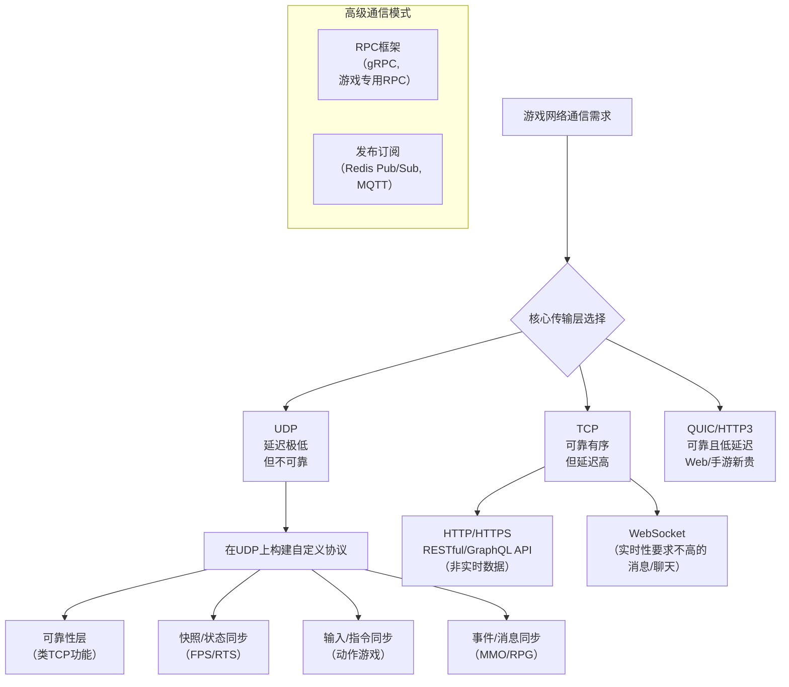

这是一个非常专业的问题！在游戏网络通信中，除了最基础的TCP和UDP，还有一系列建立在它们之上的**应用层协议**和**技术方案**。游戏开发者会根据不同需求混合使用这些协议。

下图清晰地展示了游戏网络协议的技术全景与选择逻辑：


以下是主流协议的详细解析：

---

### 一、 基于TCP的应用层协议

这类协议在TCP的可靠连接上工作，适合**对实时性要求不高的非核心玩法**。

1.  **HTTP/HTTPS (RESTful API, GraphQL)**
    *   **用途**： **非实时数据交换**的绝对主力。
    *   **场景**： 登录认证、获取玩家资料、领取每日奖励、访问游戏商店、上传得分到排行榜、社交功能（好友列表）。这些操作要求100%准确，但快慢几秒无所谓。

2.  **WebSocket**
    *   **特点**： 在单个TCP连接上提供**全双工通信**，服务器可以主动向客户端推送消息，无需客户端轮询。
    *   **场景**： 实时聊天系统（世界/队伍/私聊）、游戏内邮件通知、简单的回合制游戏、需要服务器实时推送状态（如“你的建筑已升级完成”）的策略游戏。**它比HTTP实时，但弱于自定义UDP协议**。

3.  **gRPC (基于 HTTP/2)**
    *   **特点**： 高性能、跨语言的RPC框架。使用Protocol Buffers进行高效的二进制序列化。
    *   **场景**： 越来越流行于游戏服务器**微服务**之间的内部通信，或对性能要求较高的客户端-服务器通信（如游戏后台服务）。

---

### 二、 基于UDP的应用层协议/方案

这是游戏实时联机的核心技术领域。由于UDP本身不可靠，开发者会在其上**自定义协议栈**。

1.  **可靠UDP (Reliable UDP, 或自定义可靠协议)**
    *   **本质**： **在UDP之上，自己实现一套“部分TCP”的功能**。这是大型网络游戏的核心技术。
    *   **实现机制**：
        *   **序号、确认、重传**： 对重要的数据（如技能释放、物品购买）施加可靠性保证。
        *   **选择性确认**： 只重传丢失的包，而不是像TCP一样重传之后所有包。
        *   **无序可靠通道**： 保证消息必达，但不保证顺序（适用于状态快照，新的覆盖旧的）。
    *   **目标**： 避免TCP的“队头阻塞”问题，只为**真正需要可靠**的消息增加开销。

2.  **专门为游戏设计的传输层协议**
    *   **ENET**： 一个知名的网络库，在UDP上提供了可靠的、有序的、多通道的数据传输，被《我的世界》等多款游戏使用。
    *   **KCP**： 一个以**降低延迟**为目标的快速可靠协议。它比TCP激进得多，通过更快的重传（非延迟ACK）来换取延迟的降低，非常适合实时动作游戏。在国产游戏和独立游戏中很流行。
    *   **WebRTC Data Channel**： 虽然主要用于音视频，但其数据通道支持可靠和不可靠两种模式，基于SCTP（在UDP上封装），非常适合浏览器内的P2P游戏。

3.  **QUIC / HTTP/3**
    *   **特点**： 这是**未来之星**。QUIC在UDP上重新实现了TCP+TLS+HTTP/2的功能，并进行了根本性优化。
    *   **游戏相关优势**：
        *   **0-RTT/1-RTT连接**： 极大降低建立安全连接的延迟。
        *   **改进的多路复用**： 彻底解决TCP队头阻塞，多个数据流独立，一个流丢包不影响其他流。
        *   **连接迁移**： 玩家切换网络（Wi-Fi -> 4G）时，连接不会中断。
    *   **场景**： 非常适用于移动端游戏，以及任何需要低延迟、安全传输的场景。目前已在部分大型互联网公司（如Google）的服务中应用，游戏领域正在逐步接纳。

---

### 三、 高级通信模式与框架

1.  **RPC框架**
    *   **除了gRPC**，游戏行业还有自己的RPC中间件，如**联盟的RPC**（常用于MMO后端），它们深度集成了游戏服务器的逻辑（如AOI兴趣管理），让远程调用像本地函数一样方便。

2.  **发布/订阅模式**
    *   **协议**： MQTT, Redis Pub/Sub等。
    *   **场景**： 游戏服务器集群内部的消息广播、全局事件通知（如“世界BOSS刷新”）、实时运营活动推送。客户端通常不直接使用，而是通过游戏服务器网关中转。

---

### 四、 游戏同步协议（这是核心设计，而非单一协议）

这才是游戏网络的灵魂。它们定义了数据如何组织和交换，通常运行在自定义的可靠/不可靠UDP或TCP之上。

1.  **状态同步**
    *   **描述**： 服务器定时（如每秒10-30次）向所有客户端广播整个游戏世界的**状态快照**（玩家位置、血量等）。
    *   **协议特征**： 数据量大，使用**不可靠UDP**发送，因为旧的状态会被新的覆盖。
    *   **游戏**： FPS（CS:GO, 守望先锋）、RTS（星际争霸）常用。

2.  **帧同步**
    *   **描述**： 服务器只转发所有客户端的**操作指令**（按键输入）。每个客户端根据相同的初始状态和相同的指令序列，在自己的机器上**完全 deterministic 地模拟**出整个游戏过程。
    *   **协议特征**： 指令数据量极小，但要求**可靠、严格有序**传输（类似TCP）。对逻辑一致性和防作弊要求极高。
    *   **游戏**： MOBA（王者荣耀、英雄联盟）、格斗游戏、部分RTS。

3.  **指令同步/输入同步**
    *   **描述**： 类似帧同步，但权威服务器会计算并验证结果，然后将结果同步给客户端，客户端做一定的预测和插值。
    *   **协议特征**： 混合模式。客户端输入用可靠方式发送，服务器回传的结果用不可靠方式广播。

---

### 总结与选择策略

| 协议/技术 | 底层 | 主要特点 | 典型游戏应用场景 |
| :--- | :--- | :--- | :--- |
| **TCP** | 传输层 | 可靠、有序、有延迟 | 非实时数据、WebSocket/HTTP基础 |
| **UDP** | 传输层 | 不可靠、无序、极低延迟 | **所有实时对战游戏的基础** |
| **可靠UDP / KCP** | 应用层 | 在UDP上实现可控的可靠性 | 动作游戏的核心指令、RPC调用 |
| **HTTP(S)** | 应用层 | 请求-响应、无状态 | 登录、商城、排行榜、社交API |
| **WebSocket** | 应用层 | 长连接、双向推送 | 聊天、回合制、实时通知 |
| **QUIC** | 传输层 | 安全、快速、无队头阻塞 | **未来移动游戏和Web游戏的理想选择** |
| **状态同步** | 设计模式 | 广播快照，数据量大 | FPS、RTS、大世界MMO |
| **帧同步** | 设计模式 | 同步输入，计算确定 | MOBA、格斗、棋牌 |

**现代网络游戏通常是“协议矩阵”**：
*   **用 HTTP/WebSocket 处理大厅、聊天、非实时请求**。
*   **用 自定义可靠UDP（或KCP） 处理游戏房间内的核心实时操作**。
*   **在可靠UDP通道上，运行着“状态同步”或“帧同步”的逻辑**。
*   **服务器集群内部用 gRPC 或 私有RPC 进行通信**。

选择协议的根本原则是：**在满足消息可靠性需求的前提下，不惜一切代价降低延迟**。这就是为什么UDP及其衍生技术始终是游戏实时通信的王者。


---


太棒了！这是从理论到实践的关键一步。**代码实现上的区别非常直观**，主要体现在**API调用、连接管理、数据发送和错误处理**的复杂度上。

让我们用一个经典例子来说明：**在多人游戏中实现“玩家移动”这个功能**。

---

### 一、TCP 实现 - “打电话”模式

就像打电话，必须建立稳定连接，按顺序说话。

```python
# 伪代码示例 - TCP客户端发送移动数据
import socket

# 1. 建立连接（耗时，可能失败）
tcp_socket = socket.socket(socket.AF_INET, socket.SOCK_STREAM)
tcp_socket.connect(('server_ip', 8888))  # 三次握手，阻塞调用

def send_player_position(x, y):
    # 2. 组织数据（通常带完整头部）
    data = f"MOVE|{player_id}|{x}|{y}\n"  # 文本协议常见，也可用二进制
    
    # 3. 发送（简单！系统保证可靠有序到达）
    tcp_socket.sendall(data.encode())  # 不用管丢包，系统自动重传
    
    # 4. 如果需要响应，就等待（可能阻塞）
    # response = tcp_socket.recv(1024)

# 游戏主循环中
while game_running:
    # 玩家操作产生新位置
    new_x, new_y = get_player_input()
    
    # 每帧或定时发送
    if position_changed:
        send_player_position(new_x, new_y)
```

**直观特点**：
- **连接管理重**：需要显式`connect()`，处理连接断开/重连
- **发送简单**：`send()`后不用管，像写文件
- **粘包问题**：需要设计**消息边界**（如用`\n`、长度前缀）
- **阻塞风险**：`send()`/`recv()`可能卡住，需用非阻塞或线程

---

### 二、UDP 实现 - “发短信”模式

就像发短信，无需连接，发了就走，但可能丢信。

```python
# 伪代码示例 - UDP客户端发送移动数据
import socket

# 1. 创建socket（无连接步骤！）
udp_socket = socket.socket(socket.AF_INET, socket.SOCK_DGRAM)
# 没有connect()！或者connect只设置默认地址

def send_player_position_udp(x, y):
    # 2. 组织数据（必须精简）
    # 二进制协议，紧凑格式
    data = struct.pack('!BHH', 0x10, int(x*100), int(y*100))  # 操作码+x+y（定点数）
    
    # 3. 直接发送到目标地址
    udp_socket.sendto(data, ('server_ip', 8888))  # 每次都要指定地址
    
    # 4. 发送完成！不保证对方收到

# 游戏主循环 - 更高频率发送
while game_running:
    new_x, new_y = get_player_input()
    
    # 可能每帧都发送，即使位置微变
    current_time = get_current_time()
    if current_time - last_send_time > 0.033:  # 每秒30次
        send_player_position_udp(new_x, new_y)
        last_send_time = current_time
    
    # 同时需要接收其他玩家的数据
    try:
        data, addr = udp_socket.recvfrom(1024)  # 非阻塞
        process_incoming_data(data)
    except BlockingIOError:
        pass  # 没有数据，继续
```

**直观特点**：
- **无连接**：没有`connect()`，每次`sendto()`指定地址
- **需处理丢包**：发送后石沉大海，需自己实现确认机制
- **数据精简**：每个字节都很宝贵，用二进制打包
- **非阻塞为主**：通常设置为非阻塞模式
- **无粘包**：每个`sendto()`就是一个完整消息

---

### 三、可靠UDP（自定义协议）实现 - “快递追踪”模式

像发快递，可以查物流，知道是否送达。

```python
# 伪代码示例 - 自定义可靠UDP（简化版）
class ReliableUDP:
    def __init__(self):
        self.socket = socket.socket(socket.AF_INET, socket.SOCK_DGRAM)
        self.socket.setblocking(False)
        
        # 可靠性需要的状态
        self.packet_buffer = {}  # 已发送未确认的包 {seq_num: (data, send_time, retry_count)}
        self.next_seq = 1
        self.ack_history = set()  # 已收到的ACK
        
    def send_reliable(self, data, address):
        # 1. 分配序列号
        seq = self.next_seq
        self.next_seq += 1
        
        # 2. 添加自定义头部：可靠性信息
        header = struct.pack('!IHH', seq, 0x8000, len(data))  # 序列号+标志位+长度
        packet = header + data
        
        # 3. 发送并保存副本用于重传
        self.socket.sendto(packet, address)
        self.packet_buffer[seq] = {
            'data': packet,
            'send_time': current_time(),
            'retries': 0,
            'address': address
        }
        
        # 4. 启动重传计时器（非阻塞方式）
        # 实际会加入定时检查队列
        
    def update(self):
        """每帧调用，处理重传和ACK"""
        now = current_time()
        
        # 检查超时重传
        for seq, pkt_info in list(self.packet_buffer.items()):
            if now - pkt_info['send_time'] > self.RETRY_TIMEOUT:
                if pkt_info['retries'] < self.MAX_RETRIES:
                    # 重传！
                    self.socket.sendto(pkt_info['data'], pkt_info['address'])
                    pkt_info['send_time'] = now
                    pkt_info['retries'] += 1
                else:
                    # 放弃，通知上层
                    del self.packet_buffer[seq]
                    on_packet_lost(seq)
        
        # 接收ACK
        while True:
            try:
                data, addr = self.socket.recvfrom(1500)
                if is_ack_packet(data):
                    ack_seq = parse_ack_seq(data)
                    if ack_seq in self.packet_buffer:
                        del self.packet_buffer[ack_seq]  # 确认收到！
                elif is_data_packet(data):
                    # 处理数据包并发送ACK
                    process_data(data)
                    send_ack_for(data)
            except BlockingIOError:
                break

# 使用方式
rudp = ReliableUDP()

def send_move_reliable(x, y):
    data = struct.pack('!HH', int(x), int(y))
    rudp.send_reliable(data, SERVER_ADDRESS)

# 游戏循环
while game_running:
    # 1. 发送玩家输入
    send_move_reliable(player_x, player_y)
    
    # 2. 必须每帧更新可靠UDP层
    rudp.update()  # 处理重传、ACK、接收
    
    # 3. 游戏逻辑
    game_logic_update()
```

**直观特点**：
- **代码复杂度暴增**：需要实现序列号、确认、重传、流量控制
- **双逻辑层**：应用层逻辑 + 网络层可靠性逻辑
- **定时器管理**：需要跟踪每个包的发送时间
- **非阻塞循环**：必须每帧调用`update()`处理网络事务

---

### 四、WebSocket 实现 - "VIP热线"模式

像高级客服热线，保持连接，随时双向沟通。

```javascript
// JavaScript前端示例 - WebSocket
// 1. 建立连接（类似TCP握手，但升级到WS协议）
const ws = new WebSocket('wss://game-server.com/ws');

ws.onopen = function() {
    console.log('连接已建立');
};

// 2. 发送消息（文本或二进制）
function sendPlayerPosition(x, y) {
    const msg = JSON.stringify({
        type: 'player_move',
        x: x,
        y: y,
        timestamp: Date.now()
    });
    ws.send(msg);  // 简单！底层TCP保证可靠
}

// 3. 接收服务器推送
ws.onmessage = function(event) {
    const data = JSON.parse(event.data);
    if (data.type === 'world_state') {
        updateOtherPlayers(data.players);
    }
};

// 4. 错误处理
ws.onerror = function(error) {
    console.log('WebSocket错误:', error);
};
```

**直观特点**：
- **API高级**：浏览器/引擎封装好了，使用事件驱动回调
- **消息即发**：`send()`即可，自动处理帧封装
- **自动重连**：通常需要自己实现重连逻辑
- **支持二进制**：`send(ArrayBuffer)` 可传二进制数据

---

### 五、HTTP 实现 - "寄信"模式

像寄信，每次都要写地址，等回复。

```python
# Python示例 - HTTP轮询（最简化版）
import requests
import time

# 没有持久连接，每次都是独立请求
def report_position(x, y):
    try:
        response = requests.post(
            'https://api.game.com/report_position',
            json={'x': x, 'y': y},
            timeout=2.0  # 重要：设置超时
        )
        if response.status_code == 200:
            world_state = response.json()
            return world_state
        else:
            handle_http_error(response.status_code)
    except requests.exceptions.RequestException as e:
        handle_network_error(e)

# 游戏循环中 - 必须定时轮询
last_poll_time = 0
while game_running:
    current_time = time.time()
    
    # 发送自己的位置
    if current_time - last_report_time > 0.1:  # 每秒10次
        report_position(player_x, player_y)
        last_report_time = current_time
    
    # 获取他人位置（轮询！）
    if current_time - last_poll_time > 0.5:  # 每秒2次，避免太频繁
        other_players = requests.get('https://api.game.com/get_players').json()
        update_other_players(other_players)
        last_poll_time = current_time
```

**直观特点**：
- **无状态**：每次请求都是独立的
- **开销大**：每个请求都有HTTP头部开销
- **轮询延迟**：必须主动拉取，无法实时推送
- **库支持好**：`requests`、`fetch`等封装完善

---

### 直观对比总结表

| 特性 | TCP | UDP | 可靠UDP | WebSocket | HTTP |
|------|-----|-----|---------|-----------|------|
| **建立连接** | `connect()` 阻塞调用 | 无连接，直接`sendto()` | 自定义握手过程 | `new WebSocket()` 异步 | 无连接 |
| **发送数据** | `send()` 简单 | `sendto()` 需地址 | `send_reliable()` 自定义 | `ws.send()` 简单 | `requests.post()` 完整请求 |
| **可靠性** | 系统保证 | 无保证 | 自己实现 | 系统保证 | 系统保证 |
| **消息边界** | 需自己处理粘包 | 自带边界 | 自带边界 | 帧自动处理 | 请求/响应自带边界 |
| **代码复杂度** | 低 | 低 | **极高** | 低 | 低 |
| **典型使用** | 数据库连接、RPC | 音视频流、状态广播 | **游戏实时操作** | 聊天、实时通知 | 拉取数据、提交分数 |
| **心跳/保活** | 可选`SO_KEEPALIVE` | 需自己实现 | 需自己实现 | 自动Ping/Pong | 不需要 |
| **阻塞问题** | 严重，需线程/非阻塞 | 轻微，通常非阻塞 | 非阻塞为主 | 异步回调 | 同步/异步可选 |

### 关键直观差异

1.  **心智模型不同**：
    - **TCP/WebSocket**： "管道"模型，打开后持续流动
    - **UDP**： "邮筒"模型，每封信独立
    - **HTTP**： "快递"模型，每次完整打包寄送

2.  **代码结构不同**：
    - **TCP/WS**： 连接建立后，主循环简单发送/接收
    - **UDP**： 单socket多用途，需处理多个对端
    - **可靠UDP**： **状态机驱动**，每帧必须更新网络层

3.  **调试难度**：
    - **TCP/HTTP/WS**： Wireshark直接可读
    - **自定义UDP**： 需要自定义解析器，调试困难

4.  **实时游戏的实际选择**：
```python
# 现代实时游戏的典型混合架构
class GameNetwork:
    def __init__(self):
        # 1. HTTP用于非实时数据
        self.http = HTTPClient()
        
        # 2. WebSocket用于聊天/大厅
        self.ws = WebSocketClient()
        
        # 3. 可靠UDP用于核心游戏同步（或直接用KCP/ENET库）
        self.game_channel = ReliableUDPChannel()
        
    def update(self):
        # 每帧必须更新所有通道
        self.game_channel.update()  # 最重要！
        self.ws.process_messages()
        # HTTP通常是异步回调，不需要每帧更新
```

**最终建议**：除非你要做硬核实时游戏（MOBA、FPS），否则**优先使用引擎内置的高层网络API**（如Unity的Netcode、Unreal的Replication系统），它们已经封装了底层协议的复杂性，让你更专注于游戏逻辑。只有当这些方案不满足需求时，才考虑从TCP/UDP层面自己实现。
